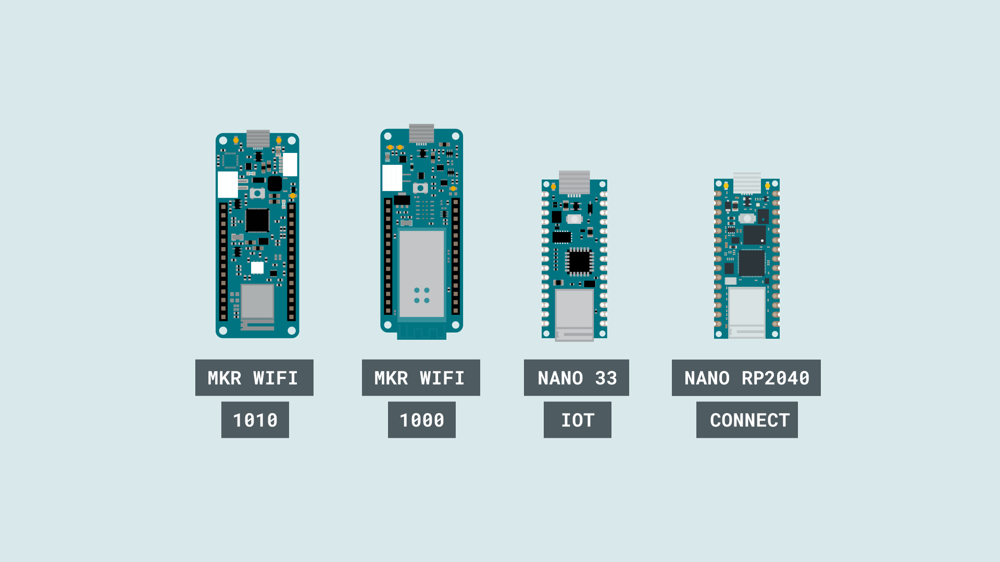
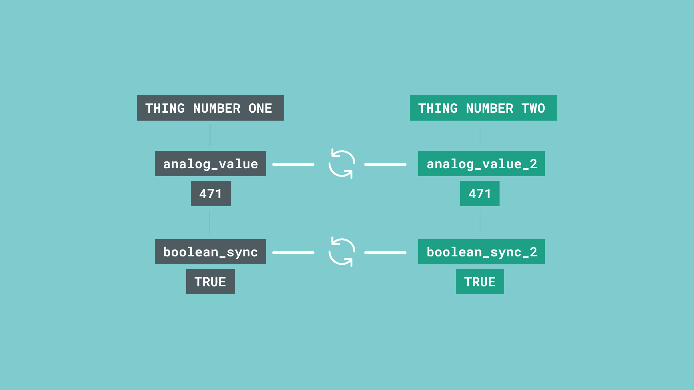
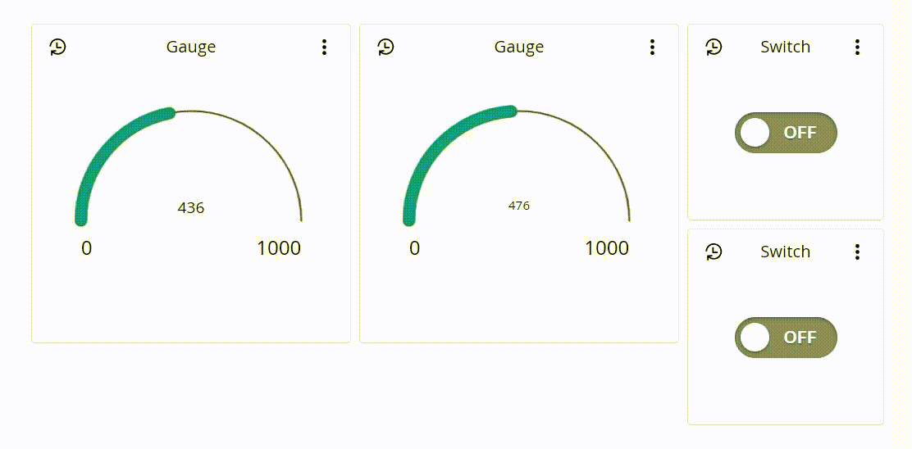

## Introduction

The Thing to Thing communication is a great feature that allows you to synchronize your Arduino devices. It enables you to pair **variables** of the same data type between things and with the Arduino IoT Cloud, creating a two-way communication between your devices has never been easier. 

## Goals

The goals of this project are:

- Learn how to set up the Thing to Thing communication.
- Sync a variable containing a value between two Things.
- Trigger a boolean between two Things.

## Hardware & Software needed

- [Arduino IoT Cloud](https://create.arduino.cc/iot/) (with a Maker subscription, read more [here](https://store.arduino.cc/digital/create)).
- 2x [Arduino MKR WiFi 1010](https://store.arduino.cc/mkr-wifi-1010) or,
- 2x [Arduino MKR WiFi 1000](https://store.arduino.cc/arduino-mkr1000-wifi) or, 
- 2x [Arduino Nano 33 IoT](https://store.arduino.cc/arduino-nano-33-iot) or,
- 2x [Arduino Nano RP2040 Connect](https://store.arduino.cc/nano-rp2040-connect-with-headers).


## Circuit

In this tutorial, we are using no external circuit. You will only need 2x IoT Cloud compatible devices. You can for example use one Nano 33 IoT and one MKR WiFi 1010.



## Setting up the Things

To start, we will need to head over to the [Arduino IoT Cloud](https://create.arduino.cc/iot/). This is also accessible through the menu at the top right.


### Step 1: Configuring two devices

To enable Thing to Thing communication, we will first need to configure the two devices. If you have never used the Arduino IoT Cloud before, you can check out [our getting started with the IoT cloud guide](https://www.arduino.cc/en/Tutorial/iot-cloud-getting-started).

Now that we are working with two devices, it is important to separate them from each other, since they will later be linked to two different Things. In this tutorial, we named the devices:

- **Device_1**
- **Device_2**

It is a good idea to place a label on the physical board to remember which one is which as well!

### Step 2: Creating the first Thing

Let's start by creating a new Thing, for simplicity, let's name it **Thing Number One**. 


Now, we will need to add two variables, with the following settings:

| Variable Name | Data Type | Permission   |
| ------------- | --------- | ------------ |
| analog_value  | integer   | read & write |
| boolean_sync  | boolean   | read & write |

We also need to enter our network details, and select our device (which should be **Device_1**).

The final overview should look something like this:


Finally, we need to edit and upload the code to the board. We are only making one addition to the code. Inside `void loop()`, add the following line:

```arduino
analog_value = analogRead(A1);
```

This means we would simply read pin A1, which we have not connected anything to, but will generate random values. You can now upload the code to the board.

When it is finished uploading, we can move on to the next step.

### Step 3: Creating the second Thing

To create our second Thing, we need to click on the **"Things"** tab, and click on **"Create Thing"**. We can name this one **Thing Number Two**. 


Now, we need to create the variables we want to sync with the other Thing. First, click on the **"Add Variable"** button. We will now click on the **"Sync with other things"** option.


We will now see the two variables we created inside **Thing Number One**. Let's select the **analog_value** variable and click on **"Synchronize variables"**.


Finally, we need to name it something fitting, such as **analog_value_2**, and click on the **"Add Variable"** button.


Next, we can repeat the same process for the boolean variable, but instead of selecting the **analog_value** variable to sync with, select the **boolean_sync** variable. Now we should have two variables that are synced with our other Thing.

Here we will also need to enter our network details, and select our device (which should be **Device_2**). 

Then we can move on to the sketch. Inside the sketch we actually **don't need to edit anything**. Simply upload the sketch to **Device_2**.

Once the upload is successful, we can move on to the next step!  

## Creating a dashboard

With both **Device_1** and **Device_2** up and running, we can go on to **create a dashboard**. Navigate to the **"Dashboards"** tab, and click on the **"Build Dashboard"** button. 

### Step 1: Creating widgets for Thing Number One

In the new, empty dashboard, click on **"Add"** and select **"Gauge"** from the list. 


Then, we need to click on the **"Link Variable"** button.


Now, let's link it to the **analog_value** variable, inside **Thing Number One**. Then click on the **"Link Variable"** button. 


We need to set the threshold values to **Min: 0** and **Max: 1000**, and click on the **"Done"** button.


Our widget will now appear in the dashboard. Next, let's add a **Switch** widget, following the same process to link it to the **boolean_sync** variable inside **Thing Number One**. After adding it, we will have two widgets: a **gauge** and a **switch**.


### Step 2: Creating widgets for Thing Number Two

Now that we have created the widgets and linked them to the variables from **Thing Number One**, we need to do the same for the variables that we sync from **Thing Number Two**. 

The process of creating them is identical to the previous steps, but we need to select the variables inside **Thing Number Two**. When it is finished, the complete dashboard should look like this:


## Testing it out

Now that everything is set up, let's test it out. First of all, we can verify that the two **gauge widgets** are updating continuously, and that they show the same values (with a short delay). 

This is because they are only recorded by **Device_1**, linked with **Thing Number One**, which has the variable **analog_value**. Since **analog_value** and **analog_value_2** are synced, the values in the widgets are the same!



Now, that the boolean variables are set up just to test that the communication is working between the two Things. To test it, simply change the state of the switch to **"ON"** by clicking on it. After a short pause we will see the other switch turn to **"ON"** as well. The same thing will happen if we turn one switch to **"OFF"**, then the other should follow shortly after.



This means that our devices are linked, and whenever we update one of them, the other one follows. And that's how the variable sync works in a nutshell!

## Conclusion

The **Thing to Thing Communication** is an amazing feature that is easy to set up and has various benefits. In this tutorial we simply demonstrated the very basics by syncing two variables between two Things, but there is a lot more to explore!

We hope you enjoyed this tutorial and that it helped you to get started with your next IoT project!

### More tutorials

You can find more tutorials in the [Arduino IoT Cloud documentation page](/arduino-cloud/).