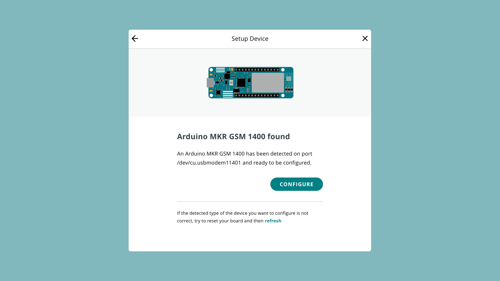

A number of Arduino boards are able to connect to the Arduino Cloud using a sim card, using either the GSM or NB-IoT technologies.

## Supported Boards

- [MKR GSM 1400](https://store.arduino.cc/arduino-mkr-gsm-1400)
- [MKR NB 1500](https://store.arduino.cc/arduino-mkr-nb-1500-1413)

Connection through mobile networks can be considered in remote areas where there's no Wi-Fi, or in mobile projects (such as cargo tracking).  

***For more information, visit the [Arduino SIM page](https://store.arduino.cc/digital/sim).***

***Note that a secured connection is a memory intense operation, so there's not a lot of memory for the user application (e.g. around 2.6 kB on the MKR GSM 1400). Using a lot of Arduino Cloud variables may cause the sketch to run out of memory on boards which don't offload the SSL stack and make it crash.***

## Setup

To configure a NB-IoT / GSM board, follow the steps below:

**1.** Connect your board to your computer.

**2.** Go to [Arduino Cloud](https://app.arduino.cc), and navigate to the **"Devices"** section. Click on the **"Add Device"** button and then select the **"Arduino Board"**. After a while, your board will be visible, and you can click on the **"Configure"** button.

**3.** Allow some time for the configuration, as a sketch is being uploaded to your board and your crypto chip is configured.

Your board is now configured and ready to be used in the Arduino Cloud. 

To get started, check out the official [Getting Started (Arduino / C++)](/arduino-cloud/guides/arduino-c) guide. This will guide you to successfully send data between your board and Arduino Cloud.

## Network Configuration

When you attach your board to a Thing, you will need to enter some credentials. With an Arduino SIM, configure it as:

- **APN** - `prepay.pelion`
- **PIN** - `0000`
- **Username** - `arduino`
- **Password** - `arduino`