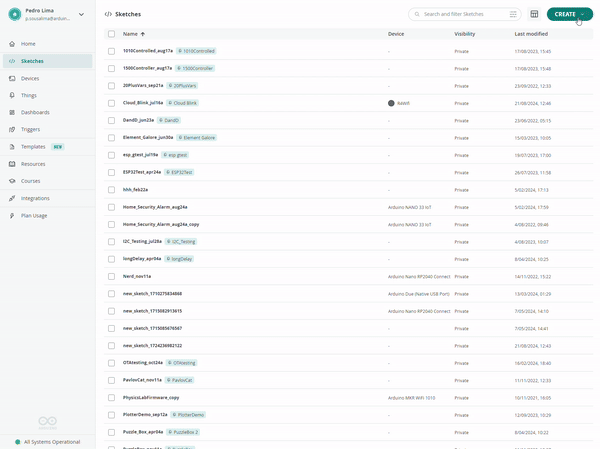
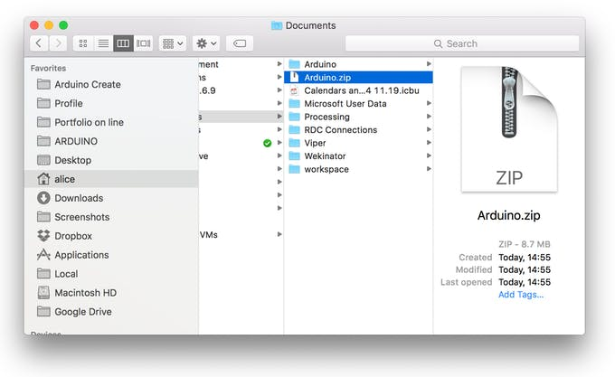
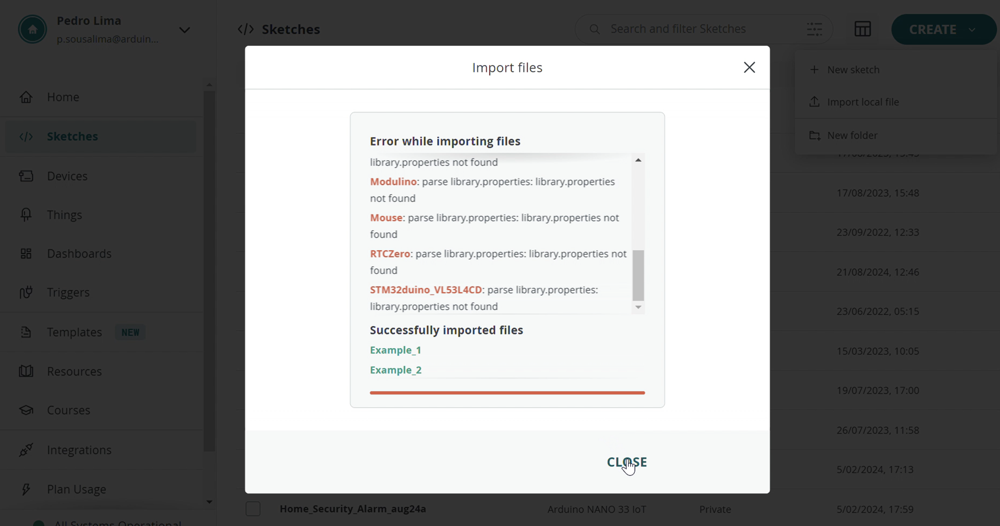
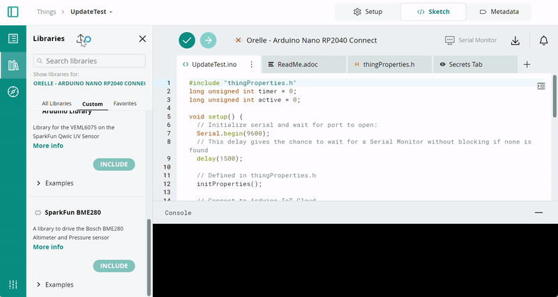

## Import Your Sketchbook and Libraries to the Cloud editor

Are you sticking to the desktop Arduino IDE because all your work is saved locally? That’s no longer a problem! Our brand new import tool enables you to upload your entire sketchbook with just a few clicks on the [Arduino Cloud editor](https://create.arduino.cc/editor). It is particularly handy because it lets you **move all your sketches and libraries to the Cloud** in a single flow.

Once your sketchbook is online it will be available on any device and backed up.

What can you import to the [Cloud editor](https://create.arduino.cc/editor)?

* Single sketches in `.ino`, `.pde` and `.zip` format.
  
* Libraries in `.zip` format.
  
* Zipped folders containing sketches and libraries. Make sure your libraries are in a folder called `‘libraries’`. Be sure not to mix sketches and libraries in the same folder.

But let’s import your whole sketchbook in a few clicks, so you will be all set up to start using the Arduino Cloud editor.

### 1. Find your sketchbook

On your PC find out where your sketchbook folder is (it is called `‘Arduino’`, unless you renamed it). On Windows it’s usually under `My Computer/Documents/Arduino`, on Mac `User/Documents/Arduino`, and on Linux is `$HOME/Arduino`.

### 2. Zip your sketchbook

Make a `.zip` pack of your sketchbook, you should obtain a file called *Arduino.zip*. Make sure it is `.zip` format, any other archive formats will not work.

### 3. Import your sketchbook to the Cloud

Go to [create.arduino.cc/editor](https://create.arduino.cc/editor). For some general information on how to get started on the Cloud editor see [this tutorial](https://create.arduino.cc/projecthub/Arduino_Genuino/getting-started-with-arduino-web-editor-4b3e4a?ref=platform&ref_id=424_trending___&offset=0). When you are logged in and ready, hit the import button on the sketchbook panel. A popup with some instructions on how to import files into the Cloud editor will be displayed. Press `“Import”` to continue.

You will now see a file system window, select your *Arduino.zip* pack. Wait for the import process to finish. If your sketchbook is big (containing lots of files), this may take a while.

### 4. You are done!

Once the import process is done there will be two reports, one for sketches and one for libraries.

If you already have sketches with the same name on the online IDE, these sketches will fail to import to avoid conflicts.

If you have libraries in your sketchbook, another report will tell you those that got successfully imported. If you have existing custom libraries with the same names, it’ll prompt you to overwrite the existing ones. Be sure to proceed with caution!

### Importing a custom library

The Arduino community has written over 700 libraries that you can include in your sketches without having to install a thing. You can browse through all of them in the Library Manager and favorite the ones you like the most.

But what if you want to use your own custom library on the Web IDE? Just zip your custom library and click on the 'Import' button on the Library panel.

If you want to import multiple custom libraries at once you can do so by creating a single zip file which contains all of them and just import it.

## A few more notes on the importing process

* Maximum of 100MB is allowed, for either `.zip` or individual files, make sure your sketchbook does not exceeds this limit

* Only sketches and libraries can be imported. Files in the `‘hardware’` folder will be ignored. We suggest you exclude them from your `.zip`, especially if they’re taking a lot of space.

* Libraries must be in a folder called “`libraries`”.

* Remove backups, unrelated files and things you don’t want to import in general.

Please note that **all the libraries that you have added via the Library Manager on the desktop IDE will be already available on the Cloud editor without having to do anything**. If you want to see their related examples or select a specific version, look for them on the online Library Manager.

More info on the online Library Manager [on this tutorial](https://create.arduino.cc/projecthub/Arduino_Genuino/getting-started-with-arduino-web-editor-4b3e4a?ref=platform&ref_id=424_trending___&offset=0#toc-libraries-and-the-arduino-web-editor).

### More tutorials

You can find more tutorials in the [Arduino Cloud documentation page](/arduino-cloud).