## Overview

This tutorial shows you how to build an Arduino compatible breadboard with an Atmel Atmega8/168/328 AVR microcontroller and FTDI FT232 breakout board from [SparkFun](http://www.sparkfun.com/). You could also use the [Arduino USB Mini](https://www.arduino.cc/en/Main/MiniUSB).

>Originally created by David A. Mellis.
Updated from the [ITP version](http://itp.nyu.edu/physcomp/Tutorials/ArduinoBreadboard) by Carlyn Maw
Updated October 23, 2008 by Rory Nugent

## Parts

To do this, you'll need:

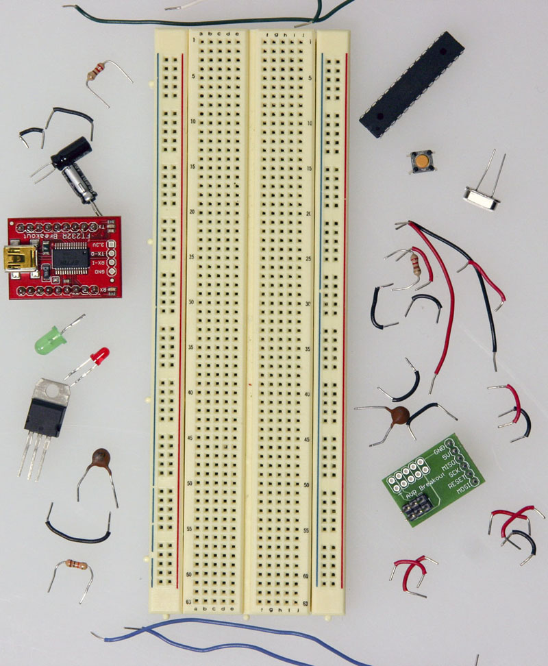

### Basic Parts for wiring up Arduino

* A breadboard
* 22 AWG wire
* 7805 Voltage regulator
* 2 LEDs
* 2 220 Ohm resistors
* 1 10k Ohm resistor
* 2 10 uF capacitors
* 16 MHz clock crystal
* 2 22 pF capacitors
* small momentary normally open ("off") button, i.e. Omron type B3F

### USB to Serial Communication Board

You will need a FT232 USB Breakout board from [SparkFun](http://www.sparkfun.com/). There are two options available from them:

* FT232RL USB to Serial Breakout Board, SKU [BOB-0071](http://www.sparkfun.com/commerce/product_info.php?products_id=718)
* Arduino Serial USB Board, SKU [DEV-08165](http://www.sparkfun.com/commerce/product_info.php?products_id=8165)

If you plan to use the top option and have not yet soldered headers to the breakout board, now would be a good time.

### Bootloading your Atmega Chips

There are several options for bootloading your Atmega chips, a few of which are covered in this tutorial. If you wish to bootload your Atmega chips using your breadboard, an additional part will make your life much easier but is not necessary. AVR Programming Adapter from Sparkfun, SKU. [BOB-08508](http://www.sparkfun.com/commerce/product_info.php?products_id=8508)

## Adding circuitry for a power supply

If you've already worked with microcontrollers, it is likely that you already have a preferred way to wire up a power supply to your board, so go ahead and do it that way. In case you need some reminders, here are some pictures of one way to go about it. (This version uses a 5V regulated power supply)

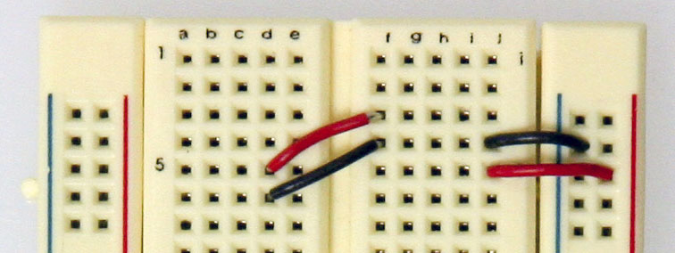

Add power and ground wires for where your voltage regulator will be.

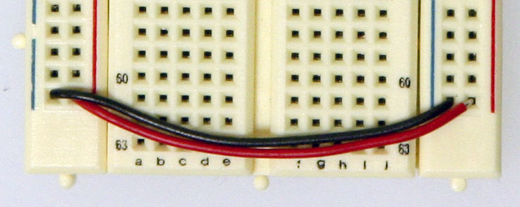

Add power and ground wires at the bottom of your board connecting each rail.

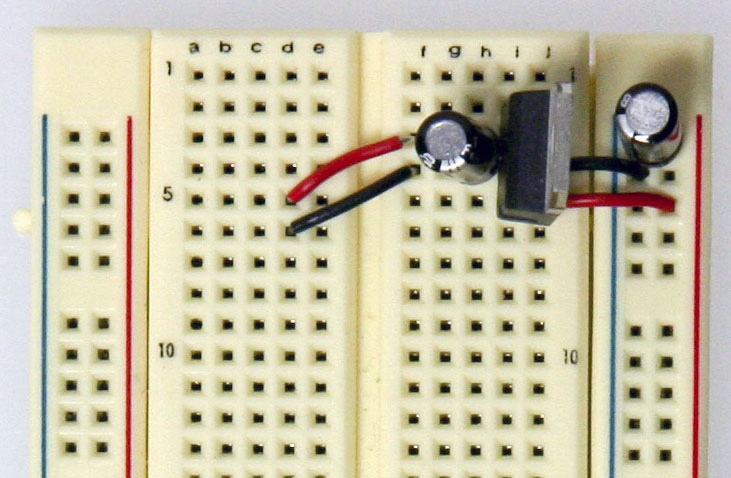

Add the 7805 power regulator and the lines to power the board. The regulator is a TO-220 package where the Input from the external power supply goes input on the left, ground is in the middle and the 5V output is on the right (when facing the front of the regulator). Add power OUT and ground wires that connect to the right and left rails of the breadboard.

Also, add a 10uF capacitor between the IN of the regulator and the ground as well as a 10uF capacitor on the right rail between power and ground. The silver strip on the capacitor signifies the ground leg.

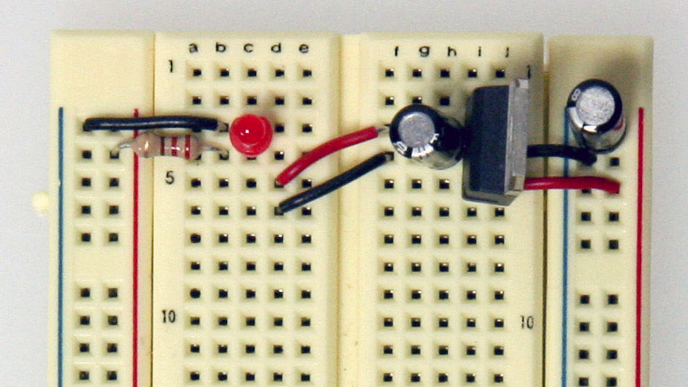

Add an LED and a 220-ohm resistor on the left side of your board across from the voltage regulator. An LED attached to power like this is a great troubleshooting trick. You'll always know when your board is being powered as well as quickly know if your board is being shorted.

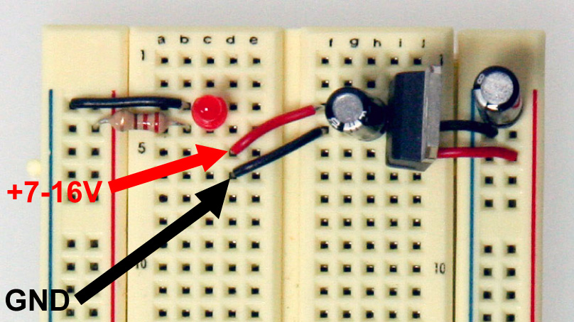

The red and black wires to the left of the voltage regulator is where your power supply will be plugged in. The red wire is for the POWER and the black wire is for the GROUND. Be sure to only attach a power supply that is between 7-16V. Any lower and you won't get 5V out of your regulator. Any higher and your regulator may be damaged. A 9V battery, 9V DC power supply, or 12V DC power supply is suitable.

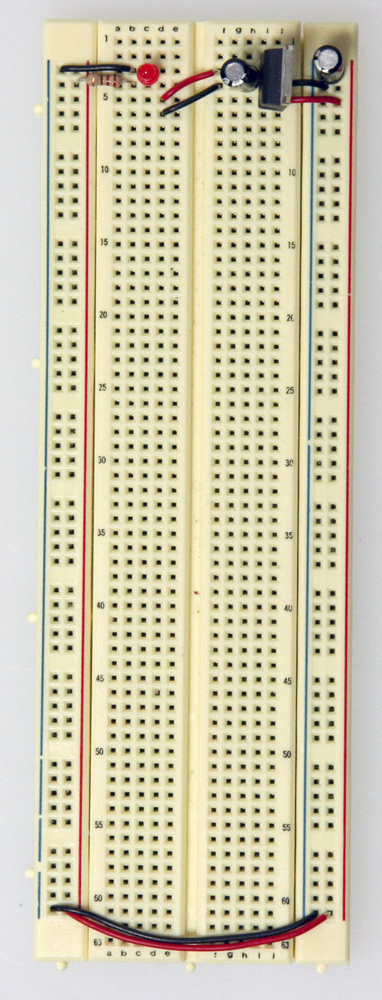

Now that the power-basics are done you are ready to load on the chip!

## ATMEGA8/168/328 Basics

Before moving on, check out this image. It's a great resource for learning what each of the pins on your Atmega chip do in relation to the Arduino's functions. This will clarify a lot of confusion behind why you hook up certain pins the way you do. For even more detailed information, take a peek at the datasheet for the Atmega 168 ([short version](http://www.atmel.com/dyn/resources/prod_documents/2545S.pdf)) ([long version](http://www.atmel.com/dyn/resources/prod_documents/doc2545.pdf)). Here's the sheet for the atmega328 ([short version](http://www.atmel.com/dyn/resources/prod_documents/8161S.pdf)) ([long version](http://www.atmel.com/dyn/resources/prod_documents/doc8161.pdf))

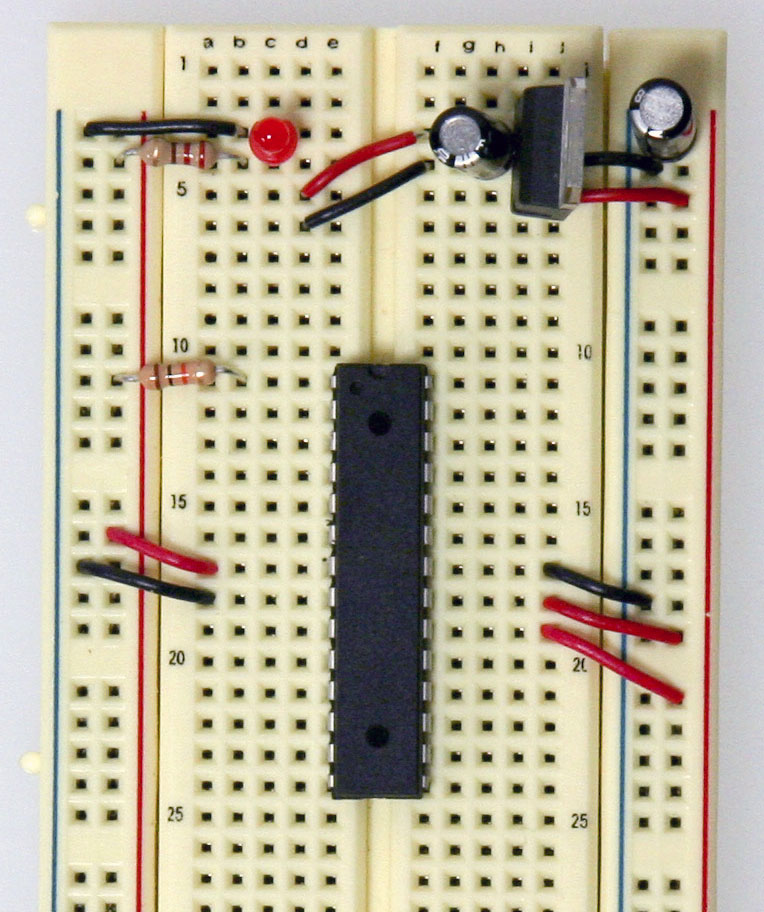

Start by connecting a 10k ohm pullup resistor to +5V from the RESET pin in order to prevent the chip from resetting itself during normal operation. The RESET pin reboots the chip when pulled down to ground. In later steps we will show you how to add a reset switch that takes advantage of this.

* Pin 7 - Vcc - Digital Supply Voltage
* Pin 8 - GND
* Pin 22 - GND
* Pin 21 - AREF - Analog reference pin for ADC
* Pin 20 - AVcc - Suppply voltage for the ADC converter. Needs to be connected to power if ADC isn't being used and to power via a low-pass filter if it is (a low pass filter is a circuit that reduces noise from the power source. This example isn't using one)

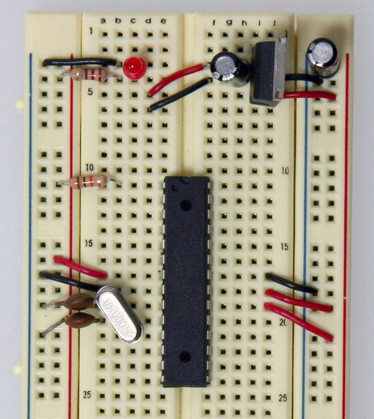

Add a 16 MHz external clock between pin 9 and 10, and add two 22 pF capacitors running to ground from each of those pins.

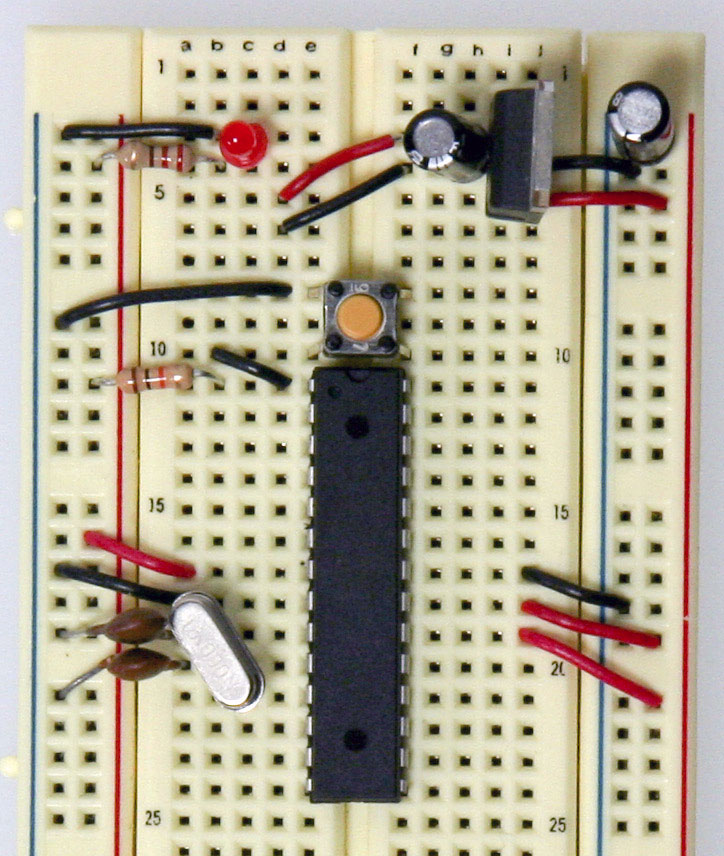

Add the small tactile switch so that you can reset the Arduino whenever we'd like and prepare the chip for uploading a new program. A quick momentary press of this switch will reset the chip when needed. Add the switch just above the top of the Atmega chip crossing the gap in the breadboard. Then, add a wire from the bottom left leg of the switch to the RESET pin of the Atmega chip and a wire from the top left leg of the switch to ground.

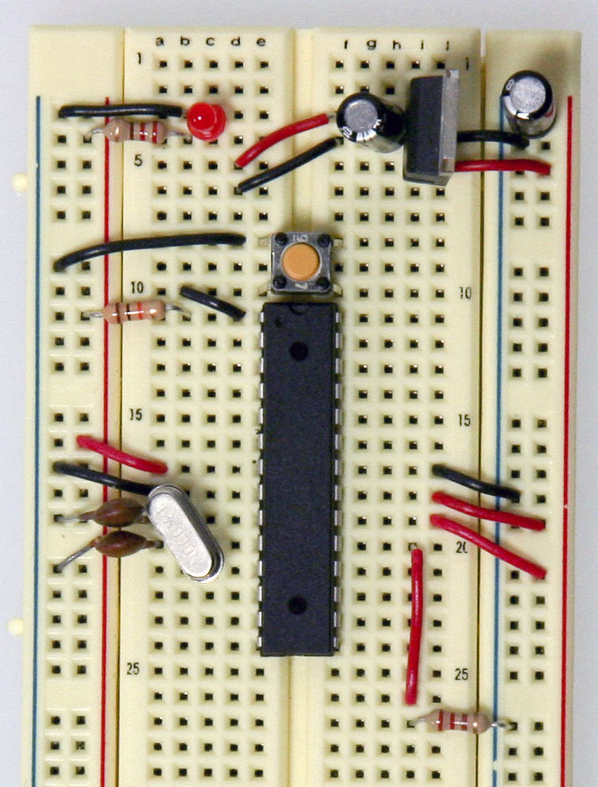

The chip used on this board is actually already programmed using the blink_led program that comes with the Arduino software. If you already have an Arduino printed circuit board running, it is a good idea to go ahead and check the breadboard version you are building with a chip you know works. Pull the chip from your working Arduino and try it on this board. The blink_led program blinks pin 13. Pin 13 on the Arduino is NOT the AVR ATMEGA8-16PU/ATMEGA168-16PU pin 13. It is actually pin 19 on the Atmega chip.

Refer to the [pin mapping](http://arduino.cc/en/Hacking/PinMapping168) above to be sure you are plugging it in correctly.

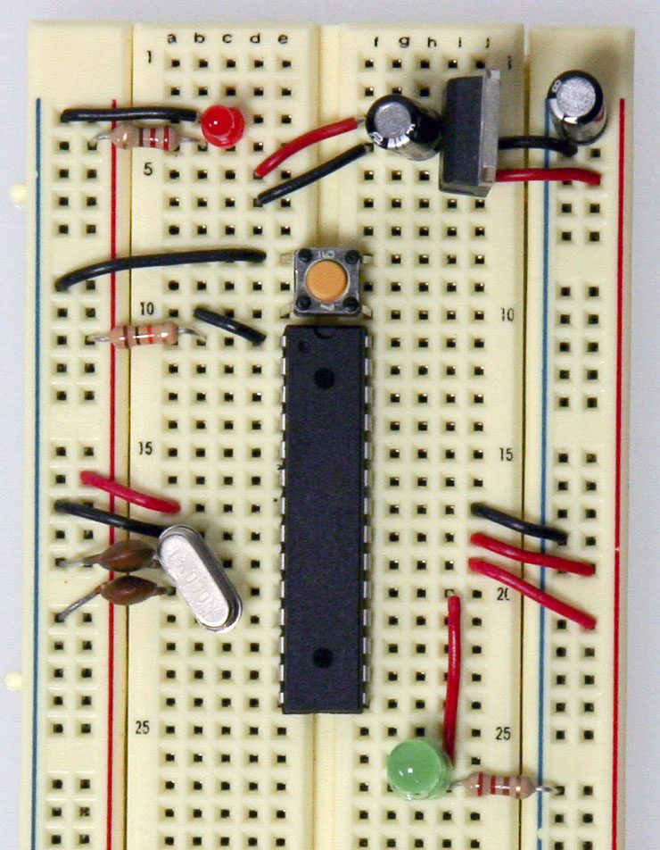

Finally, add the LED. The long leg or the anode connects to the red wire and the short leg or the cathode connects to the 220 ohm resistor going to ground.

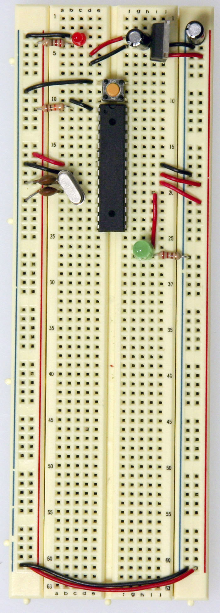

At this point if you had already programmed your chip somewhere else and didn't need this breadboard circuit to reprogram the chip, you could stop here. But part of the fun is in-circuit programming so keep going to really make a full USB-Arduino-circuit on a breadboard!

## Arduino-Ready

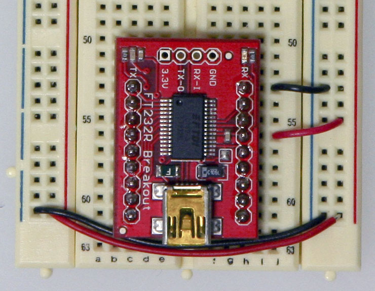

Now we'll be adding the USB to Serial breakout board to our Arduino breadboard circuit. If you haven't added male headers to your breakout board, you will need to do it now.

Connect the VCCIO of the breakout board to power and the GND to ground.

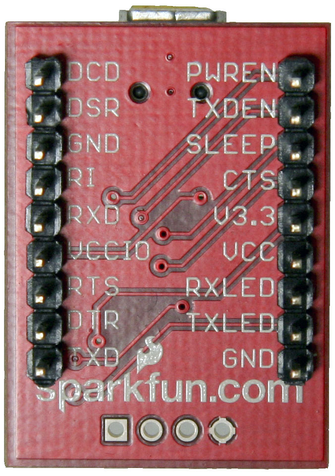

Curious what all the pin outs are for the SparkFun FT232 breakout board, just simply flip it over! In this situation we'll be using VCC (to supply 5V from the USB port to your board), GND, TXD, and RXD.

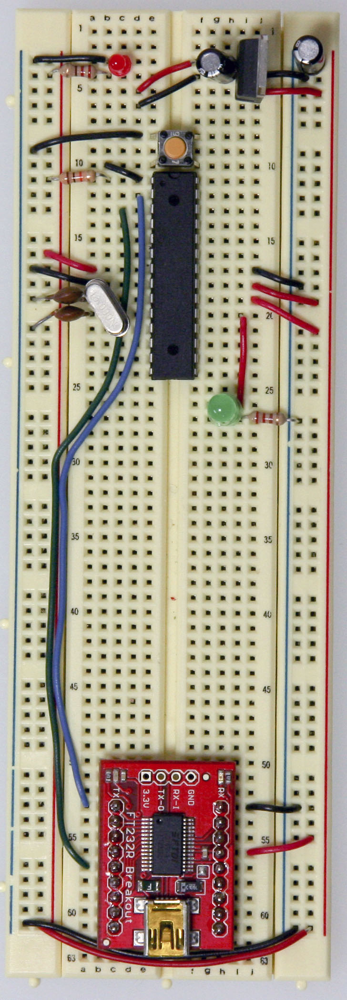

Now, it's time to get the USB to serial breakout board talking with your new Arduino setup. Connect the RX (pin 2) of your Atmega chip to the TX of the USB to serial board, and connect the TX (pin 3) of your Atmega chip to the RX of the USB to serial board.

And there you have it... ready to be plugged in, powered up and programmed!

But wait, there's another step right? If you pulled your Atmega chip out of your Arduino, it has most likely been programmed several times by yourself and so it definitely has been bootloaded, so you won't need to move any further in this tutorial.

However, if you purchased some extra Atmega328 or Atmega168 chips from an online store they will have NOT been bootloaded with the Arduino bootloader (with the exception of [Adafruit Industries](http://www.adafruit.com/index.php?main_page=product_info&cPath=17&products_id=56)). What does this mean? You won't be able to program your chips using the USB to serial breakout board and the Arduino software. So, in order to make your new chips useful for Arduino you MUST bootload them and MUST check out step 4.

## Other Breadboard Options

[The uDuino Setup by Tymn Twillman](http://www.instructables.com/id/uDuino-Very-Low-Cost-Arduino-Compatible-Developme)

This configuration is similar to the one above but the trick is that the Atmega chip is bootloaded with the Arduino Lilypad bootloader. The Lilypad runs using the internal clock instead of an external clock and so removes the need for much of the supporting circuitry.

[Boarduino by Ladyada](http://www.ladyada.net/make/boarduino/)

The Boarduino is a kit you purchase and assemble to create a nice, small breadboard compatible Arduino set up. All the common components are included on a small PCB so that the Boarduino can easily be added to a breadboard and even removed, in a snap.

## Bootloading your chips OPTIONAL

### Bootloading Options

There are two options for bootloading your chips. The first being quite easy and the other being a little more tricky. We will cover both.

* Bootloading your Atmega chip using a Arduino board and an AVR programmer
* Bootloading your Atmega chip in your newly prepared breadboard with an AVR programmer

There are also many different kinds of AVR programmers but two are most commonly used:

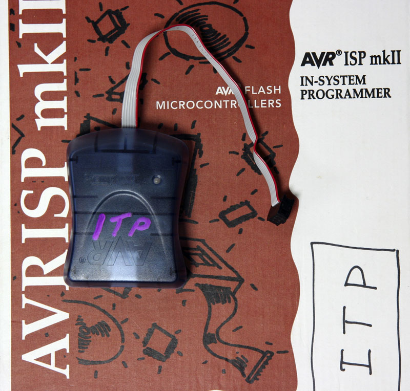

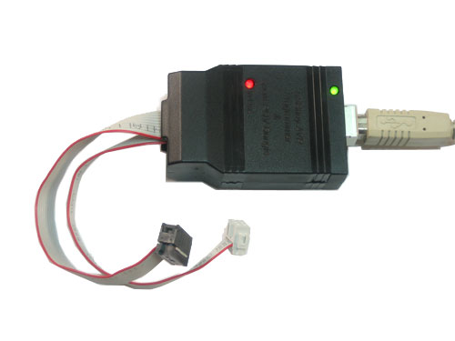

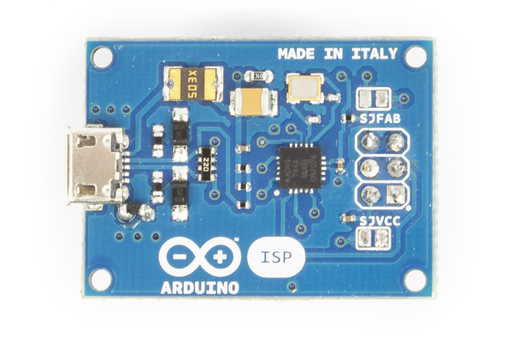

The AVRISP mkII can be purchased from Digikey (Part # [ATAVRISP2-ND](http://search.digikey.com/scripts/DkSearch/dksus.dll?Detail?name=ATAVRISP2-ND)) while the USBtinyISP must be assembled and can be found at [Adafruit Industries](http://www.adafruit.com/index.php?main_page=product_info&cPath=16&products_id=46). The documentation and the links to the Arduino Store and to the distributors list can be found in the [ArduinoISP product page](http://www.arduino.cc/en/Main/ArduinoISP).

### Using an Arduino board

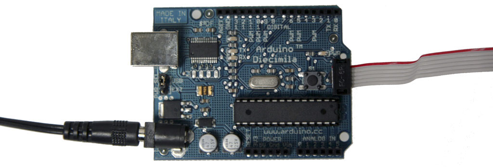

Place your Atmega chip into the Arduino board with the divot of the chip facing outward. Set the jumper to an external power supply and connect a 12V power brick (your board needs to be externally powered when using the AVR ISP mkII but is not needed with the AVRtinyISP) . Then, attach the 6-pin female plug of your AVR programmer to the 6 male header ICSP pins with the plastic nub of the ribbon cable head facing inward.

>**NOTE:** The AVR ISP mkII turns its LED green when they've been hooked up correctly and are ready for programming. The LED turns red if it is hooked up wrong.

### Using your breadboard

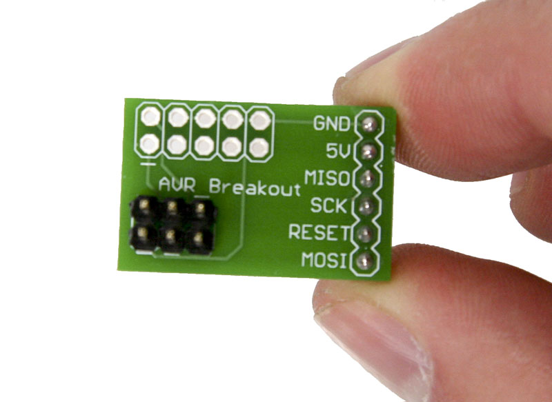

When bootloading an Atmega chip on a breadboard, the AVR programming adapter (SKU [BOB-08508](http://www.sparkfun.com/commerce/product_info.php?products_id=8508)) from Sparkfun is incredibly handy. This adapter breaks out the 6 pins from the programmer to 6 inline pins for easy attachment to the breadboard. All the pins are also labeled making it very easy to connect it up to your chip.

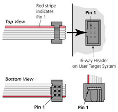

Don't worry, if you don't have an AVR programming adapter you can still bootload without it. It will however be more of a headache to set up. The two images to the left are great references when hooking up a programmer to an Atmega chip without an adapter board. The images will tell you what all the holes in the 6-pin AVR plug are and you will simply need to stick wires in the end and run them to your Atmega chip.

This image is a view from the bottom and labels each of the holes. Take note of the square as to what orientation your cable is in.

### Let's begin!

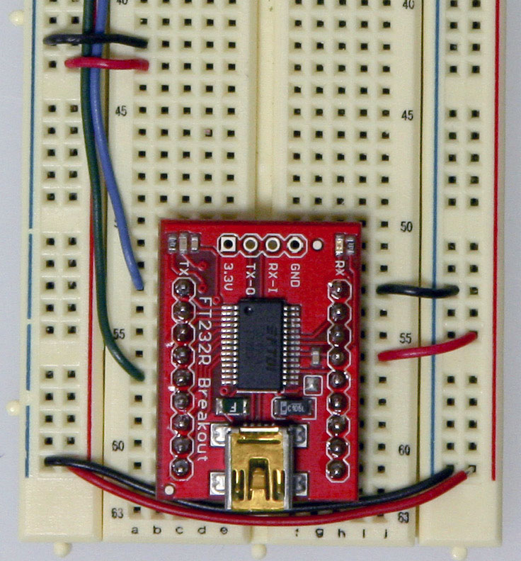

With the breadboard you prepared above, add two wires for power and ground for your AVR programmer.

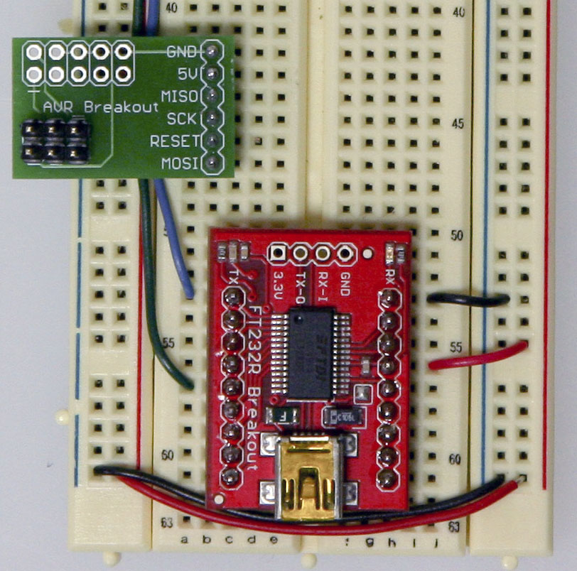

Now plug the AVR programming adapter into the breadboard with the GND pin matching up with the ground wire you just ran and the 5V pin matching up with the power wire you just ran.

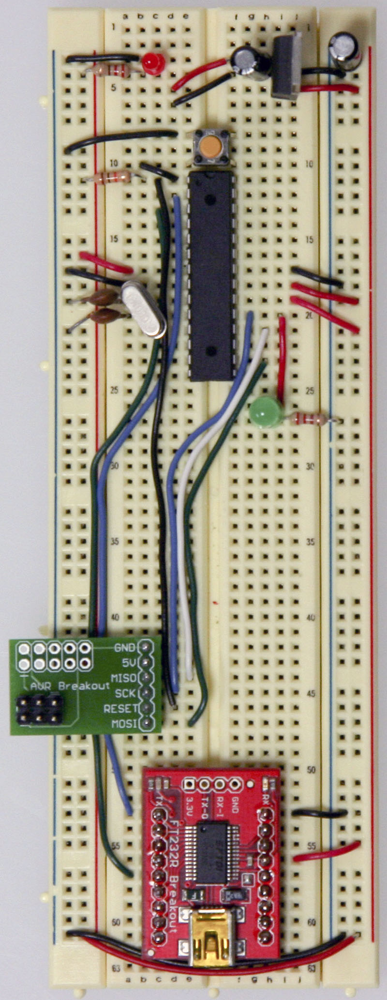

In this step you will need to add the last four wires needed by the AVR programmer for proper bootloading. Be sure to refer to the Arduino [pin mapping](http://arduino.cc/en/Hacking/PinMapping168) for help wiring this up.

* The MISO pin of your adapter will go to pin 18 or Arduino digital pin 12 of your Atmega chip.
* The SCK pin of your adapter will go to pin 19 or Arduino digital pin 13 of your Atmega chip.
* The RESET pin of your adapter will go to pin 1 of your Atmega chip.
* The MOSI pin of your adapter will go to pin 17 or Arduino digital pin 11 of your Atmega chip. Please note that the photo above shows MOSI (the dark green wire) is incorrectly connected to pin 16 of your Atmega chip. Please make sure you connect the MOSI to pin 17 on your breadboard.   

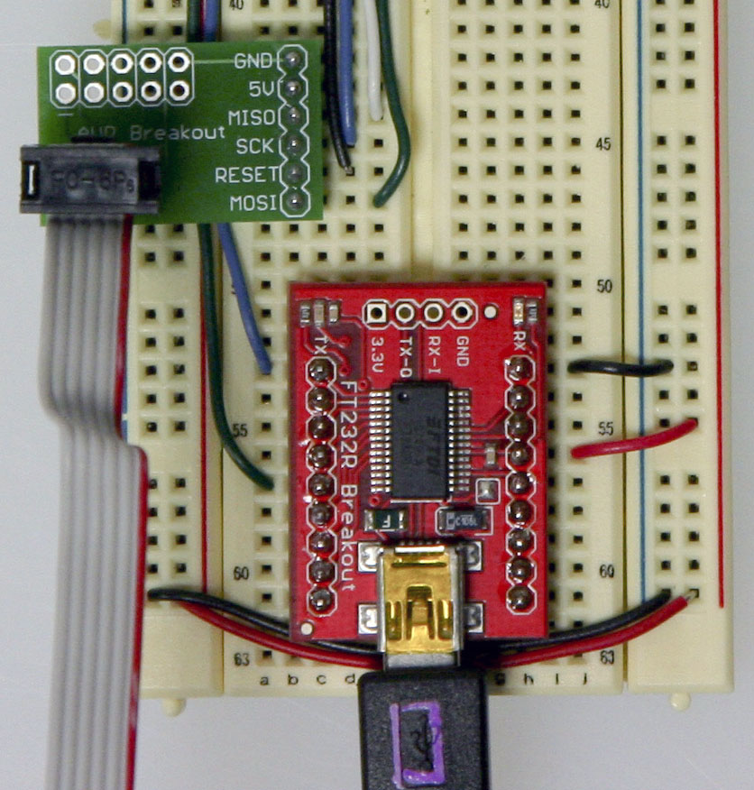

Almost there! Just plug in a USB cable to your USB breakout board and plug the 6-pin plug of your AVR programmer to your AVR programming adapter. The black nub of the 6-pin head must be facing upwards towards the Atmega chip. In the next step, we'll show you have to use the Arduino software to burn your bootloader!

### Time to burn!

Fire up Arduino and then go to 'Tools' and 'Board'. Choosing the type of board you'd like to use will effect which bootloader you will be put on your chip. Most commonly you will be using the Diecimilia or the most recent version of Arduino for an Atmega PDIP, however if you'd like to bootload an Arduino Lilypad, Arduino Mini, Arduino Nano, or any of the older Arduino versions, choose the appropriate board.

Then, go to 'Tools' and 'Burn Bootloader' and choose the programmer you will be using.

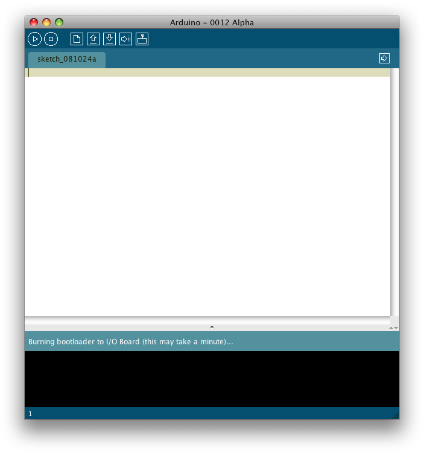

Once you chose your programmer, the AVR programmer will begin bootloading your Atmega chip and a message will appear in the status bar which reads "Burning bootloader to I/O Board (this may take a minute)..." Lights will flicker on your programmer.

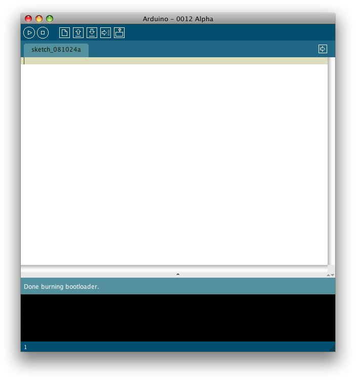

When done bootloading, the status bar will be updated with the message "Done burning bootloader." Your chip is now ready to be programmer using the Arduino software! Congrats! Power cycle your Arduino and your new Atmega chip will be running a simple LED blink program with pin 13 (if this is not the case, try programming it with one). If this is working, it was most definitely a success.

>**NOTE:** On occasion, the process of bootloading an Atmega chip with the AVR ISP mkII will take an extraordinarily long period of time. Usually it should only take a couple minutes and in fact, the AVRtinyISP finishes much quicker. However, there are times where after 5-10 minutes it still appears to be bootloading. I found this to be an odd hiccup (perhaps it is triple checking the data flow) and after giving it ample time, 10 minutes or so, I usually unplug the programmer only to find the burning process to be a success and has ended long ago. I by no means endorse this method and you take all responsibility in whatever may happen to your chip, but in my experience it has been fairly harmless though you should proceed with caution. It is very possible that you may damage your chip in the process.
