## Components and Supplies

- [Arduino MKR WAN 1300](https://store.arduino.cc/mkr-wan-1300)
- [ARDUINO MKR CONNECTOR CARRIER (GROVE COMPATIBLE)](https://store.arduino.cc/arduino-mkr-connector-carrier)
- USB power supply
- [Seeed Grove - Relay](https://www.seeedstudio.com/Grove---Relay-p-769.html)
- [Seeed Grove - Temperature&Humidity Sensor](https://www.seeedstudio.com/environment-c-912/Grove-Temperature-Humidity-Sensor-Pro-AM230-p-838.html)
- [Seeed Grove - Light Sensor](https://www.seeedstudio.com/Grove---Light-Sensor-p-746.html)
- [Seeed Grove Moisture Sensor](https://www.seeedstudio.com/Grove-Moisture-Sensor-p-955.html)

## Apps and Online Services

- [Arduino Web Editor](https://create.arduino.cc/editor)
- [The Things Network](https://www.thethingsnetwork.org/)
- [Node-RED](https://nodered.org/)
- [OpenWeatherMap](https://openweathermap.org/)

## About This Project

If you need to control a watering system (or lighting system or other generic actuators) in a smart way and collect sensor data over a large area where WiFi coverage is optional, you have to switch to other ways to communicate.

LoRa is maybe the better choice: low power consumption, long range and inexpensive hardware. Last but not least, we can use LoRa under a LoRaWAN network, that means you can place your devices all around the world no matter if you have your own receiver there!

In this project we'll use the most known global LoRaWAN network: [The Things Network](https://www.thethingsnetwork.org/).

We'll then integrate everything with [Node-RED](https://nodered.org/), so it will be easy to plot the received data and create rules to send back commands!

As for initial setup, please follow our previous guide "MKR WAN 1310 meets TheThingsNetwork!"

Steps will be:

- Electronics setup
- The Thing Network setup
- The Arduino MKR WAN 1300 and MKR WAN 1310 code
- Node-RED setup
- Node-RED integration with TTN and sensor data visualization
- Node-RED and scheduler + OpenWeatherMap (for weather forecast)

Let's start!

### Electronics Setup

Here it's quite easy, thanks to the MKR Connector Carrier and the Seeed Grove modules!

We'll use here, to monitor the environment:

- A light sensor module (connected to A0 header on MKR Connector Carrier)
- A moisture sensor module (connected to A3)
- A temperature and humidity sensor module (connected to D4)

and to activate the watering system

- A relay module (connected to D2)

Then just fit the Arduino MKR WAN 1300 or MKR WAN 1310 the on the top of the Connector Carrier, and don't forget to attach its antenna as well.

Final setup should be like this:

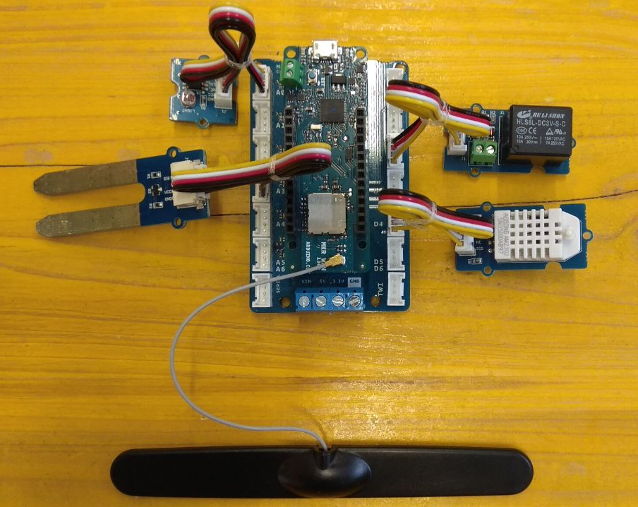

The moisture sensor will be later fitted in the soil, and the relay connected to a proper power supply and to a valve or a water pump.

This is a simple setup, but you can improve accuracy on watering i.e. using a water flow meter.

Of course you can reach the same setup using a breadboard and spare components!

### TheThingNetwork Setup

If you have followed our previous guide "MKR WAN 1310 meets TheThingsNetwork!", then you are done.

### The Arduino MKR 1300 / MKR 1310 Code

Only few things to say about the code (that you'll find below). This is based on the LoraSendAndReceive example available in the MKRWAN library.

There are 2 additional libraries imported:

- The DHT library is used to read the DHT22 sensor
- The Arduino_JSON library is used to parse the _downlink_ message from TTN

The reading of the sensors is done at the interval specified with the _interval_ constant.

After reading the sensors, we prepare a JSON string with all the data collected for the TTN _uplink_.

If there's a _downlink_ available, it will contain a command for change status to our relay, that will be:

- Turned on if we need to water our plant(s)
- Turned off if it's time to stop watering!

The _downlink_ message will be send only if there's a status change.

### Node-RED Setup

[Node-RED](https://nodered.org/) is a flow-based programming tool born for an easy implementation and deploy of IoT apps.

It's available for every OS, and well documented. After [installing it](https://nodered.org/docs/getting-started/installation), just [run it](https://nodered.org/docs/getting-started/running) and point your browser to:

[http://localhost:1880 ](http://localhost:1880/)


Now you'll have to install additional palettes (kinda plugins) in order to:

- Connect to TTN for grabbing the _uplinks_ from the MKR WAN 1300 and MKR WAN 1310, and for send back the _downlink_
- Create a dashboard for the sensor data visualization
- Define a calendar for the watering
- Verify the weather forecast for a close rain (in that case watering won't make sense)

To install a new palette, just click on the burger icon in the top right corner, and choose "Manage Palette"

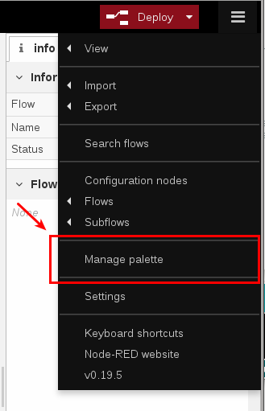

Clink on the _install_ button and then fill the search field with "ttn"; it will filter the available palettes. Let's install the _node-red-contrib-ttn_ one by pressing the _install_ button in the filtered result.

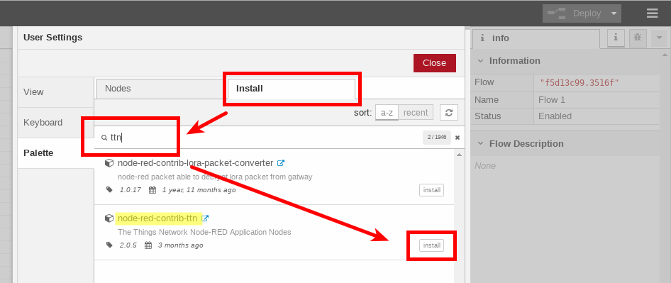

You have also to confirm the installation


Now do the same for the following palettes:

- node-red-node-openweathermap
- node-red-contrib-light-scheduler
- node-red-node-rbe
- node-red-dashboard
- node-red-contrib-startup-trigger

These new palettes will add new nodes on the column on the left.

You can check for new nodes also using the filter on the top of that column:

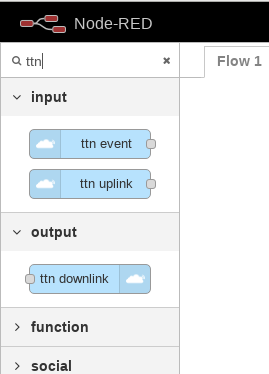

### Node-RED Integration with TTN and Sensor Data Visualization

In order to use the TTN and OpenWeateherMap nodes, we have to do a first setup.

From the nodes on the left column, drag a "ttn uplink" node into the _flow_ (kinda program) in the main area.

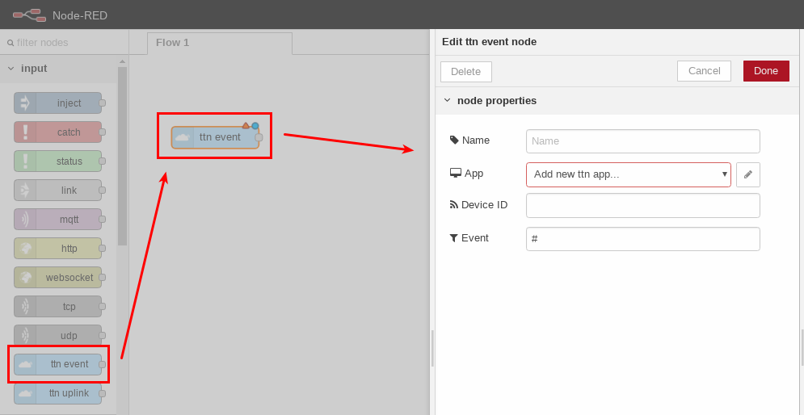

In the right area, we can configure it. For first set the _App_ adding a new ttn app. Click on the pencil icon and fill:

- the App ID field with the name chosen on TTN for your App, and
- the AccessKey by copy-paste the Access Key from the same App page


Now set a name for this node. Let the _Device ID_ and the _Field_ fields empty (in this way this node will receive the _uplinks_ from all the devices registered in that app!) and press _Done._

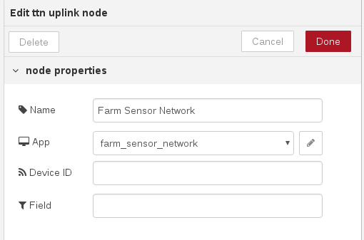

This first node of the flow will receive from the ttn app every _uplink_ (in other words: all the messages sent by the Arduino MKR WAN 1300 or the MKR WAN 1310).

Start adding other nodes to the flow:

- The second one will extract the decoded message. This node is a _function_ node, and it's used to process an input i.e. in order to extract a part of the message. Here the programming language is _javascript_


- The third one will transform the input into a JSON object; it's indeed a _JSON_ node


- At this point we can use the _debug_ node to show in the debug area (left column, bug icon) the output


- In the same way we process that JSON in order to extract the light, temperature, humidity and moisture values thanks to other few _function_ nodes
- In the end, with these data, we can create a dashboard: we can add a _gauge_ widget and a _chart_ widget for each sensors' value


- Last but not least: we have also to save somewhere the value of the moisture; it will be used later on. For this we use another _function_ node, in which will save in the _flow_ that value. You can find more info on storing data on Node-RED [at this link](https://nodered.org/docs/writing-functions#storing-data).

When you use the first _dashboard_ node into a flow, you have to specify the group in which the elements will be gathered. This setting is quite easy, and you can find more info in the [node-red-dashboard](https://flows.nodered.org/node/node-red-dashboard) node page, _Layout_ section.

Connect then in the right order the nodes: you should have now something like this:


Here you can find this flow ready to be imported in your Node-RED!

```arduino
[{"id":"8ad521ed.ea0c4","type":"ttn uplink","z":"c9ea9bc1.58fd68","name":"Farm Sensor Network","app":"2860f894.1fd7e8","dev_id":"","field":"","x":220,"y":580,"wires":[["36b90326.4d9e8c"]]},{"id":"1ad0e4c9.9f91ab","type":"function","z":"c9ea9bc1.58fd68","name":"Extract LIGHT value","func":"var light = msg.payload.light;\nmsg.payload = light;\nreturn msg;","outputs":1,"noerr":0,"x":880,"y":560,"wires":[["6d2d3359.bd0eec","a6c068f5.820c68"]]},{"id":"6d2d3359.bd0eec","type":"ui_chart","z":"c9ea9bc1.58fd68","name":"Light Chart","group":"a3e71755.838d88","order":14,"width":0,"height":0,"label":"Light","chartType":"line","legend":"false","xformat":"HH:mm:ss","interpolate":"linear","nodata":"","dot":true,"ymin":"0","ymax":"1024","removeOlder":1,"removeOlderPoints":"","removeOlderUnit":"86400","cutout":0,"useOneColor":false,"colors":["#1f77b4","#aec7e8","#ff7f0e","#2ca02c","#98df8a","#d62728","#ff9896","#9467bd","#c5b0d5"],"useOldStyle":false,"x":1200,"y":520,"wires":[[],[]]},{"id":"36b90326.4d9e8c","type":"function","z":"c9ea9bc1.58fd68","name":"Extract Decoded Payload","func":"var value = msg.payload.payload;\nmsg.payload = value;\nmsg.topic = msg.dev_id;\nreturn msg;","outputs":1,"noerr":0,"x":460,"y":620,"wires":[["396b66c6.c58b8a"]]},{"id":"396b66c6.c58b8a","type":"json","z":"c9ea9bc1.58fd68","name":"JSON Parse","property":"payload","action":"","pretty":true,"x":650,"y":560,"wires":[["1ad0e4c9.9f91ab","db3bdfa9.f83f7","c46d41ac.9433","823b2cb9.0a4d8","2d5d8598.029f6a"]]},{"id":"db3bdfa9.f83f7","type":"debug","z":"c9ea9bc1.58fd68","name":"","active":true,"tosidebar":true,"console":false,"tostatus":false,"complete":"false","x":830,"y":520,"wires":[]},{"id":"c46d41ac.9433","type":"function","z":"c9ea9bc1.58fd68","name":"Extract TEMPERATURE value","func":"var temp = msg.payload.temp;\nmsg.payload = temp;\nreturn msg;","outputs":1,"noerr":0,"x":910,"y":600,"wires":[["5378f82b.09f368","538a8ef5.794a3"]]},{"id":"823b2cb9.0a4d8","type":"function","z":"c9ea9bc1.58fd68","name":"Extract HUMIDITY value","func":"var hum = msg.payload.hum;\nmsg.payload = hum;\nreturn msg;","outputs":1,"noerr":0,"x":890,"y":640,"wires":[["8f2c98bd.4f1c98","4f71ad75.26f1d4"]]},{"id":"5378f82b.09f368","type":"ui_chart","z":"c9ea9bc1.58fd68","name":"Temp Chart","group":"a3e71755.838d88","order":14,"width":0,"height":0,"label":"Temperature","chartType":"line","legend":"false","xformat":"HH:mm:ss","interpolate":"linear","nodata":"","dot":true,"ymin":"-5","ymax":"45","removeOlder":1,"removeOlderPoints":"","removeOlderUnit":"86400","cutout":0,"useOneColor":false,"colors":["#1f77b4","#aec7e8","#ff7f0e","#2ca02c","#98df8a","#d62728","#ff9896","#9467bd","#c5b0d5"],"useOldStyle":false,"x":1200,"y":620,"wires":[[],[]]},{"id":"8f2c98bd.4f1c98","type":"ui_chart","z":"c9ea9bc1.58fd68","name":"Humidity Chart","group":"a3e71755.838d88","order":14,"width":0,"height":0,"label":"Humidity","chartType":"line","legend":"false","xformat":"HH:mm:ss","interpolate":"linear","nodata":"","dot":true,"ymin":"0","ymax":"100","removeOlder":1,"removeOlderPoints":"","removeOlderUnit":"86400","cutout":0,"useOneColor":false,"colors":["#1f77b4","#aec7e8","#ff7f0e","#2ca02c","#98df8a","#d62728","#ff9896","#9467bd","#c5b0d5"],"useOldStyle":false,"x":1210,"y":720,"wires":[[],[]]},{"id":"a6c068f5.820c68","type":"ui_gauge","z":"c9ea9bc1.58fd68","name":"","group":"8389b2aa.13894","order":14,"width":"0","height":"0","gtype":"gauge","title":"","label":"","format":"{{value}}","min":0,"max":"1024","colors":["#000000","#757572","#ffffff"],"seg1":"","seg2":"","x":1180,"y":480,"wires":[]},{"id":"538a8ef5.794a3","type":"ui_gauge","z":"c9ea9bc1.58fd68","name":"","group":"8389b2aa.13894","order":15,"width":0,"height":0,"gtype":"gauge","title":"","label":"°C","format":"{{value}}","min":"-5","max":"45","colors":["#34a5f2","#09e600","#ca3838"],"seg1":"10","seg2":"28","x":1180,"y":580,"wires":[]},{"id":"4f71ad75.26f1d4","type":"ui_gauge","z":"c9ea9bc1.58fd68","name":"","group":"8389b2aa.13894","order":16,"width":0,"height":0,"gtype":"gauge","title":"","label":"%","format":"{{value}}","min":0,"max":"100","colors":["#91edf5","#008fe6","#0005f0"],"seg1":"","seg2":"","x":1180,"y":680,"wires":[]},{"id":"2d5d8598.029f6a","type":"function","z":"c9ea9bc1.58fd68","name":"Extract MOISTURE value","func":"var mois = msg.payload.mois;\nmsg.payload = mois;\nreturn msg;","outputs":1,"noerr":0,"x":900,"y":680,"wires":[["ad89379.1f100c8","307e3855.af1028","4829b01b.8e85e"]]},{"id":"ad89379.1f100c8","type":"ui_gauge","z":"c9ea9bc1.58fd68","name":"","group":"8389b2aa.13894","order":16,"width":0,"height":0,"gtype":"gauge","title":"","label":"%","format":"{{value}}","min":0,"max":"1024","colors":["#91edf5","#008fe6","#0005f0"],"seg1":"","seg2":"","x":1190,"y":780,"wires":[]},{"id":"307e3855.af1028","type":"ui_chart","z":"c9ea9bc1.58fd68","name":"Moisture Chart","group":"a3e71755.838d88","order":14,"width":0,"height":0,"label":"Moisture","chartType":"line","legend":"false","xformat":"HH:mm:ss","interpolate":"linear","nodata":"","dot":true,"ymin":"0","ymax":"1024","removeOlder":1,"removeOlderPoints":"","removeOlderUnit":"86400","cutout":0,"useOneColor":false,"colors":["#1f77b4","#aec7e8","#ff7f0e","#2ca02c","#98df8a","#d62728","#ff9896","#9467bd","#c5b0d5"],"useOldStyle":false,"x":1220,"y":820,"wires":[[],[]]},{"id":"4829b01b.8e85e","type":"function","z":"c9ea9bc1.58fd68","name":"Save MOISTURE value","func":"flow.set(\"moisture\", msg.payload);\nreturn msg;","outputs":1,"noerr":0,"x":1250,"y":860,"wires":[[]]},{"id":"2860f894.1fd7e8","type":"ttn app","z":"","appId":"farm_sensor_network","accessKey":"your-access-key","discovery":"discovery.thethingsnetwork.org:1900"},{"id":"a3e71755.838d88","type":"ui_group","z":"","name":"ENVIRONMENTAL SENSOR","tab":"f26ca952.50b6d8","disp":true,"width":"8","collapse":true},{"id":"8389b2aa.13894","type":"ui_group","z":"","name":"SENSOR GAUGE","tab":"f26ca952.50b6d8","disp":true,"width":"7","collapse":true},{"id":"f26ca952.50b6d8","type":"ui_tab","z":"","name":"TTN","icon":"dashboard","disabled":false,"hidden":false}]
```

Just select and copy it; then click on the burger icon on the top left corner, and choose _Import_ and then _Clipboard_

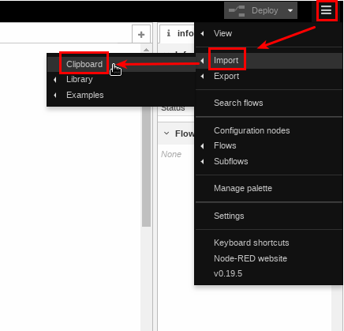

Now paste the flow code, choose to import in the _current flow_, and press _Import_


Remember to fix the TTN node configuration!

Once done, is time to run the flow. Press the _Deploy_ button on the top right corner (this is how a flow is validated and executed).


Now you can also open the dashboard; point your browser to:

[http://localhost:1880/ui](http://localhost:1880/ui)

You should see something like this (widgets will be empty until a few data will arrive)

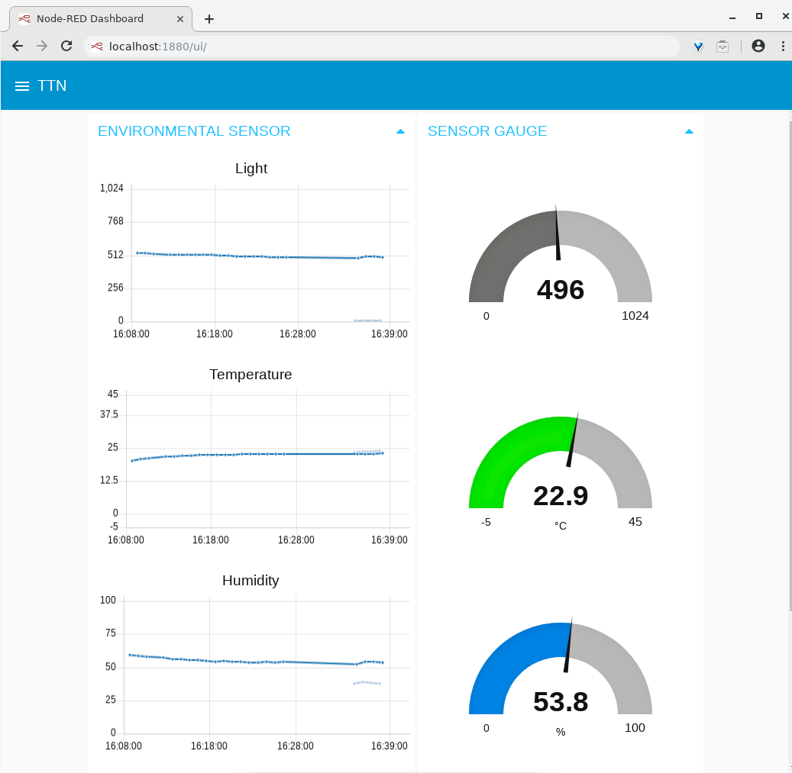

If everything went fine until now, we have finished the first part of the project; the monitoring part.

### Node-RED and Scheduler + OpenWeatherMap (for Weather Forecast)

Now we need to schedule the watering, and avoid water waste due to incoming rain event or soil already wet enough.

Let's start using the _light scheduler_ node, that is good to schedule also stuffs other than light:


Editing this node (double click on it, once dragged into the flow) allows us to define a weekly scheduling, to set Latitude and Longitude of our "farm" in order to calculate sunshine / sunrise (in the Globals field), and to set the output method: here set

- For _On Payload_ an output _Boolean True_,
- For _Off Payload_ an output _Boolean False_
- For output "_when state change + startup_"

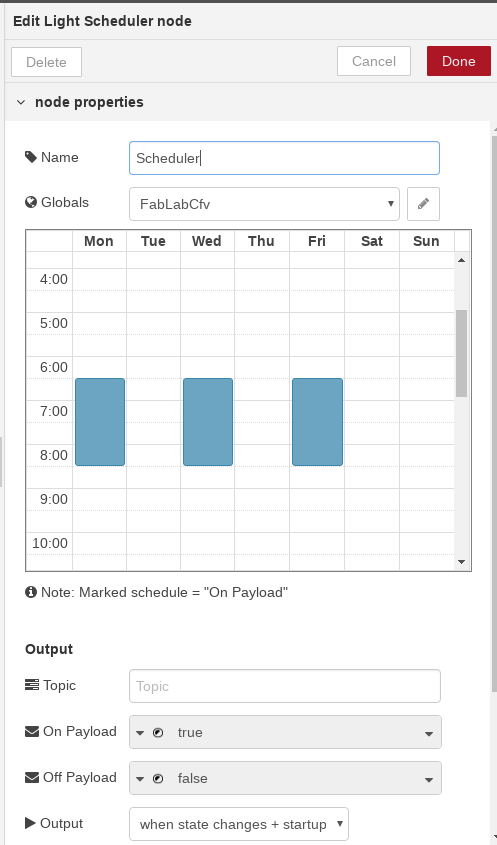

Another node to use is the _openweathermap_ one.


In order to use this node you have to obtain a API KEY from OpenWeatherMap. It's very easy: just register on [their site](https://openweathermap.org/) for a Free Plan and then copy your API KEY!

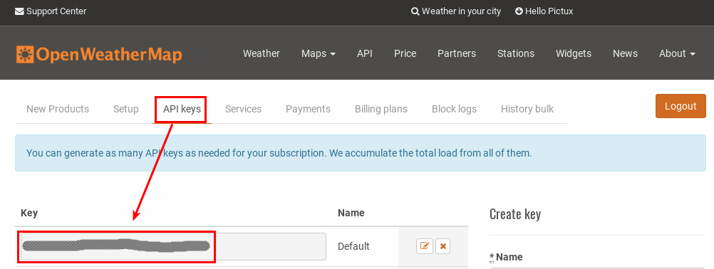

The Free Plan allows you to do up to 60 calls for minute (that is a lot).

Then you have to edit the node property filling the data about your location, by coordinates or by city name.

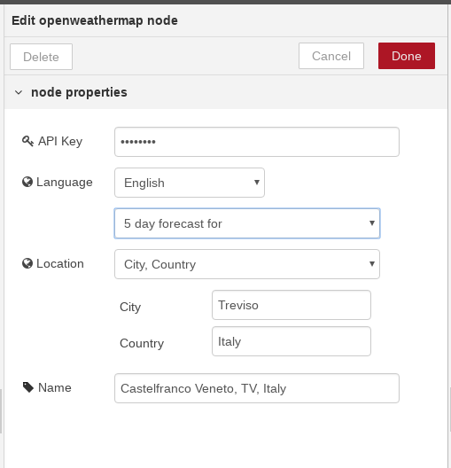

The output of this node will be the forecast for the next 5 days, divided in 3 hours forecast slots.

By using a _function_ node ad a few rows of javascript code on it, we'll keep only the data about precipitation volume of the first 3 slots (that means a total of 9 hours forecast). If the total amount will be over a certain threshold, of course we won't water!

Of course another node to use is the _ttn downlink_


It will be used to send back the relay status update to the Arduino MKR WAN 1300 or the MKR WAN 1310.

Once imported into the flow, edit its property:

- set a proper (arbitrary) _Name_
- choose from the dropdown field the _App_ you have already configured for the _ttn uplink_ node
- don't specify the _Device ID_ that will be the recipient of the message (in this way we can use this node for send message to more than one device! Later on we'll see how)
- set _Port_ to 1
- check the _Confirmed_ box
- Select _replace_ value for _Schedule_


After these, we need other nodes in order to make everything work:

- _rbe_ node (Report By Exception), it is used to generate an output only if there's a change in the output from the Light Scheduler (form ON to OFF and vice versa)


- A few _function_ nodes, used to check for the forecast and for build the _downlink_ message (in which we'll specify also the device id)


- A few _switch_ nodes in order to define rules based on different input (i.e. the moisture value, or the amount of forecast rain, etc)


- Last node we need is the _start-up-trigger_ node, that will be used start the _scheduler_ at every boot


This new flow will work in this way:

- The _scheduler_ is the main in command. It will generate an output that could be true or false.
- If the output is **false**, send directly the _downlink_ message to the device in order to turn OFF the relay.
- It the output is **true**, there will be for first a check on the last value registered for the moisture sensor. If it's over a certain threshold, we'll not water this time.
- If the moisture value is under that threshold, then we check the weather forecast; if there's a certain amount of forecast rain in the next 9 hours, again: no need to water.
- Otherwise, send the _downlink_ message to the device in order to turn ON the relay

The flow will be something like this:


Here you can find this flow ready to be imported in your Node-RED! Remember to update TTN and OpenWeatherMap nodes configuration.

And of course, you can change the values used as threshold on the _switch_ nodes.

```arduino
[{"id":"197f29f7.4643d6","type":"light-scheduler","z":"c9ea9bc1.58fd68","settings":"980aa786.731a58","events":"[{\"start\":{\"dow\":3,\"mod\":990},\"end\":{\"dow\":3,\"mod\":1020}},{\"start\":{\"dow\":1,\"mod\":390},\"end\":{\"dow\":1,\"mod\":510}},{\"start\":{\"dow\":5,\"mod\":390},\"end\":{\"dow\":5,\"mod\":510}}]","topic":"","name":"Scheduler","onPayload":"true","onPayloadType":"bool","offPayload":"false","offPayloadType":"bool","onlyWhenDark":true,"sunElevationThreshold":6,"sunShowElevationInStatus":true,"outputfreq":"output.statechange.startup","x":270,"y":1040,"wires":[["ba7ef794.54c098"]]},{"id":"ba7ef794.54c098","type":"rbe","z":"c9ea9bc1.58fd68","name":"","func":"rbe","gap":"","start":"","inout":"out","property":"payload","x":330,"y":1100,"wires":[["657bd700.f2e3f8"]]},{"id":"4e141e03.beb92","type":"start-up-trigger","z":"c9ea9bc1.58fd68","x":120,"y":960,"wires":[["197f29f7.4643d6"]]},{"id":"7c78353f.ae1f3c","type":"openweathermap","z":"c9ea9bc1.58fd68","name":"Castelfranco Veneto, TV, Italy","wtype":"forecast","lon":"","lat":"","city":"Treviso","country":"Italy","language":"en","x":950,"y":1040,"wires":[["f71443de.0c70f"]]},{"id":"f71443de.0c70f","type":"function","z":"c9ea9bc1.58fd68","name":"next 9 hours of rain","func":"/*\nhttps://openweathermap.org/forecast5\nlist.rain\nlist.rain.3h Rain volume for last 3 hours, mm\n*/\n\nforecast = msg.payload;\nslot_to_check = 4;\n\nvar rain = 0;\nfor (var i=0; i< slot_to_check; i++) {\n    var isN = parseInt(forecast[i].rain['3h']);\n    if (isN) {\n        rain += forecast[i].rain['3h'];\n    }    \n    \n}\nmsg.payload = rain;\nreturn msg;","outputs":1,"noerr":0,"x":970,"y":1100,"wires":[["2fe18ce1.81ad54"]]},{"id":"657bd700.f2e3f8","type":"switch","z":"c9ea9bc1.58fd68","name":"true || false","property":"payload","propertyType":"msg","rules":[{"t":"true"},{"t":"false"}],"checkall":"true","repair":false,"outputs":2,"x":410,"y":1160,"wires":[["5b8d5f8c.3e2bf"],["35be5ee9.7bf612"]]},{"id":"5b8d5f8c.3e2bf","type":"switch","z":"c9ea9bc1.58fd68","name":"moisture < || >","property":"moisture","propertyType":"flow","rules":[{"t":"lt","v":"512","vt":"num"},{"t":"else"}],"checkall":"true","repair":false,"outputs":2,"x":640,"y":1040,"wires":[["7c78353f.ae1f3c"],[]]},{"id":"2fe18ce1.81ad54","type":"switch","z":"c9ea9bc1.58fd68","name":"rain < || >","property":"payload","propertyType":"msg","rules":[{"t":"lt","v":"15","vt":"num"},{"t":"else"}],"checkall":"true","repair":false,"outputs":2,"x":980,"y":1160,"wires":[["1543164a.251a2a"],[]]},{"id":"1543164a.251a2a","type":"function","z":"c9ea9bc1.58fd68","name":"ON message ","func":"var content = \"{\\\"status\\\":1}\";\n\nmsg.payload = content;\nreturn msg;","outputs":1,"noerr":0,"x":610,"y":1280,"wires":[["ce2e4686.5e6448","d891debb.5667b"]]},{"id":"35be5ee9.7bf612","type":"function","z":"c9ea9bc1.58fd68","name":"OFF message ","func":"var content = \"{\\\"status\\\":0}\";\n\nmsg.payload = content;\nreturn msg;","outputs":1,"noerr":0,"x":600,"y":1320,"wires":[["ce2e4686.5e6448"]]},{"id":"ebad1adc.8d2a58","type":"comment","z":"c9ea9bc1.58fd68","name":"scheduler","info":"","x":360,"y":960,"wires":[]},{"id":"a125831.cc53b8","type":"comment","z":"c9ea9bc1.58fd68","name":"moisture check","info":"","x":640,"y":960,"wires":[]},{"id":"d43a1d51.ff7f4","type":"comment","z":"c9ea9bc1.58fd68","name":"weather forecast check","info":"","x":960,"y":960,"wires":[]},{"id":"3b4e826f.72c02e","type":"comment","z":"c9ea9bc1.58fd68","name":"output","info":"","x":630,"y":1240,"wires":[]},{"id":"ce2e4686.5e6448","type":"function","z":"c9ea9bc1.58fd68","name":"build the message","func":"var content = msg.payload;\nvar downlink = \"\";\n\nfor(var i=0;i<content.length;i++) {\n    downlink += ''+content.charCodeAt(i).toString(16);\n}\n\nmsg.dev_id = \"mkr1300_02\";\nmsg.payload = downlink;\n\nreturn msg;","outputs":1,"noerr":0,"x":810,"y":1300,"wires":[["aebe5bc0.97b378","d891debb.5667b"]]},{"id":"aebe5bc0.97b378","type":"ttn downlink","z":"c9ea9bc1.58fd68","name":"Update relay status","app":"594f24fc.25ca4c","dev_id":"","port":"1","confirmed":true,"schedule":"replace","x":630,"y":1460,"wires":[]},{"id":"fd350223.1be83","type":"comment","z":"c9ea9bc1.58fd68","name":"TTN Downlink","info":"","x":630,"y":1420,"wires":[]},{"id":"f92be7b6.92bbf8","type":"inject","z":"c9ea9bc1.58fd68","name":"Manual ON","topic":"","payload":"","payloadType":"date","repeat":"","crontab":"","once":false,"onceDelay":0.1,"x":390,"y":1280,"wires":[["1543164a.251a2a"]]},{"id":"22a57118.758aae","type":"inject","z":"c9ea9bc1.58fd68","name":"Manual OFF","topic":"","payload":"","payloadType":"date","repeat":"","crontab":"","once":false,"onceDelay":0.1,"x":390,"y":1320,"wires":[["35be5ee9.7bf612"]]},{"id":"d891debb.5667b","type":"debug","z":"c9ea9bc1.58fd68","name":"","active":true,"tosidebar":true,"console":false,"tostatus":false,"complete":"true","x":1020,"y":1280,"wires":[]},{"id":"980aa786.731a58","type":"light-scheduler-settings","z":"","name":"FabLabCfv","latitude":"45.67304890","longitude":"11.95903480"},{"id":"594f24fc.25ca4c","type":"ttn app","z":"","appId":"farm_sensor_network","accessKey":"your-access-key","discovery":"discovery.thethingsnetwork.org:1900"}]
```

Now you have a complete setup: you can start doing precision farming.

Just start testing the _downlink_ message: for this you can add to your flow a couple of _inject_ nodes (usually used to trigger manually the execution of a flow)


You don't need to change anything on them but the name, and link them to the _function_ nodes used to create the _downlink_ message


Just click on the square on the left of the node _Manual On_: you'll generate an event that will build and send to TTN the _downlink_ message for turn on the relay.

Remember that the _downlink_ message is sent immediately by Node-Red to TTN (in fact you can see it in queue on the [TTN Console](http://console.thethingsnetwork.org/)), but it is sent back to the Arduino MKR 1300 only after an _uplink_ message!


(payload is converted in hex base; you can use [this tool](https://www.asciitohex.com/) to verify the content)

Now open the Monitor (or Serial Monitor if you are working on the IDE) and you'll see in a while something like this:

```arduino
Sending: {"light":364,"temp":25.70,"hum":46.90,"mois":3} - 7B 22 6C 69 67 68 74 22 3A 33 36 34 2C 22 74 65 6D 70 22 3A 32 35 2E 37 30 2C 22 68 75 6D 22 3A 34 36 2E 39 30 2C 22 6D 6F 69 73 22 3A 33 7D
Message sent correctly!
Received: {"status":1}
```

After this first test, start playing with scheduler and with the moisture sensor (keep it dry for first, then try putting it into a wet sponge).

After you have tested indoor the flows and the circuit, it's time to apply it in the real world!

You can of course add more Arduino MKR WAN 1300 or MKR WAN 1310 devices in the TTN App, and handle them in Node-RED: you need to adapt the flows but as you have already seen on this project, both the hardware and software tools are very easy to use.

## Complete Sketch

<iframe src='https://create.arduino.cc/editor/FabLab_CastelfrancoVeneto/04eb8c3b-5dde-4464-8529-4b1f43509842/preview?embed&snippet' style='height:510px;width:100%;margin:10px 0' frameborder='0'></iframe>
