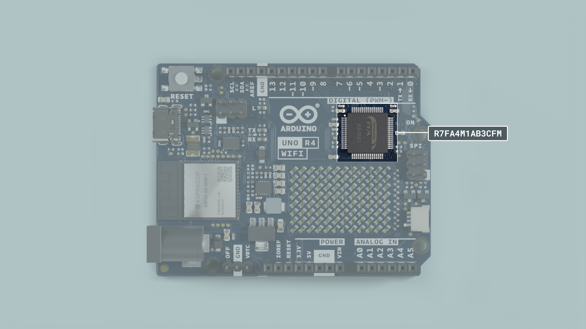
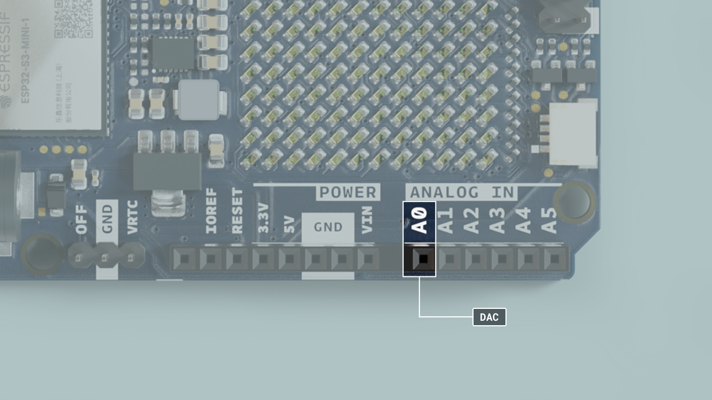
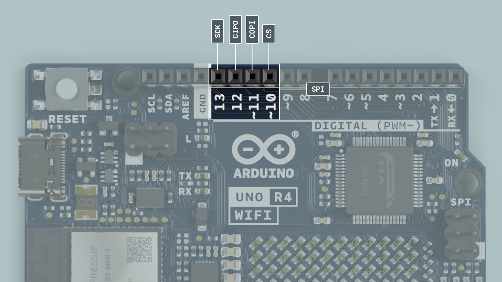
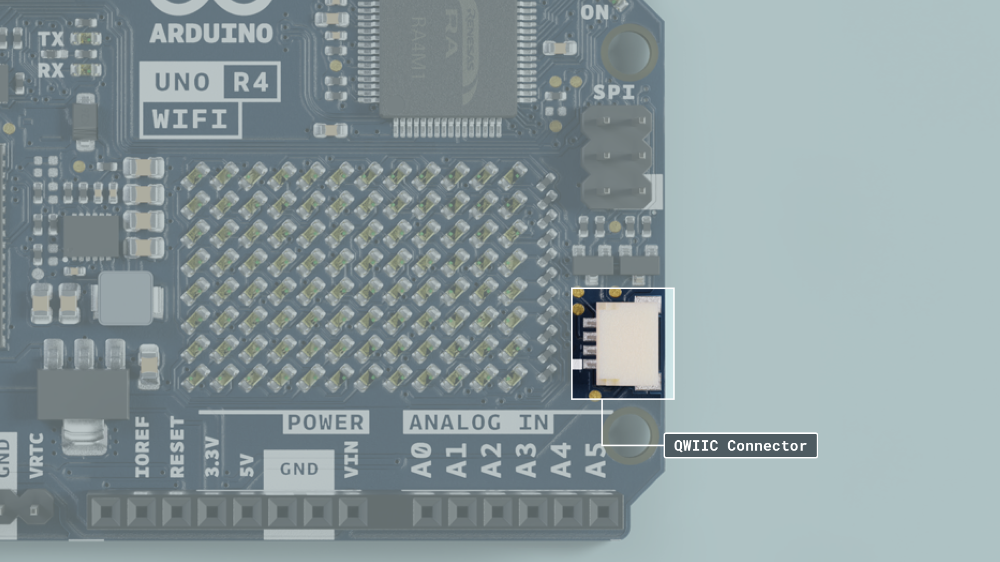
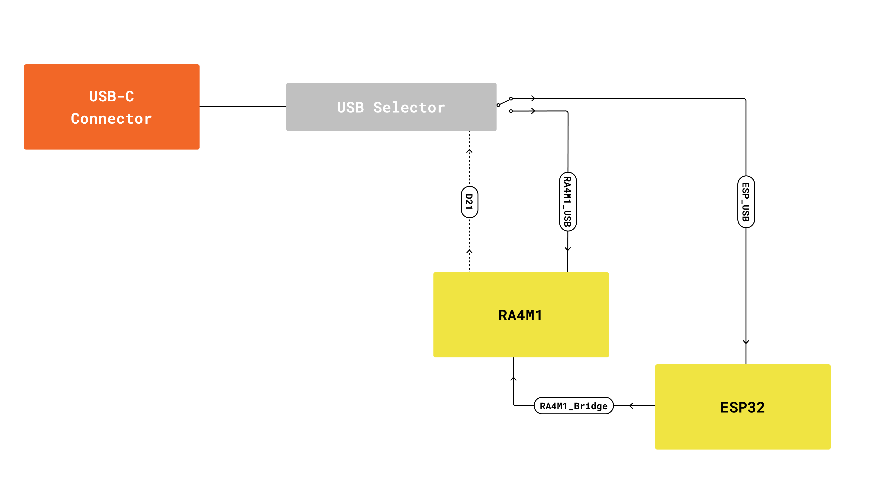
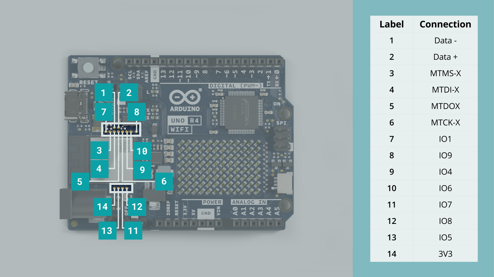

The **Arduino UNO** is our most popular and globally recognized development board, and has become a staple in the maker community and education since its release. The **Arduino UNO R4 WiFi** board is part of the 4th revision of UNO boards, and the first to feature a 32-bit MCU (RA4M1 series from Renesas).

This document serves as a technical overview for the UNO R4 WiFi, where you will a collection of links to resources and guides to help you get started with your next project. 

The ESP32 module and the Renesas RA4M1-chip are part of a sophisticated USB-Serial system that is highly flexible and adaptive to allow for HID features while still keeping the ability to program both the main MCU, and the ESP32, if you so wish (although this is an advanced option and requires some hacking).

You can also visit the documentation platform for the [Arduino UNO R4 WiFi](/hardware/uno-r4-wifi).

## Datasheet 
The full datasheet is available as a downloadable PDF from the link below:

- [Download the UNO R4 WiFi datasheet](/resources/datasheets/ABX00087-datasheet.pdf)

## Power Supply

The board can be powered via the VIN pin, supporting a range between 6-24 V.The VIN pin is also connected to the DC-jack (barrel plug connector).

When powered via the VIN pin, you are using the onboard regulator to bring down the voltage to 5V, which means that the 5 V pin can provide up to 1.2 A. Keep in mind that this voltage regulator also powers the rest of the circuit board, including the MCU, LEDs among other components.

***External devices with a high current draw (e.g. servo motors) should never be powered via the 5 V pin. It is mainly intended for devices drawing lower current such as sensor modules.***

If you’re using the USB-C® connector you must power it with 5 V. 

When powered via USB, you are bypassing the onboard voltage regulator completely. In this case, the 5 V pin can provide up to 2 A without damaging the board. 

## Core

The UNO R4 WiFi is based on the [Arduino UNO R4 Core](https://github.com/arduino/ArduinoCore-renesas).

## Installation

The UNO R4 WiFi can be programmed either via the Arduino IDE, Arduino Web Editor or Arduino CLI.

### Arduino IDE

To use the board in the Arduino IDE, you need to install the latest version of the **Arduino UNO R4 Boards** package from the boards manager.

Read more in the [Getting Started with the UNO R4 WiFi](/tutorials/uno-r4-wifi/r4-wifi-getting-started) guide.

### Arduino Web Editor

The Web Editor is an online IDE that includes all official boards, no need for installing the core/package. You will need the Create Plugin installed on your computer to use the Web Editor.

Read more in the [Getting Started with the Web Editor](https://docs.arduino.cc/arduino-cloud/getting-started/getting-started-web-editor) guide.

## Arduino IoT Cloud

The Arduino UNO R4 WiFi is compatible with the [Arduino IoT Cloud](https://create.arduino.cc/iot/things), a cloud service that allows you to create IoT applications in just minutes.

***Visit the [Getting Started with Arduino IoT Cloud](/arduino-cloud/getting-started/iot-cloud-getting-started) guide for more information.***

## Renesas RA4M1

The UNO R4 WiFi features the powerful and very robust Renesas microcontroller also found on the UNO R4 Minima. Renesas microcontrollers are known for their high performance and robustness, including their built-in peripheral set. 

These peripherals include analog-to-digital converters, timers, pulse width modulation (PWM) units, communication interfaces (such as UART, SPI, and I2C) and more.



### Memory

The board features 
- 32 kB of SRAM 
- 256 kB flash 
- 8 kB data (EEPROM).

## Pins

The UNO R4 WiFi gives you access to many different pins and many of them have special features that will be accounted for in the upcoming sections of this article. Keep reading to learn what you can do with them. 

If you just need a quick overview of the pins functionality, this is a full table of all the IO pins on the UNO R4 WiFi.

| Pin | Type      | Function                          |
| --- | --------- | --------------------------------- |
| D0  | Digital   | UART Receive                      |
| D1  | Digital   | UART Transmit                     |
| D2  | Digital   | GPIO pin, Interrupt               |
| D3  | Digital   | GPIO pin, Interrupt, PWM          |
| D4  | Digital   | GPIO pin                          |
| D5  | Digital   | GPIO pin, PWM                     |
| D6  | Digital   | GPIO pin, PWM                     |
| D7  | Digital   | GPIO pin                          |
| D8  | Digital   | GPIO pin                          |
| D9  | Digital   | GPIO pin, PWM                     |
| D10 | Digital   | SPI (CS), GPIO pin, PWM           |
| D11 | Digital   | SPI (COPI), GPIO pin, PWM         |
| D12 | Digital   | SPI (CIPO), GPIO pin              |
| D13 | Digital   | SPI (SCK), GPIO pin, Built-in LED |
| A0  | Digital   | Analog In, DAC                    |
| A1  | Analog in | Analog In, OPAMP +                |
| A2  | Analog in | Analog In, OPAMP -                |
| A3  | Analog in | Analog In, OPAMP OUT              |
| A4  | Analog in | Analog In, SDA\*                  |
| A5  | Analog in | Analog In, SCL\*                  |

***\*A4 and A5 pins are both connected to the same I2C bus.***

### Analog Pins

The UNO R4 WiFi has six analog input pins (A0-A5) that can be read by using the `analogRead()` function.

| Pin | Type   | Function             |
| --- | ------ | -------------------- |
| A0  | Analog | Analog In, DAC       |
| A1  | Analog | Analog In, OPAMP +   |
| A2  | Analog | Analog In, OPAMP -   |
| A3  | Analog | Analog In, OPAMP OUT |
| A4  | Analog | Analog In, SDA\*     |
| A5  | Analog | Analog In, SCL\*     |

***\*A4 and A5 pins are both connected to the same I2C bus.***

```arduino
value = analogRead(pin);
```

The reference voltage of these pins is 5 V.

The default resolution is set to 10-bit, but can be updated to 12 and 14-bit resolutions. To do so, use the following method in the `setup()` of your sketch.
- `analogReadResolution(10)` (default)
- `analogReadResolution(12)`
- `analogReadResolution(14)`

To learn more about the ADC capabilities of the UNO R4 WiFi, check out the [ADC-Resolution Guide](/tutorials/uno-r4-wifi/adc-resolution).

### OPAMP Pins

The **RA4M1** has an internal OPAMP that is exposed on the UNO R4 WiFi as follows:

| Pin | OPAMP     |
| --- | --------- |
| A1  | OPAMP +   |
| A2  | OPAMP -   |
| A3  | OPAMP OUT |

### Digital Pins

The UNO R4 WiFi features a total of digital 14 pins. Though some of them serve another purpose and shouldn't be used for GPIO if you have other pins available.


| Pin | Function | Notes                |
| --- | -------- | -------------------- |
| 0   | RX       | Serial communication |
| 1   | TX       | Serial communication |
| 2   | GPIO     | Digital IO pin       |
| 3   | PWM      | Digital IO pin, PWM  |
| 4   | GPIO     | Digital IO pin       |
| 5   | PWM      | Digital IO pin, PWM  |
| 6   | PWM      | Digital IO pin, PWM  |
| 7   | GPIO     | Digital IO pin       |
| 8   | GPIO     | Digital IO pin       |
| 9   | PWM      | Digital IO pin, PWM  |
| 10  | PWM      | Digital IO pin, PWM  |
| 11  | PWM      | Digital IO pin, PWM  |
| 12  | GPIO     | Digital IO pin       |
| 13  | GPIO     | Digital IO pin       |

The reference voltage of all digital pins is 5 V.

### PWM

PWM (Pulse Width Modulation) capability allows a digital pin to emulate analog output by flickering on and off very fast letting you, among other things, dim LEDs connected to digital pins. 

The UNO R4 WiFi supports PWM on pins marked with ~ on the headers. Officially supported pins are:

| Pin | RA4M1 | Timer   |
| --- | ----- | ------- |
| D3  | P105  | GTIOC1A |
| D5  | P107  | GTIOC0A |
| D6  | P111  | GTIOC3A |
| D9  | P303  | GTIOC7B |
| D10 | P103  | GTIOC2A |
| D11 | P411  | GTIOC6A |

You may use them as analog output pins with the function: 

```arduino
analogWrite(pin, value);
```

**Please Note:** the following pins are PWM capable but may interfere with other functionalities of the UNO R4 WiFi board. When writing library functions, please do not use this as they are not officially supported PWM pins. 

| Pin       | RA4M1 | Timer   |
| --------- | ----- | ------- |
| D0        | P301  | GTIOC4B |
| D1        | P302  | GTIOC4A |
| D2        | P104  | GTIOC1B |
| D4        | P106  | GTIOC0B |
| D7        | P112  | GTIOC3B |
| D8        | P304  | GTIOC7A |
| D12       | P410  | GTIOC6B |
| D13       | P102  | GTIOC2B |
| D18 / SDA | P101  | GTIOC5A |
| D19 / SCL | P100  | GTIOC5B |


## LED Matrix

The LED Matrix on the UNO R4 WiFi is available to use in your program, to display still graphics, animations, or even play games on. The Renesas core includes the [Arduino_LED_Matrix](https://github.com/arduino/ArduinoCore-renesas/tree/main/libraries/Arduino_LED_Matrix) library for displaying frames on the matrix.

To learn about the LED matrix in depth, check out the [LED Matrix Guide](/tutorials/uno-r4-wifi/led-matrix/).

-  `Arduino_LED_Matrix matrix` - Initialises a LED matrix. 
-  `Arduino_LED_Matrix.load()` - Loads a frame into the frame buffer.
Here's a basic example:

```arduino
// creates an array of two frames
const uint32_t frames[][4] = {
  {
    0x0,
    0x0,
    0xc00c0000,
    150
  },
  {
    0x0,
    0x1e01,
    0x201201e0,
    150
  }
}

  // loads the frames into the matrix buffer
  matrix.load(frames);

  ```

## DAC

The UNO R4 WiFi also has a DAC with up to 12-bit resolution, that can act as a genuine analog output pin which means it's even more capable than PWM pins.

```arduino
analogWrite(pin, value);
```



This DAC pin has a default write resolution of 8-bits. This means that values that are written to the pin should be between 0-255.

However you may change this write resolution if you need to, to up to 12-bits, and in this case the values you write to the pin should be between 0-4096.

```arduino
analogWriteResolution(12);
```

To learn more about the DAC capabilities of the UNO R4 WiFi, check out the [DAC Guide](/tutorials/uno-r4-wifi/dac).

## RTC


A real-time clock (RTC) is used to measure the time, and is useful in any time-tracking applications.

***The UNO R4 WiFi features a VRTC pin, that is used to keep the onboard RTC running, even when the boards power supply is is cut off. In order to use this, apply a voltage in the range of 1.6 - 3.6 V to the VRTC pin.***

Below is a minimal example that shows how to obtain the date and time from the RTC:

```arduino
#include "RTC.h"

void setup() {
  Serial.begin(9600);

  RTC.begin();
  RTCTime mytime(30, Month::JUNE, 2023, 13, 37, 00, DayOfWeek::WEDNESDAY, SaveLight::SAVING_TIME_ACTIVE);

  RTC.setTime(mytime);
}

void loop() {
  RTCTime currenttime;

 // Get current time from RTC
  RTC.getTime(currenttime);
  
  // Print out date (DD/MM//YYYY)
  Serial.print(currenttime.getDayOfMonth());
  Serial.print("/");
  Serial.print(Month2int(currenttime.getMonth()));
  Serial.print("/");
  Serial.print(currenttime.getYear());
  Serial.print(" - ");

  // Print time (HH/MM/SS)
  Serial.print(currenttime.getHour());
  Serial.print(":");
  Serial.print(currenttime.getMinutes());
  Serial.print(":");
  Serial.println(currenttime.getSeconds());

  delay(1000);
}

```

To learn more about the RTC capabilities of the UNO R4 WiFi, check out the [RTC Guide](/tutorials/uno-r4-wifi/rtc).

## EEPROM

EEPROM, also referred to as 'data' memory, is type of memory that can retain data even after the board has been powered off.

```arduino
EEPROM.write(address, val);
EEPROM.read(address);
```

It has a limited amount of write cycles, meaning that it is best suited for read-only applications. Make sure to never use `write()` inside `void loop()` because you may use all write cycles for the chip.

Read more in the [Guide to EEPROM](/learn/programming/eeprom-guide).

To learn more about the EEPROM capabilities of the UNO R4 WiFi, check out the [EEPROM Guide](/tutorials/uno-r4-wifi/eeprom).

## SPI



The UNO R4 WiFi features a Serial Peripheral Interface (SPI) bus. The bus (connector), ‘SPI’ uses the following pins:


- (COPI) - D11
- (CIPO) - D12
- (SCK) - D13
- (CS) - D10

The following example shows how to use SPI:


```arduino
#include <SPI.h>

const int CS = 10;


void setup() {
  pinMode(CS, OUTPUT);

  SPI.begin();

  digitalWrite(CS, LOW);

  SPI.transfer(0x00);
  
  digitalWrite(CS, HIGH);
}

void loop() {
}
```

## I2C

I2C lets you connect multiple I2C compatible devices in series using only two pins. The controller will send out information through the I2C bus to a 7-bit address, meaning that the technical limit of I2C devices on a single line is 128. Practically, you're never gonna reach 128 devices before other limitations kick in.

The UNO R4 WiFi has one I2C bus which is marked with SCL and SDA. They are shared with A4 (SDA) and A5 (SCL) which owners of previous UNO's are familiar with. The pullups are not mounted on the PCB but there are footprints to do so if needed.

The pins used for I2C on the UNO R4 WiFi are the following:
- SDA - D14
- SCL - D15


To connect I2C devices you will need to include the [Wire](https://www.arduino.cc/reference/en/language/functions/communication/wire/) library at the top of your sketch.

```arduino
#include <Wire.h>
```

Inside `void setup()` you need to initialize the library, and initialize the I2C port you want to use.

```arduino
Wire.begin() //SDA & SDL
Wire1.begin(); //SDA1 & SDL1
Wire2.begin(); //SDA2 & SDL2
```

And to write something to a device connected via I2C, we can use the following commands:

```arduino
Wire.beginTransmission(1); //begin transmit to device 1
Wire.write(byte(0x00)); //send instruction byte 
Wire.write(val); //send a value
Wire.endTransmission(); //stop transmit
```

## QWIIC Connector



***The Qwiic connector on the UNO R4 WiFi is connected to the secondary I2C bus (IIC0), which uses the `Wire1` object rather than the `Wire` object. Please note that the Qwiic connector is 3.3 V only.***

The UNO R4 WiFi features a Qwiic/STEMMA connector that you can use to connect modules, often allowing you to daisy chain several modules and control all of them through a single connector.

Qwiic or STEMMA are both names for a type of connector developed by SparkFun and Adafruit respectively, that bundles the I2C pins of a development board and breakout modules. What this means is that if you have a development board (such as for example the Arduino UNO R4 WiFi) and a breakout module, and both have a Qwiic or STEMMA connector, you can hook them up together and with absolutely minimal wiring you can quickly create multi-faceted projects. 

If your breakout board features more than one of these connectors, which many do, you can use the second one to daisychain *another* Qwiic module to add another interactive node to your project.

The UNO R4 WiFi features two I2C buses, and the Qwiic connector is connected to the secondary one. What this means is that if you are using the [Wire](https://reference.arduino.cc/reference/en/language/functions/communication/wire/) library, you will need to use the `Wire1` object rather than the `Wire` object, like the following example:

```arduino
#include <Wire.h>

void setup(){
  Wire1.begin();
  Wire1.beginTransmission(1);   //begin transmit to device 1
  Wire1.write(byte(0x00));      //send instruction byte 
  Wire1.write(val);             //send a value
  Wire1.endTransmission();      //stop transmit
}
```

## USB Serial & UART

The UNO R4 WiFi board features 2 separate hardware serial ports. 

- One port is exposed via USB-C®, and 
- One is exposed via RX/TX pins.

This is one of the few things that are distinctly different from UNO R3 to UNO R4, as the UNO R3 only features one hardware serial port, that is connected to **both** the USB port and the RX/TX pins on the board.

The pins used for UART on the UNO R4 WiFi are the following:

| Pin | Function      |
| --- | ------------- |
| D0  | RX (Receive)  |
| D1  | TX (Transmit) |

### Native USB

Sending serial data to your computer is done using the standard `Serial` object. I

```arduino
Serial.begin(9600);
Serial.print("hello world");
```

To send and receive data through UART, we will first need to set the baud rate inside `void setup()`.

### UART

The pins used for UART on the UNO R4 WiFi are the following:

| Pin | Function |
| --- | -------- |
| D0  | RX0      |
| D1  | TX0      |

To send and receive data through UART, we will first need to set the baud rate inside `void setup()`. Note that when using the UART (RX/TX pins), we use the `Serial1` object.

```arduino
Serial1.begin(9600);
```

To read incoming data, we can use a while loop() to read each individual character and add it to a string.

```arduino
  while(Serial1.available()){
    delay(2);
    char c = Serial1.read();
    incoming += c;
  }
```

And to write something, we can use the following command:

```arduino
Serial1.write("Hello world!");
```

### Serial Event

The [serialEvent()](https://www.arduino.cc/reference/en/language/functions/communication/serial/serialevent/) method is supported on older revisions of the UNO board, but **not** on the UNO R4 boards (or any other newer Arduino boards).

However, as this method is only used to detect serial data and execute a function, you can also use `Serial.available()` to detect when new data is available:

```arduino
if(Serial.available() > 0) {
  //code goes here
}
```

### SerialUSB

The UNO R4 WiFi has an extended set of Serial methods that can be enabled whenever you include the `<HID.h>` library in your sketch.

- `Serial.baud()` - Returns the baud rate **(int)** currently used.
- `Serial.stopbits()` - Returns the number of stop bits **(int)** used in the communication.
- `Serial.paritytype()` - Returns the type of parity **(int)** used in the communication.
- `Serial.numbits()` - Returns the number of data bits **(int)** used in the communication.
- `Serial.dtr()` - Returns the status of the Data Terminal Ready (DTR) signal **(bool)** and also sets the- ignore_dtr flag to true if the DTR signal is actively used.
- `Serial.rts()` - Returns the status of the Request to Send (RTS) signal **(bool)**.

The `<HID.h>` library remaps the `Serial` object to `SerialUSB`, which enables these additional features. 

Supported links:
- [SerialUSB.h](https://github.com/arduino/ArduinoCore-renesas/blob/main/cores/arduino/usb/SerialUSB.h) (Github).

## USB HID

***Please note that due to how the USB port is implemented on the UNO R4 WiFi, when using HID the board may show up as a different USB port. If this happens, simply double-tap the reset button, and select your board again.***

This board can act as an HID (keyboard/mouse) and send keystrokes or coordinates to your computer via native USB.

```arduino
keyboard.press('W');
mouse.move(x,y);
```

This support is enabled by the [keyboard](https://www.arduino.cc/reference/en/language/functions/usb/keyboard/) and [mouse](https://www.arduino.cc/reference/en/language/functions/usb/mouse/) libraries that you can install from the library manager in the IDE.

To learn more about the HID capabilities of the UNO R4 WiFi, check out the [HID Guide](/tutorials/uno-r4-wifi/usb-hid).

### Serial Remap

Whenever the `<HID.h>` library is included in a sketch, the serial object is switched from `Serial` to `SerialUSB` to support HID features. This enables more methods, which are listed [here](#serialusb).

Supported links:
- [HID.h](https://github.com/arduino/ArduinoCore-renesas/blob/main/libraries/HID/HID.h) (Github)

## CAN Module

The UNO R4 WiFi's RA4M1 has a built-in CAN module that complies with the CAN 2.0A/CAN 2.0B standard. 

The pins CANRX and CANTX can be connected to a CAN transceiver, such as a MCP2551 or TJA1050 ICs.

| Pin | Function |
| --- | -------- |
| D10 | CANRX    |
| D13 | CANTX    |

The built-in **Arduino_CAN** library is used to communicate with other CAN devices. 

```arduino
//set CAN bit rate and init library at
//choose from BR_125k,BR_250k,BR_500k,BR_1000k 
CAN.begin(CanBitRate::BR_250k); 
```

Construct a CAN message and send it:

```arduino
uint8_t const msg_data[] = {0xCA,0xFE,0,0,0,0,0,0};
memcpy((void *)(msg_data + 4), &msg_cnt, sizeof(msg_cnt));
CanMsg msg(CAN_ID, sizeof(msg_data), msg_data);
CAN.write(msg);
```

Read an incoming CAN message.
```arduino
CanMsg const msg = CAN.read(); //read
```

***Please note that without a CAN transceiver it is not possible to communicate with other CAN devices.*** 

To learn more about the CAN capabilities of the UNO R4 WiFi, check out the [CAN Guide](/tutorials/uno-r4-wifi/can).

## ESP32-S3-MINI-1-N8

By default, the ESP32-S3 module onboard the UNO R4 WiFi acts as a Serial bridge, handling the connection to your computer. It also handles the rebooting of the main MCU, the Renesas RA4M1 when it is needed, for example when receiving a new sketch and resetting.

On the UNO R3, the ATMEGA16U2 serves the same purpose. The onboard ESP32 module is a more advanced SoC, adding Wi-Fi® & Bluetooth® connectivity to the board.

The ESP32 also exposes the ESP32's data lines, so that you can program the ESP32 directly. These data lines are exposed by 3x2 header at the top of the board, or through pads on the bottom side.

***Please note that the ESP32 has a default firmware installed, which is set to communicate with the RA4M1 chip. Any direct programming of the ESP32 will override that firmware and the communication between the chips may be disrupted until the default firmware is restored.***


### USB Bridge

By default the ESP32 acts as a serial bridge between a computer and the RA4M1 MCU. The USB data lines are routed through switches, and by default, these switches are set for communication to go via the ESP32 module.



If you wish you can change this and get direct access to the serial bus on the RA4M1 MCU either with software or hardware. See the instructions below:

1. Software - By pulling D21 to HIGH you will close the circuit that controls which MCU is connected to USB. While D21 is HIGH, the RA4M1 is connected to the USB Serial port, and while D21 is LOW the ESP32 is connected, like the default configuration.
  You can do this by including the following code in `void setup()`
  ```arduino
  pinMode(21, OUTPUT);
  digitalWrite(21, HIGH);
  ```
2. On the back of the UNO R4 WiFi you will find solder pads labelled "RA4M1 USB". If you create a short circuit between these pads, by for example creating a bridge across them with solder, the RA4M1 will be connected to the USB Serial port, instead of the ESP32.


### Wi-Fi®

The ESP32 onboard the UNO R4 WiFi is used to give the board Wi-Fi® capabilities. The Wi-Fi® module has a bitrate of up to 150 Mbps. The ESP32 module has a built in trace-antenna, meaning that you do not need an external one to use the connectivity features of the board. However, this trace antenna is shared with the Bluetooth® module, which means that you cannot use Bluetooth® and Wi-Fi® at the same time.

To use the Wi-Fi® features of the UNO R4 WiFi, use the **WiFiS3** library that is built in to the UNO R4 Core.

To learn more about the Wi-Fi® capabilities of the UNO R4 WiFi, try out the [Network Examples](/tutorials/uno-r4-wifi/wifi-examples).

### Bluetooth®

Thanks to the ESP32 module, the UNO R4 WiFi has Bluetooth® LE and Bluetooth® 5 capabilities, at a speed of up to 2 Mbps. The ESP32 module has a built in trace-antenna, meaning that you do not need an external one to use the connectivity features of the board. However, this trace antenna is shared with the Bluetooth® module, which means that you cannot use Bluetooth® and Wi-Fi® at the same time.

### Programming the ESP32 (Advanced)

The ESP32 module and the Renesas RA4M1-chip are part of a sophisticated USB-Serial system that is highly flexible and adaptive to allow for HID features while still keeping the ability to program both the main MCU, and the ESP32, if you so wish. By default, the ESP32's is used mainly as a radio module using Wi-Fi® and Bluetooth®.

Overwriting the ESP32's firmware disrupts the communication between the two MCUs, but enables them to act independently. 

***Note: To reprogram the ESP32 module, you need to short the ESP_Download pin to GND while resetting the board. This will put the ESP32 module in a bootloader state where you can establish a connection to it and reprogram the module.***

To reprogram the ESP32 board you can either find UART-pads next to the ESP32 Module, that are laid out as shown in the image below:



or you can use the pins exposed directly on the ESP32 header, shown here:


