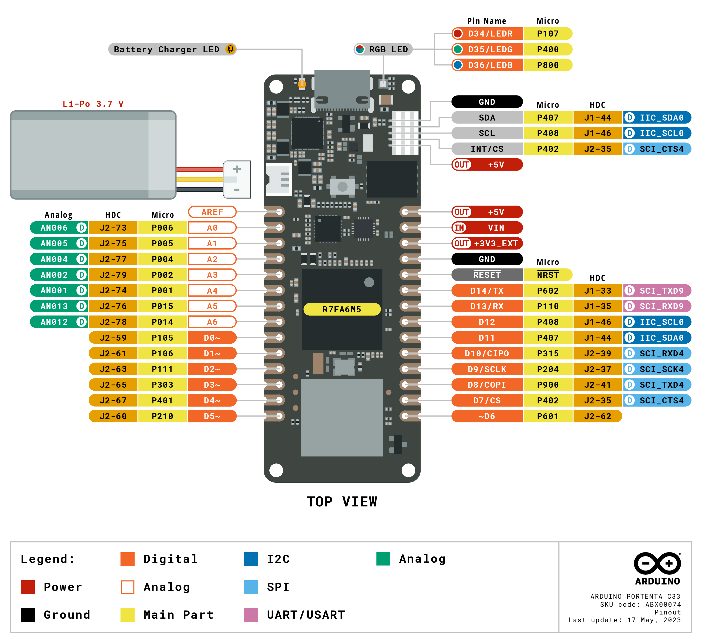
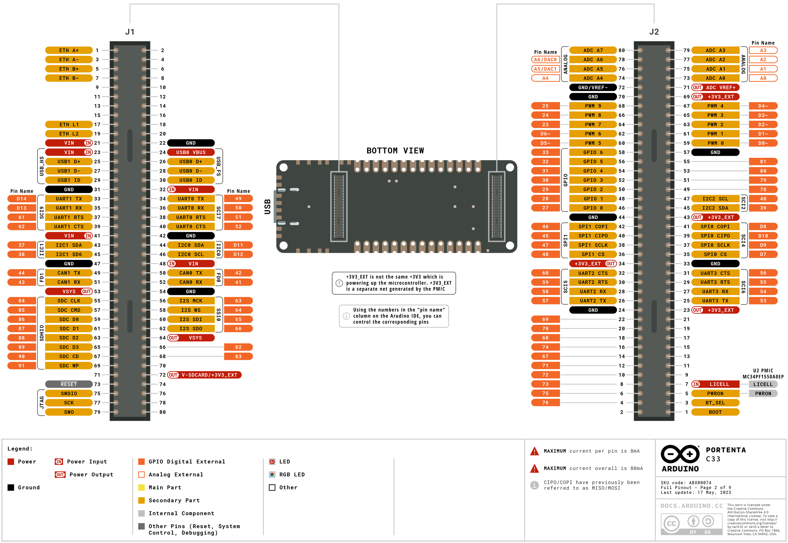
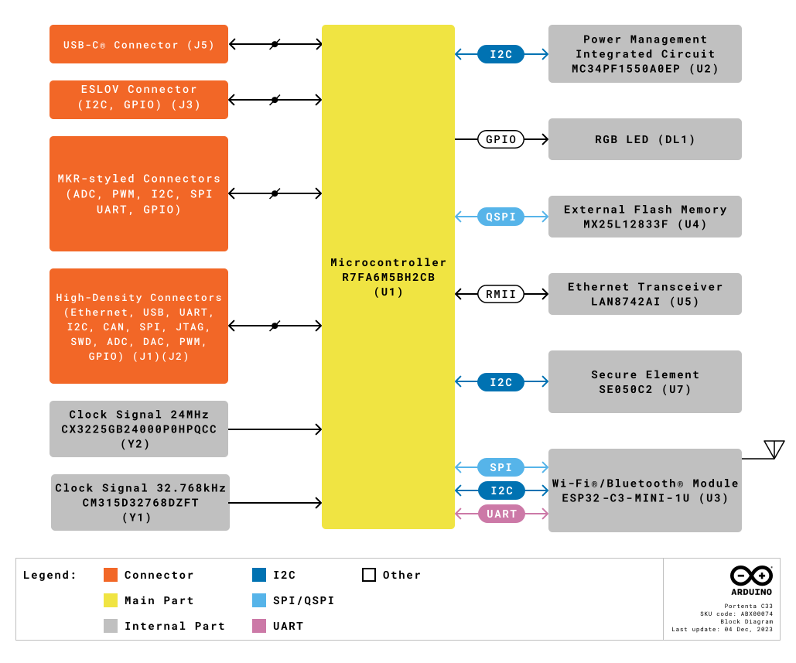
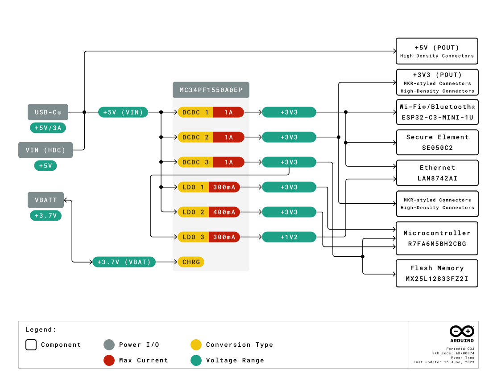
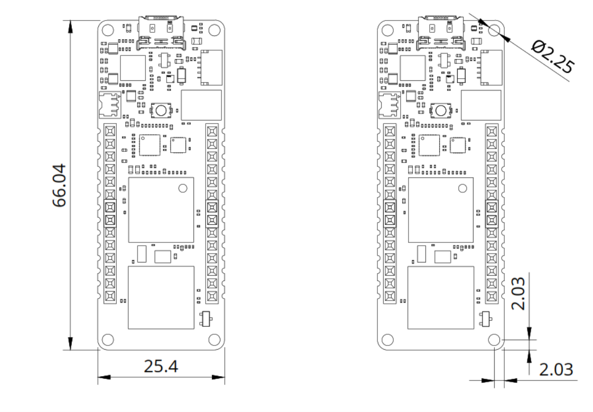

# Description 

The Portenta C33 is a powerful System-on-Module designed for low-cost Internet of Things (IoT) applications. Based on the R7FA6M5BH2CBG microcontroller from Renesas®, this board shares the same form factor as the Portenta H7 and it is backward compatible with it, making it fully compatible with all Portenta family shields and carriers through its high-density connectors. As a low-cost device, the Portenta C33 is an excellent choice for developers looking to create IoT devices and applications on a budget. Whether you're building a smart home device or a connected industrial sensor, the Portenta C33 provides the processing power and connectivity options you need to get the job done.

# Target Areas

IoT, building automation, smart cities, and agriculture

# CONTENTS
## Application Examples

Thanks to its high-performance processor, the Portenta C33 supports many applications. From industrial applications to rapid prototyping, IoT solutions, and building automation, among many others. Here are some application examples:

- **Industrial Automation:** The Portenta C33 can be implemented as a solution for different industrial applications, such as:
    - **Industrial IoT gateway:** Connect your devices, machines, and sensors to a Portenta C33 gateway. Collect real-time operation data and display them on an Arduino IoT Cloud dashboard, leveraging end-to-end secure data encryption.
    - **Machine monitoring to track OEE/OPE:** Track Overall Equipment Efficiency (OEE) and Overall Process Effectiveness (OPE) with the Portenta C33 as an IoT node. Collect data and get alerted on machine uptime and unplanned downtime to provide reactive maintenance and improve production rate.
    - **Inline Quality Assurance:** Leverage full compatibility between Portenta C33 and Nicla family to carry out quality control in your production lines. Collect Nicla smart sensing data with the Portenta C33 to catch defects early and resolve them before they travel down the line.
- **Prototyping:** The Portenta C33 can assist Portenta and MKR developers with their IoT prototypes by integrating ready-to-use Wi-Fi®/Bluetooth® connectivity and various peripheral interfaces, including CAN, SAI, SPI, and I2C. Moreover, the Portenta C33 can be promptly programmed with high-level languages like MicroPython, allowing for rapid prototyping of IoT applications.

- **Building Automation:** The Portenta C33 can be used in multiple building automation applications:
    - **Energy Consumption Monitoring:** Collect and monitor consumption data from all services (e.g., gas, water, electricity) in a single system. Display usage trends in Arduino IoT Cloud charts, providing an overall image for energy management optimization and cost reduction.
    - **Appliances Control System**: Leverage high-performing Portenta C33 microcontroller to control in real-time your appliances. Adjust HVAC heating or improve the efficiency of your ventilation system, control the motors of your curtains, and switch on/off lights. The onboard Wi-Fi® connectivity easily allows Cloud integration, so that everything is under control even from the remote.

## Features
### General Specifications Overview

The Portenta C33 is a powerful microcontroller board designed for low-cost IoT applications. Based on the high-performance R7FA6M5BH2CBG microcontroller from Renesas®, it offers a range of key features and a low-power design that make it well-suited for a variety of applications. The board has been designed with the same form factor as the Portenta H7 and is backward compatible, making it fully compatible with all Portenta family shields and carriers through its MKR-styled and high-density connectors. Table 1 summarizes the board's main features, and Table 2, 3, 4, 5, and 6 shows more detailed information about the board's microcontroller, secure element, Ethernet transceiver, and external memory.

<table>
<thead>
  <tr>
    <th>Feature</th>
    <th>Description</th>
  </tr>
</thead>
<tbody>
  <tr>
    <td>Microcontroller</td>
    <td>200 MHz, Arm® Cortex®-M33 core microcontroller (R7FA6M5BH2CBG)</td>
  </tr>
  <tr>
    <td>Internal Memory</td>
    <td>2 MB Flash and 512 kB SRAM</td>
  </tr>
  <tr>
    <td>External Memory</td>
    <td>16 MB QSPI Flash memory (MX25L12833F)</td>
  </tr>
  <tr>
    <td>Connectivity</td>
    <td>2.4 GHz Wi-Fi® (802.11 b/g/n) and Bluetooth® 5.0 (ESP32­-C3-­MINI-­1U)</td>
  </tr>
  <tr>
    <td>Ethernet</td>
    <td>Ethernet physical layer (PHY) transceiver (LAN8742AI)</td>
  </tr>
  <tr>
    <td>Security</td>
    <td>IoT-ready secure element (SE050C2)</td>
  </tr>
  <tr>
    <td>USB Connectivity</td>
    <td>USB-C® port for power and data (accessible also through the board's High-Density connectors)</td>
  </tr>
  <tr>
    <td>Power Supply</td>
    <td>Various options for easily powering the board: USB-C® port, single-cell lithium-ion/lithium-polymer battery and external power supply connected through MKR-styled connectors</td>
  </tr>
  <tr>
    <td>Analog Peripherals</td>
    <td>Two, eight-channel 12-bit analog-to-digital converter (ADC) and two 12-bit digital-to-analog converter (DAC)</td>
  </tr>
  <tr>
    <td>Digital Peripherals</td>
    <td>GPIO (x7), I2C (x1), UART (x4), SPI (x2), PWM (x10), CAN (x2), I2S (x1), SPDIF (x1), PDM (x1), and SAI (x1)</td>
  </tr>
  <tr>
    <td>Debugging</td>
    <td>JTAG/SWD debug port (accessible through the board's High-Density connectors)</td>
  </tr>
  <tr>
    <td>Dimensions</td>
    <td>66.04 mm x 25.40 mm</td>
  </tr>
  <tr>
    <td>Surface-mount</td>
    <td>Castellated pins allow the board to be positioned as a surface-mountable module</td>
  </tr>
</tbody>
</table>

<caption>Table 1: Portenta C33 Main Features</caption>

### Microcontroller

<table>
<thead>
  <tr>
    <th>Component</th>
    <th>Details</th>
  </tr>
</thead>
<tbody>
  <tr>
    <td rowspan="7">R7FA6M5BH2CBG</td>
    <td>32-bit Arm® Cortex®-M33 microcontroller, with a maximum operating frequency of 200 MHz</td>
  </tr>
  <tr>
    <td>2 MB of flash memory and 512 KB of SRAM</td>
  </tr>
  <tr>
    <td>Several peripheral interfaces, including UART, I2C, SPI, USB, CAN, and Ethernet</td>
  </tr>
  <tr>
    <td>Hardware-based security features, such as a True Random Number Generator (TRNG), a Memory Protection Unit (MPU), and a TrustZone-M security extension</td>
  </tr>
  <tr>
    <td>Onboard power management features that allow it to operate on low power mode</td>
  </tr>
  <tr>
    <td>Onboard RTC module that provides accurate timekeeping and calendar functions, along with programmable alarms and tamper detection features</td>
  </tr>
  <tr>
    <td>Designed to operate over a wide temperature range, from -40°C to 105°C, making it suitable for use in harsh environments</td>
  </tr>
</tbody>
</table>

<caption>Table 2: Portenta C33 Microcontroller Features</caption>

### Wireless Communication

<table>
<thead>
  <tr>
    <th>Component</th>
    <th>Details</th>
  </tr>
</thead>
<tbody>
  <tr>
    <td rowspan="2">ESP32­-C3-­MINI-­1U</td>
    <td>2.4 GHz Wi-­Fi® (802.11 b/g/n) support</td>
  </tr>
  <tr>
    <td>Bluetooth® 5.0 Low Energy support</td>
  </tr>
</tbody>
</table>

<caption>Table 3: Portenta C33 Wireless Communication Features</caption>

### Ethernet Connectivity

<table>
<thead>
  <tr>
    <th>Component</th>
    <th>Details</th>
  </tr>
</thead>
<tbody>
  <tr>
    <td rowspan="7">LAN8742AI</td>
    <td>Single-port 10/100 Ethernet transceiver designed for use in industrial and automotive applications</td>
  </tr>
  <tr>
    <td>Designed to operate in harsh environments, with built-in features such as ESD protection, surge protection, and low EMI emissions</td>
  </tr>
  <tr>
    <td>Media Independent Interface (MII) and Reduced Media Independent Interface (RMII) interfaces support, making it compatible with a wide range of Ethernet controllers</td>
  </tr>
  <tr>
    <td>Built-in low-power mode that reduces power consumption when the link is idle, helping to conserve power in battery-powered devices</td>
  </tr>
  <tr>
    <td>Auto-negotiation support, which allows it to automatically detect and configure the link speed and duplex mode, making it easy to use in a variety of applications</td>
  </tr>
  <tr>
    <td>Built-in diagnostic features, such as loopback mode and cable length detection, which help to simplify troubleshooting and debugging</td>
  </tr>
  <tr>
    <td>Designed to operate over a wide temperature range, from -40°C to 105°C, making it suitable for use in harsh industrial and automotive environments</td>
  </tr>
</tbody>
</table>

<caption>Table 4: Portenta C33 Ethernet Connectivity Features</caption>

### Security

<table>
<thead>
  <tr>
    <th>Component</th>
    <th>Details</th>
  </tr>
</thead>
<tbody>
  <tr>
    <td rowspan="6">NXP SE050C2</td>
    <td>Secure boot process that verifies the authenticity and integrity of the firmware before it is loaded into the device</td>
  </tr>
  <tr>
    <td>Built-in hardware cryptography engine that can perform various encryption and decryption functions, including AES, RSA, and ECC</td>
  </tr>
  <tr>
    <td>Secure storage for sensitive data, such as private keys, credentials, and certificates. This storage is protected by strong encryption and can only be accessed by authorized parties</td>
  </tr>
  <tr>
    <td>Secure communication protocols support, such as TLS, which helps to protect data in transit from unauthorized access or interception</td>
  </tr>
  <tr>
    <td>Tamper detection features that can detect if the device has been physically tampered with. This helps to prevent attacks such as probing or power analysis attacks that attempt to access the device's sensitive data</td>
  </tr>
  <tr>
    <td>Common Criteria security standard certification, which is an internationally recognized standard for evaluating the security of IT products</td>
  </tr>
</tbody>
</table>

<caption>Table 5: Portenta C33 Security Features</caption>

### External Memory

<table>
<thead>
  <tr>
    <th>Component</th>
    <th>Details</th>
  </tr>
</thead>
<tbody>
  <tr>
    <td rowspan="7">MX25L12833F</td>
    <td>NOR flash memory that can be used for storing program code, data, and configuration settings</td>
  </tr>
  <tr>
    <td>SPI and QSPI interfaces support, which provide high-speed data transfer rates of up to 104 MHz</td>
  </tr>
  <tr>
    <td>Onboard power management features, such as a deep power-down mode and standby mode, that help to reduce power consumption in battery-powered devices</td>
  </tr>
  <tr>
    <td>Hardware-based security features, such as a one-time programmable (OTP) area, a hardware write-protect pin, and a secure silicon ID</td>
  </tr>
  <tr>
    <td>Auto-negotiation support, which allows it to automatically detect and configure the link speed and duplex mode, making it easy to use in a variety of applications</td>
  </tr>
  <tr>
    <td>Reliability-enhancing features, such as ECC (Error Correction Code) and high endurance of up to 100,000 program/erase cycles</td>
  </tr>
  <tr>
    <td>Designed to operate over a wide temperature range, from -40°C to 105°C, making it suitable for use in harsh industrial and automotive environments</td>
  </tr>
</tbody>
</table>

<caption>Table 6: Portenta C33 External Memory Features</caption>

### Included Accessories

- Wi-Fi® W.FL antenna (not compatible with Portenta H7 U.FL antenna)

### Related Products

- Arduino® Portenta H7 (SKU: ABX00042)
- Arduino® Portenta H7 Lite (SKU: ABX00045)
- Arduino® Portenta H7 Lite Connected (SKU: ABX00046)
- Arduino® Nicla Sense ME (SKU: ABX00050)
- Arduino® Nicla Vision (SKU: ABX00051)
- Arduino® Nicla Voice (SKU: ABX00061)
- Arduino® Portenta Max Carrier (SKU: ABX00043)
- Arduino® Portenta CAT.M1/NB IoT GNSS Shield (SKU: ABX00043)
- Arduino® Portenta Vision Shield - Ethernet (SKU: ABX00021)
- Arduino® Portenta Vision Shield - LoRa® (SKU: ABX00026)
- Arduino® Portenta Breakout (SKU: ABX00031)
- Arduino® boards with an onboard ESLOV connector

**Note**: The Portenta Vision Shields (Ethernet and LoRa® variants) are compatible with the Portenta C33 except for the camera, which is not supported by the Portenta C33 microcontroller. 

## Ratings

### Recommended Operating Conditions

Table 7 provides a comprehensive guideline for the optimal use of the Portenta C33, outlining typical operating conditions and design limits. The operating conditions of the Portenta C33 are largely a function based on its component's specifications.

|         **Parameter**        |    **Symbol**   | **Min** | **Typ** | **Max** | **Unit** |
|:----------------------------:|:---------------:|:-------:|:-------:|:-------:|:--------:|
|   USB Supply Input Voltage   | VUSB |    -    |   5.0   |    -    |     V    |
| Battery Supply Input Voltage | VUSB |   -0.3  |   3.7   |   4.8   |     V    |
|     Supply Input Voltage     |  VIN |   4.1   |   5.0   |   6.0   |     V    |
|     Operating Temperature    |  TOP |   -40   |    -    |    85   |    °C    |

<caption>Table 7: Recommended Operating Conditions</caption>

### Current Consumption

Table 8 summarizes the power consumption of the Portenta C33 on different test cases. Notice that the operating current of the board will depend greatly on the application.

<table>
<thead>
  <tr>
    <th style="text-align: center; vertical-align: middle;">Parameter</th>
    <th style="text-align: center; vertical-align: middle;">Symbol</th>
    <th style="text-align: center; vertical-align: middle;">Min</th>
    <th style="text-align: center; vertical-align: middle;">Typ</th>
    <th style="text-align: center; vertical-align: middle;">Max</th>
    <th style="text-align: center; vertical-align: middle;">Unit</th>
  </tr>
</thead>
<tbody>
  <tr>
    <td style="text-align: center; vertical-align: middle;">Deep Sleep Mode Current Consumption1</td>
    <td style="text-align: center; vertical-align: middle;">IDS</td>
    <td style="text-align: center; vertical-align: middle;">-</td>
    <td style="text-align: center; vertical-align: middle;">86</td>
    <td style="text-align: center; vertical-align: middle;">-</td>
    <td style="text-align: center; vertical-align: middle;">µA</td>
  </tr>
  <tr>
    <td style="text-align: center; vertical-align: middle;">Normal Mode Current Consumption2</td>
    <td style="text-align: center; vertical-align: middle;">INM</td>
    <td style="text-align: center; vertical-align: middle;">-</td>
    <td style="text-align: center; vertical-align: middle;">180</td>
    <td style="text-align: center; vertical-align: middle;">-</td>
    <td style="text-align: center; vertical-align: middle;">mA</td>
  </tr>
</tbody>
</table>

<caption>Table 8: Board Current Consumption</caption>

1 All peripherals off, wake-up on RTC interrupt.
2 All peripherals on, continuous data download via Wi-Fi®.

## Functional Overview

The core of the Portenta C33 is the R7FA6M5BH2CBG microcontroller from Renesas. The board also contains several peripherals connected to its microcontroller.

### Pinout 

The MKR-styled connectors pinout is shown in Figure 1.

The High-Density connectors pinout is shown in Figure 2.

### Block Diagram

An overview of the Portenta C33 high-level architecture is illustrated in Figure 3.

### Power Supply

The Portenta C33 can be powered through one of these interfaces:

- USB-C® port
- 3.7 V single-cell lithium-ion/lithium-polymer battery, connected through the onboard battery connector
- External 5 V power supply connected through the MKR-styled pins

The recommended minimum battery capacity is 700 mAh. The battery is connected to the board via a disconnectable crimp-style connector as shown in Figure 3. The battery connector part number is BM03B-ACHSS-GAN-TF(LF)(SN). 

Figure 4 shows the power options available on the Portenta C33 and illustrates the main system power architecture.

### I2C Ports 

 System integrators can use the Portenta C33's High-Density connectors to expand signals of the board to a custom-designed daughter board or carrier. Table 9 summarizes the I2C pins mapping on the board's High-Density connectors and shared peripherals/resources. Please refer to Figure 2 for the board's High-Density connectors pinout.

<table>
<thead>
  <tr>
    <th style="text-align: center; vertical-align: middle;">HD Connector</th>
    <th style="text-align: center; vertical-align: middle;">Interface</th>
    <th style="text-align: center; vertical-align: middle;">Pins</th>
    <th style="text-align: center; vertical-align: middle;">Status1</th>
    <th style="text-align: center; vertical-align: middle;">Shared Peripherals</th>
  </tr>
</thead>
<tbody>
  <tr>
    <td style="text-align: center; vertical-align: middle;">J1</td>
    <td style="text-align: center; vertical-align: middle;">I2C1</td>
    <td style="text-align: center; vertical-align: middle;">43-45</td>
    <td style="text-align: center; vertical-align: middle;">Free</td>
    <td style="text-align: center; vertical-align: middle;">-</td>
  </tr>
  <tr>
    <td style="text-align: center; vertical-align: middle;">J1</td>
    <td style="text-align: center; vertical-align: middle;">I2C0</td>
    <td style="text-align: center; vertical-align: middle;">44-46</td>
    <td style="text-align: center; vertical-align: middle;">Free</td>
    <td style="text-align: center; vertical-align: middle;">-</td>
  </tr>
  <tr>
    <td style="text-align: center; vertical-align: middle;">J2</td>
    <td style="text-align: center; vertical-align: middle;">I2C2</td>
    <td style="text-align: center; vertical-align: middle;">45-47</td>
    <td style="text-align: center; vertical-align: middle;">Free</td>
    <td style="text-align: center; vertical-align: middle;">-</td>
  </tr>
</tbody>
</table>

<caption>Table 9: I2C pins mapping of the Portenta C33</caption>

1Status column indicates the current status of the pins. "Free" means the pins are not in use by another resource or peripheral of the board and are available for usage, while "Shared" means the pins are used by one or several resources or peripherals of the board.

## Device Operation

### Getting Started - IDE

If you want to program your Portenta C33 while offline you need to install the Arduino® Desktop IDE **[1]**. To connect the Portenta C33 to your computer, you will need a USB-C® cable.

### Getting Started - Arduino Web Editor

All Arduino® devices work out-of-the-box on the Arduino® Web Editor **[2]** by just installing a simple plugin.

The Arduino® Web Editor is hosted online, therefore it will always be up-to-date with the latest features and support for all boards and devices. Follow **[3]** to start coding on the browser and upload your sketches onto your device.

### Getting Started - Arduino IoT Cloud

All Arduino® IoT enabled products are supported on Arduino® IoT Cloud which allows you to log, graph and analyze sensor data, trigger events, and automate your home or business.

### Sample Sketches

Sample sketches for Portenta C33 can be found either in the “Examples” menu in the Arduino® IDE or the “Portenta C33 Documentation” section of Arduino® **[4]**.

### Online Resources

Now that you have gone through the basics of what you can do with the device, you can explore the endless possibilities it provides by checking exciting projects on ProjectHub **[5]**, the Arduino® Library Reference **[6]** and the online store **[7]** where you will be able to complement your Portenta C33 product with additional extensions, sensors and actuators.

## Mechanical Information

The Portenta C33 is a double-sided 66.04 mm x 25.40 mm board with a USB-C® port overhanging the top edge, dual
castellated/through-hole pins around the two long edges and two High-Density connectors on the bottom side of the board. The onboard wireless antenna connector is located on the bottom edge of the board.

### Board Dimensions

Portenta C33 board outline and mounting holes dimensions can be seen in Figure 5. 

The Portenta C33 has four 1.12 mm drilled mounting holes to provide for mechanical fixing.

### Board Connectors

Connectors of the Portenta C33 are placed on the top and bottom side of the board, their placement can be seen in Figure 6.

The Portenta C33 is designed to be usable as a surface-mount module as well as presenting a dual inline package (DIP) format with the MKR-styled connectors on a 2.54 mm pitch grid with 1 mm holes.

## Certifications

### Certifications Summary

| **Certification** | **Status** |
|:-----------------:|:----------:|
|  CE/RED (Europe)  |     Yes    |
|     UKCA (UK)     |     Yes    |
|     FCC (USA)     |     Yes    |
|    IC (Canada)    |     Yes    |
| MIC/Telec (Japan) |     Yes    |
|  RCM (Australia)  |     Yes    |
|        RoHS       |     Yes    |
|       REACH       |     Yes    |
|        WEEE       |     Yes    |
 
### Declaration of Conformity CE DoC (EU)

We declare under our sole responsibility that the products above are in conformity with the essential requirements of the following EU Directives and therefore qualify for free movement within markets comprising the European Union (EU) and European Economic Area (EEA).

### Declaration of Conformity to EU RoHS & REACH 211 01/19/2021

Arduino boards are in compliance with RoHS 2 Directive 2011/65/EU of the European Parliament and RoHS 3 Directive 2015/863/EU of the Council of 4 June 2015 on the restriction of the use of certain hazardous substances in electrical and electronic equipment.

| **Substance**                          | **Maximum Limit (ppm)** |
|----------------------------------------|-------------------------|
| Lead (Pb)                              | 1000                    |
| Cadmium (Cd)                           | 100                     |
| Mercury (Hg)                           | 1000                    |
| Hexavalent Chromium (Cr6+)             | 1000                    |
| Poly Brominated Biphenyls (PBB)        | 1000                    |
| Poly Brominated Diphenyl ethers (PBDE) | 1000                    |
| Bis(2-Ethylhexyl) phthalate (DEHP)     | 1000                    |
| Benzyl butyl phthalate (BBP)           | 1000                    |
| Dibutyl phthalate (DBP)                | 1000                    |
| Diisobutyl phthalate (DIBP)            | 1000                    |

Exemptions: No exemptions are claimed.

Arduino Boards are fully compliant with the related requirements of European Union Regulation (EC) 1907 /2006 concerning the Registration, Evaluation, Authorization and Restriction of Chemicals (REACH). We declare none of the SVHCs (https://echa.europa.eu/web/guest/candidate-list-table), the Candidate List of Substances of Very High Concern for authorization currently released by ECHA, is present in all products (and also package) in quantities totaling in a concentration equal or above 0.1%. To the best of our knowledge, we also declare that our products do not contain any of the substances listed on the "Authorization List" (Annex XIV of the REACH regulations) and Substances of Very High Concern (SVHC) in any significant amounts as specified by the Annex XVII of Candidate list published by ECHA (European Chemical Agency) 1907 /2006/EC.

### Conflict Minerals Declaration

As a global supplier of electronic and electrical components, Arduino is aware of our obligations concerning laws and regulations regarding Conflict Minerals, specifically the Dodd-Frank Wall Street Reform and Consumer Protection Act, Section 1502. Arduino does not directly source or process conflict minerals such as Tin, Tantalum, Tungsten, or Gold. Conflict minerals are contained in our products in the form of solder, or as a component in metal alloys. As part of our reasonable due diligence, Arduino has contacted component suppliers within our supply chain to verify their continued compliance with the regulations. Based on the information received thus far we declare that our products contain Conflict Minerals sourced from conflict-free areas.

## FCC Caution

Any Changes or modifications not expressly approved by the party responsible for compliance could void the user’s authority to operate the equipment.

This device complies with part 15 of the FCC Rules. Operation is subject to the following two conditions:

1. This device may not cause harmful interference

2. This device must accept any interference received, including interference that may cause undesired operation.

**FCC RF Radiation Exposure Statement:**

1. This Transmitter must not be co-located or operating in conjunction with any other antenna or transmitter

2. This equipment complies with RF radiation exposure limits set forth for an uncontrolled environment

3. This equipment should be installed and operated with a minimum distance of 20 cm between the radiator and your body.

4. This equipment has been tested and found to comply with the limits for a Class B digital device, pursuant to part 15 of the FCC Rules. These limits are designed to provide reasonable protection against harmful interference in a residential installation. This equipment generates, uses and can radiate radio frequency energy and, if not installed and used in accordance with the instructions, may cause harmful interference to radio communications. However, there is no guarantee that interference will not occur in a particular installation. If this equipment does cause harmful interference to radio or television reception, which can be determined by turning the equipment off and on, the user is encouraged to try to correct the interference by one or more of the following measures:

    * Reorient or relocate the receiving antenna.
    * Increase the separation between the equipment and receiver.
    * Connect the equipment into an outlet on a circuit different from that to which the receiver is connected.
    * Consult the dealer or an experienced radio/TV technician for help.

English:
User manuals for license-exempt radio apparatus shall contain the following or equivalent notice in a conspicuous location in the user manual or alternatively on the device or both. This device complies with Industry Canada license-exempt RSS standard(s). Operation is subject to the following two conditions:

1. This device may not cause interference

2. This device must accept any interference, including interference that may cause undesired operation of the device.

French:
Le présent appareil est conforme aux CNR d’Industrie Canada applicables aux appareils radio exempts de licence. L’exploitation est autorisée aux deux conditions suivantes:

1. L’ appareil nedoit pas produire de brouillage

2. L’utilisateur de l’appareil doit accepter tout brouillage radioélectrique subi, même si le brouillage est susceptible d’en compromettre le fonctionnement.

**IC SAR Warning:**

English:
This equipment should be installed and operated with a minimum distance of 20 cm between the radiator and your body.

French:
Lors de l’ installation et de l’ exploitation de ce dispositif, la distance entre le radiateur et le corps est d ’au moins 20 cm.

**Important:** The operating temperature of the EUT can’t exceed 85 °C and shouldn’t be lower than -40 °C.

Hereby, Arduino S.r.l. declares that this product is in compliance with essential requirements and other relevant provisions of Directive 2014/53/EU. This product is allowed to be used in all EU member states.

## Company Information

| **Company name** |                **Arduino SRL**               |
|:----------------:|:--------------------------------------------:|
|  Company address | Via Andrea Appiani, 25 - 20900 MONZA (Italy) |

## Reference Documentation
|        **Ref**                     | **Link**                                                                                    |
|:----------------------------------:|---------------------------------------------------------------------------------------------|
| Arduino IDE (Desktop)              | https://www.arduino.cc/en/Main/Software                                                     |
| Arduino IDE (Cloud)                | https://create.arduino.cc/editor                                                            |
| Arduino Cloud - Getting started    | https://docs.arduino.cc/arduino-cloud/getting-started/iot-cloud-getting-started             |
| Portenta C33 Documentation         | https://docs.arduino.cc/hardware/portenta-c33                                               |
| Project Hub                        | https://create.arduino.cc/projecthub?by=part&part_id=11332&sort=trending                    |
| Library Reference                  | https://www.arduino.cc/reference/en/                                                        |
| Online Store                       | https://store.arduino.cc/                                                                   |
         

## Document Revision History

|  **Date**  | **Revision** |                      **Changes**                       |
| :--------: | :----------: | :----------------------------------------------------: |
| 14/11/2023 |      5       |             FCC and Block Diagram Updates              |
| 30/10/2023 |      4       |          I2C ports information section added           |
| 20/06/2023 |      3       | Power tree added, related products information updated |
| 09/06/2023 |      2       |      Board's power consumption information added       |
| 14/03/2023 |      1       |                     First release                      |