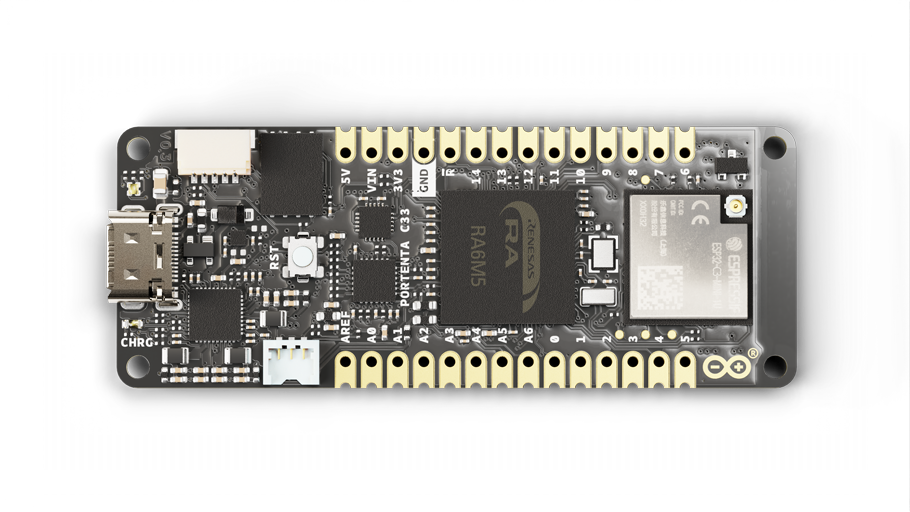

# Description 

The Portenta C33 is a powerful System-on-Module designed for low-cost Internet of Things (IoT) applications. Based on the R7FA6M5BH2CBG microcontroller from Renesas®, this board shares the same form factor as the Portenta H7 and its backward compatible with it, making it fully compatible with all Portenta family shields and carriers through its high-density connectors. As a low-cost device, the Portenta C33 is an excellent choice for developers looking to create IoT devices and applications on a budget. Whether you're building a smart home device or a connected industrial sensor, the Portenta C33 provides the processing power and connectivity options you need to get the job done.

# Target Areas

IoT, building automation, smart cities, and agriculture.

# CONTENTS

## Board Overview 

The Portenta C33 is a powerful microcontroller board based on the R7FA6M5BH2CBG, a high-performance microcontroller from Renesas with an Arm® Cortex®-M33 core running at 200MHz. It has been designed with the same form factor as the Portenta H7 and is backward compatible, making it fully compatible with all Portenta family shields and carriers through its high-density connectors. The Portenta C33 includes a range of key features and a low-power design that makes it well-suited for various low-cost IoT applications.

The key features of the Portenta C33 are the following:

- 200MHz, Arm Cortex-M33 core microcontroller with 2MB Flash memory and 256kB SRAM (R7FA6M5BH2CBG)
- External 16MB QSPI Flash memory (MX25L12833F)
- On-board 2.4GHz Wi-Fi (802.11 b/g/n) and Bluetooth® 5 small-sized module (ESP32­-C3-­MINI-­1U)
- Ethernet physical layer (PHY) transceiver (LAN8742AI)
- On-board ready-to-use IoT secure element (SE051)
- USB-C port for power and data (accessible also through the board's high-density connectors)
- Highly flexible power supply architecture designed specifically for low-power applications 
- Various options for easily powering the board: USB-C port, external power supplies, and single-cell Lithium Ion/Lithium Polymer batteries
- 12-bit analog-to-digital converter
- 12-bit digital-to-analog coverter
- Various digital peripherals such as GPIO (x7), I2C (x1), UART (x4), SPI (x2), PWM (x10), CAN (x2), I2S (x1), SPDIF (x1), PDM(x1), and SAI (x1)
- JTAG/SWD debug port (accessible through the board's high-density connectors)
- Board dimensions: 66.04mm x 25.40mm

[comment]: <> (Force page break here) 

  
## Specifications

### Recommended Operating Conditions 

The following table provides a comprehensive guideline for the optimal use of the Portenta C33, outlining typical operating conditions as well as design limits. Operating conditions of the Portenta C33 are largely a function of the operating conditions specified by its components.

|         **Parameter**        |    **Symbol**   | **Min** | **Max** | **Unit** |
|:----------------------------:|:---------------:|:-------:|:-------:|:--------:|
|   USB Supply Input Voltage   | VUSB |    -    |    -    |     V    |
| Battery Supply Input Voltage | VBAT |   -0.3  |   4.8   |     V    |
|     Supply Input Voltage     | VMCU |   4.1   |   6.0   |     V    |
|     Operating Temperature    |  TOP |   -40   |    85   |    °C    |

**<caption>Table 1: Recommended Operating Conditions</caption>**

### Current Consumption

## Hardware

### Block Diagram

### Power Supply 

### Mechanical Specification

#### Board Pinout 
#### Board Connectors

## Document Revision History

| Date       | **Revision** | **Changes**                        |
|------------|--------------|------------------------------------|
| 00/00/2023 | 1            | First release                      |

