## Overview

This user manual will provide a comprehensive overview of the Portenta C33 board, covering its major hardware and software elements. With this user manual, you will learn how to set up, configure and use all the main features of the board.

## Hardware and Software Requirements

### Hardware Requirements

- [Portenta C33](https://store.arduino.cc/products/portenta-c33) (x1)
- USB-C® cable (x1)
- Wi-Fi® W.FL antenna (x1)

### Software Requirements

- [Arduino IDE 1.8.10+](https://www.arduino.cc/en/software), [Arduino IDE 2.0+](https://www.arduino.cc/en/software), or [Arduino Web Editor](https://create.arduino.cc/editor)

## Product Overview

The Portenta C33 is a powerful System-on-Module (SOM) designed for cost-effective Internet of Things (IoT) applications and devices. Based on the R7FA6M5BH2CBG microcontroller from Renesas®, it shares the same form factor as the Portenta H7 board. It is backward-compatible with the MKR and Portenta family shields and carriers through its MKR-styled and High-Density connectors. The Portenta C33 is ideal for a wide range of applications, from smart home devices to connected industrial sensors.


### Board Architecture Overview

The Portenta C33 features a robust and efficient architecture that enables it for low-cost, battery-powered, IoT applications and devices.

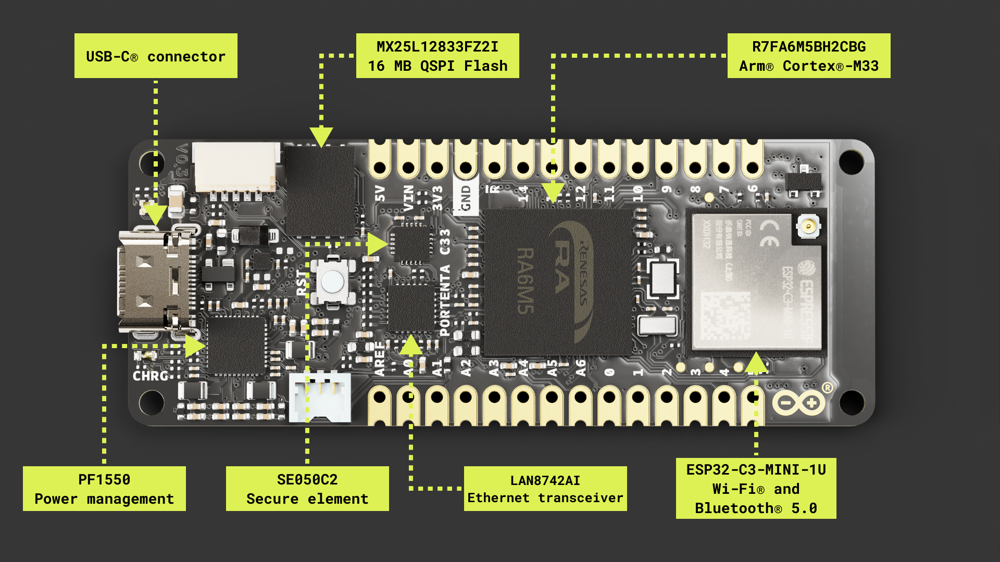


Here is an overview of the board's main components shown in the images above:

- **Microcontroller**: At the heart of the Portenta C33 is the [R7FA6M5BH2CBG](https://www.renesas.com/us/en/document/dst/ra6m5-group-datasheet?r=1493931), a powerful and versatile SOM from Renesas®. The R7FA6M5BH2CBG is built around a 32-bit Arm® Cortex®-M33 processor running at 200 MHz, with 2 MB of Flash memory and 512 kB of SRAM.
- **External memory**: The board features an onboard 16 MB QSPI Flash memory.
- **Wireless connectivity**: The board supports 2.4 GHz Wi-Fi® (802.11 b/g/n) and Bluetooth® 5.0, provided by the ESP32-C3-MINI-1U module developed by Espressif Systems®. This high-performance Wi-Fi® and Bluetooth® module allows the Portenta C33 to communicate wirelessly with other devices and systems. Note: `ArduinoBLE` library support is limited to Bluetooth® 4.0 only actually.
- **Ethernet connectivity**: The board features an onboard, high-performance 10/100 Mbps Ethernet transceiver accessible through its High-Density connectors.
- **Security**: The board features an onboard ready-to-use secure element, the SE050C2 from NXP®, specifically designed for IoT devices and provides advanced security features.
- **USB connectivity**: The board features a USB-C port for power and data, which is also accessible through the board's High-Density connectors.
- **Power management**: The Portenta C33 is designed for low-power operation to meet the demands of always-connected IoT devices. It features a power management integrated circuit (PMIC), the PF1550 from NXP®,  designed specifically for low-power, portable, and battery-powered IoT applications.
- **Analog and digital peripherals**: The board features analog peripherals such as two 8-channel 12-bit analog-to-digital converters (ADC) and two 12-bit digital-to-analog converters (DAC). It also features the following digital peripherals: GPIO (x7), I2C (x1), UART (x4), SPI (x2), PWM (x10), CAN (x2), I2S (x1), SPDIF (x1), PDM (x1), and SAI (x1).
- **Debugging**: The board features a JTAG/SWD debug port accessible through its High-Density connectors.
- **Surface mount**: The castellated pins of the board allows it to be positioned as a surface-mountable module.
- **MKR-styled connectors**: The MKR-styled connectors of the board makes it compatible with all the MKR family boards. 2.54 mm pitch headers can be easily soldered to the board.

### Board Core and Libraries

The **Arduino Renesas Boards** core contains the libraries and examples to work with the Portenta C33's peripherals and onboard components, such as its external QSPI Flash memory and Wi-Fi® and Bluetooth® module. To install the core for the Portenta C33 board, navigate to **Tools > Board > Boards Manager** or click the Boards Manager icon in the left tab of the IDE. In the Boards Manager tab, search for `renesas` and install the latest Arduino Renesas Boards version.

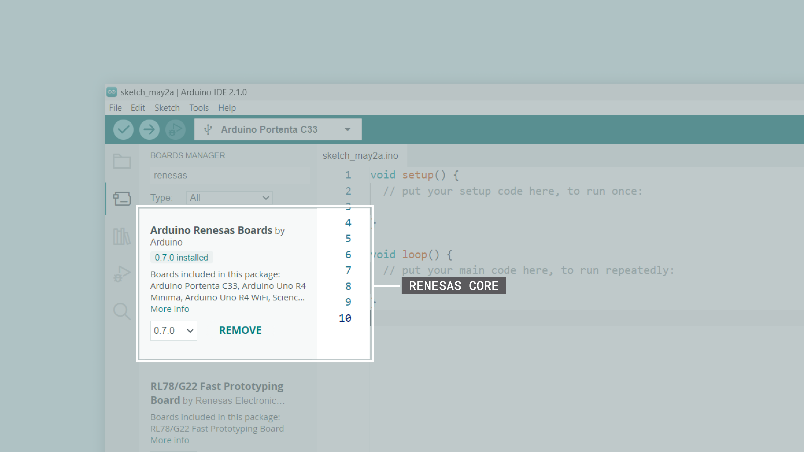

### Pinout


The complete pinout is available and downloadable as PDF from the link below:

- [Portenta C33 pinout](https://docs.arduino.cc/static/903c16295f3bf076c2ed23eb1b38791c/ABX00074-full-pinout.pdf)

### Datasheet

The complete datasheet is available and downloadable as PDF from the link below:

- [Portenta C33 datasheet](https://docs.arduino.cc/resources/datasheets/ABX00074-datasheet.pdf)

### Schematics

The complete schematics are available and downloadable as PDF from the link below:

- [Portenta C33 schematics](https://docs.arduino.cc/static/d7e16a6657c086a034a14a6619cffe7b/ABX00074-schematics.pdf)

### STEP Files

The complete STEP files are available and downloadable from the link below:

- [Portenta C33 STEP files](https://docs.arduino.cc/static/0d1ade945a6d5105667ee3a0e50b96c7/ABX00074-step.zip)

## First Use

### Powering the Board

The Portenta C33 can be powered by the following:

- Using a USB-C® cable (not included).
- Using an external **4.1 to 6 V power supply** connected to the `VIN` pin located in the MKR-styled connectors pins of the board (please, refer to the [board pinout section](#pinout) of the user manual).
- Using an external **5 V power supply** connected to the `5V` pin located in the MKR-styled connectors of the board (please, refer to the [board pinout section](#pinout) of the user manual).
- Using a **3.7 V Lithium Polymer (Li-Po) battery** connected to the board through the onboard battery connector; the manufacturer part number of the battery connector is BM03B-ACHSS-GAN-TF(LF)(SN), and its matching receptacle manufacturer part number is ACHR-03V-S. The **recommended minimum battery capacity for the Portenta C33 is 800 mAh**. A Li-Po battery with an integrated NTC thermistor is also recommended for thermal protection. 
- Using an Arduino Pro carrier board, such as the [Portenta Max Carrier](https://store.arduino.cc/collections/pro-family/products/portenta-max-carrier) and the [Portenta Breakout](https://store.arduino.cc/collections/pro-family/products/arduino-portenta-breakout). 
- Using your custom boards to power the board through the board's castellated pins, MKR-styled or High-Density connectors. Check out the [board pinout](#pinout) and its schematic to know more about it.

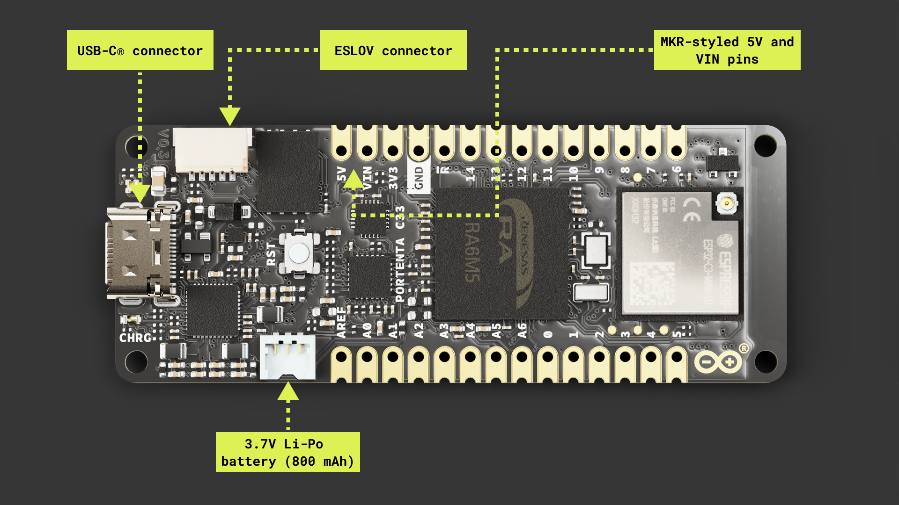

### Hello World Example

Let's program the Portenta C33 with the classic `hello world` example used in the Arduino ecosystem: the `Blink` sketch. We will use this example to verify the board's connection to the Arduino IDE and that the Portenta C33 core and the board itself are working as expected. 

There are two ways to program this example in the board:

- Navigate to **File > Examples > 01.Basics > Blink**.
- Copy and paste the code below into a new sketch in the Arduino IDE.

```arduino
void setup() {
  // Initialize LED_BUILTIN as an output (this will turn on the LED)
  pinMode(LED_BUILTIN, OUTPUT);
}

void loop() {
  // Turn the built-in LED off
  digitalWrite(LED_BUILTIN, HIGH);
  delay(1000);
  // Turn the built-in LED on
  digitalWrite(LED_BUILTIN, LOW);
  delay(1000);
}
```

For the Portenta C33, the `LED_BUILTIN` macro represents the **green LED** of the built-in RGB LED of the board.


***The built-in RGB LED on the Portenta C33 needs to be pulled to ground to make them light up. This means that a voltage level of `LOW` on each of their pins will turn the specific color of the LED on, and a voltage level of `HIGH` will turn them off. Furthermore, invoking the `pinMode(LED_BUILTIN, OUTPUT)` instruction pulls the built-in LED LOW, which means it turns it on.***

To upload the code to the Portenta C33, click the **Verify** button to compile the sketch and check for errors; then click the **Upload** button to program the board with the sketch.


You should see now the green LED of the built-in RGB LED turn on for one second, then off for one second, repeatedly.


## Pins

The Portenta C33 has been designed with two types of connectors, the MKR-styled connectors, intended for prototyping and debugging, and the High-Density connectors, intended to be used across Arduino Pro boards or custom boards. The Portenta C33 MKR-styled connectors pinout is shown in the image below:


The Portenta C33 High-Density connectors pinout is shown in the image below:


### Analog Pins

The Portenta C33 has eight analog input pins mapped as follows:

| **Arduino Pin Mapping** | **Microcontroller Pin** |
|:-----------------------:|:-----------------------:|
|           `A0`          |          `P006`         |
|           `A1`          |          `P005`         |
|           `A2`          |          `P004`         |
|           `A3`          |          `P002`         |
|           `A4`          |          `P001`         |
|       `A5`/`DAC1`       |          `P015`         |
|       `A6`/`DAC0`       |          `P014`         |
|           `A7`          |          `P000`         |

The eight analog input pins can be used through the built-in functions of the Arduino programming language ([`analogRead()` function](https://reference.arduino.cc/reference/en/language/functions/analog-io/analogread/)).

Please, refer to the [board pinout section](#pinout) of the user manual to find the analog pins on the board:

- MKR-style connectors: pins `A0`, `A1`, `A2`, `A3`, `A4`, `A5`, and `A6` are accessible thought these connectors. 
- High-Density connectors: pins `A0`, `A1`, `A2`, `A3`, `A4`, `A5`, `A6`, and `A7` are accessible thought these connectors.

The example code shown below reads the voltage value from a potentiometer connected to `A0` and displays it on the Arduino IDE Serial Monitor:

```arduino
// Define the potentiometer pin and variable to store its value
int potentiometerPin = A0;
int potentiometerValue = 0;

void setup() {
  // Initialize Serial communication
  Serial.begin(9600);
}

void loop() {
  // Read the voltage value from the potentiometer
  potentiometerValue = analogRead(potentiometerPin);

  // Print the potentiometer voltage value to the Serial Monitor
  Serial.print("- Potentiometer voltage value: ");
  Serial.println(potentiometerValue);

  // Wait for 1000 milliseconds
  delay(1000);
}
```

### Digital Pins

The Portenta C33 has 91 digital input/output pins, mapped as described in the following tables. **The first 14 digital pins are available through the MKR-styled connectors of the board**:

| **Arduino Pin Mapping** | **Pin Functionality** | **Microcontroller Pin** |
|:-----------------------:|:---------------------:|:-----------------------:|
|           `0`           |          GPIO         |          `P105`         |
|           `1`           |          GPIO         |          `P106`         |
|           `2`           |          GPIO         |          `P11`          |
|           `3`           |          GPIO         |          `P303`         |
|           `4`           |          GPIO         |          `P401`         |
|           `5`           |          GPIO         |          `P210`         |
|           `6`           |          GPIO         |          `P601`         |
|        `7`/`CS0`        |        GPIO/SPI       |          `P402`         |
|       `8`/`MOSI0`       |        GPIO/SPI       |          `P900`         |
|        `9`/`SCK0`       |        GPIO/SPI       |          `P204`         |
|       `10`/`MISO0`      |        GPIO/SPI       |          `P315`         |
|       `11`/`SDA0`       |        GPIO/I2C       |          `P407`         |
|       `12`/`SCL0`       |        GPIO/I2C       |          `P408`         |
|        `13`/`RX0`       |       GPIO/UART       |          `P110`         |
|        `14`/`TX0`       |       GPIO/UART       |          `P602`         |

The following eight digital pins also have **analog functionalities**; they are available through the MKR-styled and High-Density connectors of the board:

| **Arduino Pin Mapping** | **Pin Functionality** | **Microcontroller Pin** |
|:-----------------------:|:---------------------:|:-----------------------:|
|        `15`/`A0`        |      GPIO/Analog      |          `P006`         |
|        `16`/`A1`        |      GPIO/Analog      |          `P005`         |
|        `17`/`A2`        |      GPIO/Analog      |          `P004`         |
|        `18`/`A3`        |      GPIO/Analog      |          `P002`         |
|        `19`/`A4`        |      GPIO/Analog      |          `P001`         |
|     `20`/`A5`/`DAC1`    |      GPIO/Analog      |          `P015`         |
|     `21`/`A6`/`DAC0`    |      GPIO/Analog      |          `P014`         |
|        `22`/`A7`        |      GPIO/Analog      |          `P000`         |

The following four digital pins are **PWM-capable**; they are available through the High-Density connectors of the board:

| **Arduino Pin Mapping** | **Pin Functionality** | **Microcontroller Pin** |
|:-----------------------:|:---------------------:|:-----------------------:|
|           `23`          |          GPIO         |          `P605`         |
|           `24`          |          GPIO         |          `P608`         |
|           `25`          |          GPIO         |          `P311`         |
|           `26`          |          GPIO         |          `P600`         |

The following seven pins are **Interrupt Request (IRQ) capable**; they are available through the High-Density connectors of the board:

| **Arduino Pin Mapping** | **Pin Functionality** | **Microcontroller Pin** |
|:-----------------------:|:---------------------:|:-----------------------:|
|           `27`          |        GPIO/IRQ       |          `P009`         |
|           `28`          |        GPIO/IRQ       |          `P409`         |
|           `29`          |        GPIO/IRQ       |          `P505`         |
|           `30`          |        GPIO/IRQ       |          `P706`         |
|           `31`          |        GPIO/IRQ       |          `P707`         |
|           `32`          |        GPIO/IRQ       |          `P708`         |
|           `33`          |        GPIO/IRQ       |          `P802`         |

The following three pins are the digital pins used to control the **built-in RGB LED** of the board:

| **Arduino Pin Mapping** | **Pin Functionality** | **Microcontroller Pin** |
|:-----------------------:|:---------------------:|:-----------------------:|
|       `34`/`LEDR`       |          GPIO         |          `P107`         |
|       `35`/`LEDG`       |          GPIO         |          `P400`         |
|       `36`/`LEDB`       |          GPIO         |          `P800`         |

The following four digital pins are **I2C-capable**; they are available through the High-Density connectors of the board:

| **Arduino Pin Mapping** | **Pin Functionality** | **Microcontroller Pin** |
|:-----------------------:|:---------------------:|:-----------------------:|
|       `37`/`SDA1`       |        GPIO/I2C       |          `P511`         |
|       `38`/`SCL1`       |        GPIO/I2C       |          `P512`         |
|       `39`/`SDA2`       |        GPIO/I2C       |          `P302`         |
|       `40`/`SCL2`       |        GPIO/I2C       |          `P301`         |

The following four digital pins are **CAN-capable**; they are available through the High-Density connectors of the board:

| **Arduino Pin Mapping** | **Pin Functionality** | **Microcontroller Pin** |
|:-----------------------:|:---------------------:|:-----------------------:|
|           `41`          |      GPIO/CAN RX      |          `P202`         |
|           `42`          |      GPIO/CAN TX      |          `P203`         |
|           `43`          |      GPIO/CAN1 RX     |          `P610`         |
|           `44`          |      GPIO/CAN1 TX     |          `P609`         |

The following four digital pins are **SPI-capable**; they are available through the High-Density connectors of the board:

| **Arduino Pin Mapping** | **Pin Functionality** | **Microcontroller Pin** |
|:-----------------------:|:---------------------:|:-----------------------:|
|           `45`          |       GPIO/MISO1      |          `P100`         |
|           `46`          |       GPIO/MOSI1      |          `P101`         |
|           `47`          |       GPIO/SCLK1      |          `P102`         |
|           `48`          |        GPIO/CS1       |          `P103`         |

The following 14 digital pins are **UART-capable**; they are available through the High-Density connectors of the board:

| **Arduino Pin Mapping** | **Pin Functionality** | **Microcontroller Pin** |
|:-----------------------:|:---------------------:|:-----------------------:|
|           `49`          |        GPIO/TX2       |          `P613`         |
|           `50`          |        GPIO/RX2       |          `P614`         |
|           `51`          |       GPIO/RTS2       |          `P611`         |
|           `52`          |       GPIO/CTS2       |          `P404`         |
|           `53`          |        GPIO/TX3       |          `P506`         |
|           `54`          |        GPIO/RX3       |          `P304`         |
|           `55`          |       GPIO/RTS3       |          `P503`         |
|           `56`          |       GPIO/CTS3       |          `P502`         |
|           `57`          |        GPIO/TX4       |          `P805`         |
|           `58`          |        GPIO/RX4       |          `P513`         |
|           `59`          |       GPIO/RTS4       |          `P508`         |
|           `60`          |       GPIO/CTS4       |          `P500`         |
|           `61`          |       GPIO/RTS0       |          `P603`         |
|           `62`          |       GPIO/CTS0       |          `P604`         |

The following four digital pins are **SSI-capable**; they are available through the High-Density connectors of the board:

| **Arduino Pin Mapping** | **Pin Functionality** | **Microcontroller Pin** |
|:-----------------------:|:---------------------:|:-----------------------:|
|           `63`          |      GPIO/SSI CK      |          `P112`         |
|           `64`          |      GPIO/SSI WS      |          `P113`         |
|           `65`          |      GPIO/SSI SDI     |          `P114`         |
|           `66`          |      GPIO/SSI SDO     |          `P115`         |

The following 17 digital pins are **generic GPIO pins**; they are available through the High-Density connectors of the board:

| **Arduino Pin Mapping** | **Pin Functionality** | **Microcontroller Pin** |
|:-----------------------:|:---------------------:|:-----------------------:|
|           `67`          |          GPIO         |          `P908`         |
|           `68`          |          GPIO         |          `P403`         |
|           `69`          |          GPIO         |          `P901`         |
|           `70`          |          GPIO         |          `P612`         |
|           `71`          |          GPIO         |          `P312`         |
|           `72`          |          GPIO         |          `P313`         |
|           `73`          |          GPIO         |          `P314`         |
|           `74`          |          GPIO         |          `PA01`         |
|           `75`          |          GPIO         |          `PA08`         |
|           `76`          |          GPIO         |          `PA09`         |
|           `77`          |          GPIO         |          `PA10`         |
|           `78`          |          GPIO         |          `P507`         |
|           `79`          |          GPIO         |          `PB00`         |
|           `80`          |          GPIO         |          `P615`         |
|           `81`          |          GPIO         |          `P003`         |
|           `82`          |          GPIO         |          `P007`         |
|           `83`          |          GPIO         |          `P008`         |

And the last eight digital pins are **SD-card-capable**; they are available through the High-Density connectors of the board:

| **Arduino Pin Mapping** | **Pin Functionality** | **Microcontroller Pin** |
|:-----------------------:|:---------------------:|:-----------------------:|
|           `84`          |     GPIO/SDHI CLK     |          `P413`         |
|           `85`          |     GPIO/SDHI CMD     |          `P412`         |
|           `86`          |      GPIO/SDHI D0     |          `P411`         |
|           `87`          |      GPIO/SDHI D1     |          `P410`         |
|           `88`          |      GPIO/SDHI D2     |          `P206`         |
|           `89`          |      GPIO/SDHI D3     |          `P205`         |
|           `90`          |      GPIO/SDHI CD     |          `P415`         |
|           `91`          |      GPIO/SDHI WP     |          `P414`         |

The basic functionality of the Portenta C33's digital pins can be implemented through the built-in functions of the Arduino programming language. The configuration of a digital pin is done in the `setup()` function with the [built-in function `pinMode()`](https://www.arduino.cc/reference/en/language/functions/digital-io/pinmode/), as shown below:

```arduino
// Pin configured as an input
pinMode(pin, INPUT);

// Pin configured as an output
pinMode(pin, OUTPUT);

// Pin configured as an input, internal pull-up resistor enabled
pinMode(pin, INPUT_PULLUP);
```

The state of a digital pin, configured as an input, can be read using the [built-in function `digitalRead()`](https://www.arduino.cc/reference/en/language/functions/digital-io/digitalread/) as shown below:

```arduino
// Reads pin state, stores value in state variable
state = digitalRead(pin);
```

The state of a digital pin, configured as an output, can be changed using the [built-in function `digitalWrite()`](https://www.arduino.cc/reference/en/language/functions/digital-io/digitalwrite/) as shown below:

```arduino
// Set pin on
digitalWrite(pin, HIGH);

// Set pin off
digitalWrite(pin, LOW);
```

The example code shown below uses digital pin `3` to control an LED depending on the state of a button connected to digital pin `2`:

```arduino
// Define button and LED pin
int buttonPin = 2;
int ledPin = 3;

// Variable to store the button state
int buttonState = 0;

void setup() {
  // Configure button and LED pins
  pinMode(buttonPin, INPUT_PULLUP);
  pinMode(ledPin, OUTPUT);

  // Initialize Serial communication
  Serial.begin(9600);
}

void loop() {
  // Read the state of the button
  buttonState = digitalRead(buttonPin);

  // If the button is pressed, turn on the LED and print its state to the Serial Monitor
  if (buttonState == LOW) {
    digitalWrite(ledPin, HIGH);
    Serial.println("- Button is pressed. LED is on.");
  } else {
    // If the button is not pressed, turn off the LED and print to the Serial Monitor
    digitalWrite(ledPin, LOW);
    Serials.println("- Button is not pressed. LED is off.");
  }

  // Wait for 1000 milliseconds
  delay(1000);
}
```

### PWM Pins

The Portenta C33 has 10 digital pins with PWM functionality, mapped as follows:

| **Arduino Pin Mapping** | **Microcontroller Pin** |
|:-----------------------:|:-----------------------:|
|       `0` or `D0`       |          `P105`         |
|       `1` or `D1`       |          `P106`         |
|       `2` or `D2`       |          `P111`         |
|       `3` or `D3`       |          `P303`         |
|       `4` or `D4`       |          `P401`         |
|       `5` or `D5`       |          `P210`         |
|       `6` or `D6`       |          `P601`         |
|       `7` or `D7`       |          `P402`         |
|           `8`           |          `P900`         |
|           `9`           |          `P204`         |
|           `23`          |          `P605`         |
|           `24`          |          `P608`         |
|           `25`          |          `P311`         |
|           `26`          |          `P600`         |

The 10 PWM pins can be used through the built-in ([`analogWrite()` function](https://www.arduino.cc/reference/en/language/functions/analog-io/analogwrite)) of the Arduino programming language. 

Please, refer to the [board pinout section](#pinout) of the user manual to find them on the board.

- MKR-styled connectors: pins `0`, `1`, `2`, `3`, `4`, `5`, and `6` are accessible through these connectors.
- High-Density connectors: pins `0`, `1`, `2`, `3`, `4`, `5`, `7`, `8`, `9`, `23`, `24`, `25`, and `26` are accessible through these connectors.

The example code shown below uses digital pin `9` PWM functionality to control the brightness of the board's built-in RGB LED (green LED) connected to it:

```arduino
// Define the LED pin, brightness, and fade amount variables
int brightness = 0;
int fadeAmount = 5;

void setup() {
  // Configure the LED pin as an output
  pinMode(LEDG, OUTPUT);
}

void loop() {
  // Set the brightness of the LED
  analogWrite(LEDG, brightness);

  // Update the brightness value
  brightness += fadeAmount;

  // Reverse the fade direction when reaching the limits
  if (brightness <= 0 || brightness >= 255) {
    fadeAmount = -fadeAmount;
  }

  // Wait for 30 milliseconds
  delay(30);
}
```
You should now see the built-in RGB LED's green LED fade in, then fade out repeatedly.

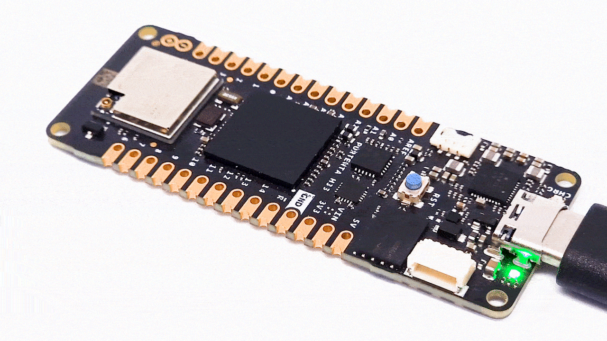

## Actuators 

This user manual section covers the Portenta C33 built-in actuators, showing their main hardware and software characteristics.

### RGB LED

The Portenta C33 features a built-in RGB LED that can be used as a visual feedback indicator for the user.


The built-in RGB LED can be accessed through the following macro definitions:

| **Built-in LED** |   **Macro Definition**  |
|:----------------:|:-----------------------:|
|      Red LED     |          `LEDR`         |
|     Blue LED     |          `LEDB`         |
|     Green LED    | `LEDG` or `LED_BUILTIN` |

***The built-in RGB LED on the Portenta C33 needs to be pulled to ground to make them light up. This means that a voltage level of `LOW` on each of their pins will turn the specific color of the LED on, and a voltage level of `HIGH` will turn them off. Furthermore, invoking the `pinMode(LED_BUILTIN, OUTPUT)` instruction pulls the built-in LED LOW, which means it turns it on.***

The following example code blinks each of the LEDs at an interval of 500 ms:

```arduino
void setup() {
  // Initialize LEDR, LEDG and LEDB as outputs
  pinMode(LEDR, OUTPUT);
  pinMode(LEDG, OUTPUT);
  pinMode(LEDB, OUTPUT);
}

void loop() {
  // Turn on the built-in red LED and turn off the rest
  digitalWrite(LEDR, LOW);
  digitalWrite(LEDG, HIGH);
  digitalWrite(LEDB, HIGH);
  delay(500);
  // Turn on the built-in green LED and turn off the rest
  digitalWrite(LEDR, HIGH);
  digitalWrite(LEDG, LOW);
  digitalWrite(LEDB, HIGH);
  delay(500);
  // Turn on the built-in blue LED and turn off the rest
  digitalWrite(LEDR, HIGH);
  digitalWrite(LEDG, HIGH);
  digitalWrite(LEDB, LOW);
  delay(500);
}
```

You should now see the built-in RGB LED blinking each of its LEDs repeatedly.

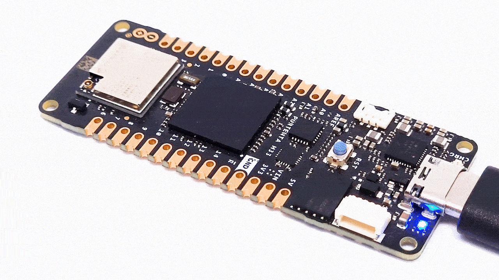

## Communication

This section of the user manual covers the different communication protocols that are supported by the Portenta C33 board, including the Serial Peripheral Interface (SPI), Inter-Integrated Circuit (I2C), Universal Asynchronous Receiver-Transmitter (UART), and Wi-Fi®; JTAG interface and communication via the onboard ESLOV connector is also explained in this section. 

The Portenta C33 features dedicated pins for each communication protocol, accessible through the MKR-styled connectors and the High-Density connectors, making connecting and communicating with different components, peripherals, and sensors easy.

### SPI

The Portenta C33 supports SPI communication via two dedicated ports named `SPI0` and `SPI1`, which allows data transmission between the board and other SPI-compatible devices. The pins used in the Portenta C33 for the SPI communication protocol are the following:

| **Arduino Pin Mapping** | **Microcontroller Pin** |
|:-----------------------:|:-----------------------:|
|      `8` or `MOSI`      |          `P900`         |
|      `10` or `MISO`     |          `P315`         |
|       `9` or `SCK`      |          `P204`         |
|     `7` or `CS`/`SS`    |          `P402`         |
| `46` or `PIN_SPI1_MOSI` |          `P101`         |
| `45` or `PIN_SPI1_MISO` |          `P100`         |
|  `47` or `PIN_SPI1_SCK` |          `P102`         |
|  `48` or `PIN_SPI1_CS`  |          `P103`         |

Please, refer to the [board pinout section](#pinout) of the user manual to find them on the board. Include the [`SPI` library](https://reference.arduino.cc/reference/en/language/functions/communication/spi/) at the top of your sketch to use the SPI communication protocol. The SPI library provides functions for SPI communication:

```arduino
#include <SPI.h>
```

In the `setup()` function, initialize the SPI library, define and configure the chip select (`CS`) pin:

```arduino
void setup() {
  // Set the chip select pin as output
  pinMode(SS, OUTPUT);

  // Pull the CS pin HIGH to unselect the device
  digitalWrite(SS, HIGH);

  // Initialize the SPI communication
  SPI.begin();
}
```

To transmit data to an SPI-compatible device, you can use the following commands:

```arduino
// Replace with the target device's address
byte address = 0x00;

// Replace with the value to send
byte value = 0xFF;

// Pull the CS pin LOW to select the device
digitalWrite(SS, LOW);

// Send the address
SPI.transfer(address);

// Send the value
SPI.transfer(value);

// Pull the CS pin HIGH to unselect the device
digitalWrite(SS, HIGH);
```

### I2C

The Portenta C33 supports I2C communication, which allows data transmission between the board and other I2C-compatible devices. The pins used in the Portenta C33 for the I2C communication protocol are the following:

| **Arduino Pin Mapping** | **Microcontroller Pin** |
|:-----------------------:|:-----------------------:|
|       `11`/`SDA0`       |          `P407`         |
|       `12`/`SCL0`       |          `P408`         |
|       `37`/`SDA1`       |          `P511`         |
|       `38`/`SCL1`       |          `P512`         |
|       `39`/`SDA2`       |          `P302`         |
|       `40`/`SCL2`       |          `P301`         |

To locate these pins on the board, please refer to the [board pinout section](#pinout) of the user manual. The `SDA0` and `SCL0` pins are also available through the onboard ESLOV connector of the Portenta C33.

**Important note for system integrators**: Use the Portenta C33's High-Density connectors to expand its signals to a custom-designed daughter board or carrier. Below is the I2C pins mapping on the board's High-Density connectors and shared resources:

| High-Density Connector | Interface Name | Pins on the High-Density Connector | Status* | Shared Peripherals (Address) |
|:----------------------:|:--------------:|:----------------------------------:|:------:|:----------------------------:|
|           J1           |     `I2C1`     |                43-45               |  Free  |               -              |
|           J2           |     `I2C0`     |                44-46               |  Free  |               -              |
|           J2           |     `I2C2`     |                45-47               |  Free  |               -              |

**Status***: This column indicates the current status of the pins. "Free" means the pins are not in use by another resource or peripheral of the board and are available for usage, while "Shared" means the pins are used by one or several resources or peripherals of the board. 

***All I2C ports of the Portenta C33 can be used without restrictions as they are not shared with any other board peripheral.***

To use I2C communication, include the [`Wire` library](https://reference.arduino.cc/reference/en/language/functions/communication/wire/) at the top of your sketch. The `Wire` library provides functions for I2C communication:

```arduino
#include <Wire.h>
```

In the `setup()` function, initialize the I2C library:

```arduino
// Initialize the I2C communication
Wire.begin();
```

To transmit data to an I2C-compatible device, you can use the following commands:


```arduino
// Replace with the target device's I2C address
byte deviceAddress = 0x1;

// Replace with the appropriate instruction byte
byte instruction = 0x00;

// Replace with the value to send
byte value = 0xFF;

// Begin transmission to the target device
Wire.beginTransmission(deviceAddress);

// Send the instruction byte
Wire.write(instruction);

// Send the value
Wire.write(value);

// End transmission
Wire.endTransmission();
```

To read data from an I2C-compatible device, you can use the `requestFrom()` function to request data from the device and the `read()` function to read the received bytes:

```arduino
// The target device's I2C address
byte deviceAddress = 0x1;

// The number of bytes to read
int numBytes = 2;

// Request data from the target device
Wire.requestFrom(deviceAddress, numBytes);

// Read while there is data available
while (Wire.available()) {
  byte data = Wire.read();
}
```

### UART 

The Portenta C33 supports UART communication. The pins used in the Portenta C33 for the UART communication protocol are the following:

| **Arduino Pin Mapping** | **Microcontroller Pin** |
|:-----------------------:|:-----------------------:|
|        `13`/`RX0`       |          `P110`         |
|        `14`/`TX0`       |          `P602`         |
|           `49`          |          `P613`         |
|           `50`          |          `P614`         |
|           `53`          |          `P506`         |
|           `54`          |          `P304`         |
|           `57`          |          `P805`         |
|           `58`          |          `P513`         |
|           `92`          |          `P603`         |
|           `93`          |          `P604`         |

Please, refer to the board pinout section of the user manual to find them on the board. The built-in ([Serial](https://www.arduino.cc/reference/en/language/functions/communication/serial/)) library functions can use the UART pins.


To begin with UART communication, you'll need to configure it first. In the `setup()` function, set the baud rate (bits per second) for UART communication:

```arduino
// Start UART communication at 9600 baud
Serial.begin(9600);
```

To read incoming data, you can use a `while()` loop to continuously check for available data with the `Serial.available()` function and read individual characters with the `Serial.read()` function. The code shown above stores the incoming characters in a String variable and process the data when a line-ending character is received:

```arduino
// Variable for storing incoming data
String incoming = "";

void loop() {
  // Check for available data and read individual characters
  while (Serial.available()) {
    // Allow data buffering and read a single character
    delay(2);
    char c = Serial.read();

    // Check if the character is a newline (line-ending)
    if (c == '\n') {
      // Process the received data
      processData(incoming);

      // Clear the incoming data string for the next message
      incoming = "";
    } else {
      // Add the character to the incoming data string
      incoming += c;
    }
  }
}
```

To transmit data to another device via UART, you can use the `Serial.write()` function:

```arduino
// Transmit the string "Hello world!
Serial.write("Hello world!");
```

You can also use the `Serial.print()` and `Serial.println()` functions to send a String without a newline character or followed by a newline character:

```arduino
// Transmit the string "Hello world!"
Serial.print("Hello world!");

// Transmit the string "Hello world!" followed by a newline character
Serial.println("Hello world!");
```

### Wi-Fi®

The Portenta C33 board features an onboard Wi-Fi® module, the ESP32-C3-MINI-1U module from Espressif Systems®. The ESP32-C3-MINI-1U is a low-power, highly integrated Wi-Fi® and Bluetooth® System-on-Chip (SoC) solution designed for many IoT applications.

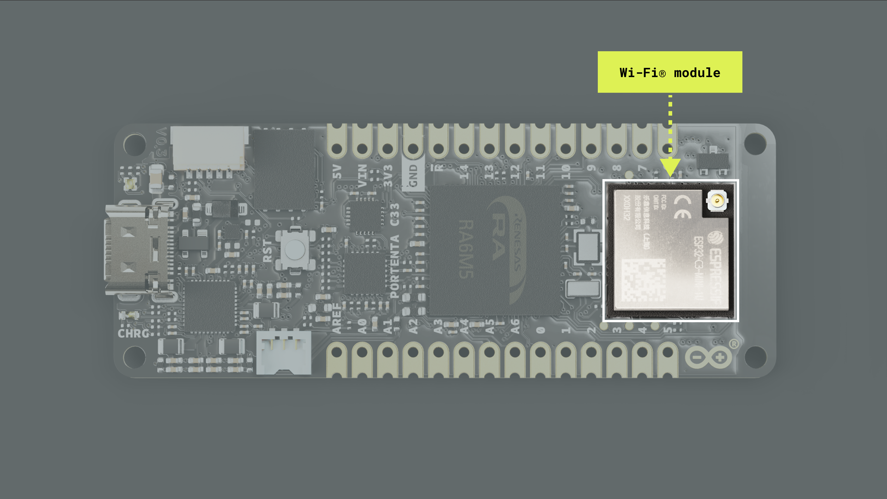

Some of the key capabilities of the ESP32-C3-MINI-1U module are the following:

- **Wi-Fi® and Bluetooth® connectivity**: The module supports 2.4 GHz Wi-Fi® (802.11 b/g/n) and Bluetooth® 5.0 connectivity. `ArduinoBLE` library support is limited to Bluetooth® 4.0 at this time.
- **CPU and memory**: It contains a 32-bit RISC-V single-core processor with a clock speed of up to 160 MHz. The chip also has 400 KB of SRAM and 384 KB of ROM.
- **Security features**: It supports various security features, including secure boot, flash encryption, and cryptographic hardware acceleration.
- **Low-power operation**: It supports multiple power modes for different low-power applications, making it suitable for battery-powered devices.

The Arduino Renesas Core has a built-in library that lets you use the onboard Wi-Fi® module, the `WiFiC3` library, right out of the box. Let's walk through an example code demonstrating some of the module's capabilities. 

***Always connect your board's Wi-Fi® module with its W.FL antenna (included with your board) to avoid damaging it.***

The code below showcases how to connect to a Wi-Fi® network, check Wi-Fi® status, connect to a server, send HTTP requests, and receive and print HTTP responses, which are common tasks for an IoT device. 

```arduino
/**
  Web Client (Wi-Fi version)
  Name: WiFiWebClient.ino
  Purpose: This sketch connects to a website via Wi-Fi

  @author Arduino Team
  @version 2.0 31/05/12
*/

// Include the necessary libraries for Wi-Fi management and HTTP communication
#include "WiFiC3.h"
#include "WiFiClient.h"
#include "IPAddress.h"
#include "arduino_secrets.h"

// Define the credentials of the Wi-Fi network to connect to
char ssid[] = SECRET_SSID;  // Network SSID
char pass[] = SECRET_PASS;  // Network password

// Define a variable for storing the status of the Wi-Fi connection
int status = WL_IDLE_STATUS;

// Define the server to which we'll connect
// This can be an IP address or a URL
char server[] = "www.google.com";

// Initialize the Wi-Fi client object
// This will be used to interact with the server
WiFiClient client;

void setup() {
  // Begin serial communication at a baud rate of 115200
  Serial.begin(115200);

  // Wait for the serial port to connect
  // This is necessary for boards that have native USB
  while (!Serial) {}

  // Check for the onboard Wi-Fi module
  // If the module isn't found, halt the program
  if (WiFi.status() == WL_NO_MODULE) {
    Serial.println("- Communication with Wi- Fi module failed!");
    while (true);
  }

  // Check if the Wi-Fi module's firmware is up to date
  String fv = WiFi.firmwareVersion();
  if (fv < WIFI_FIRMWARE_LATEST_VERSION) {
    Serial.println("- Please upgrade the firmware!");
  }

  // Attempt to connect to the defined Wi-Fi network
  // Wait for the connection to be established
  while (status != WL_CONNECTED) {
    Serial.print("- Attempting to connect to SSID: ");
    Serial.println(ssid);
    status = WiFi.begin(ssid, pass);
    delay(10000); 
  }

  // Print the Wi-Fi connection status
  printWifiStatus(); 

  // Attempt to connect to the server at port 80 (the standard port for HTTP).
  // If the connection is successful, print a message and send a HTTP GET request.
  // If the connection failed, print a diagnostic message.
  Serial.println("\n- Starting connection to server...");
  if (client.connect(server, 80)) {
    Serial.println("- Connected to server!");
    client.println("GET /search?q=arduino HTTP/1.1");
    client.println("Host: www.google.com");
    client.println("Connection: close");
    client.println();
  } else {
    Serial.println("- Connection failed!");
  }
}

/**
  Reads data from the client while there's data available

  @param none
  @return none
*/
void read_response() {
  uint32_t received_data_num = 0;
  while (client.available()) {

    // Actual data reception
    char c = client.read();

    // Print data to serial port
    Serial.print(c);

    // Wrap data to 80 columns
    received_data_num++;
    if (received_data_num % 80 == 0) {
      Serial.println();
    }
  }
}

void loop() {
  // Read and print the server's response
  read_response();

  // If the server has disconnected, disconnect the client and halt the program
  if (!client.connected()) {
    Serial.println();
    Serial.println("- Disconnecting from server...");
    client.stop();
    while (true);
  }
}

/**
  Prints data from the Wi-Fi connection status

  @param none
  @return none
*/
void printWifiStatus() {
  // Print network SSID
  Serial.print("- SSID: ");
  Serial.println(WiFi.SSID());

  // Print board's IP address
  IPAddress ip = WiFi.localIP();
  Serial.print("- IP Address: ");
  Serial.println(ip);

  // Print signal strength
  long rssi = WiFi.RSSI();
  Serial.print("- Signal strength (RSSI):");
  Serial.print(rssi);
  Serial.println(" dBm");
}
```

First, the necessary libraries are included:

 - The `WiFiC3.h` and `WiFiClient.h` are included at the start, those libraries contains the functionalities required to communicate via Wi-Fi®. 
 - The SSID and password for the Wi-Fi® network are defined.

Then, the server is defined ( "www.google.com" in this case) and the Wi-Fi® client object is created to manage the connection to the server.

Next, in the `setup()` function:

- The serial port is initialized at a baud rate of 115200.
- The sketch checks for Wi-Fi® module availability and its firmware version, then attempts to connect to the Wi-Fi® network with the defined SSID and password. If the connection is successful, it prints the Wi-Fi® status and attempts to connect to the defined server. If the server connection is successful, it sends a GET request.
- The `read_reponse()` function reads data from the client while there's data available. It wraps the data to 80 columns and prints it to the IDE's Serial Monitor.

Finally, in the loop() function:

- The `read_response()` function is called to read any available data. If the server is disconnected, it disconnects the client and enters an infinite loop, halting the sketch.
- The `printWifiStatus()` function prints the connected network SSID, the IP address of the board, and the signal strength (RSSI) to the IDE's Serial Monitor.

### Ethernet

The Portenta C33 board features an Ethernet physical layer (PHY) transceiver, the LAN8742AI from Microchip®. The LAN8742AI is a low-power 10BASE-T/100BASE-TX physical layer (PHY) transceiver. This device is responsible for transmitting and receiving data over an Ethernet connection. The transceiver complies with the IEEE 802.3 and 802.3u standards  and supports communication with an Ethernet MAC through a standard RMII interface.

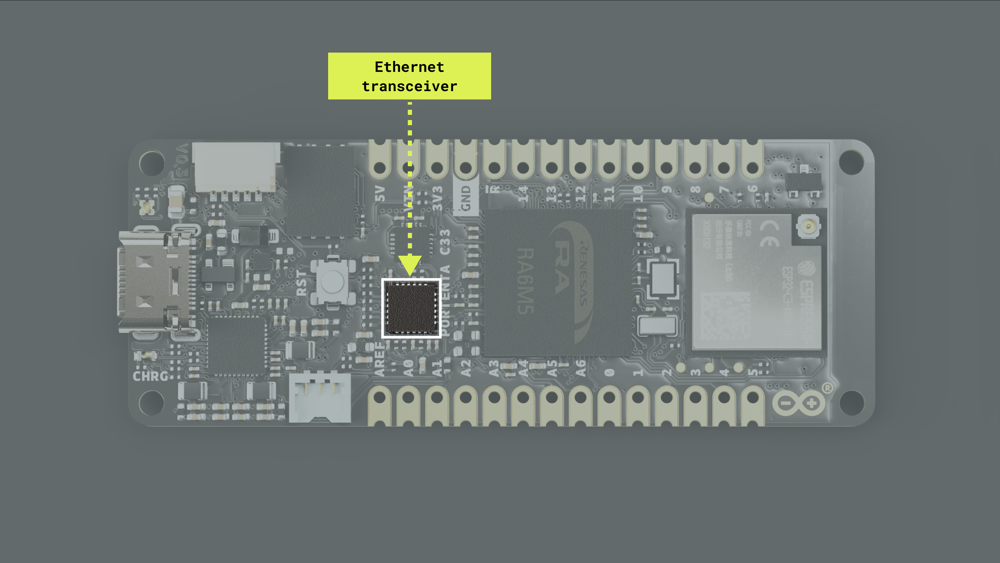

Some of the key capabilities of the LAN8742AI are the following:

- **Speed and duplex mode**: It can operate at 10 Mbps (10BASE-T) or 100 Mbps (100BASE-TX). It also features auto-negotiation, which means it can automatically determine the best speed and duplex mode for communication.
- **HP Auto-MDIX**: This feature allows you to use a straight-through or crossover Ethernet cable.
- **Wake on LAN (WoL)**: The device can be programmed to detect certain types of packets and trigger an interrupt.
- **Cable diagnostics**: The transceiver can detect issues with the Ethernet cable and determine its location.

The Arduino Renesas Core has a built-in library that lets you use the onboard Ethernet PHY transceiver right out of the box, the `EthernetC33` library. Let's walk through an example code demonstrating some of the transceiver's capabilities. You can access your board's Ethernet pins through its High-Density connectors or an Arduino Pro carrier board like the [Portenta Breakout](https://store.arduino.cc/products/arduino-portenta-breakout). 

```arduino
/**
  Web Client (Ethernet version)
  Name: WebClient.ino
  Purpose: This sketch connects to a website via Ethernet

  @author Arduino Team
  @version 4.0 01/06/18
*/

// Include the Ethernet library
#include <EthernetC33.h>

// Define the server to which we'll connect
// This can be an IP address or a URL
char server[] = "www.google.com";

// Set a static IP address to use if the DHCP fails to assign one automatically
IPAddress ip(10, 130, 22, 84);

// Initialize the Ethernet client object
// This will be used to interact with the server
EthernetClient client;

void setup() {
  // Begin serial communication at a baud rate of 115200
  Serial.begin(115200);

  // Wait for the serial port to connect
  // This is necessary for boards that have native USB
  while (!Serial);

  // Attempt to start Ethernet connection via DHCP
  // If DHCP failed, print a diagnostic message
  if (Ethernet.begin() == 0) {
    Serial.println("- Failed to configure Ethernet using DHCP!");

    // Try to configure Ethernet with the predefined static IP address
    Ethernet.begin(ip);
  }

  delay(2000);

  // Attempt to connect to the server at port 80 (the standard port for HTTP).
  // If the connection is successful, print a message and send a HTTP GET request.
  // If the connection failed, print a diagnostic message.
  Serial.println("- Connecting...");
  if (client.connect(server, 80)) {
    Serial.println("- Connected!");
    client.println("GET /search?q=arduino HTTP/1.1");
    client.println("Host: www.google.com");
    client.println("Connection: close");
    client.println();
  } else {
    Serial.println("- Connection failed!");
  }
}

/**
  Reads data from the client while there's data available

  @param none
  @return none
*/
void read_request() {
  uint32_t received_data_num = 0;
  while (client.available()) {

    // Actual data reception
    char c = client.read();

    // Print data to serial port
    Serial.print(c);

    // Wrap data to 80 columns
    received_data_num++;
    if (received_data_num % 80 == 0) {
      Serial.println();
    }
  }
}

void loop() {
  // Read data from the client
  read_request();

  // If there's data available from the server, read it and print it to the Serial Monitor
  while (client.available()) {
    char c = client.read();
    Serial.print(c);
  }

  // If the server has disconnected, disconnect the client and stop
  if (!client.connected()) {
    Serial.println();
    Serial.println("- Disconnecting...");
    client.stop();

    // Halt the sketch by entering an infinite loop
    while (true);
  }
}
```


First, the necessary libraries are included: 

- The `EthernetC33` library which contains the functionality required to communicate via Ethernet is included in the beginning.


Then, the server is defined, which is "www.google.com" in this case:

- The static IP address which will be used if the DHCP fails to assign an IP address is set.

- The Ethernet client is initialized with the server's IP address and port.

Next, in the `setup()` function:

- The serial port is initialized at a baud rate of 115200.
- An Ethernet connection is attempted; if the DHCP configuration fails, the sketch tries to configure the connection using the static IP address defined before. The usage of a DNS server depends also on the success of the DHCP configuration.
- If the DNS server is used, it connects to the server using the server name; otherwise, it uses the server IP address. If the connection is successful, it sends a `HTTP GET` request to the server. If not, it outputs an error message to the IDE's Serial Monitor.
- The `read_request()` function reads data from the client while there's data available. It wraps the data to 80 columns and prints it to the IDE's Serial Monitor.

Finally, in the `loop()` function:

- The `read_request()` function is called to read any available data. If the server is disconnected, it disconnects the client and enters an infinite loop, halting the sketch.

### Bluetooth®

The Portenta C33 board features an onboard Bluetooth® module, the ESP32-C3-MINI-1U module from Espressif Systems®. The ESP32-C3-MINI-1U is a low-power, highly integrated Wi-Fi® and Bluetooth® System-on-Chip (SoC) solution designed for many IoT applications.


***Always connect your board's Bluetooth® module with its W.FL antenna (included with your board) to avoid damaging it.***

To enable Bluetooth® communication on the Portenta C33, you can use the [`ArduinoBLE` library](https://github.com/arduino-libraries/ArduinoBLE)`ArduinoBLE` library. Let's walk through an example code demonstrating some of its Bluetooth® module's capabilities. Here is an example of how to use the `ArduinoBLE` to create a voltage level monitor application:

```arduino
/**
  Portenta_C33_Bluetooth
  Name: Portenta_C33_Bluetooth.ino
  Purpose: Read voltage level from an analog input of the Portenta C33
  then maps the voltage reading to a percentage value ranging from 0 to 100.

  Then exposes the voltage percentage level using a Custom BLuetooth Service.

  @author Arduino Team
  @version 1.1 13/07/23
*/

#include <ArduinoBLE.h>

// Define the voltage service and its characteristic
BLEService voltageService("1101");
BLEUnsignedCharCharacteristic voltageLevelChar("2101", BLERead | BLENotify);


const int analogPin = A0;

/**
  Read voltage level from an analog input of the Portenta C33,
  then maps the voltage reading to a percentage value ranging from 0 to 100.

  @param none
  @return the voltage level percentage (int).
*/

int readVoltageLevel() {
  int voltage = analogRead(analogPin);
  int voltageLevel = map(voltage, 0, 1023, 0, 100);
  return voltageLevel;
}

void setup() {
  // Initialize LEDB as an output
  pinMode(LEDB, OUTPUT);
  digitalWrite(LEDB, HIGH);

  Serial.begin(9600);

  // Initialize the BLE module
  if (!BLE.begin()) {
    Serial.println("- Starting BLE failed!");
    while (1)
      ;
  }

  // Set the local name and advertised service for the BLE module
  BLE.setLocalName("VoltageMonitor");
  BLE.setAdvertisedService(voltageService);
  voltageService.addCharacteristic(voltageLevelChar);
  BLE.addService(voltageService);

  // Start advertising the BLE service
  BLE.advertise();
  Serial.println("- Bluetooth device active, waiting for connections...");
}

void loop() {
  // Check for incoming BLE connections
  BLEDevice central = BLE.central();

  // If a central device is connected
  if (central) {
    Serial.print("- Connected to device: ");
    Serial.println(central.address());

    // Set the LED color to solid blue when connected
    digitalWrite(LEDB, LOW);

    // While the central device is connected
    while (central.connected()) {
      // Read the voltage level and update the BLE characteristic with the level value
      int voltageLevel = readVoltageLevel();

      Serial.print("- Voltage level is: ");
      Serial.println(voltageLevel);
      voltageLevelChar.writeValue(voltageLevel);

      delay(200);
    }
  }

  // The LED blinks when bluetooth® is not connected to an external device
  digitalWrite(LEDB, HIGH);
  delay(200);
  digitalWrite(LEDB, LOW);
  delay(200);

  Serial.print("- BLE not connected: ");
  Serial.println(central.address());
}
```

The example code shown above creates a Bluetooth® Low Energy service and characteristic for transmitting a voltage value read by one of the analog pins of the Portenta C33 to a central device.

- The code begins by importing all the necessary libraries and defining the Bluetooth® Low Energy service and characteristics.
- In the setup() function, the code initializes the Portenta C33 board and sets up the Bluetooth® Low Energy service and characteristics. Then, it begins advertising the defined Bluetooth® Low Energy service.
- A Bluetooth® Low Energy connection is constantly verified in the loop() function; when a central device connects to the Portenta C33, its built-in blue LED is turned into a solid blue. The code then enters into a loop that constantly reads the voltage level from an analog input and maps it to a percentage value between 0 and 100. The voltage level is printed to the Serial Monitor and transmitted to the central device over the defined Bluetooth® Low Energy characteristic.

### JTAG

The Portenta C33 board features a JTAG/SWD debug port accessible through its High-Density connectors. The pins used for the JTAG/SWD debug port are the following:

| **Functionality** | **Microcontroller Pin** |
|:-----------------:|:-----------------------:|
|     `TMS/SWD`     |          `P108`         |
|     `TCK/SCK`     |          `P300`         |
|     `TDO/SWO`     |          `P109`         |

You can use a [Portenta Breakout](https://store.arduino.cc/products/arduino-portenta-breakout) with your Portenta C33 board to easily access your board's JTAG/SWD debug port through the individual pins or a dedicated MIPI 20-pin JTAG connector with trace capability.

### ESLOV Connector

The Portenta C33 board features an onboard ESLOV connector to extend the I2C communication bus. This connector simplifies connecting various sensors, actuators, and other modules to the Portenta C33 without soldering or wiring; Nicla family boards can also be connected to the Portenta C33 through this connector. 


The ESLOV connector is a small 5-pin connector with a 1.00 mm pitch. The mechanical details of the connector can be found in the [connector's datasheet](https://www.jst-mfg.com/product/pdf/eng/eSH.pdf).

The pin layout of the ESLOV connector is the following:

1. VCC
2. INT
3. SCL
4. SDA
5. GND

`VCC` pin works as a 5 V output if the board is connected to a USB-C® cable. The manufacturer part number of the ESLOV connector is SM05B-SRSS, and its matching receptacle manufacturer part number is SHR-05V-S-B.

## External Memory

The Portenta C33 board features an onboard 16 MB QSPI Flash memory, the MX25L12833F from Macronix®. Having an onboard QSPI Flash memory enhances the capabilities of the Portenta C33, enabling you to develop and run more complex and data-intensive applications.

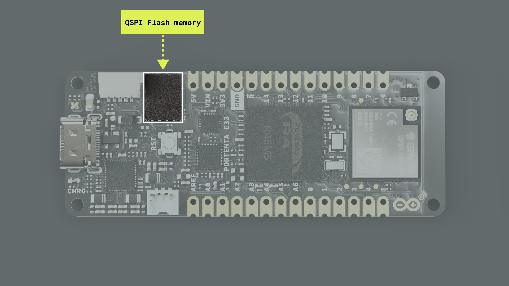

Some key advantages of having an onboard QSPI Flash memory are the following:

- **Storage capacity**: The MX25L12833F QSPI Flash memory adds significant non-volatile storage to the board.
- **Extended functionality**: The additional memory space allows more complex applications to be developed and run on your Portenta C33. This application includes data logging, image processing, audio processing, and executing complex algorithms.
- **Firmware updates**: The MX25L12833F QSPI Flash memory can also store firmware or software updates for your Arduino board. This means you can update the firmware without requiring a complete reprogramming of the board.

The Arduino Renesas Core has built-in libraries and drivers that immediately let you use the onboard QSPI Flash memory. Let's walk through an example code demonstrating some of the onboard Flash memory capabilities; the main tasks performed in the sketch are initializing the Flash memory, writing to a file, and reading from a file.

```arduino
/**
  QSPI Flash File System test
  Name: QSPI_Flash_FileSystem_Test.ino
  Purpose: This sketch test the onboard QSPI Flash memory
  file system by writing and reading a file.

  @author Arduino Team
  @version 1.0 20/06/23
*/

// Include necessary libraries and drivers
#include "QSPIFlashBlockDevice.h"
#include "FATFileSystem.h"

// Define constants for file system and test file name
#define QSPI_FS_NAME "qspi"
#define TEST_FILE "test.txt"

// Instantiate flash block device and file system
QSPIFlashBlockDevice block_device(PIN_QSPI_CLK, PIN_QSPI_SS, PIN_QSPI_D0, PIN_QSPI_D1, PIN_QSPI_D2, PIN_QSPI_D3); 
FATFileSystem fs(QSPI_FS_NAME);

// Define full path to the test file
std::string file_test_name = std::string("/") + std::string(QSPI_FS_NAME) + std::string("/") + std::string(TEST_FILE); 

void setup() {
  // Initialize serial communication and wait a connection
  Serial.begin(9600);
  while(!Serial);

  // Print test start message
  Serial.println();
  Serial.println("- SIMPLE QSPI FLASH TEST");
  Serial.println();

  // Try to mount the QSPI Flash file system
  // If mounting fails, try to format the file system
  int err =  fs.mount(&block_device);
  if (err) {
    Serial.println("- No filesystem found, formatting... ");
    err = fs.reformat(&block_device);
  }
  if (err) {
    // If formatting fails, print error and halt
    Serial.println("- Error formatting QSPI Flash ");
    while(1);
  }

  // Try to open a test file for writing
  // If file opened successfully, write some text to the file
  FILE* fp = fopen(file_test_name.c_str(), "w");
  if(fp != NULL) {
    Serial.println("- Opened file for writing!");
    char text[] = "Hello from QSPI Flash!\n";
    fwrite(text, sizeof(char), strlen(text), fp);
    // Always close the file after writing to save changes
    fclose(fp);
  }
  else {
    // If file opening fails, print an error message
    Serial.print("- Failed to open file for writing: ");
    Serial.println(file_test_name.c_str());
  }

  // Try to open the test file for reading
  // If file opened successfully, read and print its content
  fp = fopen(file_test_name.c_str(), "r");
  if(fp != NULL) {
    Serial.println("- Opened file for reading!");
    char ch;
    while(fread(&ch, sizeof(char), 1, fp) == 1) {
      Serial.print(ch);
    }
    // Always close the file after reading
    fclose(fp);
  }
  else {
    // If file opening fails, print an error message
    Serial.print("Failed to open file for reading: ");
    Serial.println(file_test_name.c_str());
  }
}

void loop() {}
```

Here's what each section of the example code does:

- **Initialize the onboard Flash memory**: After setting up the Serial port, the sketch tries to mount the QSPI Flash file system. If the file system is not found, the code formats the memory to set up a new file system. If there's an error during this process, the code will halt and print an error message to the IDE's Serial Monitor.
- **Write to a file**: Next, the sketch attempts to open a file named `test.txt` in `write` mode. If this process is successful, it writes the string `Hello from QSPI Flash!` to the file and then closes it. If it cannot open the file, it will print an error message to the IDE's Serial Monitor.
- **Read from a file**: After writing to the file, the sketch attempts to open the same file, but this time in 'read' mode. If successful, it will read the content of the file one character at a time and print each character to the IDE's Serial Monitor. After reading, it closes the file. If it cannot open the file for reading, it will print an error message to the IDE's Serial Monitor.

## Secure Element

The Portenta C33 features a secure element onboard, the SE050 from NXP®. A secure element is a component that can store sensitive data and run secure apps; it acts as a vault, protecting what is inside the secure element from attacks. A secure element simplifies the implementation of robust security mechanisms, reducing time to market without requiring specialized security expertise.


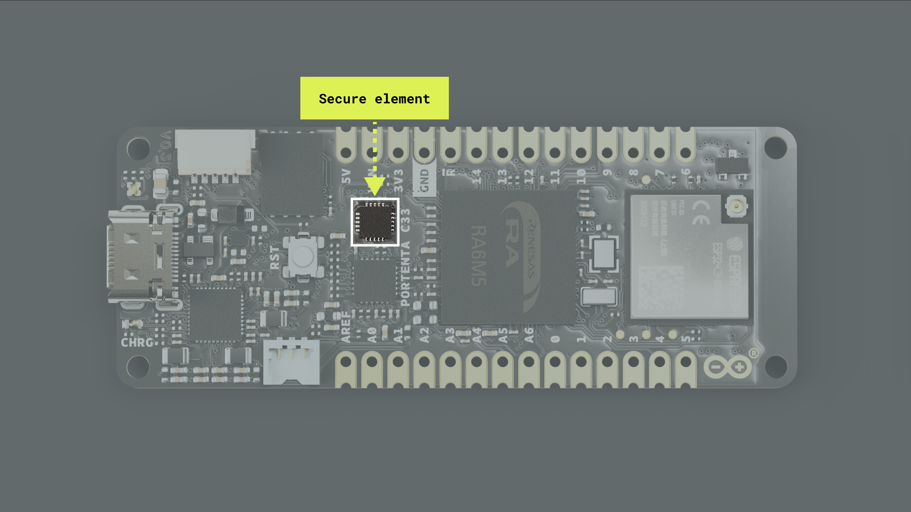

The SE050 is a ready-to-use IoT secure element that provides a root of trust at the IC level and gives an IoT system state-of-the-art, edge-to-cloud security capability. It allows for securely storing and provisioning credentials and performing cryptographic operations for security-critical communication and control functions. The Arduino Renesas Core has a built-in library that lets you use the secure onboard element right out of the box, the `SE05X` library. 

The Arduino sketch below can help you start with the SE050 and demonstrate its capabilities. The example code generates a new Elliptic Curve (EC) key pair (NIST Curve P-256), signs a SHA256 hash of a predefined input with the private key, and verifies the signature with the public key.

```arduino
/**
  SE05X Import and Verify
  Name: import_public_key.ino
  Purpose: This sketch generates a new EC NIST P-256 key pair,
  signs a SHA256 hash of a predefined input with the private key,
  and verifies the signature with the public key.

  @author Arduino HW/FW team, modified by Arduino PRO Content Team
  @version 1.0 08/06/23
*/

// Include the SE05X library
#include <SE05X.h>

// Define IDs for the private and public keys
const int PRIVATE_KEY_ID  = 999;
const int PUBLIC_KEY_ID   = 899;

// Define the input buffer
const byte input[64] = {
  0x00, 0x01, 0x02, 0x03, 0x04, 0x05, 0x06, 0x07, 0x08, 0x09, 0x0a, 0x0b, 0x0c, 0x0d, 0x0e, 0x0f,
  0x10, 0x11, 0x12, 0x13, 0x14, 0x15, 0x16, 0x17, 0x18, 0x19, 0x1a, 0x1b, 0x1c, 0x1d, 0x1e, 0x1f,
  0x20, 0x21, 0x22, 0x23, 0x24, 0x25, 0x26, 0x27, 0x28, 0x29, 0x2a, 0x2b, 0x2c, 0x2d, 0x2e, 0x2f,
  0x30, 0x31, 0x32, 0x33, 0x34, 0x35, 0x36, 0x37, 0x38, 0x39, 0x3a, 0x3b, 0x3c, 0x3d, 0x3e, 0x3f
};

/**
  Print a buffer in hexadecimal format.

  @param input buffer to print in hexadecimal format.
  @param inputLenght input buffer length.
  @return none.
*/

// Function to print a buffer in hexadecimal format
void printBufferHex(const byte input[], size_t inputLength) {
  for (size_t i = 0; i < inputLength; i++) {
    Serial.print(input[i] >> 4, HEX);     // Print the high nibble
    Serial.print(input[i] & 0x0f, HEX);   // Print the low nibble
  }
  Serial.println();
}

void setup() {
  // Initialize serial port with a baud rate of 9600, wait for a connection.
  Serial.begin(9600);
  while (!Serial);

  // Initialize the secure element. If the initialization fails, print an error message and halt.
  if (!SE05X.begin()) {
    Serial.println("- Failed to communicate with secure element!");
    while(1);
  }

  // Create a buffer for DER-encoded key and define its size.
  byte derBuf[256];
  size_t derSize;

  // Generate a new private key with the defined ID.
  SE05X.generatePrivateKey(PRIVATE_KEY_ID, derBuf, sizeof(derBuf), &derSize);

  // Print the input buffer on the Serial Monitor.
  Serial.print("- Input is:                     ");
  printBufferHex(input, sizeof(input));

  // Calculate and print the SHA256 hash of the input buffer on the Serial Monitor.
  byte sha256[256];
  size_t sha256Len;
  SE05X.SHA256(input, sizeof(input), sha256, sizeof(sha256), &sha256Len);
  Serial.print("- Input SHA256 is:              ");
  printBufferHex(sha256, sha256Len);

  // Sign the SHA256 hash with the generated private key.
  byte signature[256];
  size_t signatureLen;
  SE05X.Sign(PRIVATE_KEY_ID, sha256, sha256Len, signature, sizeof(signature), &signatureLen);

  // Print the signature on the Serial Monitor.
  Serial.print("Signature using KeyId ");
  Serial.print(PRIVATE_KEY_ID);
  Serial.print(" is: ");
  printBufferHex(signature, signatureLen);
  Serial.println();

  // Import the public key to the secure element using the public key ID and the DER-encoded key. 
  SE05X.importPublicKey(PUBLIC_KEY_ID, derBuf, derSize);

  // To make the signature verification fail, uncomment the next line:
  // signature[0] = 0x00;

  // Verify the signature. If the verification fails, print an error message on the Serial Monitor. 
  if (SE05X.Verify(PUBLIC_KEY_ID, sha256, sha256Len, signature, signatureLen)) {
    Serial.println("Verified signature successfully :D");
  } else {
    Serial.println("- Failed to verify signature!");
  }
}

// Loop function
void loop() {
  // This function remains empty, as no repetitive task needs to be done in this example.
}
```

Here's what each section of the example code does:

- **Input buffer initialization**: The sketch begins by initializing a 64-byte input buffer.
- **Buffer print function**: A function named `printBufferHex()` is defined to print the contents of a buffer in hexadecimal format to the IDE's Serial Monitor.
- **Secure element initialization**: In the `setup()` function, communication with the secure element is initiated. If it fails, an error message is shown in the IDE's Serial Monitor, and the program is halted.
- **Private key generation**: The secure element generates an Elliptic Curve (EC) NIST P-256 private key. The key ID is set to 999, and the generated key is returned in DER format.
- **Input hash and signature**: The SHA256 hash of the input buffer is computed and printed, then signed using the generated private key.
- **Public key import**: The public key derived from the generated private key is imported to the secure element with key ID 899.
- **Signature verification**: The example code then verifies the signature using the imported public key and prints a success or failure message accordingly.

## Arduino IoT Cloud

The Portenta C33 is fully compatible with the Arduino Cloud IoT, which simplifies how professional applications are developed and tracked. By using the IoT Cloud, you can, for example, monitor sensor data, control your board and actuators connected to it remotely, and update your device's firmware over-the-air.


In case it is the first time you are using the Arduino IoT Cloud:

- To use the Arduino IoT Cloud, you need an account. If you do not have an account, create one for free [here](https://cloud.arduino.cc/).
- To use the Arduino Web Editor or Arduino IoT Cloud, the Arduino Create Agent must be running on your computer. You can install the Arduino Create Agent [here](https://create.arduino.cc/getting-started/plugin/welcome).

Let's walk through a step-by-step demonstration of how to use your Portenta C33 board with the Arduino IoT Cloud.

Log in to your Arduino IoT Cloud account; you should see the following:


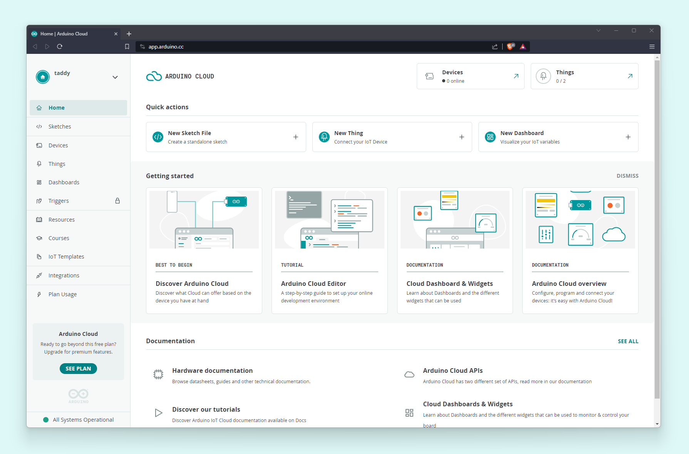

First, provision your Portenta C33 board on your Arduino IoT Cloud space. To do this, navigate to **Devices** and then click on the **ADD DEVICE** button:


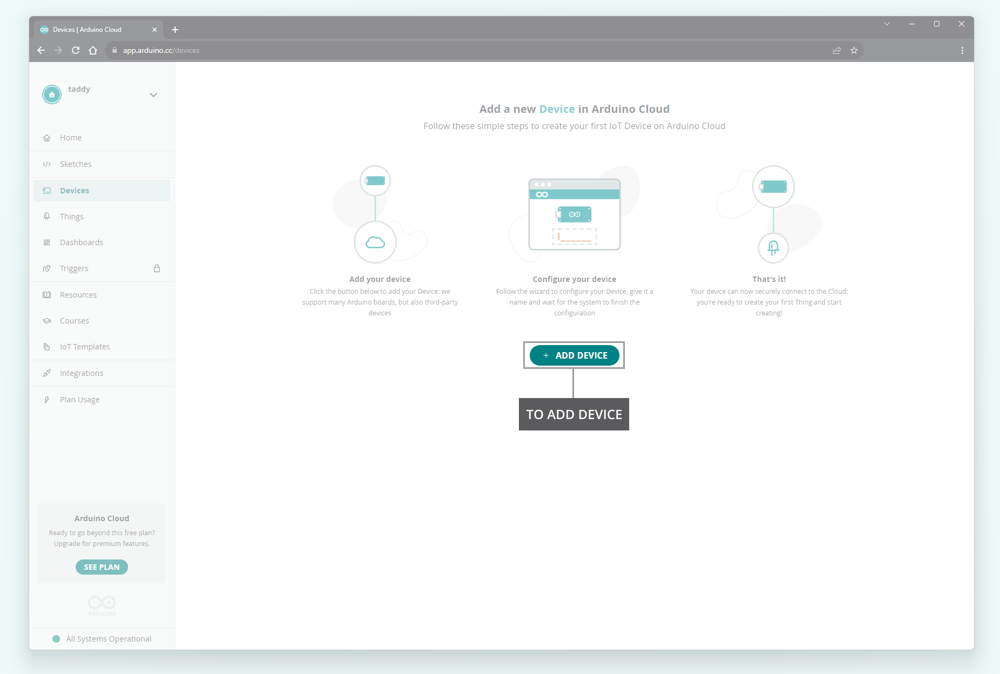

The **Setup Device** pop-up window will appear, navigate into **AUTOMATIC** and select the **Arduino board** option:


After a while, your Portenta C33 board should be discovered by the Arduino IoT Cloud, as shown below:

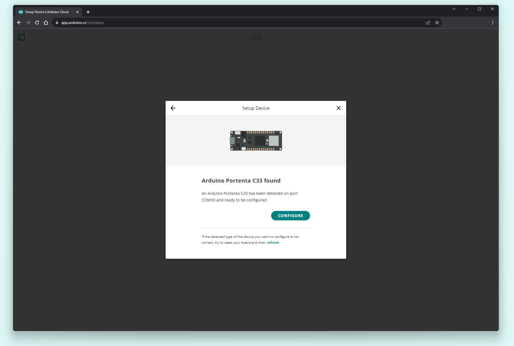

Click the **CONFIGURE** button, give your board a name, and select the type of network connection. In this example, we will use a Wi-Fi® connection; you can also use an Ethernet connection with a [Portenta Max Carrier](https://store.arduino.cc/products/portenta-max-carrier), a [Portenta Breakout](https://store.arduino.cc/products/arduino-portenta-breakout), a [Portenta Vision Shield](https://store.arduino.cc/products/arduino-portenta-vision-shield-ethernet) or a custom-made board with an Ethernet connector. Your Portenta C33 board will be configured to securely communicate with the Arduino IoT Cloud. This process can take a while.

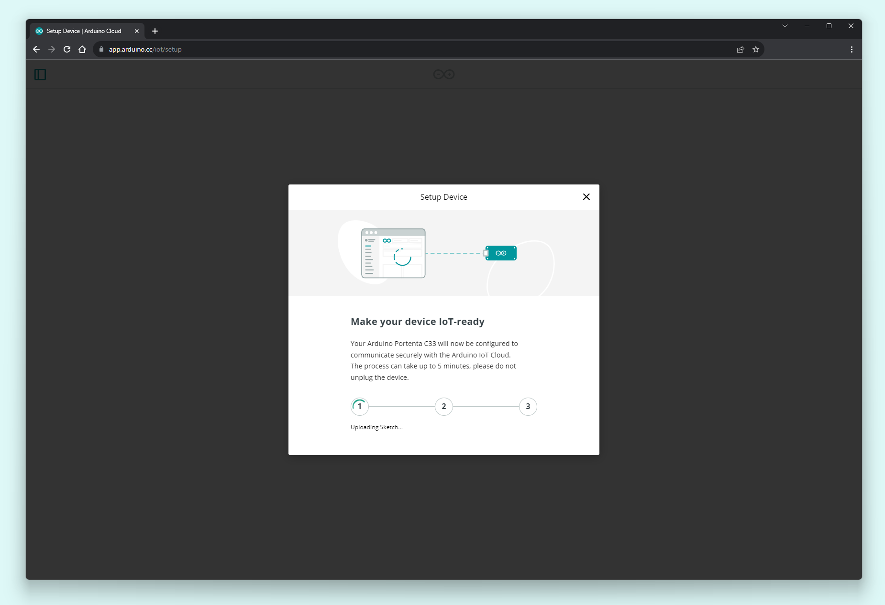

Once the Portenta C33 has been configured, let's create a "Thing" to test the connection between your board and the Arduino IoT Cloud. Navigate into **Things** and select the **CREATE THING** button; give your thing a name.


Navigate into **Associate Device** and click the **Select Device** button. Select your Portenta C33 board and associate it with your "Thing." Then, navigate into **Network** and click the **Configure** button; enter your network credentials.

The project is now ready to add some variables to your "Thing"; navigate into **Cloud Variables** and click the **ADD VARIABLE** button. 


Add one variable with the following characteristics:

- **Name**: `led`
- **Variable type**: `boolean`
- **Variable permission** `Read & Write`
- **Variable update policy**: `On change`


You should see the `led` variable in the **Cloud Variables** section. Navigate into **Dashboards** and select the **BUILD DASHBOARD** button; this will create a new dashboard; give your dashboard a name.

Add the following widgets to your dashboard:

- **Switch**: name the widget `Switch` and link it to the `led` variable you created before.
- **LED**: name the widget `led` and link it to the `led` variable you created before.

Your dashboard should look like the following:

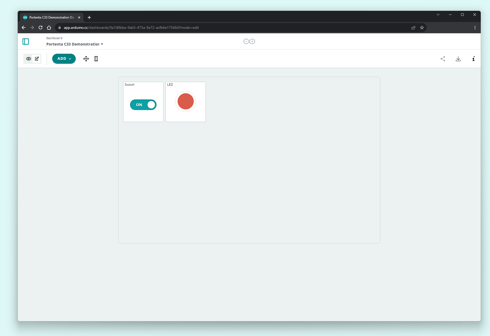

Go back to your **Things** and open the "Thing" you created. In the "Thing" setup page, navigate into **Sketch**, where you should see the online editor.

In the generated sketch, define `LED_BUILTIN` pin as an output in the `setup()` function:

```arduino
void setup() {
  // Initialize serial and wait for port to open:
  Serial.begin(9600);
  // This delay gives the chance to wait for a Serial Monitor without blocking if none is found
  delay(1500);

  // LED_BUILTIN macro access the onboard green LED
  pinMode(LED_BUILTIN, OUTPUT);

  // Defined in thingProperties.h
  initProperties();

  // Connect to Arduino IoT Cloud
  ArduinoCloud.begin(ArduinoIoTPreferredConnection);

  /*
     The following function allows you to obtain more information
     related to the state of network and IoT Cloud connection and errors
     the higher number the more granular information you’ll get.
     The default is 0 (only errors).
     Maximum is 4
 */
  setDebugMessageLevel(2);
  ArduinoCloud.printDebugInfo();
}
```

In the `onLedChange()` function, which was generated automatically by the Arduino IoT Cloud when the variable `led` was created, you must associate the onboard green LED state with the `led` variable:

```arduino
/*
  Since Led is READ_WRITE variable, onLedChange() is
  executed every time a new value is received from IoT Cloud.
*/
void onLedChange()  {
  digitalWrite(LED_BUILTIN, !led);
}
```

The complete example code can be found below:

```arduino
/*
  Sketch generated by the Arduino IoT Cloud

  Arduino IoT Cloud Variables description

  The following variables are automatically generated and updated when changes are made to the Thing

  bool led;

  Variables which are marked as READ/WRITE in the Cloud Thing will also have functions
  which are called when their values are changed from the Dashboard.
  These functions are generated with the Thing and added at the end of this sketch.
*/

#include "thingProperties.h"

void setup() {
  // Initialize serial and wait for port to open:
  Serial.begin(9600);
  // This delay gives the chance to wait for a Serial Monitor without blocking if none is found
  delay(1500);

  // Defined in thingProperties.h
  initProperties();

  // Connect to Arduino IoT Cloud
  ArduinoCloud.begin(ArduinoIoTPreferredConnection);

  /*
     The following function allows you to obtain more information
     related to the state of network and IoT Cloud connection and errors
     the higher number the more granular information you’ll get.
     The default is 0 (only errors).
     Maximum is 4
 */
  setDebugMessageLevel(2);
  ArduinoCloud.printDebugInfo();
}

void loop() {
  ArduinoCloud.update();
  // Your code here
}

/*
  Since Led is READ_WRITE variable, onLedChange() is
  executed every time a new value is received from IoT Cloud.
*/
void onLedChange()  {
  digitalWrite(LED_BUILTIN, !led);
}
```

To upload the code to the Portenta C33 from the online editor, click the green **Verify** button to compile the sketch and check for errors, then click the green **Upload** button to program the board with the sketch.

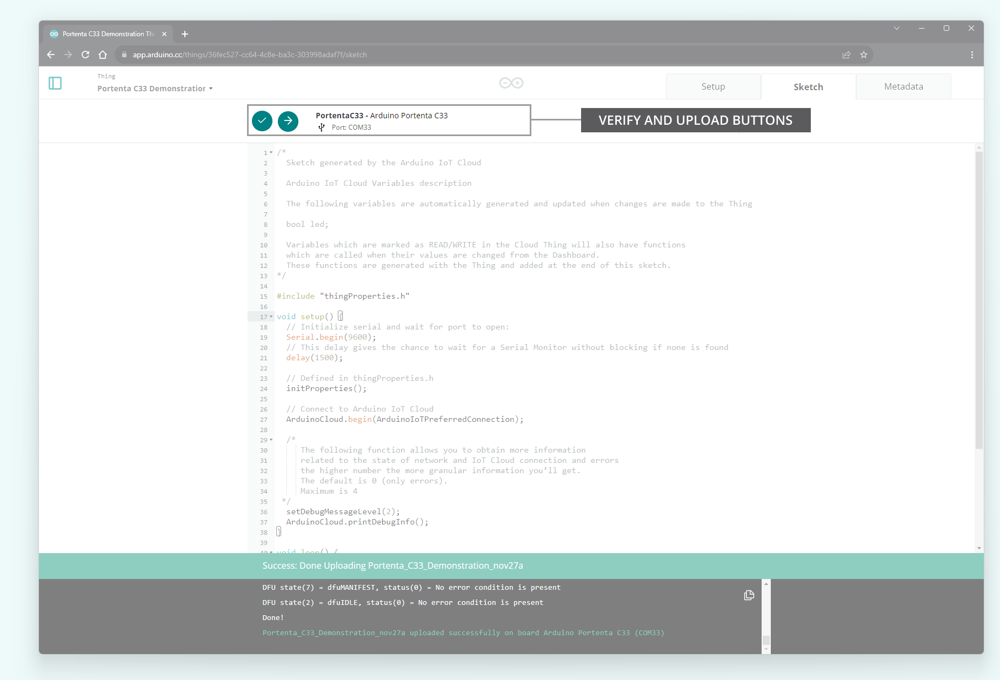

Navigate into **Dashboards** again, your board should connect to the Wi-Fi® network you defined before (you can follow the connection process with the online editor integrated Serial Monitor). Your board's green LED should light on or off when the position of the switch changes.

## Support

If you encounter any issues or have questions while working with the Portenta C33, we provide various support resources to help you find answers and solutions.

### Help Center

Explore our Help Center, which offers a comprehensive collection of articles and guides for the Portenta C33. The Arduino Help Center is designed to provide in-depth technical assistance and help you make the most of your device.

- [Portenta C33 help center page](https://support.arduino.cc/hc/en-us/sections/360004767859-Portenta-Family)

### Forum

Join our community forum to connect with other Portenta C33 users, share your experiences, and ask questions. The forum is an excellent place to learn from others, discuss issues, and discover new ideas and projects related to the Portenta C33.

- [Portenta C33 category in the Arduino Forum](https://forum.arduino.cc/c/hardware/portenta/portenta-c33/183)

### Contact Us

Please get in touch with our support team if you need personalized assistance or have questions not covered by the help and support resources described before. We're happy to help you with any issues or inquiries about the Portenta C33.

- [Contact us page](https://www.arduino.cc/en/contact-us/)