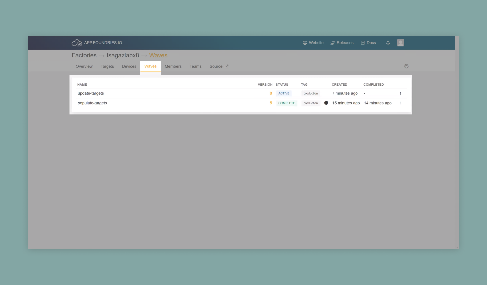

## Overview

In a production environment, it is convenient to plan updates and have control over when and which devices are updated. FoundriesFactory® Waves is the feature for this. It allows you to easily define a group of Portenta X8 and then push updates to that specific group. The difference between standard updates and using Waves to update is that the Wave update will promote targets to production by double signing them, which makes the updates more manageable and controllable.

This tutorial will show you how to define fleets and how to construct a Wave that can then be pushed to a group.

## Goals

- Learn how to use Waves fleet manager
- Learn how to assign a target to a Wave
- Learn how to push a Wave to a group of devices

### Required Hardware and Software

- [Arduino Portenta X8](https://store.arduino.cc/products/portenta-x8)
- USB-C® cable (either USB-C® to USB-A or USB-C® to USB-C®)
- Arduino Create account
- Arduino Cloud for business subscription with Portenta X8 Manager add-on: [Learn more about here](https://cloud.arduino.cc/plans#business)
- Foundries.io™ account (linked with the Arduino Cloud for business subscription)
- FoundriesFactory® and devices already attached to your Factory ([User Manual for setup process](tutorials/portenta-x8/user-manual#out-of-the-box-experience))

## Instructions

### Setting Up the Terminal

Waves fleet management requires us to have the X8 setup with FoundriesFactory. If you have not done so, please follow our [User Manual for setup process](tutorials/portenta-x8/user-manual#out-of-the-box-experience), as it will walk you through setting up the X8 with your Factory.

To use Waves, you need to have fioctl installed and configured. Follow this [guide](https://docs.foundries.io/latest/getting-started/install-fioctl/index.html) to do so. Creating Waves and device groups will be done via the host, which is your factory. As such, the following commands will be entered in a terminal using fioctl to connect to your Factory.

### Rotating Our Keys

For security purposes, we recommend that you rotate your FoundriesFactory keys. Rotation of the key will convert the root role's online key, which was generated during the bootstrap of your Factory, to an [offline key](https://docs.foundries.io/latest/reference-manual/security/offline-keys.html).

First, we will rotate the root keys. These are the most important keys, as they are used to create new target keys. Rotate them with the command:

```
fioctl keys rotate-root --initial /absolute/path/to/root.keys.tgz
```

Now we can rotate the target-only keys with following command:

```
fioctl keys rotate-targets /absolute/path/to/root.keys.tgz
```

And finally, for security reasons, we separating the target keys from the root using the following command:

```
fioctl keys copy-targets /absolute/path/to/root.keys.tgz /path/to/target.only.key.tgz
```

Now we can move on to creating our Wave.

### Creating a Dummy Wave for Production Targets

Before a Factory can start making production OTAs, an initial production Targets file must be created. For more information, please check out [here](https://docs.foundries.io/latest/reference-manual/ota/production-targets.html). We can begin by creating a dummy wave with the command:

```
fioctl wave init -k /absolute/path/to/targets.only.key.tgz populate-targets
```

Then complete the Wave with:

```
fioctl wave complete populate-targets
```

This creates a new `targets.json` file for production devices, subscribing to the production tag. It will include a single Target from the CI build.

### Creating a Wave

Now we can start creating our Wave. The command below will create a Wave that is pushable to our devices. To create a Wave, we will sign it with a key, and here we will use the targets-only key. Then we give the Wave a name, target number, and tag. The `target number` needs to correspond to the target that we want the Wave to contain for our devices. The `tag` can be set as production or development.

```
fioctl wave init -k /absolute/path/to/targets.only.key.tgz <waveName> <targetNumber> <tag>
```

And then we can complete the Wave by passing the name to the "complete" function:

```
fioctl wave complete <waveName>
```

If you decide to cancel, the following command will help you to do that:

```
fioctl waves cancel <waveName>
```

After creating the Wave, you should see it on your Factory page. It should also be marked as complete after you call the Wave complete command.



### Create the Device Group

With this command, we create our group, giving it a name and a short description:

```
fioctl config device-group create <groupName> "<shortDescription>"
```

The name and the short description should be as explicit and concise as possible to highlight its group. Now to assign a device to our group we use the following command:

```
fioctl device config group <deviceName> <groupName>
```

On your FoundriesFactory device page, you can sort and view devices by the group.


To roll out our Wave to our device group, use the following command:

```
fioctl waves rollout <waveName> <deviceGroupName>
```

Every device in the device group should now have the target specified in the Wave creation.

### Conclusion

In this tutorial, we first looked at what is required to use the Wave tool. We then went through the process of creating a Wave and device group. Then we pushed a target to the device group using the Wave tool. With this, you have learned to use FoundriesFactory® Waves Fleet Management for multiple Portenta X8.

## Troubleshooting

- If you are having trouble with any fioctl commands you can use `fioctl wave --help` or `fioctl wave rollout --help` depending on the context.
