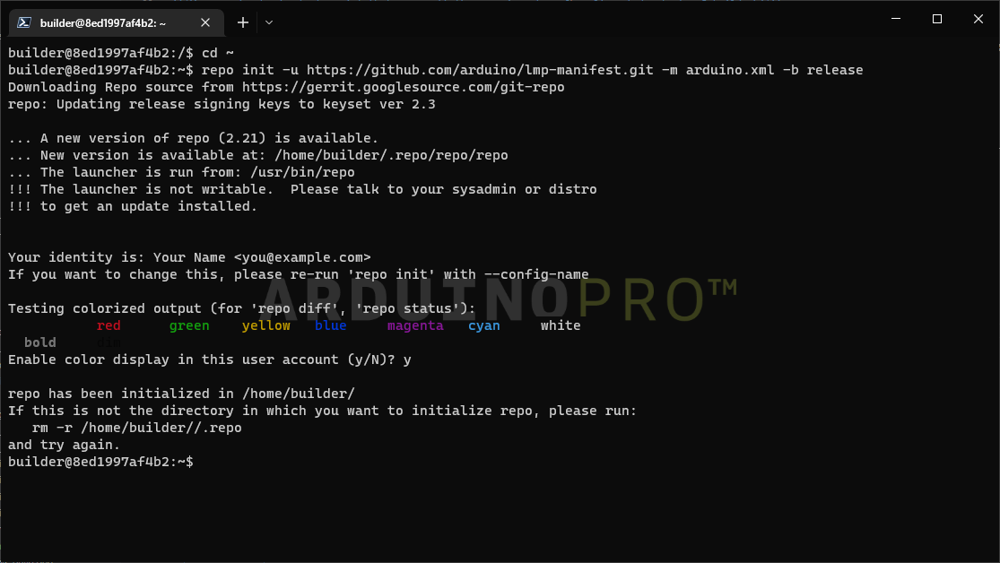
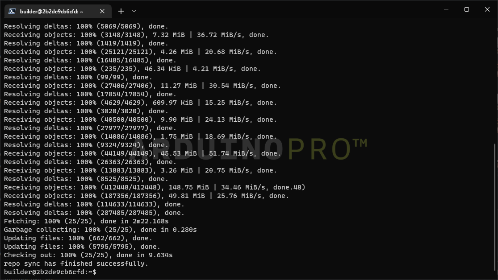
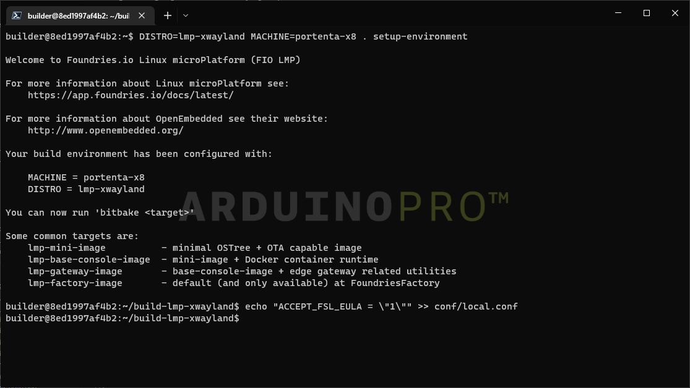
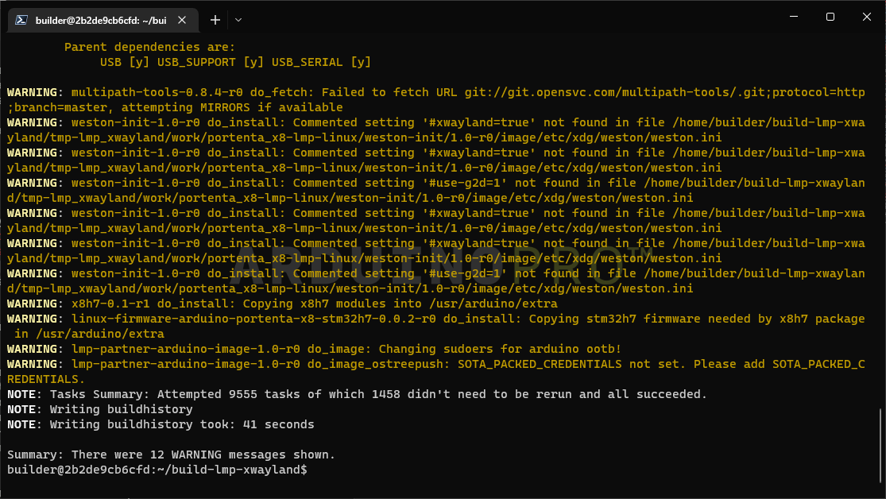
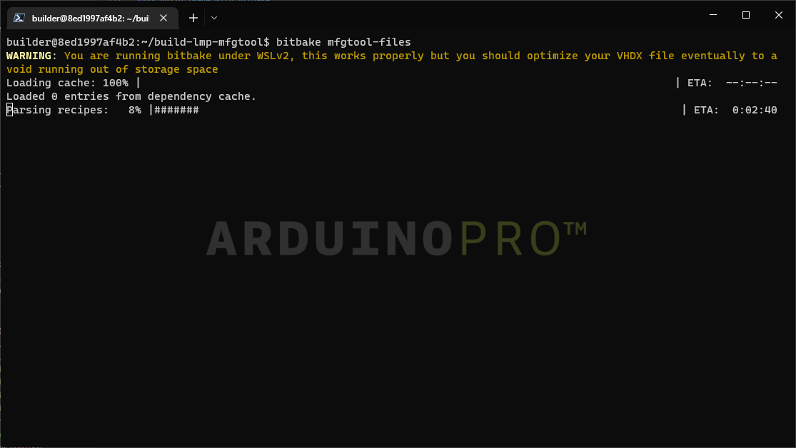
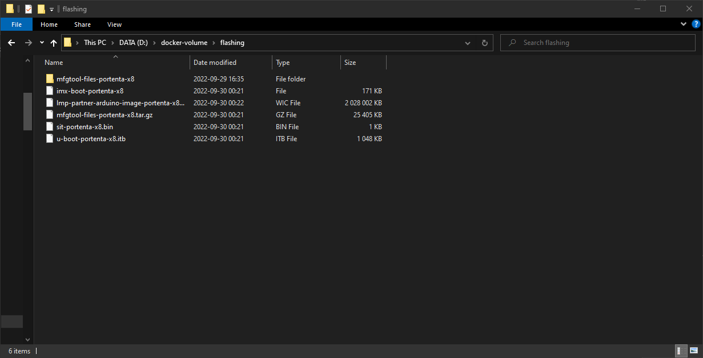

## Overview

In this tutorial, you will learn how to build an image for the Portenta X8 with the source code provided at our [GitHub repository for lmp-manifest](https://github.com/arduino/lmp-manifest/). It is an ideal approach for debugging system elements like the bootloader or kernel support by building images locally.

***Images built locally cannot register with FoundriesFactory and will not be OTA compatible, but this is a good alternative for those who do not have a FoundriesFactory subscription.***

This tutorial targets customers that are not FoundriesFactory subscribers, but still want to extend the functionality of the Arduino pre-built sources by building their images. For FoundriesFactory subscribers, we strongly suggest making use of your Factory's continuous integration system for image creation.

## Goals

- Learn how to build a "builder" Docker image
- Learn how to get the required files
- Learn how to configure the build settings
- Learn how to build the image
- Learn how to save the needed files for flashing

### Required Hardware and Software

- [Portenta X8](https://store.arduino.cc/products/portenta-x8)
- [Docker Engine](https://docs.docker.com/engine/install/)
- ~60GB of available storage space on your machine

## Instructions

### Docker

#### Build the Docker Image

You will start by creating a Docker image with the necessary dependencies to build your device image. This involves cloning the [lmp-manifest repository](https://github.com/arduino/lmp-manifest/) from Arduino's GitHub. Follow these steps:

Clone the [lmp-manifest repository](https://github.com/arduino/lmp-manifest/) using the command below:

```bash
git clone https://github.com/arduino/lmp-manifest.git
```


After successfully cloning the repository, navigate to the lmp-manifest directory:

```bash
cd lmp-manifest
```

Build the Docker image with the following command:

```bash
docker build -t yocto-build ./lmp-manifest
```


You will see a confirmation message indicating the image's readiness if the build completes successfully.

#### Run The Docker Image (Builder)

After preparing the Docker image, it is time to run it with the *`-v`* option to mount a host directory as a volume inside the container. This step is important for preserving data and build artifacts beyond the container's lifecycle.

***Skipping the volume mount (`-v`) will result in data loss once the container has stopped.***

To run the *`yocto-build`* image and begin an interactive session, use the following command, replacing *`<source>`* with your host directory path:

```bash
docker run -v <source>:/dockerVolume -it yocto-build bash
```

Once inside the container, switch to the *`builder`* user to proceed with the build process. The password for the builder user is **builder**:

```bash
su builder
```

### Image Setup and Build

***You can download a [bash script](assets/portenta-x8_build.sh) that wraps all the upcoming steps.***

#### Setup the Environment

Now that you are running inside the Docker Image, you can use tools like **git-repo**, which is already installed.

Begin by configuring git with any credentials, as *`git-repo`* requires this for operations. Use the following commands as placeholders:

```bash
git config --global user.email "you@example.com"
```

```bash
git config --global user.name "Your Name"
```


Next, navigate to the mounted volume directory and initialize the repository using **repo**:

```bash
cd /dockerVolume
```

```bash
repo init -u https://github.com/arduino/lmp-manifest.git -m arduino.xml -b main
```

If no specific branch is mentioned, the command could default to:

```bash
repo init -u https://github.com/arduino/lmp-manifest.git -m arduino.xml
```

This would implicitly use the default branch, which is typically the *main* in repositories these days.



Proceed to download the necessary files by synchronizing the repositories:

```bash
repo sync
```


Upon successful synchronization, your directory should resemble the following:



***If you are a FoundriesFactory subscriber and want to build your Factory sources locally, please use the manifest link for your Factory as below. This is not recommended as images built locally cannot register to the Factory and receive OTAs.***

#### Set Up the Portenta X8 Distribution

For the Portenta X8, you have options for the **DISTRO** setting, each designed for different needs:

- **`lmp-base`**: A developer-friendly, insecure image without OSTree that is unsuitable for OTA updates.
- **`lmp`**: A secure image, streamlined without xwayland.
- **`lmp-xwayland`**: A secure image that includes xwayland support.

Choose the appropriate distribution with the command below:

```bash
DISTRO=lmp-xwayland MACHINE=portenta-x8 . setup-environment
```

***Support for `lmp-partner-arduino-image` is anticipated to improve continuously.***

Following the environment setup, the process will navigate to a new directory. Here, accept the EULA with:

```bash
echo "ACCEPT_FSL_EULA = \"1\"" >> conf/local.conf
```

The setup completion should resemble the output shown here: 



#### Build an Image With Bitbake

Start the image build with Bitbake using:

```bash
bitbake lmp-partner-arduino-image
```

***This process may take ~7 hours depending on the build host***


To maintain system responsiveness during the build, consider adjusting resource usage by editing *`conf/local.conf`*:

- Reduce `BB_NUMBER_PARSE_THREADS` and `BB_NUMBER_THREADS` to `"4"`
- Set `PARALLEL_MAKE` to `"-j 4"`

Assessing and adjusting according to your system's thread availability can help balance the build process and other activities. Upon completion, the output should be similar to this:



#### Setup Manufacturing Tools

To flash your board, you will need to compile **lmp-mfgtool distro** to get additional tools. First, go into your home folder and change **DISTRO** following the command sequence:

```bash
cd ..
DISTRO=lmp-mfgtool MACHINE=portenta-x8 . setup-environment
echo "ACCEPT_FSL_EULA = \"1\"" >> conf/local.conf
echo "MFGTOOL_FLASH_IMAGE = \"lmp-partner-arduino-image\"" >> conf/local.conf
```

You should be able to see similar results as the following image when successful:


#### Build Manufacturing Tools: Flash The Board

To compile and get the tools required, we will use the following command:

```bash
bitbake mfgtool-files
```



After completion:


***This process may take ~2 hours, depending on your build host***

#### Save Your Image For Flashing

After a successful build, save the needed files to the host volume you mounted with `docker run`. Use the following commands to copy the files to your storage unit:

```bash
cd ..
mkdir ../../dockerVolume/flashing
DEPLOY_FOLDER=../../dockerVolume/flashing

cp -L build-lmp-mfgtool/deploy/images/portenta-x8/mfgtool-files-portenta-x8.tar.gz $DEPLOY_FOLDER
cp -L build-lmp-xwayland/deploy/images/portenta-x8/imx-boot-portenta-x8 $DEPLOY_FOLDER
cp -L build-lmp-xwayland/deploy/images/portenta-x8/u-boot-portenta-x8.itb $DEPLOY_FOLDER
cp -L build-lmp-xwayland/deploy/images/portenta-x8/sit-portenta-x8.bin $DEPLOY_FOLDER
cp -L build-lmp-xwayland/deploy/images/portenta-x8/lmp-partner-arduino-image-portenta-x8.wic $DEPLOY_FOLDER

cd $DEPLOY_FOLDER
tar xvf mfgtool-files-portenta-x8.tar.gz
```


You will be able to see the copied files in your OS file explorer.



## Conclusion

In this tutorial, you have learned how to build a "builder" Docker image, get its required files, configure the build settings, build the image, and save the needed files for flashing. Now, you have all the files necessary to flash the image you built onto the device.

## Next Steps

Please follow the [Flashing tutorial](https://docs.arduino.cc/tutorials/portenta-x8/image-flashing/) to flash your device with your custom image. Following the tutorial's steps, you can use the files from this build to flash the Portenta X8.

## Troubleshooting

- If you are having `do_fetch` issues, check your system's and virtual machine's DNS settings.
