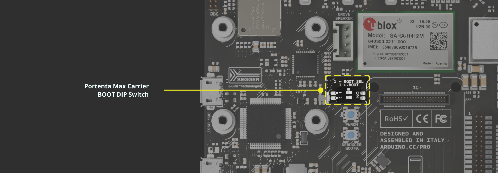
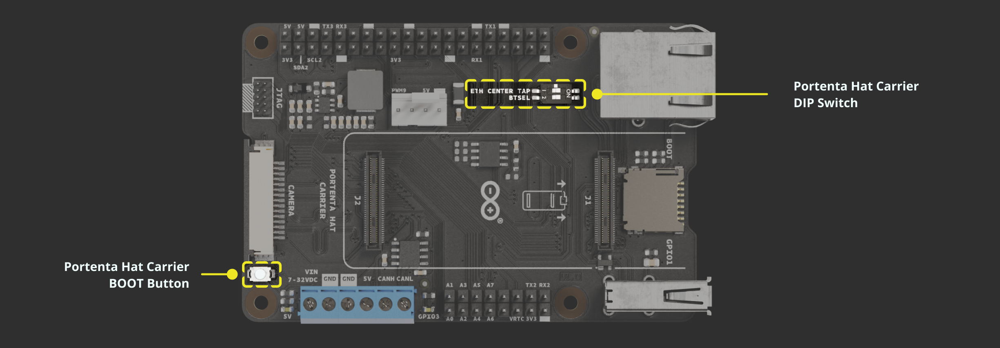
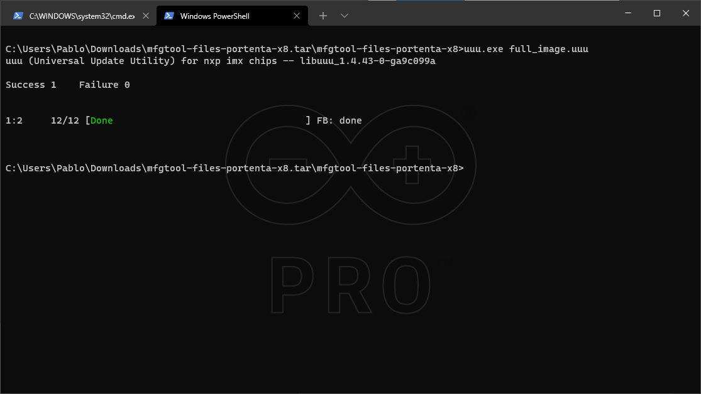

## Overview

In this tutorial, you will learn how to manually flash your Portenta X8 with the image provided by Arduino. You will flash your board through USB using the Terminal. The instructions below are meant to be used with a **Windows Operating System**.

## Goals

- Learn how to get the required files
- Learn how to set up the correct structure of the files
- Learn how to set up the board
- Learn how to flash the device

### Required Hardware and Software

- [Arduino Portenta X8](https://store.arduino.cc/products/portenta-x8)
- USB-C® cable (either USB-C® to USB-A or USB-C® to USB-C®)
- Portenta Family Carrier (Optional):
- [Arduino Portenta Breakout Board](https://store.arduino.cc/products/arduino-portenta-breakout)
- [Arduino Portenta Max Carrier](https://store.arduino.cc/products/portenta-max-carrier)
- [Arduino Portenta Hat Carrier](https://store.arduino.cc/products/portenta-hat-carrier)

## Instructions

### Arduino's Download Repository

Go to [Arduino Download repository](https://downloads.arduino.cc/portentax8image/image-latest.tar.gz), and a compressed `.tar.gz` with the latest version of all the required OS image files will be there to download.


Please extract the files after you have downloaded the compressed file. The extracted contents have the following structure.

```
Unzipped folder
├── imx-boot-portenta-x8
├── lmp-partner-arduino-image-portenta-x8.wic.gz **(Compressed)**
├── mfgtool-files-portenta-x8.tar.gz **(Compressed)**
├── sit-portenta-x8.bin
└── u-boot-portenta-x8.itb
```

After verifying these files are available, you will need to decompress `mfgtool-files-portenta-x8.tar.gz` and `lmp-partner-arduino-image-portenta-x8.wic.gz`. Please ensure the `.wic` is in the unzipped folder in the main directory. The folder structure should share a similar following layout.

```
Unzipped folder
├── mfgtool-files-portenta-x8/
├── imx-boot-portenta-x8
├── lmp-partner-arduino-image-portenta-x8.wic
├── lmp-partner-arduino-image-portenta-x8.wic.gz **(Compressed)**
├── mfgtool-files-portenta-x8.tar.gz **(Compressed)**
├── sit-portenta-x8.bin
└── u-boot-portenta-x8.itb
```

### Setting the Portenta X8 to Flashing Mode

#### Flashing Mode with Carrier

Connect your Portenta X8 to your carrier of choice, either *Portenta Breakout*, *Portenta Max Carrier*, or *Hat Carrier*, via High-Density connectors. After connecting the Portenta X8, you must set the `BOOT` or `BTSEL` DIP switches to the ON position. The `BOOT/BTSEL` switch configuration is crucial as it will put the board into Flashing mode.

For the **Portenta Max Carrier**, set the `BOOT SEL` and `BOOT` DIP switches to the ON position as depicted in the figure:



For the **Portenta Breakout**, the `BT_SEL` and `BOOT` DIP switches should be set to the ON position, as illustrated in the figure:


For the **Portenta Hat Carrier**, the `BTSEL` DIP switch must be set to the ON position, as depicted in the figure below:



The `ETH CENTER TAP` DIP switch position does not affect the flashing mode state for the Portenta Hat Carrier.

You must connect one USB-C® end to the Portenta X8 and the other (USB-C® or USB-A) to your computer. With this, the Portenta X8 is ready to begin the flashing process.

#### Flashing Mode without Carrier

***It is recommended to flash the board with the carrier. If it is not possible, we provide an alternative procedure for advanced users only implying the full flash memory erasing. If something goes wrong during the procedure, you might not be able to recover the board. Proceed with caution.***

If *Portenta Breakout* or *Portenta Max Carrier* is unavailable, the Portenta X8 can be configured for programming mode using a few command lines inside the Portenta X8's terminal via ADB. Please use the following commands in exact sequence while in the root environment with root permission.

```bash
echo 0 > /sys/block/mmcblk2boot0/force_ro
```

```bash
dd if=/dev/zero of=/dev/mmcblk2boot0 bs=1024 count=4096 && sync
```

```bash
echo 0 > /sys/block/mmcblk2boot1/force_ro
```

```bash
dd if=/dev/zero of=/dev/mmcblk2boot1 bs=1024 count=4096 && sync
```

This sequence of commands will allow you to reset Portenta X8's bootloader sector, defaulting the internal bootloader to `uuu` mode.

### Flashing the Portenta X8

To flash the Portenta X8, you need to begin by opening a terminal. Within the terminal, you need to change the directory to where the `mfgtool-files-portenta-x8` file is located using the `cd` command. Once it is inside the directory where the previous file is included, the following command is used:

```bash
uuu full_image.uuu
```

If you have followed the __Flashing Mode without Carrier__ method to flash an OS or a custom image, the `uuu` command should be active and seeking the board. While the process is active, please unplug and reconnect the USB-C® cable powering the Portenta X8 to allow entering the programming mode of the boot sequence. It should trigger the standing-by `uuu` task to run the flash process.

When the flashing operation is finished, you should see a similar result as the following figure:



Once you have verified it has successfully flashed the Portenta X8, the `BOOT` DIP switches configured to the ON position now need to be set to the OFF position. Otherwise, you will always have the Portenta X8 attached to a carrier in Flashing mode. Recycle the power for Portenta X8 by reconnecting the board to your computer. The board is now ready for use with the latest updates.

If the Portenta X8 was flashed barebone, you will need to recycle the power and be ready with the latest OS image.

***After booting, you will need to wait 10 seconds until the Portenta X8 starts blinking Blue LED. The Blue LED indicates it was able to boot successfully.***

## Conclusion

In this tutorial, you have learned to flash the Portenta X8 by getting the latest image, setting up the adequate file structure and the board, and finally flashing the board with these files.

## Troubleshooting

- If you get an error while it is flashing, make sure your USB is correctly plugged in. Reconnect your board and try to flash it again. You may need to go through a few trials before successful flashing.
- If you get an error related to permissions, try to launch the `uuu` command as Super User (`sudo`).
