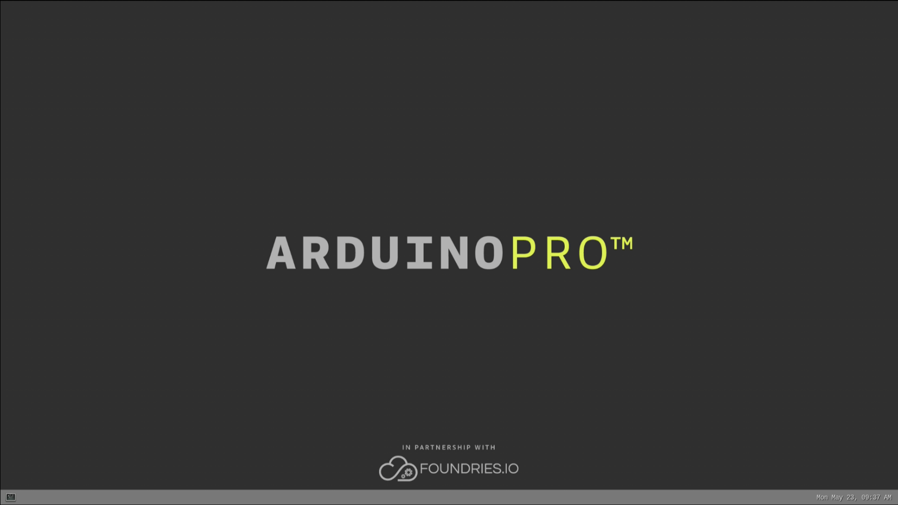
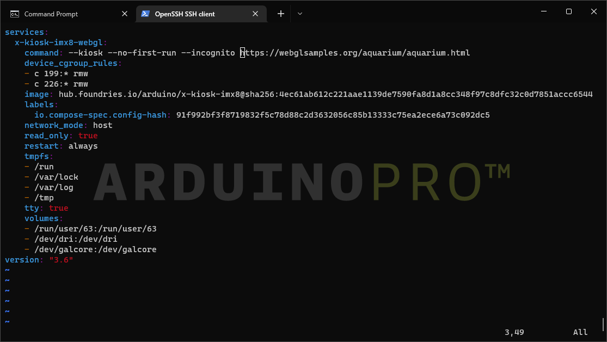

## Overview

The Arduino Portenta X8's processor **NXP® i.MX 8M Mini Processor** is capable of 3D rendering by using OpenGL to process the 3D-related calculations, allowing us to display 3D content on a screen or video output. 

In this tutorial, we will render web content from the internet using WebGL and display it on a screen, using a USB Hub. We will go through the steps to set up, install and modify the video output.

## Goals

- Learn how to setup the Video Output
- Learn how to get the required container
- Learn how to run the container
- Learn how to change the video output

### Required Hardware and Software

- [Arduino Portenta X8](https://store.arduino.cc/products/portenta-x8)
- USB-C® cable (either USB-C® to USB-A or USB-C® to USB-C®)
- USB-C® hub with HDMI
- External monitor
- HDMI cable

## Instructions

### Install The Container

There are two ways to get the container, either through `foundriesFactories` or downloading the container from [portenta-containers repository](https://github.com/arduino/portenta-containers).

**With Foundries.io:**

If you use [Foundries.io](https://www.foundries.io), you can switch the current `target` of your device to `x-kiosk-imx8-webgl` by switching the app from a terminal on your computer:

```bash
//Change the app to an existing one
fioctl devices config updates --apps "x-kiosk-imx8-webgl" <deviceName> -f <yourFactoryName>

//Make a clean installation with no containers
fioctl devices config updates --apps "," <deviceName> -f <yourFactoryName>

//If you are getting issues doing so, make sure you are logged correctly with your token
//You can logout:
fioctl logout

//Then log in again and follow the instructions
fioctl login
```

You will now see the home screen for a few seconds and then it will fade out and open the Aquarium 3D from [WebGL samples - Aquarium](https://webglsamples.org/aquarium/aquarium.html).

**With downloaded repository:**

If you downloaded the [portenta-containers repository](https://github.com/arduino/portenta-containers), you will need to connect your board directly to your computer and run the `adb shell`, then push the container to your Portenta X8.

### Connect to a Wi-Fi®

Check the available Wi-Fi® access points by using the `nmcli de wifi` command. You will be able to see an output laying out `BSSID`, `SSID`, and its other elements.

```bash
nmcli de wifi

//Output
IN-USE  BSSID              SSID             MODE   CHAN  RATE        SIGNAL  BARS  SECURITY
        AA:BB:CC:DD:EE:FF  <yourAP-SSID>    Infra  X     130 Mbit/s  --      *     WPA2
```

The Wi-Fi® details can be saved using the following commands in sequence:

```bash
nmcli c add type wifi con-name <customName> ifname wlan0 ssid <SSID>
nmcli con modify <customName> wifi-sec.key-mgmt wpa-psk
nmcli con modify <customName> wifi-sec.psk <PASSWORD>
nmcli con up <customName>

//To disconnect from a custom connection
nmcli con down <customName>

//To delete a saved connection
nmcli c delete <customName>
```

If the LED is illuminating Green, then we know it has been correctly connected. If you want to check it in your terminal, you can use the following commands:

```bash
nmcli de

//Output
DEVICE   TYPE      STATE                   CONNECTION
usb0     ethernet  connected               usbrndis
usb1     ethernet  connected               usbecm
wlan0    wifi      connected               <customName>
docker0  bridge    connected (externally)  docker0
```

The output table will display information regarding active connections as well as the Wi-Fi® connection in which we are interested.

### Get Your Board's IP

The IP information of the board can be obtained using `ifconfig wlan0` command. It will show different IP information composed of `inet`, `netmask`, and `broadcastIP`.

```bash
ifconfig wlan0

//Output
wlan0: flags=4163<UP,BROADCAST,RUNNING,MULTICAST>  mtu 1500
        inet <localIP>  netmask 255.255.255.0  broadcast <broadcastIP>
```

Test your IP connection by exiting the `adb shell`, you can use **CTRL+Z** or type `exit`, then try to connect through **SSH** using following command:

```bash
ssh fio@<localIP>
```

***To connect through SSH it will request the user's password, which is "fio". If you have trouble connecting with the SSH, please check the troubleshooting section at the end of this tutorial.***

### Copy/Push the Container

You can push the container from your computer using a terminal on the container's directory. The following command is used to send the container to the Portenta X8:

```bash
scp <folderName> fio@<portentaX8-IP>:<desiredPath>
```

### Video Output Setup

Now we need a USB Hub that has an available video output connector, for example, an HDMI cable. Connect the Portenta X8 to the USB Hub as a Host, the video connector to a display, and the power supply USB to your computer. It is optional but we could also connect a USB mouse to the hub. The setup should look like as follows:


***As a reference, a list of validated USB-C® to HDMI hubs that you can use are: [TPX00145](https://store.arduino.cc/products/usb-c-to-hdmi-multiport-adapter-with-ethernet-and-usb-hub) and [TPX00146](https://store.arduino.cc/products/usb-c-to-hdmi-multiport-adapter-4k-usb-hub-pd-pass-through).***

By default, if you connect the board to a display, you will see the "home screen" with the `Arduino PRO` background wallpaper, and a bottom bar with a real-time clock.

***You can interact with the interface by plugging USB devices into your hub, like a mouse or a keyboard.***



If you need to change the resolution of your display/monitor to improve the video output quality, you need to add a specific resolution to the configuration file of the graphical server (Weston on Portenta X8). To do so, you need to generate the right **Modeline**, i.e. a row that specifies a custom mode for the graphical interface to correctly drive the display. 

In the next steps, we provide an example of a 1600 x 758 display running at 60Hz. If you need to modify the modeline and generate a new one, you can use `cvt` command, which is already installed in the Linux image running on your Portenta X8 (see [here](https://wiki.ubuntu.com/X/Config/Resolution#Adding_undetected_resolutions) to get more information). 

To get started in modifying the resolution of your display, connect to your Portenta X8 through ADB (check [this link](https://docs.arduino.cc/tutorials/portenta-x8/user-manual#working-with-linux) to learn how to do it). 

At this point, you are ready to modify the `/etc/xdg/weston/weston.ini` file with `Vim` command as follows: 

```bash
sudo vim /etc/xdg/weston/weston.ini
```

You can now add the following lines to the `weston.ini` file: 

```bash
[output]
name=DP-1
mode=98.00  1600 1680 1840 2080  758 761 771 787 -hsync +vsync
```
Save the file and exit. To see the changes in place, you have to reboot your Portenta X8 by using the command `sudo systemctl reboot`. When the board gets started again, you will be able to see your display with the right resolution. 

### Running The Container

If you obtained the container from **Foundries.io**, it will run automatically after a few seconds.

On the other hand, if you copied from the repository, you will need to initialize with **docker** by accessing your Portenta X8 through SSH, going to the directory where you have copied it, and running it from that directory using following commands:

```bash
//Connect to your device
ssh fio@<portentaX8-IP>

//Change directory
cd <containerPath>

//Compose with docker
docker-compose up --detach

//Stop the docker-compose
docker-compose stop
```

### Edit The Output

It is possible to change the web output URL by editing the `docker-compose.yml` file, using the following commands:

```bash
//Connect to your device
ssh fio@<portentaX8-IP>

//Change directory
cd <containerPath>

//Edit the file with VIM
vim docker-compose.yml
```

Once you are inside the **VIM** editor, to edit the file you will need to press **insert** and replace the URL as shown in the screenshot.



To save the changes, press the **ESC** key and type `:wq`. This will write and quit the **VIM** editor. After editing the file, you will need to compose the container again to make the changes take effect.

## Conclusion

In this tutorial, we went through how to connect the board and display something on a screen. Using a container from FoundriesFactories or by downloading it and uploading it to your Portenta X8. Lastly, we showed how to edit the video output by editing the container.

### Next Steps

- Make your own HTML content, push it to your device, and output the desired content.
- You could make an app that shows information about the weather on the web and have that on a display.

## Troubleshooting

- If you tried to connect with `ssh` and you get a **fingerprint** issue, you will need to remove the IP and fingerprint on your `.ssh` file. On Windows, the file is located at `C:\Users\<yourUsername>\.ssh\known_hosts` and try again with the **ssh** connection. An example is as follows:

```bash
$portenta-x8: ssh-keygen -R <name or IP address of the host>
```
