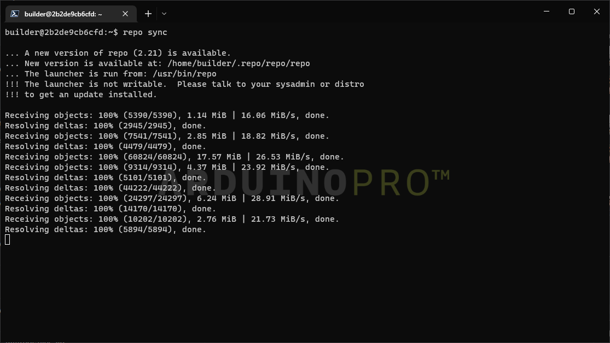
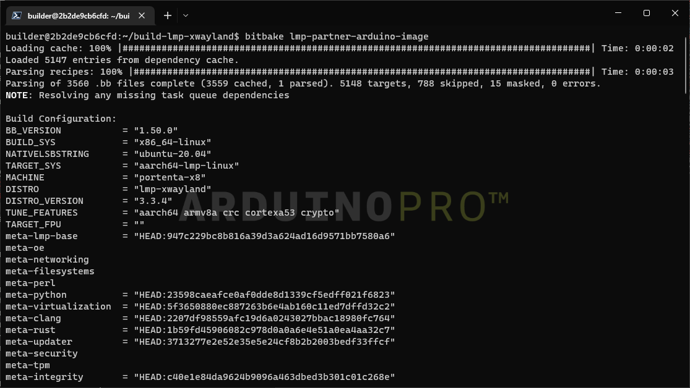
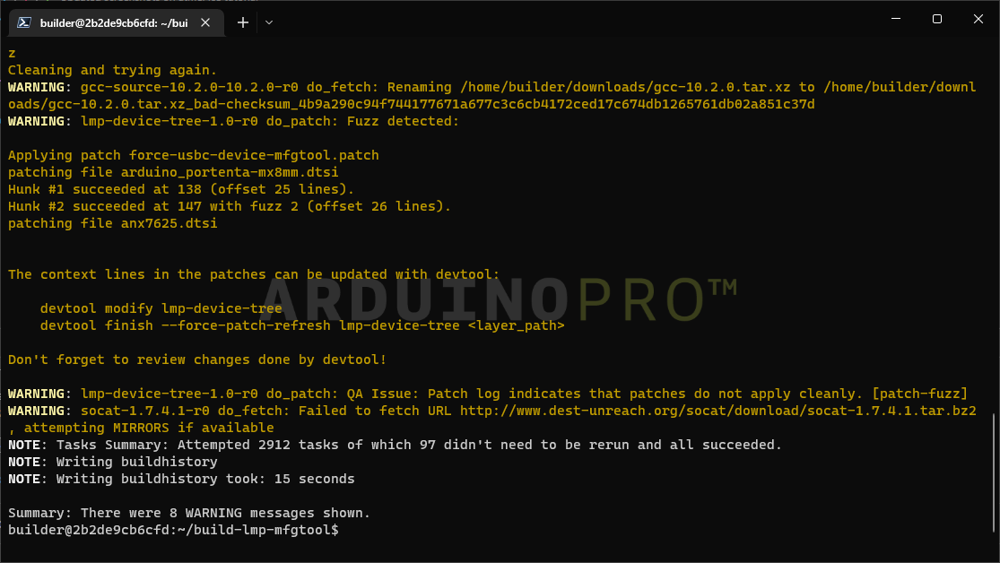

## Overview

In this tutorial you will learn how to build an image for the Portenta X8 with the source code provided at our GitHub repository lmp-manifest.
Building your image locally is helpful to quickly debug certain aspects of the systems, like bootloader or kernel support.

***Please keep in mind that images built locally cannot register to a FoundriesFactory and will not be OTA compatible, but this is a good alternative for those who do not have a FoundriesFactory subscription.  This tutorial targets the customers that are not FoundriesFactory subscribers and want to extend the functionality provided by the Arduino pre-built sources by building their own images. For FoundriesFactory subscribers, we strongly suggest to make use of the Factory continuous integration system for creating your images.***

## Goals
- Build a "builder" Docker image
- Get the required files
- Configure the building settings
- Build the image
- Save the needed files for flashing

### Required Hardware and Software

- [Docker Engine](https://docs.docker.com/engine/install/)

## Instructions

### Docker
#### Build the Docker Image

You will create an image with all the needed dependencies so it will be ready to build your image.

To do so you will need to clone our [lmp-manifest repository](https://github.com/arduino/lmp-manifest):
1. Clone the lmp-manifest repository
  ```
  git clone https://github.com/arduino/lmp-manifest.git
  ```
  
2. Build the Docker Image:
  ```
  cd lmp-manifest
  docker build -t yocto-build ./lmp-manifest
  ```
  

#### Run the Docker Image (builder)
You will be running the image with the `-v` argument to add a volume, this will make the second drive storage unit available inside the virtual machine, so we will be able to store all the data safely.

***If you do not use a volume while running the image, you will lose the data when the image stops***

Run the `yocto-build` builder image with:
```
docker run -v <source>:/dockerVolume -it yocto-build bash
```

Switch to the `builder` user, the password is **builder**:
```
su builder
```

### Setup and Build

***You can download a bash script that wraps all the upcoming steps [here](assets/portenta-x8_build.sh)***

#### Setup the environment
Now that you are running inside the Docker Image you are already provided with some tools like **git-repo** which has been installed on the image building process, this was the providing process on the previous section.

First of all set up the git config with your credentials, they don't need to be the real ones, they are just needed to pull the data from the git-repo.
Copy paste the following:
```
git config --global user.email "you@example.com"
git config --global user.name "Your Name"
```


You can change the directory to home, and initialize the **git-repo** repository:
```
cd ~
repo init -u https://github.com/arduino/lmp-manifest.git -m arduino.xml -b release
```


and pull the needed files:
```
sudo repo sync
```


After completion:


***NOTE: If you are a FoundriesFactory subscriber and want to build your Factory sources locally, please use the manifest link for your Factory as below. This is not recommended as images build locally cannot register to the Factory and receive OTAs.***

#### Set Up The Portenta X8 Distribution

You can set `DISTRO` to:
- `lmp-base`: insecure image without ostree, developer friendly, not OTA compatible
- `lmp`: secure image without xwayland
- `lmp-xwayland`: secure image with xwayland support

***`lmp-partner-arduino-image` will be better supported in the near future.***

```bash
DISTRO=lmp-xwayland MACHINE=portenta-x8 . setup-environment
```

It will then switch automatically to a new folder.
Now to accept the EULA:

```bash
echo "ACCEPT_FSL_EULA = \"1\"" >> conf/local.conf
```


#### Build Image With Bitbake

To start building the image, run:

```
bitbake lmp-partner-arduino-image
```
***This process takes ~7h depending on the HW***



In case you want to use your computer while it builds, (the build is going to take time and resources) you should lower the used threads.
Do so by opening `conf/local.conf` and lower the values of the following variables:

- `BB_NUMBER_PARSE_THREADS = "4"`
- `BB_NUMBER_THREADS = "4"`

And add:

- `PARALLEL_MAKE = "-j 4"`

Once it finishes you will see something similar to:


#### Setup Manufacturing Tools
To flash your board you will need to compile another `DISTRO`.
To get those tools go into the home folder and setup your distro.
```
cd ..
DISTRO=lmp-mfgtool MACHINE=portenta-x8 . setup-environment
echo "ACCEPT_FSL_EULA = \"1\"" >> conf/local.conf
echo "MFGTOOL_FLASH_IMAGE = \"lmp-partner-arduino-image\"" >> conf/local.conf
```


#### Build Manufacturing Tools: Flash The Board
To compile and get the tools you will need to type:
```
bitbake mfgtool-files
```


After completion:


***This process takes ~2h depending on the HW***

#### Save Your Image For Flashing

After the built was successful you need to save the needed files to your physical store unit, you have set that up before on `docker run` setting the volume pointing to the **dockerVolume** directory

Use the following commands to copy the files to your storage unit:

```
cd ..
mkdir ../../dockerVolume/flashing
DEPLOY_FOLDER=../../dockerVolume/flashing

cp -L build-lmp-mfgtool/deploy/images/portenta-x8/mfgtool-files-portenta-x8.tar.gz $DEPLOY_FOLDER
cp -L build-lmp-xwayland/deploy/images/portenta-x8/imx-boot-portenta-x8 $DEPLOY_FOLDER
cp -L build-lmp-xwayland/deploy/images/portenta-x8/u-boot-portenta-x8.itb $DEPLOY_FOLDER
cp -L build-lmp-xwayland/deploy/images/portenta-x8/sit-portenta-x8.bin $DEPLOY_FOLDER
cp -L build-lmp-xwayland/deploy/images/portenta-x8/lmp-partner-arduino-image-portenta-x8.wic $DEPLOY_FOLDER

cd $DEPLOY_FOLDER
tar xvf mfgtool-files-portenta-x8.tar.gz
```


You will be able to see the copied files on your OS file explorer


Now you have all the needed files to flash your Portenta X8 with your custom image, to do so follow the [How to flash the Portenta X8](image-flashing) tutorial.

## Conclusion

Now you have all the required files to flash the image you built onto the device.

Please follow the [Flashing tutorial](image-flashing) to flash your device with your custom image.
Keep in mind you will need to use the files provided from this build, not the ones mentioned in the Flashing tutorial.

## Troubleshooting

- If you are having `do_fetch` issues, try to check your system's and virtual machine's DNS settings.