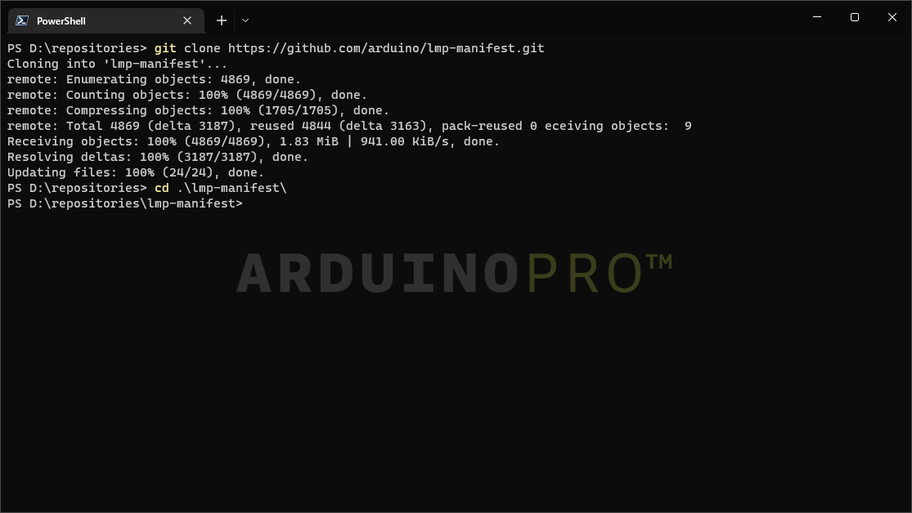
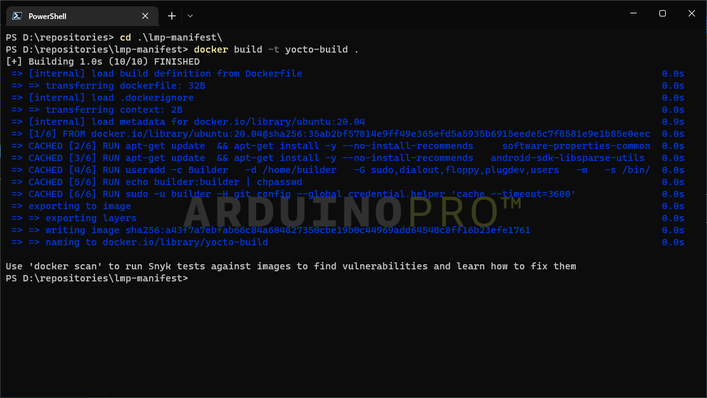
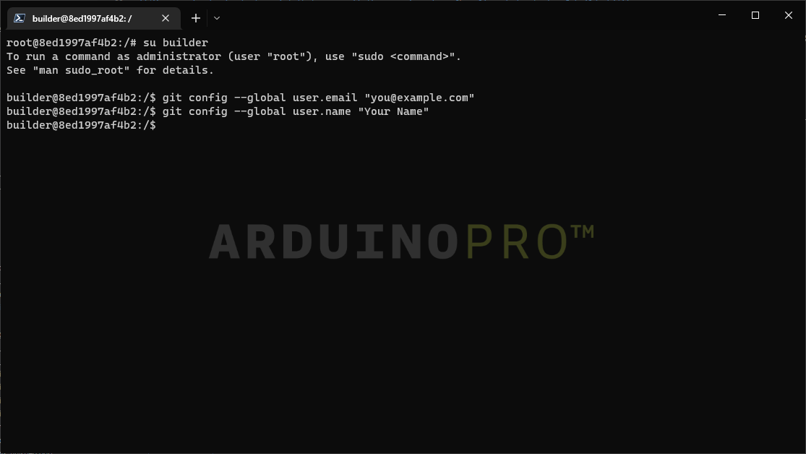

## Overview

In this tutorial you will learn how to build an image for the Portenta X8 with the source code provided at our [GitHub repository for lmp-manifest](https://github.com/arduino/lmp-manifest).
Building your image locally can help debug certain aspects of the system, such as the bootloader or kernel support.

***Keep in mind that images built locally cannot register with FoundriesFactory and will not be OTA compatible, but this is a good alternative for those who do not have a FoundriesFactory subscription.
This tutorial targets customers that are not FoundriesFactory subscribers, but still want to extend the functionality of the Arduino pre-built sources by building their own images. For FoundriesFactory subscribers, we strongly suggest making use of your Factory's continuous integration system for creating images.***

## Goals

- Build a "builder" Docker image
- Get the required files
- Configure the build settings
- Build the image
- Save the needed files for flashing

### Required Hardware and Software

- [Docker Engine](https://docs.docker.com/engine/install/)
- [Arduino Portenta X8](https://store.arduino.cc/products/portenta-x8)
- ~60GB available space on your machine's drive

## Instructions

### Docker

#### Build the Docker Image

You will create a Docker image that has the dependencies needed to build your device image.

To do so you will need to clone our [lmp-manifest repository](https://github.com/arduino/lmp-manifest), follow these steps to do so:

First, clone the lmp-manifest repository with this command:
  ```
  git clone https://github.com/arduino/lmp-manifest.git
  ```
  

Then build the Docker Image using:
  ```
  cd lmp-manifest
  docker build -t yocto-build ./lmp-manifest
  ```
  

#### Run The Docker Image (Builder)

Run the image with the `-v` argument to mount a volume. This allows you to use a host directory inside the Docker image, so you can store all the data and build artifacts safely.

***If you do not use a volume while running the image, you will lose the data when the image stops***

Run the `yocto-build` builder image with:
```
docker run -v <source>:/dockerVolume -it yocto-build bash
```

Switch to the `builder` user with the following command, the password is **builder**:
```
su builder
```

### Setup and Build

***You can download a [bash script](assets/portenta-x8_build.sh) that wraps all the upcoming steps.***

#### Setup the Environment

Now that you are running inside the Docker Image, you can use tools like **git-repo**, which is already installed.

First configure git with your credentials. They don't need to be the real ones, but are required by `git-repo` to pull.
Copy and paste the following:
```
git config --global user.email "you@example.com"
git config --global user.name "Your Name"
```


Change to the home directory, and initialize the repository using **repo**:
```
cd ~
repo init -u https://github.com/arduino/lmp-manifest.git -m arduino.xml -b release
```


Then pull the needed files with:
```
repo sync
```


After completion it should look like the following image:


***NOTE: If you are a FoundriesFactory subscriber and want to build your Factory sources locally, please use the manifest link for your Factory as below. This is not recommended as images built locally cannot register to the Factory and receive OTAs.***

#### Set Up The Portenta X8 Distribution

You can set `DISTRO` to:
- `lmp-base`: insecure image without ostree, developer friendly, not OTA compatible
- `lmp`: secure image without xwayland
- `lmp-xwayland`: secure image with xwayland support

***`lmp-partner-arduino-image` will be better supported in the near future.***

```bash
DISTRO=lmp-xwayland MACHINE=portenta-x8 . setup-environment
```

It will then switch automatically to a new folder. Now to accept the EULA with:

```bash
echo "ACCEPT_FSL_EULA = \"1\"" >> conf/local.conf
```


#### Build Image With Bitbake

To start building the image, run:

```
bitbake lmp-partner-arduino-image
```
***This process takes ~7h depending on the HW***


In case you want to use your computer while it builds, (which is going to take time and resources) you should lower the threads used.
Do so by opening `conf/local.conf` and lower the values of the following variables:

- `BB_NUMBER_PARSE_THREADS = "4"`
- `BB_NUMBER_THREADS = "4"`

And add:

- `PARALLEL_MAKE = "-j 4"`

Once it finishes you will see something similar to:


#### Setup Manufacturing Tools

To flash your board you will need to compile **lmp-mfgtool distro** to get additional tools. First go into your home folder and change `DISTRO`:
```
cd ..
DISTRO=lmp-mfgtool MACHINE=portenta-x8 . setup-environment
echo "ACCEPT_FSL_EULA = \"1\"" >> conf/local.conf
echo "MFGTOOL_FLASH_IMAGE = \"lmp-partner-arduino-image\"" >> conf/local.conf
```


#### Build Manufacturing Tools: Flash The Board

To compile and get the tools you will need to type:
```
bitbake mfgtool-files
```


After completion:


***This process takes ~2h depending on your build host***

#### Save Your Image For Flashing

After a successful build,  save the needed files to the host volume you mounted with `docker run`. Use the following commands to copy the files to your storage unit:

```
cd ..
mkdir ../../dockerVolume/flashing
DEPLOY_FOLDER=../../dockerVolume/flashing

cp -L build-lmp-mfgtool/deploy/images/portenta-x8/mfgtool-files-portenta-x8.tar.gz $DEPLOY_FOLDER
cp -L build-lmp-xwayland/deploy/images/portenta-x8/imx-boot-portenta-x8 $DEPLOY_FOLDER
cp -L build-lmp-xwayland/deploy/images/portenta-x8/u-boot-portenta-x8.itb $DEPLOY_FOLDER
cp -L build-lmp-xwayland/deploy/images/portenta-x8/sit-portenta-x8.bin $DEPLOY_FOLDER
cp -L build-lmp-xwayland/deploy/images/portenta-x8/lmp-partner-arduino-image-portenta-x8.wic $DEPLOY_FOLDER

cd $DEPLOY_FOLDER
tar xvf mfgtool-files-portenta-x8.tar.gz
```


You will be able to see the copied files in your OS file explorer.


## Conclusion

Now you have all the required files to flash the image you built onto the device.

Please follow the [Flashing tutorial](image-flashing) to flash your device with your custom image.
Keep in mind you will need to use the files provided from this build, not the ones mentioned in the Flashing tutorial.

## Troubleshooting

- If you are having `do_fetch` issues, try to check your system's and virtual machine's DNS settings.