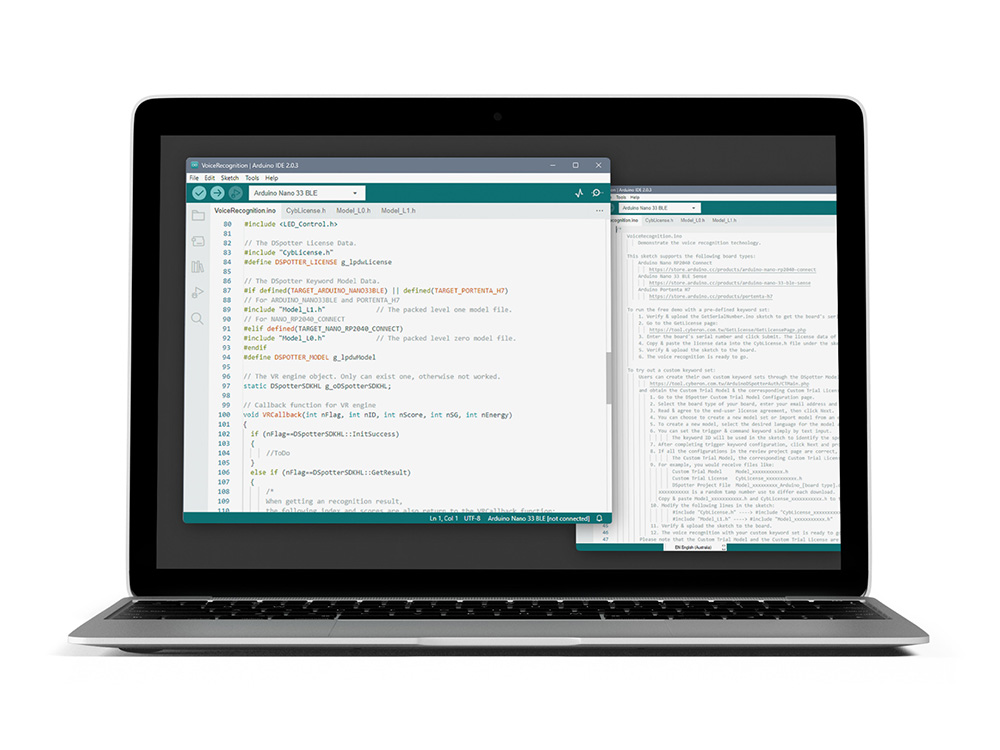
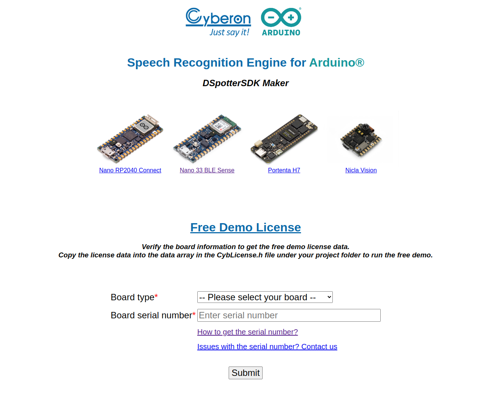
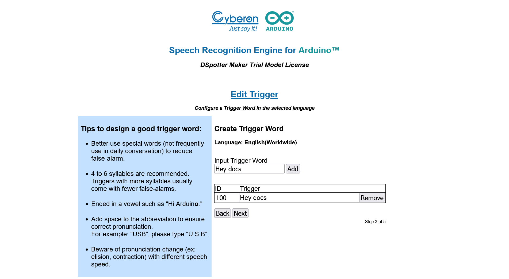
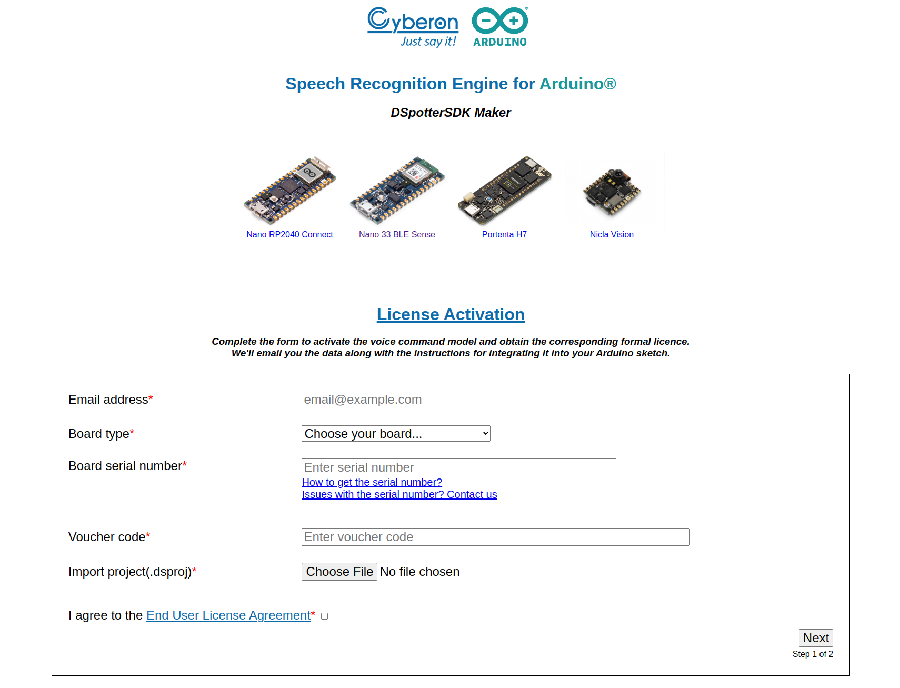
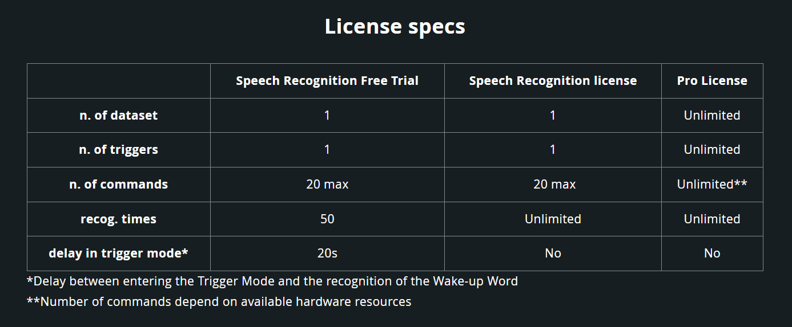

## What Is Speech Recognition

Speech recognition is a technology field that captures, interprets, and computes a voice to transform it into text (TTS). Once the voice has been transformed into text, it can be applied to different applications, from speech dictation, to command-voice controllers, health monitoring, robotics and artificial intelligence or accessibility, among many others.

## The Arduino Speech Recognition Engine



The Arduino Speech Recognition Engine, which is powered by Cyberon, is one of the best platforms available on the market to perform speech recognition on embedded microcontrollers. The full compatibility with multiple Arduino boards and with the Arduino IDE makes it very flexible, efficient, and easy to use, both in hobby projects and in professional products.

The Arduino Speech Recognition Engine can be further customized based on the license type, check the [Licensing section](#licensing) of this tutorial to learn more.


## Overview
This tutorial shows how to use the Arduino Speech Recognition Engine to configure multiple voice commands and perform custom tasks based on the recognized commands. To do that, it is necessary to perform a series of steps to register your board and activate your trial and free-of-charge license. Afterward, you will test the demo sketch and learn how to create your own custom voice commands.

In case you are interested in unlocking the full potential of the tool, the tutorial will teach you how to acquire a paid license to unblock the free license limitations.

## Goals
- Set the voice command triggers
- Get your board serial number and the required files to set up the library
- Get the license and use the demo sketch
- Create a new project with your own custom voice commands
- Learn how to acquire and use a paid license in case you want to remove the free license limitations

### Required Hardware and Software

To use the Arduino Speech Recognition Engine, you will need one of the following boards:

- [Arduino Portenta H7 (any variant)](https://store.arduino.cc/portenta-h7) + Portenta Vision Shield ([LoRa](https://store.arduino.cc/products/arduino-portenta-vision-shield-lora%C2%AE) or [Ethernet](https://store.arduino.cc/products/arduino-portenta-vision-shield-ethernet))
- [Arduino Nicla Vision](https://store.arduino.cc/products/nicla-vision)
- [Arduino Nano 33 BLE Sense Rev 1](https://store.arduino.cc/products/arduino-nano-33-ble-sense)
- [Arduino Nano 33 BLE Sense Rev 2](https://store.arduino.cc/products/nano-33-ble-sense-rev2)
- [Arduino Nano RP2040](https://store.arduino.cc/products/arduino-nano-rp2040-connect)

In the case of the Portenta H7, remember that is always possible to add an external microphone as additional hardware, instead of using the Portenta Vision Shield.

Additionally, you will need the following hardware and software:
- 1x USB-C® cable (either USB-A to USB-C® or USB-C® to USB-C®)
- [Arduino IDE 2](https://www.arduino.cc/en/software), [Arduino Cloud](https://cloud.arduino.cc), or [Arduino-cli](https://arduino.github.io/arduino-cli)

## Instructions

The Arduino Speech Recognition Engine is a solution powered by Cyberon that requires a series of additional steps to unleash its potential. This tutorial will explain how to:

* Get the Serial Number of your Arduino device
* Install the library on your IDE
* Test the free demo sketch

In case you would like to extend the engine functionalities, you will have to purchase [a voucher on the Arduino Store](https://store.arduino.cc/speech-recognition-engine) and follow the next steps:
* Fill in the required information on Cyberon's website
* Get the required files and activate your license

### Setup
#### Setup the Library
There are three libraries, you will need to install one or another depending on which board you are using:
* **Portenta H7 Family**: Cyberon_DSpotterSDK_Maker_PortentaH7
* **Nicla Vision**: Cyberon_DSpotterSDK_Maker_NiclaVision
* **Nano 33 BLE Sense (Rev1 & Rev2)**: Cyberon_DSpotterSDK_Maker_33BLE
* **Nano RP2040**: Cyberon_DSpotterSDK_Maker_RP2040

***Inside each of the libraries and under the folder "extra", you will find additional documentation made by Cyberon. Check them out in case you need more information***

Go to the Library Manager, search for the library that you need for your board and install it.

In case you need more instructions about how to install libraries, read this [guide](https://docs.arduino.cc/software/ide-v2/tutorials/ide-v2-installing-a-library/).

#### Get The Serial Number

To use the Arduino Speech Recognition Engine, you will need a free trial license or paid license. In any of the cases, the serial number of the board that you are using is necessary to activate the license.

To get your board's serial number, and once you have the library downloaded, navigate to **File > Examples > Cyberon_DSpotterSDK > GetSerialNumber**.

Connect your board to the computer, upload the sketch to it and, once is done, open the **Serial Monitor** to see your device's Serial Number.

***On the Arduino IDE 1.6.x or previous versions, you can also find the serial number as follow: select the board's serial port and click on `tools > Get Board Info`, you will see the "SN" number, save it for later.***

#### Get the Demo License

Once you have the Serial number, open: https://tool.cyberon.com.tw/ArduinoDSpotterAuth/FDMain.php

* Select your board
* Fill in the "Board serial number" field
* Click the **Submit** button



Once everything is ready, click on the **submit** button to get your license, it will print an array of numbers for the license. **Save it in a safe place**, it will be used in the next step.

### Test the Free Demo Sketch

* Open the sketch **File > Example > Cyberon_DSpotterSDK > VoiceRecognition**
* Navigate to the `CybLicense.h` tab.
* Paste your license between the brackets, like in the following example:
  ```cpp
  #include <stdint.h>

  const uint32_t g_lpdwLicense[] = {
      0x00000000, 0x00000000, 0x00000000, 0x00000000, 0x00000000, 0x00000000, 0x00000000, 0x00000000,
      0x00000000, 0x00000000, 0x00000000, 0x00000000, 0x00000000, 0x00000000, 0x00000000, 0x00000000,
      0x00000000, 0x00000000, 0x00000000, 0x00000000, 0x00000000, 0x00000000, 0x00000000, 0x00000000,
      0x00000000, 0x00000000, 0x00000000, 0x00000000, 0x00000000, 0x00000000, 0x00000000, 0x00000000,
      0x00000000, 0x00000000, 0x00000000, 0x00000000, 0x00000000, 0x00000000, 0x00000000, 0x00000000,
      0x00000000, 0x00000000, 0x00000000, 0x00000000, 0x00000000, 0x00000000
      };
  ```

***Remember to replace the `g_lpdwLicense` values with your license ones.***

Now switch back to the `VoiceRecognition` tab and upload the sketch.

You can now open the Serial Monitor where you can see the available commands that the CyberonSDK recognizes.


Now it is time to test the engine. Feel free to say out loud the commands and see how it recognizes your voice!

Please note that the sketch and license that you are using are a "demo" version with the following limitations:
  * A maximum of 50 recognitions per each board start
  * A 20 seconds delay before each trigger recognition

### Customized Commands

To expand the features and human interaction of your projects, you can create your own voice commands with the Arduino Speech Recognition Engine. In this section, you will learn about how to use the [Cyberon Model Configuration](https://tool.cyberon.com.tw/ArduinoDSpotterAuth/CTMain.php) webpage to create a new project with custom voice commands.

***These steps are compatible with the trial license, used in this tutorial, and the paid license***

Go to [Cyberon Model Configuration](https://tool.cyberon.com.tw/ArduinoDSpotterAuth/CTMain.php) and fill in the required fields:
* E-mail address
* Board model
* Serial Number of your board
* EULA Agreement - Please, read it carefully


Click next, you will see a new page to:
* Create a new project
* Import an existing project

#### Create a New Project

***Warning: each project is bound to a single Arduino board with the declared Serial Number. If you would like to use the Arduino Speech Recognition Engine on another Arduino board, you need to create a new project from scratch and assign it to the new Serial Number.***

To create a new project first you need to select the desired language for the speech recognition. Once is set, click **Create**.


Now you need to configure the following steps to create a new trigger:

* Create the **Input Trigger word**, for example "Hey Arduino".
  The **Input Trigger word** will trigger the device to let the board know that you are going to say a command after that.

* Add the **Command** list.
  These commands will be used to do tasks on your sketch. For example, if you have a command which is `share`, later you will be able to get that command and proceed with some job inside the sketch easily.

* The next step is just to confirm that the data written is correct. Click on **Next** to finish.

On the next page you will see all the configurations already set. Check it out to confirm that everything is correct. In case something is wrong, click on **Back** to fix it.


Once everything is checked, click **Confirm** and you will get the model header file (`model.h`). This header is part of your new project and you need to copy it onto your sketch folder to use it. 

***Warning: when a project is created and confirmed, it cannot be further modified.***

You will now get some files in your e-mail inbox. Download them to your computer.

On the IDE, open the example **File > Examples > Cyberon_DSpotterSDK > VoiceRecognition** and click **File > Save As...** and type a name for your sketch.

Once it is saved, open your File Explorer, and navigate to your sketch path.

On your sketch directory, paste the files you have got in your e-mail inbox before:
* `CybLicense_<id>.h`
* `Model_<id>.h`

Now to implement the **Input Trigger Command** and the **Command List** open the sketch and change the following headers with the downloaded ones:

```arduino
...

#include "CybLicense.h" -> #include "CybLicense_<id>.h"

...

#include "Model_L1.h" -> #include "Model_<id>.h"

...

#include "Model_L0.h" -> #include "Model_<id>.h"

```

At this point, the project is set to be used. Upload the sketch and open the Serial Monitor. Now you can test your new **Input Trigger Word** and the **Command** list that you have created. Pronounce the new trigger words out loud, you will see the recognized words on the **Serial Monitor**.

#### Modify the Example Codes

If you want to execute custom actions with the **trigger** and **commands** you defined, you can do it inside the `VRCallback` function.

First you need to know your trigger and commands IDs. You can find them listed in your Serial Monitor, in this case are the following:

| **Keyword** | **ID** |
| :---------: | :----: |
| Hey Arduino |  100   |
|    read     | 10000  |
|   upload    | 10001  |
|    share    | 10002  |

Here is the `VRCallback` function modified so you can easily give functionality to the commands detection:

```arduino
// Callback function for VR engine
void VRCallback(int nFlag, int nID, int nScore, int nSG, int nEnergy)
{
  if (nFlag==DSpotterSDKHL::InitSuccess)
  {
      //ToDo
  }
  else if (nFlag==DSpotterSDKHL::GetResult)
  {
      /*
      When getting an recognition result,
      the following index and scores are also return to the VRCallback function:
          nID        The result command id
          nScore     nScore is used to evaluate how good or bad the result is.
                     The higher the score, the more similar the voice and the result command are.
          nSG        nSG is the gap between the voice and non-command (Silence/Garbage) models.
                     The higher the score, the less similar the voice and non-command (Silence/Garbage) models are.
          nEnergy    nEnergy is the voice energy level.
                     The higher the score, the louder the voice.
      */
      //ToDo
      switch(nID)
      {
          case 100:
            Serial.println("The Trigger was heard");
            // Add your own code here
            break;
          case 10000:
            Serial.println("The Command -read- was heard");
            // Add your own code here
            break;
          case 10001:
            Serial.println("The Command -upload- was heard");
            // Add your own code here
            break;
          case 10002:
            Serial.println("The Command -share- was heard");
            // Add your own code here
            break;
          default:
            break;
      }

  }
  else if (nFlag==DSpotterSDKHL::ChangeStage)
  {
      switch(nID)
      {
          case DSpotterSDKHL::TriggerStage:
            LED_RGB_Off();
            LED_BUILTIN_Off();
            break;
          case DSpotterSDKHL::CommandStage:
            LED_BUILTIN_On();
            break;
          default:
            break;
      }
  }
  else if (nFlag==DSpotterSDKHL::GetError)
  {
      if (nID == DSpotterSDKHL::LicenseFailed)
      {
          //Serial.print("DSpotter license failed! The serial number of your device is ");
          //Serial.println(DSpotterSDKHL::GetSerialNumber());
      }
      g_oDSpotterSDKHL.Release();
      while(1);//hang loop
  }
  else if (nFlag == DSpotterSDKHL::LostRecordFrame)
  {
      //ToDo
  }
}
```
We added a `switch...case` that evaluates the `nID` variable and compares it with the different IDs.
Inside each case add your custom code to be executed with the trigger or commands.

```arduino
...
      switch(nID)
      {
          case 100:
            Serial.println("The Trigger was heard");
            // Add your own code here
            break;
          case 10000:
            Serial.println("The Command -read- was heard");
            // Add your own code here
            break;
          case 10001:
            Serial.println("The Command -upload- was heard");
            // Add your own code here
            break;
          case 10002:
            Serial.println("The Command -share- was heard");
            // Add your own code here
            break;
          default:
            break;
      }
...

```


#### Unlock Limitations (License)

In case you want to further customize your model or add additional commands or trigger words, we have the right licenses for you:
- **Speech Recognition license.** Vouchers available on the [Arduino Store](https://store.arduino.cc/speech-recognition-engine).
- **Pro License.** Feel free to [contact us](https://www.arduino.cc/pro/contact-us/) to unlock all the limitations.

There are different licensing options to fit the needs of your project. Read more in the [Licensing section (Voucher codes)](#licensing). Note that you need to have an already existing project to use a paid license. Check the [previous section](#create-a-new-project) to know more.

Browse to [Cyberon's Licensed Project Configuration](https://tool.cyberon.com.tw/ArduinoDSpotterAuth/CFMain.php).

Fill in the required fields:
* E-mail address
* Board
* Serial Number of your board
* Voucher code
* Import project: the `.dsproj` file that you received in your e-mail inbox during the creation of the project.
* EULA Agreement - Please read it carefully



Click next, review your project options and press continue.

You will get a new e-mail with the new License and Model headers.

***Warning: in case you are using a Speech Recognition License (not Pro), please note that deployed models are not customizable. You can always purchase an additional voucher on [Arduino Store](https://store.arduino.cc/speech-recognition-engine) to generate a new model for the same hardware.***

Open the sketch you have duplicated in the [Create New Project](#create-a-new-project) section.

Repeat the replacement of `#include` files, with the latest ones (they have a different ID):
```cpp
...

#include "CybLicense_<id>.h" -> #include "CybLicense_<newId>.h"

...

#include "Model_<id>.h" -> #include "Model_<newId>.h"

...

#include "CybLicense_<id>.h" -> #include "CybLicense_<newId>.h"

```

Upload the sketch to your board, and you will have unlocked the limitations of the trial version.

### Licensing

Here you can know more about the different licenses and limitations of each device. Remember that the code that you get for your license is also called a **voucher code**.



#### Free Demo

* Compatible with the CDSpotterSDK library
* Number of SET: x1
* Number of TRIGGERS: x1
* Number of COMMANDS: 4
* Configure TRIGGER: Fixed (not configurable)
* Configure COMMANDS: Fixed (not configurable)
* Recognition times: Unlimited
* Delay in Trigger mode: no
* Hardware binding: no

#### Speech Recognition Free Trial

Once the number of recognition is reached the model will stop working and you will need to manually reboot the target.

* Compatible with the CDSpotterSDK library
* Number of SET: x1
* Number of TRIGGERS: x1
* Number of COMMANDS: 20 maximum
* Configure TRIGGER: Configurable
* Configure COMMANDS: Configurable
* Recognition times: x50
* Delay in Trigger mode: 20 seconds \[1\]
* Hardware binding: Yes

\[1\] Please note that the delay in Trigger mode means a 20 seconds delay between entering the trigger mode and the recognition of the wake-up word.

#### Speech Recognition License

* Compatible with the CDSpotterSDK library
* Number of SET: x1
* Number of TRIGGERS: x1
* Number of COMMANDS: 20 maximum
* Configure TRIGGER: Configurable
* Configure COMMANDS: Configurable
* Recognition times: Unlimited
* Delay in Trigger mode: No delay
* Hardware binding: Yes

#### PRO

* Compatible with the CDSpotterSDK PRO library
* Number of SET: Unlimited (depends on the hardware)
* Number of TRIGGERS: Unlimited (depends on the hardware)
* Number of COMMANDS: Unlimited (depends on the hardware)
* Configure TRIGGER: Configurable
* Configure COMMANDS: Configurable
* Recognition times: Unlimited
* Delay in Trigger mode: No delay
* Hardware binding: Yes

## Next Steps

After getting the demo sketch working, we encourage you to start implementing this on your own project to unleash the full potential of the Arduino Speech Recognition Engine.

In case you are looking for more information, you can check out Cyberon's documentation:
* Inside each of the libraries and under the folder "extra", you will find additional documentation made by Cyberon, as well as the `Readme.md` file that contains the requirements and the steps shown in this tutorial
* [Cyberon's youtube channel](https://youtube.com/playlist?list=PLTEknqO5GAbrzlKN3fP-rW0l7BntOuaK0) contains a series of step-by-step tutorials that can help you to know more about how to use the Arduino Speech Recognition Engine
* You can also consult [Cyberon's official Maker User Guide](https://tool.cyberon.com.tw/ArduinoDSpotterAuth/Document/Cyberon_DSpotterSDK_Maker_User_Guide_Arduino_Platform.pdf)

## Conclusion

In this tutorial, you have learned what is the Arduino Speech Recognition Engine, the different licenses and limitations, and how to acquire one. Once you have your license, you learned how to test it with the free demo sketch and how to create a project with your own custom voice triggers. Eventually, you learned how to upgrade a free already-made project to be used with a more advanced license.
