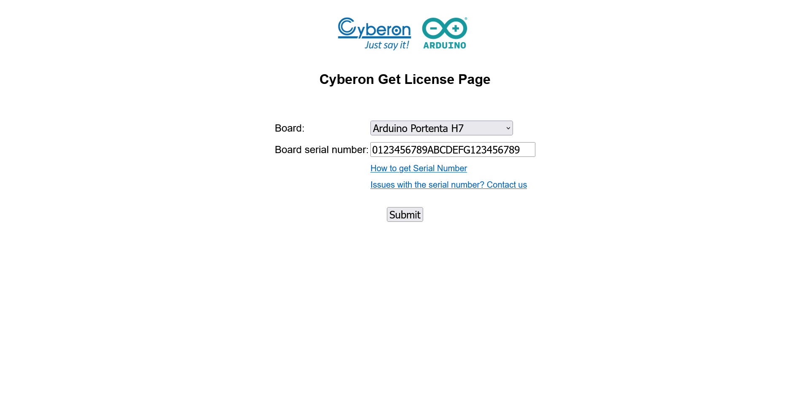
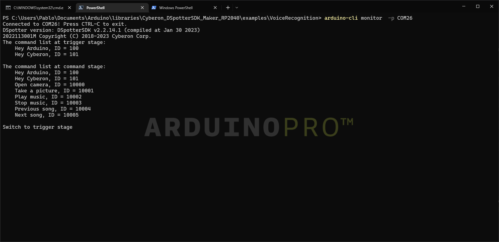
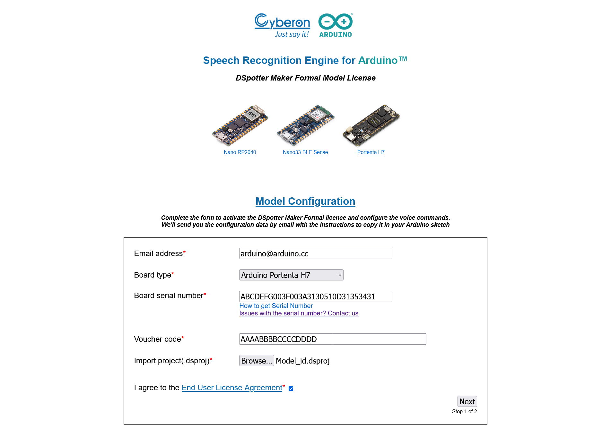

## What is Speech Recognition

Speech recognition is a technology field that captures, interprets, and computes a voice to transform it into text (TTS). Once the voice has been transformed into text, it can be applied to different applications, from speech dictation, to command-voice controllers, health monitoring, robotics and artificial intelligence or accessibility, among many others.

## The Arduino Speech Recognition Engine

The Arduino Speech Recognition Engine, which is powered by Cyberon, is one of the most advanced, efficient and flexible platforms available on the market to perform speech recognition on embedded microcontrollers. Being the perfect solution for professional products and hobby projects.

The Arduino Speech Recognition Engine is compatible with the following products:
* Arduino Portenta H7 + Portenta Vision Shield (or any external microphone connected to the Portenta)
* Arduino Nano 33 BLE
* Arduino Nano RP2040

## Overview
This tutorial shows how to use the Arduino Speech Recognition Engine to receive multiple voice commands and perform custom tasks after receiving each of them. To do that, it is necessary to perform a series of steps to register your board and activate your trial and free-of-charge license. Once we have done that you will test the demo sketch and learn how to create your own custom voice commands.

In case you are interested in unlocking the full potential of the tool, the tutorial will teach you how to acquire a paid license to unblock the free license limitations.

## Goals
- Set the voice command triggers
- Get your board serial number, needed files and set up the library
- Get the license and use the demo sketch
- Create a new project with your own custom voice commands
- Learn how to acquire and use a paid license only in case you want to remove the free license limitations

### Required Hardware and Software

To use the Arduino Speech Recognition Engine, you will need to use one of the following boards:

- [Arduino Portenta H7](https://store.arduino.cc/portenta-h7) + Portenta Vision Shield ([LoRa](https://store.arduino.cc/portenta-vision-shield-lora) or [Ethernet](https://store.arduino.cc/portenta-vision-shield))
- [Arduino Nano 33 BLE](https://store.arduino.cc/products/arduino-nano-33-ble)
- [Arduino Nano RP2040](https://store.arduino.cc/products/arduino-nano-rp2040-connect)

In the case of the Portenta H7, remember that is always possible to add an external microphone, using additional hardware, instead of using the Portenta Vision Shield.

Additionally, you will need the following hardware and software:
- 1x USB-C® cable (either USB-A to USB-C® or USB-C® to USB-C®)
- [Arduino IDE 2.0](https://www.arduino.cc/en/software), [Arduino IoT Cloud](https://cloud.arduino.cc), or [Arduino-cli](https://arduino.github.io/arduino-cli)

## Instructions

The Arduino Speech Recognition Engine is a solution powered by Cyberon that requires a series of additional steps to unleash its potential. This tutorial will explain how to:

* Get the Serial Number of your Arduino device
* Install the library on your IDE
* Test the free demo sketch

In case you have a paid license and you want to unlock the full potential of the engine:
* Fill in some information on Cyberon's website
* Once you get the files, you need to activate your license

### Setup
#### Setup the Library
There are three libraries, you will need to install one or another depending on which board you are using:
* Portenta H7: Cyberon_DSpotterSDK_Maker_PortentaH7
* Nano 33 BLE: Cyberon_DSpotterSDK_Maker_33BLE
* Nano RP2040: Cyberon_DSpotterSDK_Maker_RP2040

***Inside each of the libraries and under the folder "extra", you will find additional documentation made by Cyberon. Check them out in case you need more information***

Go to the Library Manager, search for the library that you need for your board and install it.

In case you need more instructions about how to install libraries, visit: https://docs.arduino.cc/hacking/software/Libraries

***From now on we will refer to the DSpotter SDK library as Cyberon_DSpotterSDK library, to skip the specific board***
TODO not sure about this

#### Get The Serial Number

To use the Arduino Speech Recognition Engine, you will need a free trial license or paid license. In any of the cases, the serial number of the board that you are using is necessary to activate the license.

To get your board's serial number, and once you have the library downloaded, navigate to **File > Examples > Cyberon_DSpotterSDK > GetSerialNumber**.

Connect your board to the computer, upload the sketch to it and, once is done, open the **Serial Monitor** to see your device's Serial Number.

***On the Arduino IDE 1.6.x There is another way only available through the previous version of the Arduino IDE: select the board's serial port and click on `tools > Get Board Info`, you will see the "SN" number, save it.***

#### Get the Demo License

Once you have the Serial number, open: https://tool.cyberon.com.tw/GetLicense/GetLicensePage.php

* Select your board
* Fill in the "Board serial number" field
* Click the **Submit** button



Once everything is ready, click on the **submit** button to get your license, it will print an array of numbers for the license. **Save them on a safe place**, they will be used in the next step.

### Test the Free Demo Sketch

* Open the sketch **File > Example > Cyberon_DSpotterSDK > VoiceRecognition**
* Navigate to the `CybLicense.h` tab.
* Paste your license between the brackets, like:
  ```cpp
  #include <stdint.h>

  const uint32_t g_lpdwLicense[] = {
      0x00000000, 0x00000000, 0x00000000, 0x00000000, 0x00000000, 0x00000000, 0x00000000, 0x00000000,
      0x00000000, 0x00000000, 0x00000000, 0x00000000, 0x00000000, 0x00000000, 0x00000000, 0x00000000,
      0x00000000, 0x00000000, 0x00000000, 0x00000000, 0x00000000, 0x00000000, 0x00000000, 0x00000000,
      0x00000000, 0x00000000, 0x00000000, 0x00000000, 0x00000000, 0x00000000, 0x00000000, 0x00000000,
      0x00000000, 0x00000000, 0x00000000, 0x00000000, 0x00000000, 0x00000000, 0x00000000, 0x00000000,
      0x00000000, 0x00000000, 0x00000000, 0x00000000, 0x00000000, 0x00000000
      };
  ```

Now switch back to the `VoiceRecognition` tab and upload the sketch.

You can now open the Serial Monitor, you will see the available commands that the CyberonSDK recognizes.



Feel free to say the commands and see how it recognizes your voice!

Please note that the files you have are a "demo" version has limitations which are:
  * Maximum of 50 recognitions per start.
  * 20 seconds delay before each trigger recognition.

### Customized Commands

***This steps are compatible with the trial license (the one that we are showing) and the paid license***

Go to [Cyberon Model Configuration](https://tool.cyberon.com.tw/ArduinoDSpotterAuth/CTMain.php) and fill the required fields:
* e-mail address
* Board
* Serial Number of your board
* EULA Agreement (Please read it carefully)


Click next, you will see a new page to:
* Create a new project, or
* Import an existing project

#### Create a New Project

First, you need to select the desired language of the voice recognition, once is set, click **create**.


* Create the **Input Trigger word**, for example "Hey Arduino".
  The **Input Trigger word** will trigger the device, to let the board know that you are going to say a command after that.
  
* Add the **Command** list.
  These commands will be used to do tasks on your sketch for example if you have a command which is "Play", later you will be able to get that command and proceed with some job inside the sketch easily.
  
* The next step is to confirm the data that we have written, you can click **Next** to finish.

At the end you will see all the configurations that you have set, check it out and see if there is something wrong, you are on time to go back and fix it.


Once everything is checked, click **Confirm** and you will get the model header file (`model.h`), you will need to copy it onto your sketch folder to access it.

You will now get some files on your e-mail address, download them.

On the IDE, open the example **File > Examples > Cyberon_DSpotterSDK > VoiceRecognition** and click **File > Save As...** and type a name for your sketch.

Once it's saved, open your File Explorer, and navigate to your sketch path.

On your sketch directory, paste the files you have got in your e-mail before:
* `CybLicense_<id>.h`
* `Model_<id>.h`

Now to implement the **Input Trigger Command** and the **Command List** open the sketch and change the following `#include`

```cpp
...

#include "CybLicense.h" -> #include "CybLicense_<id>.h"

...

#include "Model_L1.h" -> #include "Model_<id>.h"

...

#include "Model_L0.h" -> #include "CybLicense_<id>.h"

```

Now you are all set to use your new project!

Upload the sketch, and open the Serial Monitor.

Test your new **Input Trigger Word** and the **Command** list that you have created.

You will see the recognized words on the **Serial Monitor**

#### Unlock Limitations (License)

***For this section, you need to have bought the corresponding license, available at https://store.arduino.cc/speech-recognition-engine***
***Depending on the license you can configure more than one trigger words. Read more in the [Licensing section (Voucher codes)](#licensing)***

Note that you need to have an already existing project, check the [previous section](#create-a-new-project).

Browse to [Cyberon's Licensed Project Configuration](https://tool.cyberon.com.tw/ArduinoDSpotterAuth/CFMain.php)

Fill the required fields:
* e-mail address
* Board
* Serial Number of your board
* Voucher code
* Import project: the `.dsproj` file that you have received on your e-mail
* EULA Agreement (Please read it carefully)



Click next, review your project options and press continue.

You will get a new e-mail with the new License and Model headers.

Open the sketch you have duplicated in the [Create New Project](#create-a-new-project) section.

Repeat the replacement of `#include` files, with the latest ones (they have a different ID):
```cpp
...

#include "CybLicense_<id>.h" -> #include "CybLicense_<newId>.h"

...

#include "Model_<id>.h" -> #include "Model_<newId>.h"

...

#include "CybLicense_<id>.h" -> #include "CybLicense_<newId>.h"

```

Upload the sketch to your board, and you will have unlocked all the limitations from the trial version.

## Conclusion

On this article, we have shown how to try the demo sketches of Cyberon DSpotter SDK and how to activate a license to unlock the limitations.

Also, you have tested the very base APIs from the DSpotter SDK, so you will be able to embed this on your project quickly.

### Licensing

To know more about the different licenses and limitations of each device.
The code that you get for your license is also called a **voucher code**.

#### MAKER Free Demo

* Compatible with the CDSpotterSDK library
* Number of SET: x1
* Number of TRIGGERS: x1
* Number of COMMANDS: 4
* Configure TRIGGER: Fixed (not configurable)
* Configure COMMANDS: Fixed (not configurable)
* Recognition times: Unlimited
* Delay in Trigger mode: no
* Hardware binding: no

#### MAKER Trial

Once the number of recognition is reached the model will stop working and you will need to manually reboot the target.

* Compatible with the CDSpotterSDK library
* Number of SET: x1
* Number of TRIGGERS: x1
* Number of COMMANDS: Unlimited (depends on the hardware)
* Configure TRIGGER: Configurable
* Configure COMMANDS: Configurable
* Recognition times: x50
* Delay in Trigger mode: 20 seconds
* Hardware binding: Yes

#### MAKER Formal


* Compatible with the CDSpotterSDK library
* Number of SET: x1
* Number of TRIGGERS: x1
* Number of COMMANDS: Unlimited (depends on the hardware)
* Configure TRIGGER: Configurable
* Configure COMMANDS: Configurable
* Recognition times: Unlimited
* Delay in Trigger mode: No delay
* Hardware binding: Yes

#### PRO

* Compatible with the CDSpotterSDK PRO library
* Number of SET: Unlimited (depends on the hardware)
* Number of TRIGGERS: Unlimited (depends on the hardware)
* Number of COMMANDS: Unlimited (depends on the hardware)
* Configure TRIGGER: Configurable
* Configure COMMANDS: Configurable
* Recognition times: Unlimited
* Delay in Trigger mode: No delay
* Hardware binding: Yes
* Customer-Support: Paid

## Next Steps

After getting the demo sketch working, we encourage you to start implementing this on your own project.

We recommend checking out Cyberon's documentation:
* The included within the downloaded library, inside the `extra` folder inside the library's path, as well as the `Readme.md` file that contains the requirements and the steps shown in this tutorial.
* The linked PDF on the e-mail received when getting the license: https://tool.cyberon.com.tw/ArduinoDSpotterAuth/Document/Cyberon_DSpotterSDK_Maker_User_Guide_Arduino_Platform.pdf