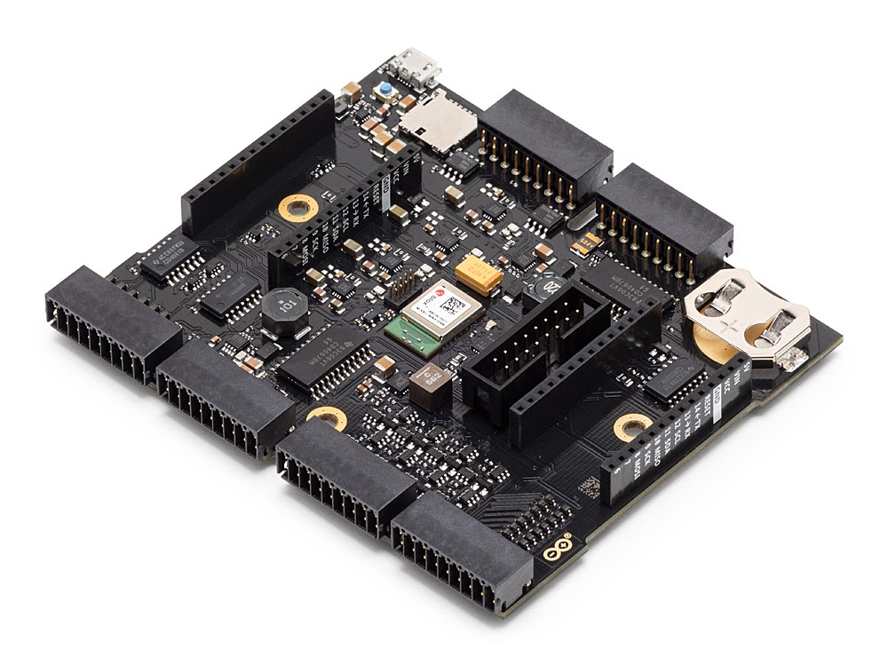
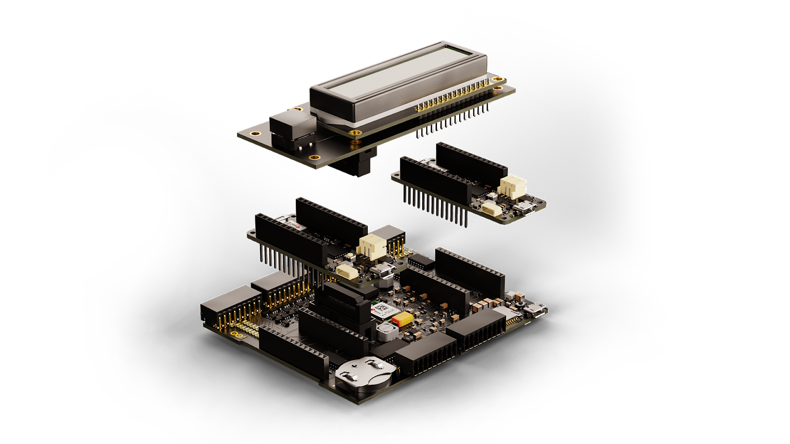
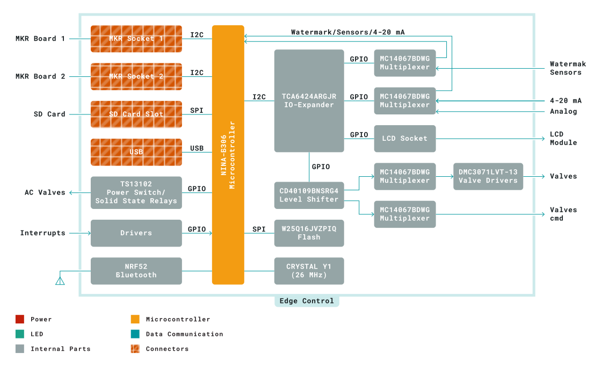
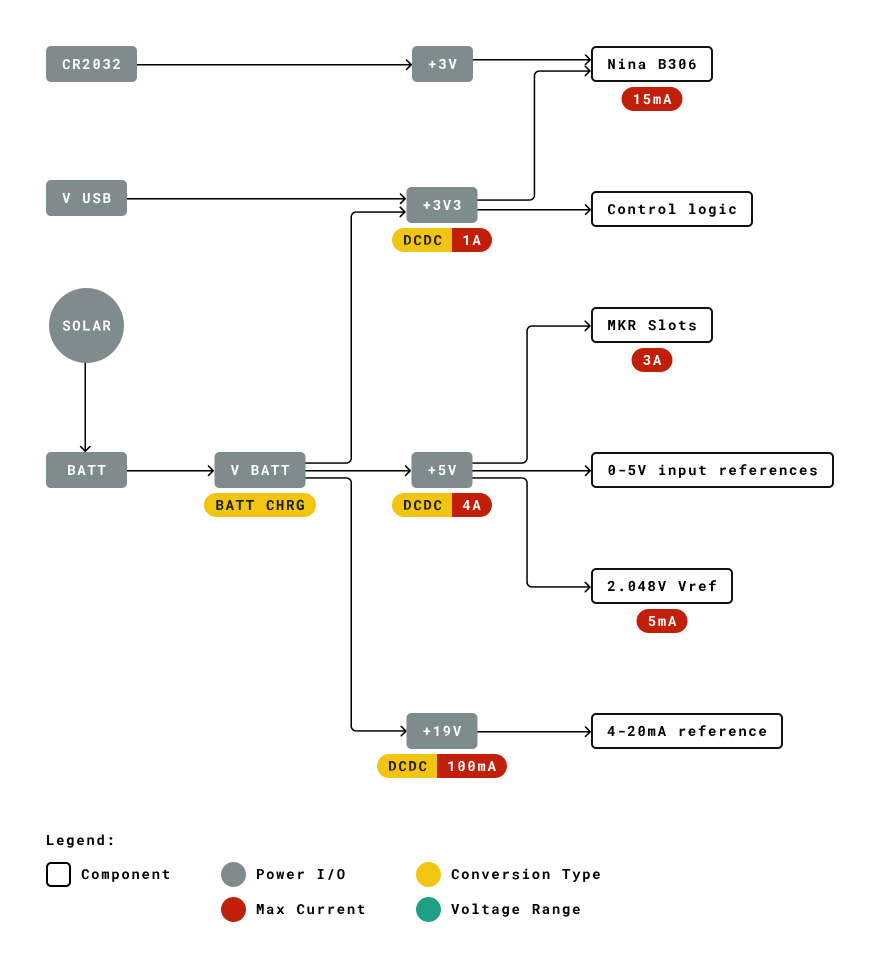
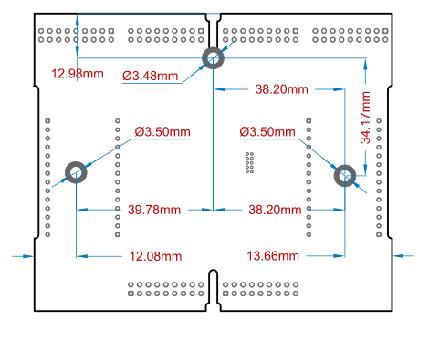
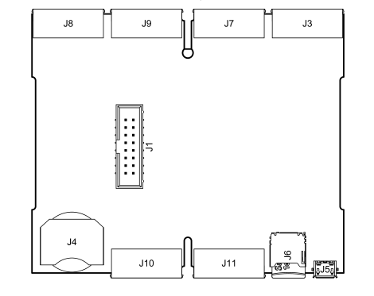

# Description 
The Arduino® Edge Control board is designed to address the needs of precision farming. It provides a low power control system, suitable for irrigation with modular connectivity.

The functionality of this board is expandable with Arduino® MKR Boards to provide additional connectivity. 

# Target areas:
Agriculture measurements, smart irrigation systems, hydroponics

<h2>Features</h2>
<table style="page-break-before: avoid;">
 <thead>
    <tr>
        <th width="25%" style="text-align: center">Component</th>
        <th colspan="3" style="text-align: center">Details</th>
    </tr>
 </thead>
 <tbody>
     <tr>
        <td rowspan="3" style="text-align: center">Nina B306 Module</td>
        <td width="15%" style="text-align: center">Processor</td>
        <td>
            
64 MHz Arm® Cortex®-M4F (with FPU)

            
1  MB Flash + 256 KB RAM

        </td>
    </tr>
    <tr>
        <td style="text-align: center">Wireless</td>
        <td>
            
Bluetooth®  (Bluetooth® Low Energy 5 via Cordio® stack, Bluetooth® Low Energy 4.2 via Arduino® Stack)

            
Advertising Extensions

            
95 dBm sensitivity

            
4.8 mA in TX (0 dBm)

            
4.6 mA in RX (1 Mbps)

        </td>
    </tr>
    <tr>
        <td style="text-align: center">Peripherals</td>
        <td>
            
Full-speed 12 Mbps USB

            
Arm® CryptoCell® CC310 security subsystem

            
QSPI/SPI/TWI/I²S/PDM/QDEC

            
High speed 32 MHz SPI

            
Quad SPI interface 32 MHz

            
12-bit 200 ksps ADC

            
128 bit AES/ECB/CCM/AAR co-processor

        </td>
    </tr>
    <tr> 
        <td style="text-align: center">Memory</td>
        <td colspan="2">
            
1 MB internal Flash memory

            
2MB onboard QSPI

            
SD Card slot

        </td>
    </tr>
    <tr>
        <td style="text-align: center">Power</td>
        <td colspan="2">
            
Low Power

            
200uA Sleep current

            
Can operate for up to 34 months on a 12V/5Ah battery 

            
12 V Acid/lead SLA Battery Supply (Recharged via solar panels)

            
RTC CR2032 Lithium Battery back up

       </td>
    </tr>
    <tr>
        <td style="text-align: center">Battery</td> 
        <td colspan="2">
            
LT3652 Solar Panel Battery Charger

            
Input Supply Voltage Regulation Loop for Peak Power Tracking in (MPPT) Solar applications

        </td>
    </tr>
    <tr>
        <td style="text-align: center">I/O</td>
        <td colspan="2">
            
6x edge sensitive wake up pins

            
16x hydrostatic watermark sensor input

            
8x 0-5V analog inputs

            
4x 4-20mA inputs

            
8x latching relay command outputs with drivers

            
8x latching relay command outputs without drivers

            
4x 60V/2.5A galvanically isolated solid state relays

            
6x 18 pin plug in terminal block connectors

        </td>
    </tr>
    <tr>
        <td style="text-align: center">RTC</td>
        <td colspan="2">Provides year, month, day and time based on a 32.768 kHz crystal. Alarm and timer functions are also included.</td>
    </tr>
    <tr>
        <td height="25px" style="text-align: center">Dual MKR Socket</td>
        <td colspan="2">
            
Individual power control 

            
Individual Serial Port

            
Individual I2C ports

       </td>
    </tr>
    <tr>
        <td height="25px" style="text-align: center">Safety information</td>
        <td colspan="2">Class A</td>
    </tr>
 </tbody>
</table>

# Contents

## The Board
### Application Examples
The Arduino® Edge Control is your gateway to Agriculture 4.0. Get real-time insight into the state of your process and increase crop yield. Improve business efficiency through automation and predictive farming. Tailor the Edge Control to your needs by using up two Arduino® MKR Boards and an assortment of compatible Shields. Maintain historical records, automate quality control, implement crop planning and more through the Arduino IoT Cloud from anywhere in the world.

**Automated Greenhouses:** In order to minimize carbon emissions and increase economic yield, it is important to ensure that the best environment is provided for the growth of crops in terms of humidity, temperature and other factors. The Arduino® Edge Control is an integrated platform that enables remote monitoring and real-times optimization to this end. Including an Arduino® MKR GPS Shield (SKU:ASX00017) allows for optimum crop rotation planning and acquisition of geospatial data.

**Hydroponics/Aquaponics:** Since hydroponics involves the growth of plants without soil, delicate care must be maintained to ensure they maintain the narrow window required for optimum growth. The Arduino Edge Control can ensure that this window is achieved with minimal manual labour. Aquaponics can provide even more benefits than conventional hydroponics towards which the Arduino® Edge Control can help match the even higher requirements by providing better control over the internal process while ultimately reducing production risks.

**Mushroom Cultivation:** Mushrooms are notorious for requiring the perfect temperature and humidity conditions to sustain spore growth while also preventing competing fungi from growing. Thanks to the numerous watermark sensors, output ports and connectivity options available on the Arduino® Edge Control as well as the Arduino® IoT Cloud, this precision farming can be achieved on an unprecedented level.

### Accessories
*   Irrometer Tensiometers
*   Watermark soil moisture sensors
*   Mechanized ball valves
*   Solar panel
*   12V/5Ah acid/lead SLA battery (11 - 13.3V)

### Related Products
*   LCD Display + Flat Cable + plastic enclosure  
*   1844646 Phoenix contacts (included with the product)
*   Arduino® MKR family boards (for expanding wireless connectivity)

### Solution Overview

**Example of a typical application for a solution including LCD Display and two Arduino® MKR 1300 boards.**

## Ratings
### Absolute Maximum Ratings

| Symbol               | Description                              | Min  | Typ | Max  | Unit |
| -------------------- | ---------------------------------------- | ---- | --- | ---- | ---- |
| TMax      | Maximum thermal limit                    | -40  | 20  | 85   | °C   |
| VBattMax  | Maximum input voltage from battery input | -0.3 | 12  | 17   | V    |
| VSolarMax | Maximum input voltage from solar panel   | -20  | 18  | 20   | V    |
| ARelayMax | Maximum current through relay switch     | -    | -   | 2.4  | A    |
| PMax      | Maximum Power Consumption                | -    | -   | 5000 | mW   |

### Recommended Operating Conditions

| Symbol            | Description                      | Min | Typ | Max | Unit |
| ----------------- | -------------------------------- | --- | --- | --- | ---- |
| T                 | Conservative thermal limits      | -15 | 20  | 60  | °C   |
| VBatt  | Input voltage from battery input | -   | 12  | -   | V    |
| VSolar | Input voltage from solar panel   | 16  | 18  | 20  | V    |

## Functional Overview

### Block Diagram

### Board Topology

#### Top Topology

| **Ref.**     | **Description**                | **Ref.**       | **Description**                                  |
| ------------ | ------------------------------ | -------------- | ------------------------------------------------ |
| U1           | LT3652HV battery charger IC    | J3,7,9,8,10,11 | 1844798 pluggable terminal blocks                |
| U2           | MP2322 3.3V buck converter IC  | LED1           | On board LED                                     |
| U3           | MP1542 19V boost converter IC  | PB1            | Reset pushbutton                                 |
| U4           | TPS54620 5V boost converter IC | J6             | Micro SD Card                                    |
| U5           | CD4081BNSR AND gate IC         | J4             | CR2032 battery holder                            |
| U6           | CD40106BNSR NOT gate IC        | J5             | Micro USB (NINA Module)                          |
| U12,U17      | MC14067BDWG multiplexer IC     | J3, J7-J11     | T1844798 Term Block HDR                          |
| U16          | CD40109BNSRG4 I/O Expander     | U10            | ADR360AUJZ-R2 Voltage reference series 2.048V IC |
| U18,19,20,21 | TS13102 solid state relay IC   | U12, U17       | MC14067BDWG IC Multiplexer switch                |
| U8           | TCA6424A IO expander IC        | U13            | AP2141 IC power SW USB                           |
| U9           | NINA-B306 Module               | U16            | CD40109BNSR voltage translator                   |
| Q1, Q2       | MOSFET P-CH 30V 20A 8SO        |                |                                                  |

#### Bot Topology

| **Ref.** | **Description**           | **Ref.** | **Description**                  |
| -------- | ------------------------- | -------- | -------------------------------- |
| U11      | W25Q16JVZPIQ Flash 16M IC | U22      | PCF8563 Real-time clock/calendar |
| U7       | CD4081BNSR AND gate IC    | U14, 15  | MC14067BDWG IC MUX               |

### Processor
The Main Processor is a Cortex M4F running at up to 64MHz.

### LCD Screen
The Arduino® Edge Control provides a dedicated connector (J1) for interfacing with a HD44780 16x2 LCD display module, sold separately. The main processor controls the LCD via a TCA6424 port expander over I2C. Data is transferred over a 4-bit interface. LCD backlight intensity is also adjustable by the main processor.

### 5V Analog Sensors
Up to eight 0-5V analog inputs can be connected to J4 for interfacing analog sensors such as tensiometers and dendrometers.  Inputs are protected by a 19V Zener diode. Each input is connected to an analog multiplexer that channels the signal to a single ADC port.

Each input is connected to an analog multiplexer (MC14067) that channels the signal to a single ADC port. The main processor controls the input selection via a TCA6424 port expander over I2C.

### 4-20mA Sensors
Up to four 4-20mA sensors can be connected to J4. A reference voltage of 19V is generated by the MP1542 step-up converter to power the current loop. The sensor value is read via a 220 ohm resistor. 
Each input is connected to an analog multiplexer (MC14067) that channels the signal to a single ADC port. The main processor controls the input selection via a TCA6424 port expander over I2C.

### Watermark Sensors
Up to sixteen hydrostatic watermark sensors can be connected to J8. Pins J8-17 and J8-18 are the common sensor pins for all the sensors, controlled directly by the microcontroller. Inputs and the common sensor pins are protected by a 19V Zener diode. 

Each input is connected to an analog multiplexer (MC14067) that channels the signal to a single ADC port. The main processor controls the input selection via a TCA6424 port expander over I2C. The board supports 2 precision modes.

### Latching Outputs
Connectors J9 and J10 provide outputs  to latching devices like motorized valves. The latching output consists of dual channels (P and N) through which an impulse or strobe can be sent in either of the 2 channels (to open a close valve for example). The duration of the strobes can be configured to adjust to the external device requirement. 

The board provides a total of 16 latching ports divided in 2 types:

*   Latching commands (J10): 8 ports for high impedance inputs ( max +/- 25 mA). Connect to external devices with third-party protection/power circuits. Referenced to VBAT.

*   Latching Out (J9): 8 ports. This outputs includes drivers for the latching device. No external drivers are needed. Referenced to VBAT.

### Solid State Relays
The board features four configurable 60V 2.5A solid state relays with galvanic isolation available in J11. Typical applications include HVAC, sprinkler control  etc.

### Storage
The board includes both a microSD card socket and an additional 2MB flash memory for data storage. Both are directly connected to the main processor via a SPI interface.

### Power Tree
The board can be powered via solar panels and/or SLA batteries.

## Board Operation
### Getting Started - IDE
If you want to program your Arduino® Edge Control while offline you need to install the Arduino® Desktop IDE **[1]** To connect the Arduino® Edge control to your computer, you’ll need a Micro-B USB cable. This also provides power to the board, as indicated by the LED.

### Getting Started - Arduino Web Editor
All Arduino® boards, including this one, work out-of-the-box on the Arduino® Web Editor **[2]**, by just installing a simple plugin. 

The Arduino® Web Editor is hosted online, therefore it will always be up-to-date with the latest features and support for all boards. Follow **[3]** to start coding on the browser and upload your sketches onto your board.

### Getting Started - Arduino IoT Cloud
All Arduino® IoT enabled products are supported on Arduino® IoT Cloud which allows you to Log, graph and analyze sensor data, trigger events, and automate your home or business.

### Sample Sketches
Sample sketches for the Arduino® Edge Control can be found either in the “Examples” menu in the Arduino® IDE or in the “Documentation” section of the Arduino® Pro website **[4]**

### Online Resources
Now that you have gone through the basics of what you can do with the board you can explore the endless possibilities it provides by checking exciting projects on ProjectHub **[5]**, the Arduino® Library Reference **[6]** and the online store **[7]** where you will be able to complement your board with sensors, actuators and more.

### Board Recovery
All Arduino® boards have a built-in bootloader which allows flashing the board via USB. In case a sketch locks up the processor and the board is not reachable anymore via USB it is possible to enter bootloader mode by double-tapping the reset button right after power up.

## Connector Pinouts
### J1 LCD Connector

| Pin        | **Function** | **Type** | **Description**                     |
| ---------- | ------------ | -------- | ----------------------------------- |
| 1          | PWM          | Power    | Backlight LED Cathode (PWM control) |
| 2          | Power On     | Digital  | Button input                        |
| 3          | +5V LCD      | Power    | LCD power supply                    |
| 4          | LCD RS       | Digital  | LCD RS signal                       |
| 5          | Contrast     | Analog   | LCD Contrast control                |
| 6          | LCD RW       | Digital  | LCD Read/Write signal               |
| 7          | LED+         | Power    | Backlight LED Anode                 |
| 8          | LCD EN       | Digital  | LCD Enable signal                   |
| 10         | LCD D4       | Digital  | LCD D4 signal                       |
| 12         | LCD D5       | Digital  | LCD D5 signal                       |
| 14         | LCD D6       | Digital  | LCD D6 signal                       |
| 16         | LCD D7       | Digital  | LCD D7 signal                       |
| 9,11,13,15 | GND          | Power    | Ground                              |

### J3 Wake up signals/External Relay Commands

| Pin           | **Function** | **Type** | **Description**                                    |
| ------------- | ------------ | -------- | -------------------------------------------------- |
| 1,3,5,7,9     | **V** BAT    | Power    | Gated voltage battery for wake up signal reference |
| 2,4,6,8,10,12 | Input        | Digital  | Edge sensitive wake up signals                     |
| 13            | Output       | Digital  | External solid state relay clock signal 1          |
| 14            | Output       | Digital  | External solid state relay clock signal 2          |
| 17            | Bidir        | Digital  | External solid state relay data signal 1           |
| 18            | Bidir        | Digital  | External solid state relay data signal 2           |
| 15,16         | GND          | Power    | Ground                                             |

### J5 USB

| Pin | **Function** | **Type**     | **Description**                                                                                                                                |
| --- | ------------ | ------------ | ---------------------------------------------------------------------------------------------------------------------------------------------- |
| 1   | VUSB         | Power        | Power Supply Input Note: A board powered only via V USB will not enable most of the features of the board. Check the power tree in Section 3.8 |
| 2   | D-           | Differential | USB differential data -                                                                                                                        |
| 3   | D+           | Differential | USB differential data +                                                                                                                        |
| 4   | ID           | NC           | Unused                                                                                                                                         |
| 5   | GND          | Power        | Ground                                                                                                                                         |

### J7 Analog/4-20mA

| Pin     | **Function** | **Type** | **Description**                     |
| ------- | ------------ | -------- | ----------------------------------- |
| 1,3,5,7 | +19V         | Power    | 4-20mA voltage reference            |
| 2       | IN1          | Analog   | 4-20mA input 1                      |
| 4       | IN2          | Analog   | 4-20mA input 2                      |
| 6       | IN3          | Analog   | 4-20mA input 3                      |
| 8       | IN4          | Analog   | 4-20mA input 4                      |
| 9       | GND          | Power    | Ground                              |
| 10      | +5V          | Power    | 5V output for 0-5V analog reference |
| 11      | A5           | Analog   | 0-5V input 5                        |
| 12      | A1           | Analog   | 0-5V input 1                        |
| 13      | A6           | Analog   | 0-5V input 6                        |
| 14      | A2           | Analog   | 0-5V input 2                        |
| 15      | A7           | Analog   | 0-5V input 7                        |
| 16      | A3           | Analog   | 0-5V input 3                        |
| 17      | A8           | Analog   | 0-5V input 8                        |
| 18      | A4           | Analog   | 0-5V input 4                        |

### J8 Watermark

| Pin   | **Function** | **Type** | **Description**       |
| ----- | ------------ | -------- | --------------------- |
| 1     | WaterMrk1    | Analog   | Watermark input 1     |
| 2     | WaterMrk2    | Analog   | Watermark input 2     |
| 3     | WaterMrk3    | Analog   | Watermark input 3     |
| 4     | WaterMrk4    | Analog   | Watermark input 4     |
| 5     | WaterMrk5    | Analog   | Watermark input 5     |
| 6     | WaterMrk6    | Analog   | Watermark input 6     |
| 7     | WaterMrk7    | Analog   | Watermark input 7     |
| 8     | WaterMrk8    | Analog   | Watermark input 8     |
| 9     | WaterMrk9    | Analog   | Watermark input 9     |
| 10    | WaterMrk10   | Analog   | Watermark input 10    |
| 11    | WaterMrk11   | Analog   | Watermark input 11    |
| 12    | WaterMrk12   | Analog   | Watermark input 12    |
| 13    | WaterMrk13   | Analog   | Watermark input 13    |
| 14    | WaterMrk14   | Analog   | Watermark input 14    |
| 15    | WaterMrk15   | Analog   | Watermark input 15    |
| 16    | WaterMrk16   | Analog   | Watermark input 16    |
| 17,18 | VCOMMON      | Digital  | Sensor common voltage |

### J9 Latching Out (+/- VBAT)

| Pin   | **Function** | **Type** | **Description**            |
| ----- | ------------ | -------- | -------------------------- |
| 1     | PULSE_OUT0_P | Digital  | Latching output 1 positive |
| 2     | PULSE_OUT0_N | Digital  | Latching output 1 negative |
| 3     | PULSE_OUT1_P | Digital  | Latching output 2 positive |
| 4     | PULSE_OUT1_N | Digital  | Latching output 2 negative |
| 5     | PULSE_OUT2_P | Digital  | Latching output 3 positive |
| 6     | PULSE_OUT2_N | Digital  | Latching output 3 negative |
| 7     | PULSE_OUT3_P | Digital  | Latching output 4 positive |
| 8     | PULSE_OUT3_N | Digital  | Latching output 4 negative |
| 9     | PULSE_OUT4_P | Digital  | Latching output 5 positive |
| 10    | PULSE_OUT4_N | Digital  | Latching output 5 negative |
| 11    | PULSE_OUT5_P | Digital  | Latching output 6 positive |
| 12    | PULSE_OUT5_N | Digital  | Latching output 6 negative |
| 13    | PULSE_OUT6_P | Digital  | Latching output 7 positive |
| 14    | PULSE_OUT6_N | Digital  | Latching output 7 negative |
| 15    | PULSE_OUT7_P | Digital  | Latching output 8 positive |
| 16    | PULSE_OUT7_N | Digital  | Latching output 8 negative |
| 17,18 | GND          | Power    | Ground                     |

### J10 Latching Command (+/- VBAT)

| Pin | **Function**     | **Type** | **Description**                    |
| --- | ---------------- | -------- | ---------------------------------- |
| 1   | STOBE8_P         | Digital  | Latching command 1 positive        |
| 2   | STOBE8_N         | Digital  | Latching command 1 negative        |
| 3   | STOBE9_P         | Digital  | Latching command 2 positive        |
| 4   | STOBE9_N         | Digital  | Latching command 2 negative        |
| 5   | STOBE10_P        | Digital  | Latching command 3 positive        |
| 6   | STOBE10_N        | Digital  | Latching command 3 negative        |
| 7   | STOBE11_P        | Digital  | Latching command 4 positive        |
| 8   | STOBE11_N        | Digital  | Latching command 4 negative        |
| 9   | STOBE12_N        | Digital  | Latching command 5 positive        |
| 10  | STOBE12_P        | Digital  | Latching command 5 negative        |
| 11  | STOBE13_P        | Digital  | Latching command 6 positive        |
| 12  | STOBE13_N        | Digital  | Latching command 6 negative        |
| 13  | STOBE14_P        | Digital  | Latching command 7 positive        |
| 14  | STOBE14_N        | Digital  | Latching command 7 negative        |
| 15  | STOBE15_P        | Digital  | Latching command 8 positive        |
| 16  | STOBE15_N        | Digital  | Latching command 8 negative        |
| 17  | GATED_VBAT_PULSE | Power    | Gated Positive terminal of battery |
| 18  | GND              | Power    | Ground                             |

### J11 Relay (+/- VBAT)

| Pin | **Function** | **Type** | **Description**                                       |
| --- | ------------ | -------- | ----------------------------------------------------- |
| 1   | SOLAR+       | Power    | Solar Panel Positive Terminal                         |
| 2   | NC           | NC       | Unused                                                |
| 3   | GND          | Power    | Ground                                                |
| 4   | RELAY1_P     | Switch   | Relay 1 positive                                      |
| 5   | NC           | NC       | Unused                                                |
| 6   | RELAY1_N     | Switch   | Relay 1 negative                                      |
| 7   | NC           | NC       | Unused                                                |
| 8   | RELAY2_P     | Switch   | Relay 2 positive                                      |
| 9   | NC           | NC       | Unused                                                |
| 10  | RELAY2_N     | Switch   | Relay 2 negative                                      |
| 11  | 10kGND       | Power    | Ground via 10k resistor                               |
| 12  | RELAY3_P     | Switch   | Relay 3 positive                                      |
| 13  | NTC          | Analog   | Negative temperature coefficient (NTC) thermoresistor |
| 14  | RELAY3_N     | Switch   | Relay 3 negative                                      |
| 15  | GND          | Power    | Ground                                                |
| 16  | RELAY4_P     | Switch   | Relay 4 positive                                      |
| 17  | BATTERY+     | Power    | Battery Positive Terminal                             |
| 18  | RELAY4_N     | Switch   | Relay 4 negative                                      |

 

## Mechanical Information

### Board Outline

### Mounting Holes

### Connector Positions

## Certifications
### Declaration of Conformity CE DoC (EU)
We declare under our sole responsibility that the products above are in conformity with the essential requirements of the following EU Directives and therefore qualify for free movement within markets comprising the European Union (EU) and European Economic Area (EEA). 

### Declaration of Conformity to EU RoHS & REACH 211 01/19/2021
Arduino boards are in compliance with RoHS 2 Directive 2011/65/EU of the European Parliament and RoHS 3 Directive 2015/863/EU of the Council of 4 June 2015 on the restriction of the use of certain hazardous substances in electrical and electronic equipment. 

| **Substance**                          | **Maximum Limit (ppm)** |
| -------------------------------------- | ----------------------- |
| Lead (Pb)                              | 1000                    |
| Cadmium (Cd)                           | 100                     |
| Mercury (Hg)                           | 1000                    |
| Hexavalent Chromium (Cr6+)             | 1000                    |
| Poly Brominated Biphenyls (PBB)        | 1000                    |
| Poly Brominated Diphenyl ethers (PBDE) | 1000                    |
| Bis(2-Ethylhexyl} phthalate (DEHP)     | 1000                    |
| Benzyl butyl phthalate (BBP)           | 1000                    |
| Dibutyl phthalate (DBP)                | 1000                    |
| Diisobutyl phthalate (DIBP)            | 1000                    |

Exemptions : No exemptions are claimed. 

Arduino Boards are fully compliant with the related requirements of European Union Regulation (EC) 1907 /2006 concerning the Registration, Evaluation, Authorization and Restriction of Chemicals (REACH). We declare none of the SVHCs (https://echa.europa.eu/web/guest/candidate-list-table), the Candidate List of Substances of Very High Concern for authorization currently released by ECHA, is present in all products (and also package) in quantities totaling in a concentration equal or above 0.1%. To the best of our knowledge, we also declare that our products do not contain any of the substances listed on the "Authorization List" (Annex XIV of the REACH regulations) and Substances of Very High Concern (SVHC) in any significant amounts as specified by the Annex XVII of Candidate list published by ECHA (European Chemical Agency) 1907 /2006/EC.

### Conflict Minerals Declaration 
As a global supplier of electronic and electrical components, Arduino is aware of our obligations with regards to laws and regulations regarding Conflict Minerals, specifically the Dodd-Frank Wall Street Reform and Consumer Protection Act, Section 1502. Arduino does not directly source or process conflict minerals such as Tin, Tantalum, Tungsten, or Gold. Conflict minerals are contained in our products in the form of solder, or as a component in metal alloys. As part of our reasonable due diligence Arduino has contacted component suppliers within our supply chain to verify their continued compliance with the regulations. Based on the information received thus far we declare that our products contain Conflict Minerals sourced from conflict-free areas. 

## FCC Caution
Any Changes or modifications not expressly approved by the party responsible for compliance could void the user’s authority to operate the equipment.

This device complies with part 15 of the FCC Rules. Operation is subject to the following two conditions: 

(1) This device may not cause harmful interference

(2) this device must accept any interference received, including interference that may cause undesired operation.

**FCC RF Radiation Exposure Statement:**

1. This Transmitter must not be co-located or operating in conjunction with any other antenna or transmitter.

2. This equipment complies with RF radiation exposure limits set forth for an uncontrolled environment.

3. This equipment should be installed and operated with minimum distance 20cm between the radiator & your body.

English: 
User manuals for license-exempt radio apparatus shall contain the following or equivalent notice in a conspicuous location in the user manual or alternatively on the device or both. This device complies with Industry Canada license-exempt RSS standard(s). Operation is subject to the following two conditions:

(1) this device may not cause interference

(2) this device must accept any interference, including interference that may cause undesired operation of the device.

French: 
Le présent appareil est conforme aux CNR d’Industrie Canada applicables aux appareils radio exempts de licence. L’exploitation est autorisée aux deux conditions suivantes:

(1) l’appareil nedoit pas produire de brouillage

(2) l’utilisateur de l’appareil doit accepter tout brouillage radioélectrique subi, même si le brouillage est susceptible d’en compromettre le fonctionnement.

**IC SAR Warning:**

English 
This equipment should be installed and operated with minimum distance 20 cm between the radiator and your body.  

French: 
Lors de l’ installation et de l’ exploitation de ce dispositif, la distance entre le radiateur et le corps est d ’au moins 20 cm.

**Important:** The operating temperature of the EUT can’t exceed 85℃ and shouldn’t be lower than -40℃.

Hereby, Arduino S.r.l. declares that this product is in compliance with essential requirements and other relevant provisions of Directive 201453/EU. This product is allowed to be used in all EU member states. 

| Frequency bands | Maximum output power (ERP) |
| --------------- | -------------------------- |
| 2402-2480Mhz    | x.x dBm                     |

## Company Information

| Company name    | Arduino S.r.l.                                                |
| --------------- | ------------------------------------------------------------- |
| Company Address | Via Andrea Appiani 25, 20900 Monza, Italy |

## Reference Documentation

| Ref                                | Link                                                                                                |
| ---------------------------------- | --------------------------------------------------------------------------------------------------- |
| Arduino® IDE (Desktop)             | https://www.arduino.cc/en/Main/Software                                                             |
| Arduino® IDE (Cloud)               | https://create.arduino.cc/editor                                                                    |
| Arduino® Cloud IDE Getting Started | https://create.arduino.cc/projecthub/Arduino_Genuino/getting-started-with-arduino-web-editor-4b3e4a |
| Arduino® Pro Website               | https://www.arduino.cc/pro                                                                          |
| Project Hub                        | https://create.arduino.cc/projecthub?by=part&part_id=11332&sort=trending                            |
| Library Reference                  | https://github.com/bcmi-labs/Arduino_EdgeControl/tree/4dad0d95e93327841046c1ef80bd8b882614eac8      |
| Online Store                       | https://store.arduino.cc/                                                                           |

## Change Log

| **Date**   | **Changes**             |
| ---------- | ----------------------- |
| 05/01/2022 | First Release           |
