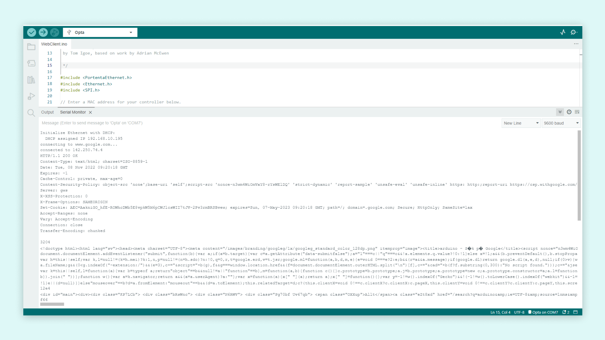
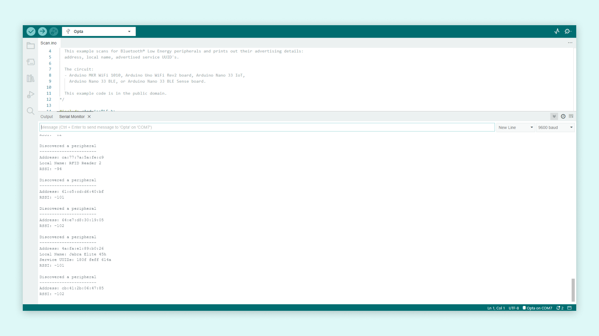

## Overview

The Arduino® Opta is a powerful PLC device that has many features, allowing you to customize its use for your solution. Among these features are the standard connectivity features: Wi-Fi®, Ethernet and Bluetooth®. In this tutorial we will go through how to use these features with the Arduino IDE and the Arduino Opta.

## Goals

- Learn how to use Bluetooth® Low Energy on the Opta
- Learn how to use Wi-Fi® on the Opta
- Learn how to use Ethernet on the Opta

### Required Hardware and Software

- Arduino Opta
- Ethernet cable
- USB-C® cable (either USB-C to USB-A or USB-C to USB-C)
- Wi-Fi® Access Point with Internet Access

## Instructions

Using the Arduino IDE we can easily work with these peripherals. Some features have their own library that we can make use of. First we need to install the appropriate core for the Arduino Opta, go into the **Board manager** and search for **Opta Mbed core**. When the latest version of the core is installed, we can move on to try out the connectivity options.

### Wi-Fi®

The files necessary for using the Wi-Fi® on the Opta are included in the core. To try it out, we can go to **File > Examples**, and under **Examples for Opta** we can find the **WiFi** section. Inside there is an example sketch called **WiFiWebClient**. Open this example sketch and fill out the WiFi details in the **arduino_secrets.h** tab. The sketch will make the Opta connect to desired website defined within `char server[] = "example.com";` variable. If the connection is successful, it will then print the websites' HTML content to the serial monitor. If the sketch ran successfully, the output should look like the image below.

If you want to take a deeper look at what features the **WiFi** library has to offer, [take a look at the API reference page](https://www.arduino.cc/reference/en/libraries/wifi/).

### Ethernet

The Arduino Opta has a RJ45 ethernet port with a LED that will indicate the status of the connected cable. The files necessary for using Ethernet on the Opta are included in the core. To try it out, we can go to **File > Examples**, and under **Examples for Opta** we can find the **Ethernet** section. Inside there is an example sketch called **WebClient**. Connect the Ethernet cable to the Arduino Opta and upload the example. This example will function the same way as the one mentioned in the Wi-Fi® section. The device will connect to the website defined in the sketch and print the websites' HTML content in the serial monitor. If the sketch ran successfully, the output should look like the image below.

If you want to take a deeper look at what features the **Ethernet** library has to offer, [take a look at the API reference page](https://www.arduino.cc/reference/en/libraries/ethernet/).

### Modbus TCP Via Ethernet Port

The Arduino Opta can be configured to used Modbus TCP protocol, which basically runs on Ethernet instead of serial lines using TCP interface over RTU protocol. Thus the coverage distance is dependent on the capacity of the Ethernet cable. For example, Cat6a cable could be paired with Arduino Opta to operate inside industrial environment. Modbus TCP is a variant of the Modbus family of simple, vendor-neutral communication protocols intended for supervision and control of automation equipment. Specifically, it covers the use of Modbus messaging in an intranet or internet environment using the TCP/IP protocols. The most common use of the protocols at this time is for Ethernet attachment of PLCs, I/O modules and gateways to other simple field buses or I/O networks.

### Bluetooth® Low Energy

To use the Bluetooth® feature, you will need to download the **ArduinoBLE** library in the Arduino IDE. Go into the **library manager** and search for **ArduinoBLE**. if you can't find it, try sorting by official libraries published by Arduino. Let's now try and run a simple example sketch from the ArduinoBLE library. We will test with the sketch that will scan for other Bluetooth® devices within range. The sketch will then print the found devices address, local name and the advertised service UUIDs, if present. You can find the example under **File > Examples > ArduinoBLE > Central**, the sketch is called **Scan**. When the sketch is running on the Opta, the output on the serial monitor should look something like the image below.

If you want to take a deeper look at what features the **ArduinoBLE** library has to offer, [take a look at the API reference page](https://www.arduino.cc/reference/en/libraries/arduinoble/).

## Conclusion

Now you have a better overview of the connectivity features on the Arduino Opta and how to use them. We went through how to use the different connectivity features and what libraries are required for them. By running all the example sketches on our device, we have made sure that the modules are all working and everything is up to date.

### Next Steps

Now that you know how to use the connectivity features of the device, have a look at our other tutorials and try to combine the different features. The Opta uses the same architecture as the Portanta H7, it could therefore be a good idea to take a look at the Portenta H7 tutorials. Such as the using your [device as a Wi-Fi® access point tutorial](https://docs.arduino.cc/tutorials/portenta-h7/wifi-access-point) or the [Bluetooth® Low Energy connectivity with a phone tutorial](https://docs.arduino.cc/tutorials/portenta-h7/ble-connectivity).
