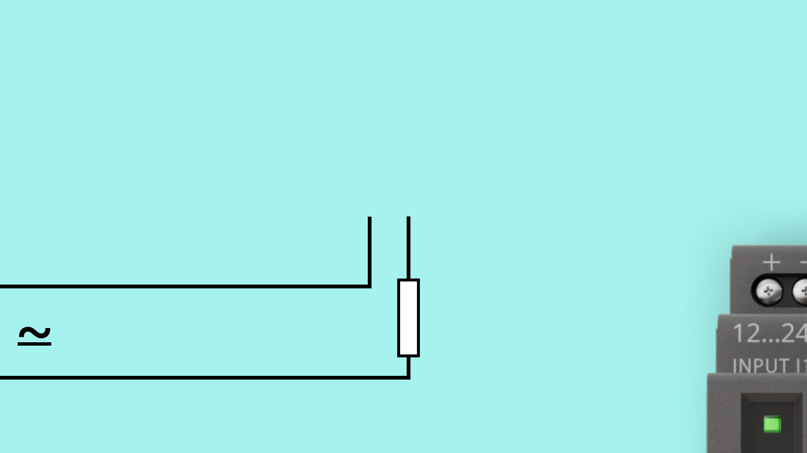
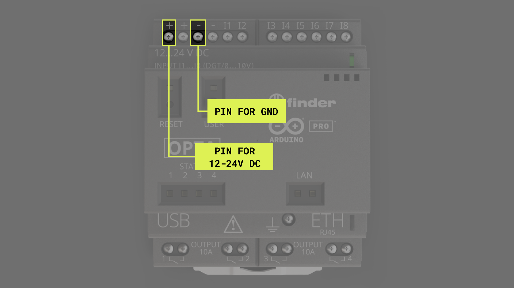

## Overview

Opta™ is a robust micro PLC solution with many engaging features. In this tutorial we will go through the setup of Opta™ with the Arduino IDE and explain how to use its basic features, showing through examples how to program the LEDs on the device, how to use the programmable button, as well as controlling its inputs and outputs.


## Goals

- Putting Opta™ to work with the Arduino IDE
- Blinking the LEDs on the device
- Programming the button on the device
- Testing the inputs and outputs on the device
- Connecting the device to the Arduino Cloud

### Required Hardware and Software

- USB-C® cable (x1)
- [Opta™ PLC](https://store.arduino.cc/pages/opta) (x1)
- [Arduino IDE](https://www.arduino.cc/en/software)
- Power supply of 12-24V DC, 1A (optional if not running the section related to the relays) (x1)
- Analog inputs (optional, alternatively the section related to analog inputs will work but reading random values)

## Instructions

### Setup With the Arduino IDE

Make sure the latest version of the Arduino IDE is installed. The IDE can be downloaded [here](https://www.arduino.cc/en/software).
Within the Arduino IDE install the core for the Opta™. Go to **Tools > Board > Boards Manager**, in the board's manager section search for **Opta mbed** and install it.


Now you are ready to upload sketches to the Opta™ via the Arduino IDE.

### Trying a Blink Sketch

Once the IDE and the core are installed, let's warm up by uploading a first sketch to your Opta™. We will be using a modified version of the classical Arduino blink sketch to put your device to work and test if everything is set properly. 
Let's create a simple blink sketch that will blink the four STATUS LEDs on the Opta™, highlighted in the image below.


All the STATUS LEDs on the device are defined in the core of the PLC. 
Hereafter you can see the correspondence between each of them as identified in the core and their labeling on the front panel of the product:

- `LED_D0`: STATUS 1
- `LED_D1`: STATUS 2
- `LED_D2`: STATUS 3
- `LED_D3`: STATUS 4
- `LED_RESET`: LED above the reset button
- `LED_USER`: LED above the user button (only available on the Opta™ WiFi, SKU: AFX00002)

Select the correct **board** and **port** in the **Tools** section.
Copy the sketch below into the Arduino IDE sketch editor, then upload it to Opta™.
When the sketch is uploaded you will see the Opta's STATUS LEDs blinking in sequence.

```arduino
void setup() {
  pinMode(LED_D0, OUTPUT);
  pinMode(LED_D1, OUTPUT);
  pinMode(LED_D2, OUTPUT);
  pinMode(LED_D3, OUTPUT);
}

void loop() {
  digitalWrite(LED_D0, HIGH);
  delay(100);
  digitalWrite(LED_D0, LOW);
  delay(100);
  
  digitalWrite(LED_D1, HIGH);
  delay(100);
  digitalWrite(LED_D1, LOW);
  delay(100);
  
  digitalWrite(LED_D2, HIGH);
  delay(100);
  digitalWrite(LED_D2, LOW);
  delay(100);
  
  digitalWrite(LED_D3, HIGH);
  delay(100);
  digitalWrite(LED_D3, LOW);
  delay(500);
}
```

### Configuring the Programmable Button on the Opta™

Opta™ has a programmable button, shown in the image below and identified as USER. It can be programmed using the Arduino IDE to fit your needs. To show how simple it is to use, let's create a sketch and program the button as a trigger to modify the status of the STATUS LEDs.


The button is defined in the core as `BTN_USER`: 'HIGH' as default (not pressed),  and 'LOW' when pressed. The new sketch will turn the STATUS LEDs on one by one when the button is pressed and then start over when all the lights have been turned on. Below you can find the entire sketch, where a simple [Switch (case) Statement](https://www.arduino.cc/reference/en/language/structure/control-structure/switchcase/) is used, and an image highlighting where the USER button is located on the device. 

```arduino
int buttonState = 0;
int counter = 0;

void setup() {
  // Initialize OPTA LEDs
  pinMode(LED_D0, OUTPUT);
  pinMode(LED_D1, OUTPUT);
  pinMode(LED_D2, OUTPUT);
  pinMode(LED_D3, OUTPUT);
  pinMode(BTN_USER, INPUT);
}

// The loop function runs over and over again while the device is on
void loop() {
  buttonState = digitalRead(BTN_USER);
  if(buttonState == LOW){
    if(counter < 4){
      counter++;
    }
    else{
      counter = 0;
    }
    delay(100);
  }
  changeLights();
}

void changeLights() {
  switch(counter){
    case 0:
      digitalWrite(LED_D0, LOW);
      digitalWrite(LED_D1, LOW);
      digitalWrite(LED_D2, LOW);
      digitalWrite(LED_D3, LOW);
      break;
    case 1:
      digitalWrite(LED_D0, HIGH);
      break;
    case 2:
      digitalWrite(LED_D1, HIGH);
      break;
    case 3:
      digitalWrite(LED_D2, HIGH);
      break;
    case 4:
      digitalWrite(LED_D3, HIGH);
      break;
  }
  delay(100);
}
```

Once the sketch is uploaded, you can see that an additional LED is turned on each time you press the button, following the sequence:

| Interaction  | Result                                |
| ------------ | ------------------------------------- |
| First press  | STATUS LED 1 ON                       |
| Second press | STATUS LEDs 1 and 2 ON                |
| Third press  | STATUS LEDs 1, 2 and 3 ON             |
| Fourth press | STATUS LEDs 1, 2, 3 and 4 ON          |
| Fifth press  | All STATUS LEDs off and counter reset |


### Using Out Relays

Opta™ has 4 relay outputs, consisting of 4 electromechanical relays NO (SPST) with a capacity of 10A at 250V AC (considering a resistive load). They are identified as OUTPUTS and located on the bottom of Opta™ as shown in the image below.


The coils of each relay correspond to pins D0 to D3 as follows:

| Output     | Pin   | Alias  |
| :--------: | :---: | :----: |
| OUTPUT 1   | D0    | RELAY1 |
| OUTPUT 2   | D1    | RELAY2 |
| OUTPUT 3   | D3    | RELAY3 |
| OUTPUT 4   | D4    | RELAY4 |

The Opta™ output contacts are "clean" contacts, which means they are contacts that are not alive in a "non-connection" situation. This type of contact can be used in any system and with any type of voltage. To properly function, the outputs must therefore be connected by bringing for example a power cable to one of the terminals and connecting the load to the exit of the other terminal.

This way, when the contact is closed by the logic set in the programming, the power supply signal will cross the contact carrying the signal up to the reference load.

The “clean” contact also allows carrying a different power system or type of load for each output contact, being possible to control multiple devices or signals that use different voltage levels.



Let's run a simple sketch to test the output relays on Opta™: in this sketch all the 4 relays are closing and reopening their contacts and, after each relay's cycle, a led will be turned on to provide visual feedback.
To activate the relays and run this sketch, you need to provide energy to Opta™ with a voltage from 12 to 24 V DC by connecting it to a proper power supply.

Opta™ has dedicated terminals for power supply located in the upper part of Opta™ and next to the inputs. They are duplicated to help the user to connect the power supply and any common part to the input terminals but they have the same potential (upon polarity).



***These terminals are polarized, it is therefore mandatory to strictly respect the power supply polarity by connecting the positive connector of the power supply to "+" and the negative to "-".***

The entire sketch can be found below, copy it into your IDE and upload it to your device.

```arduino
void setup() {
 // Initialize Relays outputs
 pinMode(D0, OUTPUT);
 pinMode(D1, OUTPUT);
 pinMode(D2, OUTPUT);
 pinMode(D3, OUTPUT);
 
 // Initialize Opta LEDs
 pinMode(LED_D0, OUTPUT);
 pinMode(LED_D1, OUTPUT);
 pinMode(LED_D2, OUTPUT);
 pinMode(LED_D3, OUTPUT);
}

void loop() {
 // Closes and opens the contact of relay 1 and turns on led 1
 digitalWrite(D0, HIGH); // Sets the relay 1 on
 digitalWrite(LED_D0, HIGH);
 delay(1000);
 digitalWrite(D0, LOW); // Sets the relay 1 off
 digitalWrite(LED_D0, LOW);
 delay(1000);
 
 // Closes and opens the contact of relay 2 and turns on led 2
 digitalWrite(D1, HIGH); // Sets the relay 2 on
 digitalWrite(LED_D1, HIGH);
 delay(1000); 
 digitalWrite(D1, LOW); // Sets the relay 2 off
 digitalWrite(LED_D1, LOW);
 delay(1000);
 
 // Closes and opens the contact of relay 3 and turns on led 3
 digitalWrite(D2, HIGH); // Sets the relay 3 on
 digitalWrite(LED_D2, HIGH);
 delay(1000);
 digitalWrite(D2, LOW); // Sets the relay 3 off
 digitalWrite(LED_D2, LOW);
 delay(1000);

 //  Closes and opens the contact of relay 4 and turns on led 4
 digitalWrite(D3, HIGH); // Sets the relay 4 on
 digitalWrite(LED_D3, HIGH);
 delay(1000);
 digitalWrite(D3, LOW); // Sets the relay 4 off
 digitalWrite(LED_D3, LOW);
 delay(1000);
}
```

***Important: It is not possible to program the Opta™ while it is being powered with the power pins. You would need to disconnect the power supply, upload the program and then connect the power again.***

### Using Opta's Inputs

Opta™ has 8 input pins that can be programmed to be used as analog or digital. The mapping between the marking on the Opta™ physical terminals (I1 to I8) and their definition in the core can be found below:

| Physical terminal | Definition in core  | Alias              |
| :---------------: | :-----------------: | :----------------: |
| I1                | A0                  | PIN_A0             |
| I2                | A1                  | PIN_A1             |
| I3                | A2                  | PIN_A2             |
| I4                | A3                  | PIN_A3             |
| I5                | A4                  | PIN_A4             |
| I6                | A5                  | PIN_A5             |
| I7                | A6                  | PIN_A6             |
| I8                | A7                  | PIN_A7             |

The 8 input pins can be used as digital (having the logical values of LOW or HIGH) or as analog inputs (within a range from 0 to 10V).
* To use them as digital inputs, add the Arduino command `pinMode(pinName, INPUT);` inside the `setup()`.
* To use them as analog inputs, add the command `analogReadResolution();` with the bit resolution that you want to use.


Now let's try a sketch that will read the analog inputs on the Opta™. The inputs can operate in a range between 0 and 10V.
The maximum voltage managed by the microcontroller is 3V. This maximum voltage is important to calculate the voltage of the input using it in conjunction with the resolution factor of the ADCs. That resolution can be selected inside the program within a range between 12 bits (4095) and 16 bits (65535).
To get and display the proper voltage value read by the input, we need to convert the value read by the `analogRead` function and apply a rescaling factor of 0.3 which is determined by the internal voltage divider.
The sketch will read the inputs on the analog pins A0, A1 and A2 and then print the result in the serial monitor.

```arduino
void setup() {
   Serial.begin(9600);
   // 65535 is the max value with 16 bits resolution set by analogReadResolution(16)
   // 4095 is the max value with 12 bits resolution set by analogReadResolution(12)
   analogReadResolution(12);
}

void loop() {
   // Read the input on analog input I1 corresponding to A0:
   int sensorValueA0 = analogRead(A0);
   float voltageA0 = sensorValueA0 * (3.0 / 4095.0)/ 0.3;
   
   // Print out the value you read from I1 to the max value for the analog inputs resolution:
   Serial.print("I1 value: ");
   Serial.print(sensorValueA0);
   Serial.print(" corresponding to ");
   Serial.print(voltageA0, 5); // Print the voltage as a float with 5 decimal digits
   Serial.println("Volts");
   
   // Read the input on analog input I2 corresponding to A1:
   int sensorValueA1 = analogRead(A1);
   float voltageA1 = sensorValueA1 * (3.0 / 4095.0)/0.3;

   Serial.print("I2 value: ");
   Serial.print(sensorValueA1);
   Serial.print(" corresponding to ");
   Serial.print(voltageA1, 5); // Print the voltage as a float with 5 decimal digits
   Serial.println("Volts");
   
   // Read the input on analog input I3 corresponding to A2:
   int sensorValueA2 = analogRead(A2);
   float voltageA2 = sensorValueA2 * (3.0 / 4095.0)/0.3;

   Serial.print("I3 value: ");
   Serial.print(sensorValueA2);
   Serial.print(" corresponding to ");
   Serial.print(voltageA2, 5); // Print the voltage as a float with 5 decimal digits
   Serial.println("Volts");

   delay(1000);
}
```

Once you have uploaded the code, open the serial monitor to see the values read in each analog input. If you have connected a device with an analog voltage value in I1, I2, and/or I3 you will see the voltage or analog value of each of the signals. In case you did not connect anything to the analog inputs, you will see how the values oscillate between 0V and a very small value because the pins are floating.

You may notice from the output values that when the maximum value of 10V is reached, the corresponding numerical value is not 4095 as the maximum value with 12 bits resolution should be. The reason is that there is a precautional margin taken on the maximum voltage level applied to the inputs to preserve the integrity of the microcontroller.

### Connecting Opta™ to the Cloud

It is possible to use the Opta™ with the Arduino Cloud. To set up the Opta™ to the cloud go to the [Arduino Cloud](https://cloud.arduino.cc/). For help with how to get started with the cloud, go to our [Getting started with the cloud](https://docs.arduino.cc/arduino-cloud/getting-started/iot-cloud-getting-started) tutorial. We also have some other helpful tutorials for [the Arduino cloud](https://docs.arduino.cc/arduino-cloud/) that will help you to expand its capabilities.

## Conclusion

This tutorial went through the basics of the Opta™ device. Now you know how to program the LEDs of the PLC, use the user-programmable button to create additional modes and features, program the relays and read the digital and analog inputs. With the additional connection of the Opta™ to the Arduino Cloud, Opta™ can be programmed online, create HMI interfaces accessible on any device, and even be updated through an OTA using professional encryption security.

### Next Steps

Now that you know the basics of the Opta™, it could be a good idea to combine these features with other features of the device. For example, if you want to add connectivity to your solution, take a look at the [Getting started with connectivity on the Opta™ tutorial](/tutorials/opta/getting-started-connectivity).