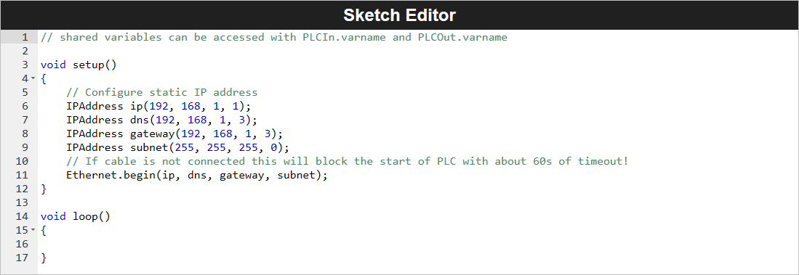
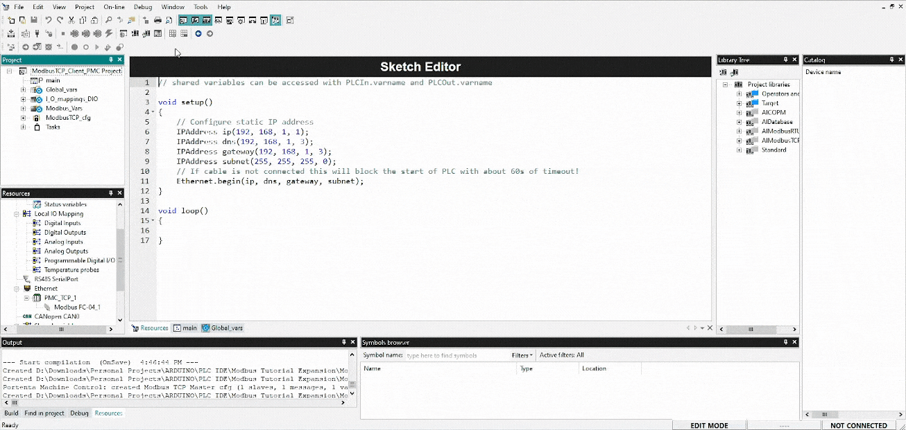
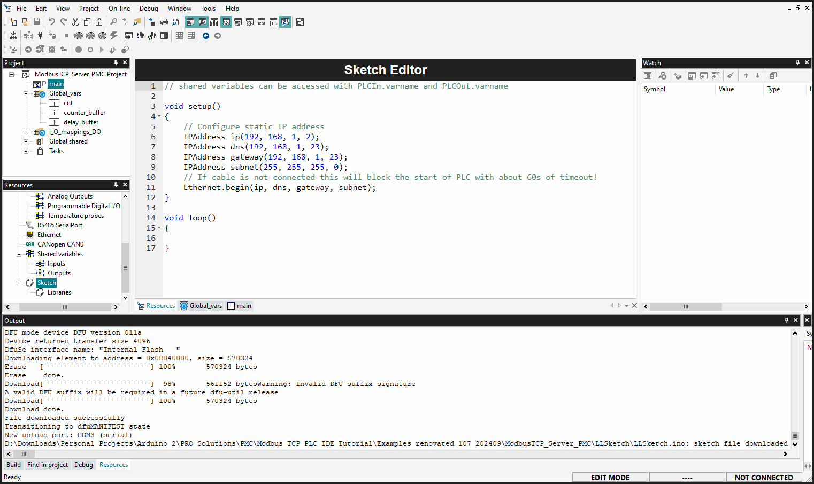
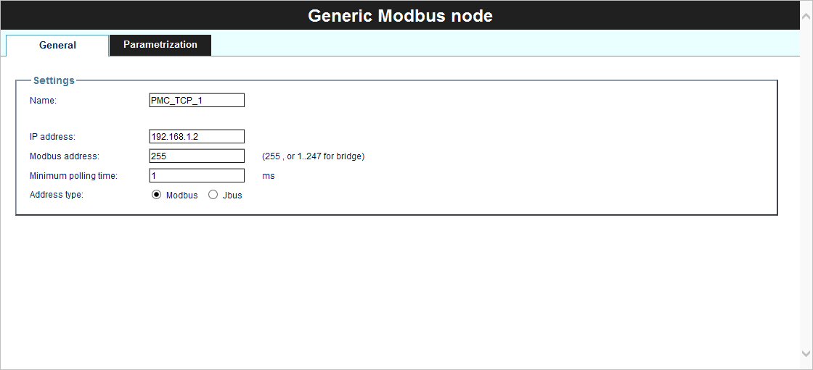
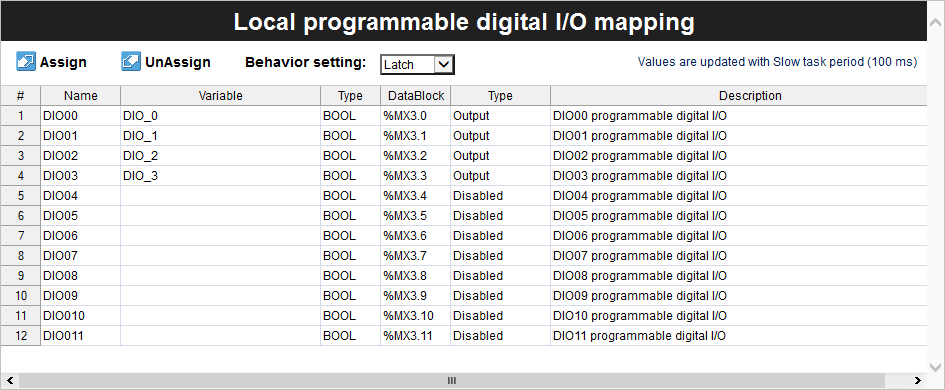
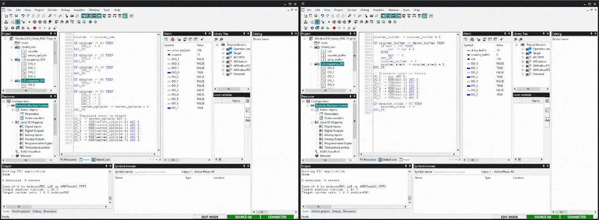

## Overview

Portenta Machine Control is characterized by its industrial-grade hardware which provides consistent performance and durability even in the most demanding conditions. A notable feature of its design is the provision of various connectivity options, with an emphasis on Modbus TCP via the RJ-45 port.


In this tutorial, you will learn the process of setting up Modbus TCP-based communication between two Portenta Machine Control using the Arduino PLC IDE.

## Goals

- Learn how to set up the workspace environment for Modbus TCP using Arduino PLC IDE.
- Learn how to configure Modbus TCP for Portenta Machine Control using Arduino PLC IDE.
- Learn how to verify that Portenta Machine Control has been correctly set up using an example that uses Modbus TCP communication.

## Required Hardware and Software

### Hardware Requirements

- [Portenta Machine Control](https://store.arduino.cc/collections/pro-family) (x2)
- Micro USB cable (x2)
- RJ-45 LAN cable (x3)
- Ethernet Switch (Recommended) (x1)

### Software Requirements

- [Arduino PLC IDE Tools](https://www.arduino.cc/en/software#arduino-plc-ide)
- [Arduino PLC IDE software](https://www.arduino.cc/en/software#arduino-plc-ide)
- If you have a Portenta Machine Control, you will need a unique PLC IDE License key for your device. Get your license key [here](https://store.arduino.cc/products/plc-key-portenta-machine-control). Go to section [__License Activation with Product Key (Portenta Machine Control)__](https://docs.arduino.cc/software/plc-ide/tutorials/plc-ide-setup-license#6-license-activation-with-product-key-portenta-machine-control) to know more.
- [Portenta Machine Control Modbus TCP PLC IDE Project Example File](assets/ModbusTCP_PMC_Example.zip)

## Modbus TCP

The Modbus protocol works as a messaging service structure, operating with Client/Server or Controller/Peripheral communications. Recognized as an *application protocol*, its data handling remains distinct from its transmission mechanism.

The __Modbus over TCP/IP__ — often shortened to __Modbus TCP__ — emerges as a derivative of the Modbus RTU protocol. It characterizes for the TCP/IP interface over Ethernet to process data transfer between compliant devices. Following points will help you understand the Modbus TCP briefly:

* The 'Transmission Control Protocol (TCP)' supervises the packet transmissions.

* The 'Internet Protocol (IP)' defines the addresses to guide messaging routes.

* A distinct feature of Modbus TCP concerns how it maintains data integrity. With Modbus TCP wrapping the primary data frame inside a TCP frame, the conventional Modbus checksum is not considered. Rather, the Ethernet TCP/IP layer's checksum technique vouches for data integrity.

* Modbus over TCP/IP complies with TCP/IP networking norms on Ethernet, with Modbus messaging service playing the role of its data intermediary. The standard connectivity involves Modbus TCP/IP Client and Server devices. Additionally, interconnections can be achieved via routers, gateways, or bridges, crafting a TCP/IP network.

***Controller/Peripheral is formerly known as Master/Slave. Arduino no longer supports the use of this terminology. Devices formerly known as Master are referred to as Controller/Client and devices formerly known as Slaves are referred to as Peripheral/Server.***

## Modbus TCP & PLC IDE

In this tutorial, we will guide you through setting up two Portenta Machine Control devices with Modbus TCP using the Arduino PLC IDE. To achieve a successful protocol deployment, it is important to understand the overall implementation procedure.

The following diagram visualizes how Portenta Machine Control is configured and deployed with Modbus TCP:


The entire procedure is divided into three distinct stages:

* __Modbus TCP Configuration__ is the foundational step where we initialize the Portenta Machine Control device with Modbus TCP and other core device settings. A crucial aspect of this step is IP configuration, which is vital for Modbus TCP communication and is defined within the Arduino sketch.

  During this step, the Modbus TCP role, either Client or Server, is designated to the desired Portenta Machine Control. Based on this role within the Modbus TCP, 'Status variables' are outlined or a Modbus node is established to identify the communicating devices under this protocol.

* __PLC Program__, developed subsequent to device initialization, envelopes around Modbus TCP and other properties. The highlight of this step bases on minimal configuration or coding needed for the Modbus TCP specifics within the PLC code.

  The process has been simplified for user convenience. Just by referencing preset variables in your PLC code, the system autonomously handles data transfer through Modbus TCP. This approach leverages prior device setup, eliminating repetitive tasks and enhancing seamless communication.

* __System Operation__ represents the desired behavior after the Modbus TCP configuration and the execution of the PLC program based on the developer's developed logic. Consequently, we can observe the device establishing communication with other devices via Modbus TCP.

The provided diagram underscores the consistency in the Modbus TCP configuration across Arduino devices using the PLC IDE. A salient feature of this system is its adaptability. The PLC program works effectively, independent of the Modbus TCP setups. This autonomous nature guarantees its interoperability and versatility in a variety of scenarios.

Additionally, there is no limitation on the programming language when developing the PLC script. The platform is compliant with the IEC61131-3 standard, allowing developments using any language from this standard's spectrum. Its adaptability allows for both ease of use in program development.

Having provided an overview of the entire process, we can now proceed to create an example.

## Instructions

### Setting Up the Arduino PLC IDE

Access the Arduino PLC IDE software by following [Arduino PLC IDE official website](https://www.arduino.cc/pro/software-plc-ide). You will have to download two executable files for proper software installation:

- [Arduino PLC IDE Tools](https://www.arduino.cc/en/software#arduino-plc-ide)
- [Arduino PLC IDE](https://www.arduino.cc/en/software#arduino-plc-ide)


The **Arduino PLC IDE Tools** will provide all the required drivers, libraries, and cores for development while the **Arduino PLC IDE** will install the IDE software.

Install the Arduino PLC IDE Tools before the Arduino PLC IDE to avoid potential problems related to old libraries and drivers.

***For more details regarding Arduino PLC IDE setup, please take a look at [Arduino PLC IDE Setup and Board's License Activation](https://docs.arduino.cc/tutorials/portenta-machine-control/plc-ide-setup-license) tutorial.***

### Hardware Setup

We will use two Portenta Machine Control devices and the PLC IDE to set up the Modbus TCP communication.

The Ethernet LAN (RJ-45) cable is used to make a physical connection between both devices using the `ETH RJ45` port. The following image provides a connection diagram for both devices:


The setup incorporates an Ethernet switch that monitors both Portenta Machine Control using the PLC IDE. This configuration not only links both Portenta Machine Control devices using the PLC IDE but also lets you employ a profile to observe information exchanges in real-time. We recommend using an Ethernet switch for this tutorial to ensure optimal communication between devices and monitor in real-time.

### Workspace Pre-Configuration

There are some considerations that you will need to understand beforehand for proper use of Modbus TCP on Portenta Machine Control within PLC IDE. Following subsections will help briefly explain such aspects.

#### PLC IDE Project Configuration & Licenses Management
<br></br>

In any robust development environment, understanding the intricacies of project configuration and the nuances of license management is essential. The Arduino PLC IDE provides a unique blend of features tailored for industrial automation, but to utilize them effectively, a solid foundation is indispensable.

We highly recommend reviewing [this tutorial](https://docs.arduino.cc/tutorials/portenta-machine-control/plc-ide-setup-license) before delving into the present tutorial.

#### Portenta Machine Control Basic Configuration
<br></br>

To establish Modbus TCP communication, it is necessary to identify the IP address of each Portenta Machine Control device. When you connect the Portenta Machine Control to a computer using an RJ-45 cable via an Ethernet port with standard ethernet settings, it automatically obtains an IP address from the external *Dynamic Host Configuration Protocol (DHCP)* server. To locate these auto-assigned IP addresses, utilizing tools like this [scanner](https://angryip.org/) can prove invaluable.

It is also feasible to assign a custom IP address to the Portenta Machine Control. This approach is especially useful when specific addresses need to be designated due to particular operational criteria. To achieve this, we will employ the sketch located in the `Resources` tab of the PLC IDE. An attached image offers an overview of the setup possibilities within the sketch.



If opting to manually set the IP address for the Portenta Machine Control, it is also necessary to adjust the computer's Ethernet interface in the *IPv4* settings. The information input in the IPv4 configurations should correspond to the gateway settings. Ensuring a stable connection to the Portenta Machine Control via the PLC IDE is pivotal for a successful project execution. Below, an illustrative setup is depicted for the Windows 11 operating system:


The IP address set for the Portenta Machine Control is essential for establishing and developing in the Arduino PLC IDE environment. To pair with the Portenta Machine Control device, activate the Modbus TCP feature and enter its unique IP address by navigating to `On-line -> Set up communication`. To verify the link between the Portenta Machine Control and development platform, execute the `ping <Portenta Machine Control IP Address>` command in a terminal.



It is important to remember a proper setup is vital when interfacing with the PLC IDE and Portenta Machine Control. Once the Portenta Machine Control properties are all set, you can connect and monitor the status of both devices.

#### Modbus TCP Client and Server Mode
<br></br>

The image below shows the panel we'll encounter when accessing the Modbus TCP configuration panel in the PLC IDE.


There are two options on the Modbus TCP configuration panel:

- Modbus TCP Master
- Modbus TCP Slave always enabled. Unit Identifier: 255

When the "Modbus TCP Master" option is not selected, the Portenta Machine Control device automatically assumes the Modbus TCP Server role with its specified Unit Identifier. In these instances, the Unit Identifier does not require special consideration. This is because the set IP address ensures communication with the correct Portenta Machine Control device, even if multiple devices have the same Unit Identifier.

If "Modbus TCP Master" is selected, the Portenta Machine Control device assumes both the Client and Server roles. In this setting, priority is given to the Client role. Consequently, under the `Ethernet` configuration tab, you will notice the inclusion of a *General Modbus Node* option, which will be elaborated on in the subsequent section.

#### General Modbus Node Configuration
<br></br>

The General Modbus Node allows to add information regarding the devices compatible with the Modbus messaging service.


We will need to provide fundamental details in the `General` tab. Crucially it includes the IP address of the Modbus TCP compatible device with which we aim to communicate. Depending on the project's needs and your preferences, additional properties can be set.

If you initially set up a General Modbus Node with the Portenta Machine Control as a Modbus TCP Master and later deselect the Client role, the Node option will remain. Nonetheless, the configuration field for that Node will adjust, prompting for a Modbus address within the `1 ... 247` range.

#### PLC IDE Modbus Custom Editor
<br></br>

We can also add a Modbus node through the `Ethernet` configuration tab using the Modbus Custom Editor. To access the editor window, navigate to `Tools -> Run Modbus Custom Editor` in the PLC IDE.

It will let us specify the device version and parameters, along with predefined Modbus functions. Once set up, it can be integrated later within the `Ethernet` configuration tab.


It is a useful feature to have frequently deployed device configuration stored that is compatible with Modbus protocol.
  
### Project Overview

With the necessary prerequisites in place and the tools for Modbus TCP configuration for Portenta Machine Control using PLC IDE, we will introduce an example project. This project will demonstrate how to establish Modbus TCP communication between two Portenta Machine Control devices.

In this example, we will make a minor adjustment to the default example code by using the counter (`cnt`) variable. The counter information will be transmitted, facilitating real-time handshake verification between both Portenta Machine Control devices. For this tutorial, we will assign Ethernet properties manually to each device.

Through the counter information provided by the 'Modbus TCP Server Portenta Machine Control', the 'Modbus TCP Client Portenta Machine Control' oversees the programmable digital I/Os and digital outputs. Each Portenta Machine Control focuses on a specific function using the elements mentioned earlier. You will learn to set the Modbus TCP role for each Portenta Machine Control device, following the sections dedicated for each specific role.

For those eager to dive right in, the full example project is available for download [here](assets/ModbusTCP_PMC_Example.zip). All crucial configurations and components are incorporated, so it is ready to be compiled and uploaded to the corresponding Portenta Machine Control device.

Subsequent sections will delve into the setup of each Portenta Machine Control, explaining their specific roles in Modbus TCP communication.

#### Modbus TCP Server Portenta Machine Control
<br></br>

To configure the Portenta Machine Control as a Modbus TCP Server, navigate to the `Ethernet` tab found in the `Resources` panel of the PLC IDE. The `Modbus TCP Slave` mode is always enabled, so there is no need to adjust settings in this window. Yet, for the Portenta Machine Control to operate seamlessly with Modbus TCP, specific properties must be set.

Upon starting a new project file in the PLC IDE, Ethernet properties within the sketch might be commented out. To activate the necessary configurations, these lines should be uncommented. The sketch is located under `Resources` panel of the PLC IDE. After making these changes, the sketch should be uploaded to the Portenta Machine Control via the `Portenta Machine Control Configuration` window.

The following are the necessary Ethernet properties within the sketch for the Modbus TCP Server Portenta Machine Control.

```arduino
void setup()
{
    // Configure static IP address
    IPAddress ip(192, 168, 1, 2);
	IPAddress dns(192, 168, 1, 23);
    IPAddress gateway(192, 168, 1, 23);
    IPAddress subnet(255, 255, 255, 0);
	// If cable is not connected this will block the start of PLC with about 60s of timeout!
	Ethernet.begin(ip, dns, gateway, subnet);
}
```

The properties — such as `ip`, `dns`, `gateway`, and `subnet` — are used as arguments in the `Ethernet.begin()` method to determine the settings for Portenta Machine Control. These can be configured according to your preferences or network requirements. For instance, `ip(192, 168, 1, 2)` indicates the IP address given to the Modbus TCP Server Portenta Machine Control.

***The __Ethernet.begin(ip, dns, gateway, subnet)__ method will delay initialization for 60 seconds if either the RJ45 cable is not connected or the Ethernet properties, like the IP address, are improperly configured. It can be extended using __Ethernet.begin(NULL, ip, dns, gateway, subnet, connection_timeout)__ method, where `connection_timeout` defines a timeout for establishing a Data Layer connection.***

The subsequent image presents the `Status variables (volatile)` window. In this window, the `cnt` variable will be defined, where its access address and datatype will be specified for Modbus TCP communication.


The `cnt` status variable uses the following parameters:

* Address: 25000 (dec) / 0x61A8 (hex)
* Name: cnt
* PLC type: INT

To get started with these configurations, navigate to `Resources -> Portenta Machine Control`, select the corresponding port, and begin the `Manual sketch download`. Following that, go to `On-line -> Set up Communication` and activate the Modbus TCP using the designated IP address for the Portenta Machine Control.



Next, select `On-line -> Connect` to establish a connection between your computer and the Portenta Machine Control server. If all is set up correctly, a notification will appear in the bottom right corner of the PLC IDE software, indicating a successful connection.


Icons `(1)` and `(2)` represent the different connection states: the Portenta Machine Control connecting without any PLC code, and the Portenta Machine Control connecting with an existing PLC code, respectively.

Finally, you will need to compile and upload the main PLC code to the Portenta Machine Control. Access the `main` tab in the `Project` panel and enter the following code:

```arduino
counter_buffer := counter_buffer + 1;

IF counter_buffer >= delay_buffer THEN
	IF cnt < 255 THEN
	    cnt := cnt + 1;
	ELSE
	    cnt := 0;
	END_IF;
	counter_buffer := 0;
	counter_stack := counter_stack + 1;
END_IF;

// Translate count to binary
DO_0 := cnt AND 1;
DO_1 := SHR(cnt,1) AND 1;
DO_2 := SHR(cnt,2) AND 1;
DO_3 := SHR(cnt,3) AND 1;
DO_4 := SHR(cnt,4) AND 1;
DO_5 := SHR(cnt,5) AND 1;
DO_6 := SHR(cnt,6) AND 1;
DO_7 := SHR(cnt,7) AND 1;

IF counter_stack > 50 THEN
	counter_stack := 0;
END_IF;
```

The main role of the Portenta Machine Control server is to operate a binary counter, programmed using digital outputs determined by a sub-counter variable, `cnt`. This variable operates within an 8-Bit value range. The counter's speed is modulated through `counter_buffer` and `delay_buffer`, using as adjustable timing parameters. For the client Portenta Machine Control, the shared Modbus counter variable known as `counter_stack` is used.


To integrate the `counter_buffer` and `delay_buffer` variables, access the `New Variable` option by right-clicking on `Global_vars`. While `counter_buffer` can be designated as an `automatic` variable, `delay_buffer` was originally defined as a `constant` variable with a set value.

For deploying the main PLC code to the Portenta Machine Control, choose `Download PLC code` or simply press `F7`. Upon completing these instructions, you will have set up the Portenta Machine Control device as a Modbus TCP Server. The subsequent section will walk you through the process of configuring another Portenta Machine Control as a Modbus TCP Client.

#### Modbus TCP Client Portenta Machine Control
<br></br>

To configure the Portenta Machine Control as a Modbus TCP Client, start by accessing the 'Ethernet' section under the 'Resources' panel in the PLC IDE. In this section, select the 'Modbus TCP Client' checkbox. As highlighted [here](#modbus-tcp-Client-client-and-server-mode), this step will identify the Portenta Machine Control as a Client. The Server option that appears greyed out can be ignored.

To begin communication with the configured Modbus TCP Server Portenta Machine Control, you can add a Modbus node. Right-click on the 'Ethernet' section within the 'Resources' panel. It will reveal the 'Add' button. Click on it to introduce a 'Generic Modbus' node. For this example, we can set the node using these specific parameters:

* Name: PMC_TCP_1
* IP address: 192.168.1.2
* Minimum polling time: 1 ms
* Address type: Modbus

The settings for these properties should mirror those for the Modbus TCP Server Portenta Machine Control. The IP address is the most vital configuration to take into account. Ensure that this address matches the one given to the server Portenta Machine Control, or to any other compatible devices if you plan on adding more nodes. The final configuration should resemble the image provided:



When defining the Modbus node for the Client Portenta Machine Control, it is essential to specify the Modbus function that will extract the counter (`cnt`) data from the server Portenta Machine Control. By right-clicking on `PMC_TCP_1` or any other name you have chosen, we will see the 'Add' option. Clicking on it will display a device catalog window showcasing a selection of Modbus functions:


To retrieve counter information from the server Portenta Machine Control, choose the 'Modbus FC-04 (Read Input Registers)' function. To ensure correct data access, set up the 'General' tab using the subsequent parameters:

* Start address: 25000
* Polling time: 0 ms (Continuous Read)
* Timeout: 1000 ms


Next, a variable needs to be defined to hold the counter data from the server Portenta Machine Control. To add this variable, go to the `Input Reg.` tab in the Modbus function configuration window. Create a variable called `counter_rec` to store the data transmitted via the protocol.

The following image shows a visual representation of the expected configuration:


The Modbus TCP Client Portenta Machine Control will use the following Ethernet properties for this example.

```arduino

void setup()
{
    // Configure static IP address
    IPAddress ip(192, 168, 1, 1);
    IPAddress dns(192, 168, 1, 3);
    IPAddress gateway(192, 168, 1, 3);
    IPAddress subnet(255, 255, 255, 0);
    // If the cable is not connected this will block the start of PLC with about 60s of timeout!
    Ethernet.begin(ip, dns, gateway, subnet);
}
```

The `ip(192, 168, 1, 1)` represents the IP address of the Modbus TCP Master Portenta Machine Control. While you can modify the Internet Protocol properties as needed, it is essential to make sure the `subnet` aligns with that of your computer.

For the purposes of this tutorial, the client Portenta Machine Control has been set up to use digital programmable I/Os and digital outputs.

The image below provides a glimpse of its appearance within the PLC IDE interface:


These elements also needs labels to reference it later in the main PLC code. A table displaying the variable names designated for digital programmable I/Os can be seen below:



The main program below will be used to fetch counter data, control programmable digital I/Os, and manage corresponding digital outputs. A successful Modbus TCP communication will process previous tasks accordingly.

```arduino
counter := counter_rec;

IF counter >= 10 THEN
	DIO_0 := 1;
END_IF;

IF counter >= 20 THEN
	DIO_1 := 1;
END_IF;

IF counter >= 30 THEN
	DIO_2 := 1;
END_IF;

IF counter >= 40 THEN
	DIO_3 := 1;
END_IF;

IF counter >= 50 THEN
	DIO_0 := 0;
	DIO_1 := 0;
	DIO_2 := 0;
	DIO_3 := 0;
	server_opCycle := server_opCycle + 1;
END_IF;

// Translate count to binary
DO_0 := server_opCycle AND 1;
DO_1 := SHR(server_opCycle,1) AND 1;
DO_2 := SHR(server_opCycle,2) AND 1;
DO_3 := SHR(server_opCycle,3) AND 1;
DO_4 := SHR(server_opCycle,4) AND 1;
DO_5 := SHR(server_opCycle,5) AND 1;
DO_6 := SHR(server_opCycle,6) AND 1;
DO_7 := SHR(server_opCycle,7) AND 1;
```

The `counter` variable acts as a universal reference for the client Portenta Machine Control. While, `counter_rec` is specifically defined for use with Modbus transactions, capturing data from the server Portenta Machine Control that relates to the `counter_stack` data. This particular variable was established during the 'Read Input Registers' Modbus function setup.

For operational indications, the client Portenta Machine Control will employ four digital programmable outputs, complemented by the full suite of digital outputs. Every time the `counter` registers a multiple of ten, the corresponding digital programmable output tied to that counter's first digit will be engaged. As an example, when the `counter` value reaches `10`, digital programmable output #1 gets activated.

When the `counter` achieves a value of `50` and then resets, it marks the end of an operational cycle. This mechanism is recurrent, with digital outputs representing the process cycle count in the form of a binary counter. The repeating counter value is stored in the `server_opCycle`.

The complete workspace interface for client Portenta Machine Control should resemble the following image once the main PLC code has been successfully compiled and downloaded to the client Portenta Machine Control:


Finally, Portenta Machine Control is now ready as a Modbus TCP Client.

### Testing Modbus TCP Communication Between Portenta Machine Control Devices (PLC IDE)

You can access the complete example project [here](assets/ModbusTCP_PMC_Example.zip).

Set both Portenta Machine Control devices running with the corresponding main PLC code with the hardware setup explained in [this section](#hardware-setup). You will be able to observe the following results on client Portenta Machine Control periodically:



In the clip, the left window represents the Modbus TCP Client Portenta Machine Control, while the right window shows the Modbus TCP Server Portenta Machine Control.

The server Portenta Machine Control is tasked to:

- Run a binary counter, using digital outputs as visual cues, all encapsulated within an 8-Bit range.
- Increase the shared Modbus counter variable whenever the 8-Bit binary counter finishes a cycle.
- Tune the binary counter's pace by altering buffer variables to match preferred timing factors.

On the other hand, the client Portenta Machine Control will:

- Retrieve server-side counter data using the Modbus protocol.
- Decode and trigger the appropriate programmable digital I/Os.
- Harness the complete cycle of the programmable digital I/Os to denote the cumulative operation cycles, displayed through digital outputs in binary counter format.

## Conclusion

In this tutorial, you have learned how to configure the workspace environment for Modbus TCP using the Arduino PLC IDE and Portenta Machine Control.

Furthermore, through a practical example, you have learned how to ensure that the Portenta Machine Control is correctly configured and that the Modbus TCP communication functions properly. This example highlighted how to utilize the onboard features of the Portenta Machine Control device, like programmable digital I/Os, using a custom demonstration.

### Next Steps

Now that you have learned to implement the Modbus TCP between Portenta Machine Control devices using Arduino PLC IDE, try expanding the setup by integrating additional Modbus TCP compatible devices into the communication network. You can enhance this setup further with Opta™. Learn more about it by watching this [video](https://youtu.be/reBrbCq86uQ).

Additionally, you can explore the possibilities by leveraging the onboard features of the Portenta Machine Control device combined with the Modbus TCP communication network. This combination offers a robust enhancement solution for industrial management systems.

For more information regarding the Modbus RTU protocol implementation on an Portenta Machine Control, it may interest you to check out ["Getting Started with Modbus RTU on Portenta Machine Control"](https://docs.arduino.cc/tutorials/opta/getting-started-with-modbus-rtu) tutorial.