This user manual provides a comprehensive overview of the Portenta Machine Control, covering its major hardware and software elements. With this user manual, you will learn how to set up, configure, and use all the main features of the Portenta Machine Control.

***This User Manual teaches how to use the Portenta Machine Control with the new `Arduino_PortentaMachineControl` library. If you want to know how to use it with IEC 61131-3 PLC programming languages check the [PLC IDE Tutorials](https://docs.arduino.cc/software/plc-ide). In case you are already using the older version of the `Arduino_MachineControl` library, check the following [tutorial to know the differences and how to migrate your code to the latest version.](https://docs.arduino.cc/tutorials/portenta-machine-control/pmc-arduino-library/)***

## Hardware and Software Requirements

### Hardware Requirements

- [Portenta Machine Control](https://store.arduino.cc/products/arduino-portenta-machine-control) (x1)
- [Micro-USB cable](https://store.arduino.cc/products/usb-2-0-cable-type-a-micro) (x1)
- +24 VDC/0.5 A power supply (x1)

### Software Requirements

- [Arduino IDE 2.0+](https://www.arduino.cc/en/software) or [Arduino Web Editor](https://create.arduino.cc/editor)
- [Arduino PLC IDE 1.0.3+](https://www.arduino.cc/en/software) (for IEC 61131-3 PLC programming languages)
- [Arduino PLC IDE 1.0.3+ Tools](https://www.arduino.cc/en/software#arduino-plc-ide) 
[Arduino_PortentaMachineControl](https://github.com/arduino-libraries/Arduino_PortentaMachineControl)

***This User Manuals shows how to use the Portenta Machine Control using the Arduino IDE environment. To learn more about how to use it with IEC-61131-3 languages and the PLC IDE, check out our tutorials [here](https://docs.arduino.cc/software/plc-ide).***

## Portenta Machine Control Overview

The Portenta Machine Control is designed for efficiency and adaptability in industrial environments. It is compatible with the Arduino framework and other embedded platforms and provides a flexible solution for controlling various equipment and machinery. The Portenta H7 board (included) is central to its operation, which ensures stable performance across a broad temperature spectrum, ranging from -40 °C to +85 °C, without external cooling requirements.


This controller offers many connectivity options, from USB and Ethernet to Wi-Fi®/Bluetooth® Low Energy, as well as industry-specific protocols. It can also connect with various external sensors, actuators, and different Human Machine Interfaces (HMI), such as displays and touch panels, showcasing its adaptability. It is designed for harsh industrial operations with features like DIN bar compatible housing, compact size, and an integrated Real Time Clock (RTC). For real-time control or predictive maintenance tasks, the Portenta Machine Control is a solid choice for businesses aiming to enhance production and equipment management processes.

### Portenta Machine Control Main Components

The Portenta Machine Control features a secure, certified, and durable design that enables it for automation and industrial applications. 

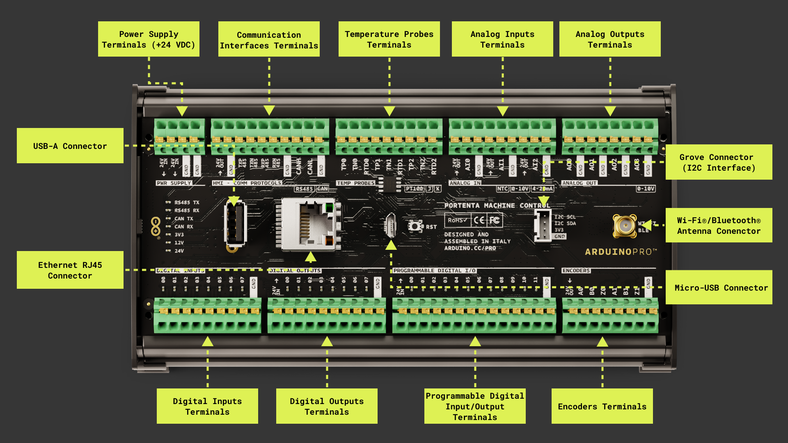

Here is an overview of the controller's main components shown in the image above:

- **Microcontroller**: At the heart of the Portenta Machine Control is the STM32H747XI, a powerful, robust, and high-performance dual-core microcontroller from STMicroelectronics®. This microcontroller is built around an Arm® Cortex®-M7 and an Arm® Cortex®-M4 32-bit RISC cores. The Arm® Cortex®-M7 core operates at up to 480 MHz, while the Arm® Cortex®-M4 core operates at up to 240 MHz.
- **Memory and storage**: The Portenta Machine Control houses:
  - 2 MB of Flash Memory
  - 1 MB of RAM
  - Additional onboard memory of 8 MB SDRAM
  - 16 MB Flash QSPI.
- **Security**: The controller features an onboard ready-to-use secure element from NXP®, the SE0502. This secure element, specifically designed for Internet of Things (IoT) devices, provides advanced security features, perfect for Industrial IoT (IIoT) environments where security is critical.
- **Power architecture**: The controller's power system was designed to be resilient. It operates at an input voltage of +24 VDC, with reverse polarity protection, ensuring the controller remains safeguarded from power irregularities.
- **Digital and analog ports**: Equipped with a versatile set of input and output ports, the Portenta Machine Control supports:
  - 8x digital input ports with 8x Status LEDs labeled as `DIGITAL INPUTS`
  - 8x digital output ports with 8x Status LEDs labeled as `DIGITAL OUTPUTS`
  - 3x software-configurable analog input ports labeled as `ANALOG IN`
  - 4x analog output ports labeled as `ANALOG OUT`
  - 12x digital programmable input/output ports labeled as `PROGRAMMABLE DIGITAL I/O` 
- **Temperature sensing**: With three software-configurable temperature channels, the Portenta Machine Control can measure a variety of temperature ranges using:
  - Type K thermocouples
  - Type J thermocouples
  - PT100 sensors
- **Communication interfaces**: Seamless connectivity is a hallmark of this controller. The Portenta Machine Control offers a high-speed, software-configurable interfaces such as: 
  - CAN bus
  - RS-232
  - RS-422
  - RS-485
  - I<sup>2</sup>C interface (accessible via a Grove connector)
- **Ethernet and USB**: The Portenta Machine Control features onboard Ethernet connectivity and full-speed USB-A and half-speed micro-USB Type B connectors for wired communication.
- **Wireless connectivity**: The Portenta Machine Control supports 2.4 GHz Wi-Fi® (802.11 b/g/n) and Bluetooth® Low Energy (4.2 supported by firmware and 5.1 supported by hardware).
- **Additional features**: The Portenta Machine Control features an onboard RTC with at least 48 hours of memory retention and two encoder channels. Moreover, Electrostatic Discharge (ESD) protection on all inputs and output ports ensures the longevity and durability of the controller.
- **Form factor**: The Portenta Machine Control can be standalone on a DIN rail, a grid, or a panel, providing quick and easy access to all input/output ports and peripherals.

### Portenta Machine Control Core and Libraries

The `Arduino Mbed OS Portenta Boards` core contains the libraries and examples to work with Portenta's Machine Control peripherals and onboard components, such as its input ports, output ports, Wi-Fi® and Bluetooth® modules. To install the Portenta Machine Control core, navigate to **Tools > Board > Boards Manager** or click the **Boards Manager** icon in the left tab of the IDE. In the Boards Manager tab, search for `portenta` and install the latest `Arduino Mbed OS Portenta Boards` core version.

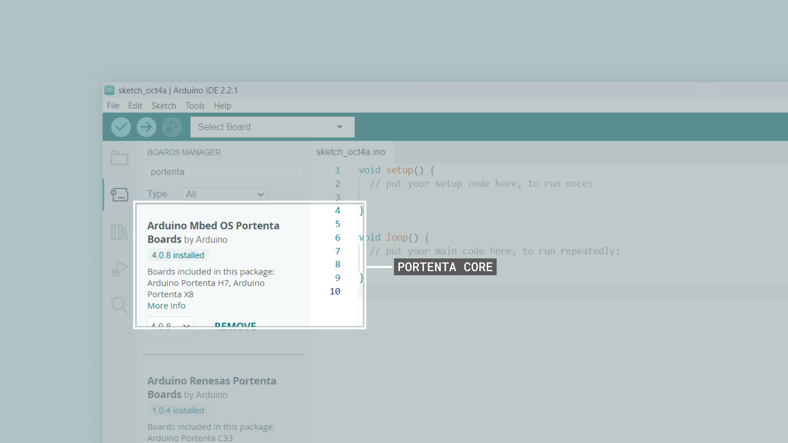

The `Arduino_PortentaMachineControl` library enables efficient management of the features of the Portenta Machine Control. To install the library, navigate to **Tools > Manage Libraries...** or click the **Library Manager** icon in the left tab of the IDE. In the Library Manager tab, search for `machinecontrol` and install the latest `Arduino_PortentaMachineControl` library version.

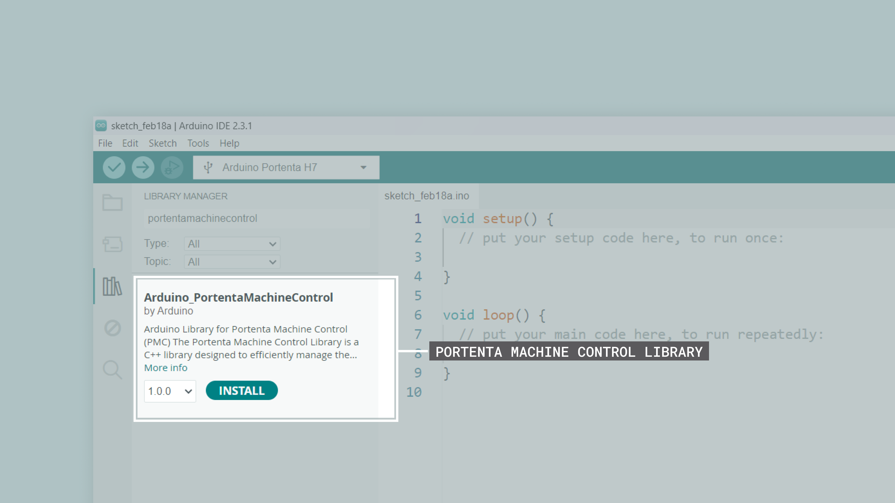


### Arduino PLC IDE

PLC IDE is the Arduino solution to program Portenta Machine Control devices using the five programming languages recognized by the IEC 61131-3 standard. 

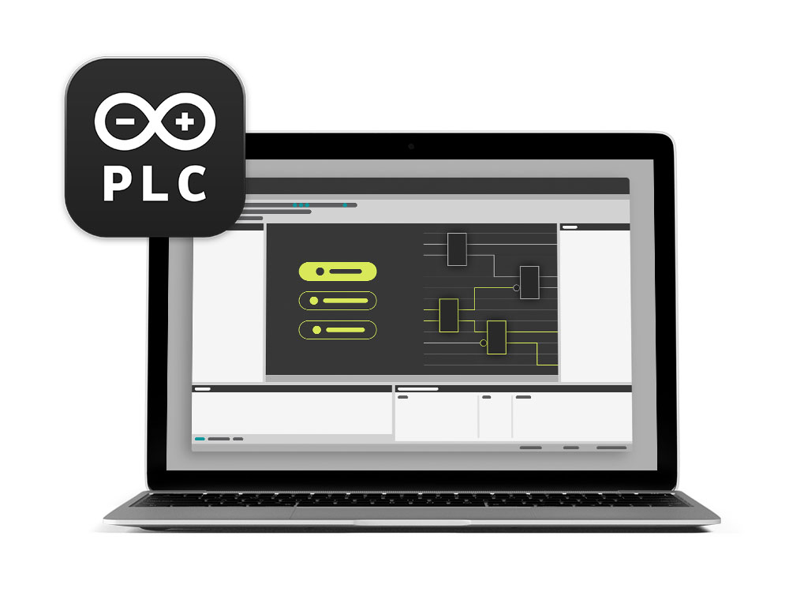

The IEC 61131-3 programming languages include:

- Ladder Diagram (LD)
- Functional Block Diagram (FBD)
- Structured Text (ST)
- Sequential Function Chart (SFC)
- Instruction List (IL)

In the PLC IDE, you can mix PLC programming with standard Arduino sketches within the integrated sketch editor and share variables between the two environments. You can also automate tasks in your software applications; this gives you control over scheduling and repetition, enhancing the reliability and efficiency of your project. Moreover, communication protocols such as Modbus RTU and Modbus TCP can be managed effortlessly using integrated no-code fieldbus configurators.

Check out the following resources that will show you how to start with the Arduino PLC IDE and use IEC 61131-3 programming languages with the Portenta Machine Control:

- [Arduino PLC IDE download page and tutorials](https://docs.arduino.cc/software/plc-ide/)
- [Portenta Machine Control tutorials](https://docs.arduino.cc/hardware/portenta-machine-control/#tutorials)

### Pinout


The complete pinout is available and downloadable as PDF from the link below:

- [Portenta Machine Control pinout](https://docs.arduino.cc/resources/pinouts/AKX00032-full-pinout.pdf)

### Datasheet

The complete datasheet is available and downloadable as PDF from the link below:

- [Portenta Machine Control datasheet](https://docs.arduino.cc/resources/datasheets/AKX00032-datasheet.pdf)

### STEP Files

The complete STEP files are available and downloadable from the link below:

- [Portenta Machine Control STEP files](https://docs.arduino.cc/static/142bd938b340c767b9343451485aa5d2/AKX00032-step.zip)

## First Use

### Powering the Portenta Machine Control

Portenta Machine Control can be powered in different ways:

- Using an **external +24 VDC/0.5 A power supply** connected to Portenta's Machine Control power supply terminals. Please refer to the [pinout section](#pinout) of the user manual.
- Using a **micro-USB cable** (not included) for programming purposes only.


### Hello World Example

Let's program the Portenta Machine Control with a modified version of the classic `hello world` example used in the Arduino ecosystem: the `Blink` sketch. We will use this example to verify the controller's connection to the Arduino IDE and that its core functionalities and the `Arduino_PortentaMachineControl` library are working as expected.

Copy and paste the code below into a new sketch in the Arduino IDE.

```arduino
// Include the Arduino_PortentaMachineControl library
#include <Arduino_PortentaMachineControl.h>

void setup() {
    // Initialize the digital outputs terminals of the Arduino_MachineControl library
    MachineControl_DigitalOutputs.begin();
}

void loop() {
    // Turn on the digital output at channel 0
    MachineControl_DigitalOutputs.write(0, HIGH);
    delay(1000);
    // Turn off the digital output at channel 0
    MachineControl_DigitalOutputs.write(0, LOW);
    delay(1000);
}
```
The sketch begins by including the `Arduino_PortentaMachineControl` library. The `setup()` function initializes the digital output terminals from this library. The `loop()` function, which continually runs after the `setup()` function is called, toggles a digital output at channel `0`.

To upload the code to your Portenta Machine Control, click the **Verify** button to compile the sketch and check for errors; once verification is successful, click the **Upload** button to program the controller with the sketch.


Upon successful upload, observe the red LED on your controller's digital output labeled as `00`. It should turn on for one second, then off for one second, repeatedly.

## Digital Outputs

The Portenta Machine Control has up to eight digital output channels, as shown in the image below.


Some of the key features of the digital output channels of the Portenta Machine Control are the following:

- Digital outputs are **high-side switches** (TPS4H160AQPWPRQ1), handling up to 500 mA.
- All digital output terminals have **overcurrent protection**. If the current exceeds 700 mA (with a tolerance of ±20%), the channel opens to prevent damage.

***The digital output channels must be connected to an external +24 VDC power supply through pin `24V IN`; this power supply can be shared with the controller's +24 VDC power supply. Moreover, pin `24V IN` is not galvanically isolated, meaning the input power supply voltage must share the same `GND` as the controller.***

There are two modes of overcurrent protection in the digital output channels:

1. **Latch mode**: When overcurrent is detected, the digital output channel remains open and can only be closed manually via software. 
2. **Auto retry**: Upon detecting overcurrent, the channel opens. After a short duration (several tens of milliseconds), it attempts to close automatically. If the overcurrent condition persists in the channel, it will keep toggling.

***Ensure each channel does not exceed a maximum current of 500 mA to avoid potential damage or malfunctions in the digital output channels.***

The sketch below showcases a "scanning" effect using the digital output channels of the Portenta Machine Control. It sequentially activates each channel in sequence from the first to the last and then in the opposite direction. As each channel is activated, feedback is provided in the Arduino IDE's Serial Monitor, indicating the active channel at each step.

```arduino
/*
  Portenta Machine Control's Digital Outputs 
  Name: portenta_machine_control_digital_outputs_example.ino
  Purpose: This sketch demonstrates a "scanning" effect using 
  the digital output channels of the Portenta Machine Control.

  @author Arduino PRO Content Team
  @version 1.0 01/10/23
*/

#include <Arduino_PortentaMachineControl.h>

// Initialize the digital outputs and serial communication.
void setup() {
  Serial.begin(9600);

  // Set overcurrent behavior of all channels to latch mode (true)
  MachineControl_DigitalOutputs.begin(true);

  // At startup, set all channels to open state (OFF)
  MachineControl_DigitalOutputs.writeAll(0);
}

void loop() {
  // Create the "scanning" effect moving forward
  for (int i = 0; i < 8; i++) {
    toggleChannel(i);

    // Turn off the previous channel to maintain the "scanning" effect
    if (i < 7) {
      MachineControl_DigitalOutputs.write(i - 1, LOW);
    }
  }

  // Create the "scanning" effect moving backward
  for (int i = 6; i >= 0; i--) {
    toggleChannel(i);

    // Turn off the next channel to maintain the "scanning" effect
    if (i < 7) {  
      MachineControl_DigitalOutputs.write(i + 1, LOW);
    }
  }
}

/**
  Toggles a specific digital output channel, creating part of the "scanning" effect.
  
  @param channel (int)
*/
void toggleChannel(int channel) {
  // Activate the digital output channel
  MachineControl_DigitalOutputs.write(channel, HIGH); 
  Serial.println("- CH" + String(channel) + ": ON");
  // Delay to keep the channel activated, making the effect visible
  delay(200);

  // Deactivate the digital output channel
  MachineControl_DigitalOutputs.write(channel, LOW);
  // Delay to make the transition between channels smoother
  delay(200);
}
```
Notice that the sketch shown above utilizes the following functions from the `Arduino_PortentaMachineControl` library:

- `MachineControl_DigitalOutputs.begin(true)`: This function initializes the digital outputs channels with overcurrent behavior set to **latch mode**, meaning that upon overcurrent detection, channels remain open until manually toggled in software.
- `MachineControl_DigitalOutputs.writeAll(0)`: This function initially sets all digital output channels to an open state (off).
- `MachineControl_DigitalOutputs.write(channel, HIGH/LOW)`: This function controls individual channel states, turning them either on (`HIGH`) or off (`LOW`). In the example sketch, this function creates the "scanning" effect by activating one channel at a time.

## Analog Outputs

The Portenta Machine Control has up to four independent analog output channels, as shown in the image below. These analog output channels enable precise voltage control for various applications. 


Some of the key features of the analog output channels of the Portenta Machine Control are the following:

- Analog outputs can be configured with specific PWM periods, affecting the frequency and resolution of the voltage output.
- Each channel supports voltage outputs ranging from 0 VDC to 10.5 VDC and can source up to 20 mA.

Each analog output channel is designed with a double low-pass filter and a high-current operational amplifier (OPA2990IDSGR) set up in a non-inverting topology with a gain factor of 3.3. This design allows for an effective filtering and amplification of the signal provided.

***The output signal of the analog output channels of the Portenta Machine Control is a DC voltage whose amplitude is a function of the defined PWM duty cycle.***

Below is an example demonstrating using a single analog output channel to generate a sine wave voltage output.

```arduino
/*
  Portenta Machine Control's Analog Output 
  Name: portenta_machine_control_sine_wave_example.ino
  Purpose: This sketch demonstrates the generation of a sine wave 
  using an analog output channel of the Portenta Machine Control.

  @author Arduino PRO Content Team
  @version 1.0 01/10/23
*/

#include <math.h> 
#include <Arduino_PortentaMachineControl.h>

// PWM period set to 4 ms (or 250 Hz)
#define PERIOD_MS 4 

void setup() {
  // Initialize serial communication at 9600 bauds
  Serial.begin(9600);

  // Initialize the analog output channels
  MachineControl_AnalogOut.begin();
  
  // Set the PWM period for channel 0 to 4 ms (or 250 Hz)
  MachineControl_AnalogOut.setPeriod(0, PERIOD_MS);
}

void loop() {
  // Iterate through 360 degrees, generating a complete sine wave output
  for (int i = 0; i < 360; i += 5) {
    
    // Calculate the sine wave voltage output from 0 to 10 VDC
    float voltage = 5 + 5 * sin(i * (PI / 180)); 

    // Set the voltage for channel 0
    MachineControl_AnalogOut.write(0, voltage);

    // Print the current voltage to the IDE's serial monitor (with two decimal precision)
    Serial.println("Channel 0 set at " + String(voltage, 2) + "V");

    // Introduce a delay to adjust the frequency of the sine wave
    delay(15); 
  }
}
```

In the example sketch, the sine wave signal is generated by iterating through 360 degrees; the sine function is computed for each degree value. The sine function yields a value between -1 and 1; to convert this into a voltage value between 0 and 10 VDC, an offset of 5 VDC is added, and the result is then multiplied by 5. With this formula, the sine wave oscillates between 0 to 10 VDC. The delay introduced at the end of each iteration helps adjust the frequency of the sine wave signal, resulting in the desired waveform at the analog output.

Notice that the sketch shown above utilizes the following functions from the `Arduino_PortentaMachineControl` library:

- `MachineControl_AnalogOut.begin()`: This function initializes the analog output channels, preparing them for voltage output.
- `MachineControl_AnalogOut.setPeriod(channel, period)`: This function configures the PWM period for the specified analog output channel. In the example shown above, it is set to 4 ms or 250 Hz.
- `MachineControl_AnalogOut.write(channel, voltage)`: This function controls the voltage output for the specified channel. In the example above, a sine wave is generated for channel `0` ranging from 0 to 10 VDC.

The expected result of the generated sine wave measured with an oscilloscope in the analog output channel `0` is shown in the image below.


## Digital Inputs

The Portenta Machine Control has up to eight digital input channels, as shown in the image below. Each channel incorporates a voltage divider comprising a 680 kΩ and a 100 kΩ resistor, which scales an input from 0 to 24 VDC down to 0 to 3 VDC.

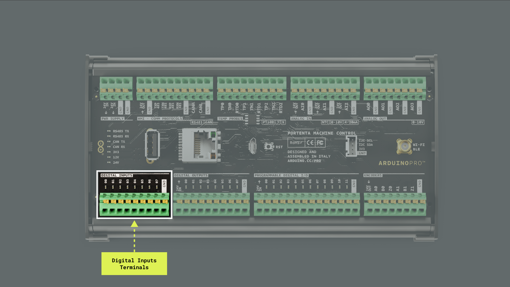

Below is an example sketch showcasing how to periodically read data from all the digital input channels.

```arduino
/*
  Portenta Machine Control's Digital Input Example 
  Name: portenta_machine_control_digital_input_example.ino
  Purpose: This sketch demonstrates how to periodically read from 
  all the digital input channels on the Portenta Machine Control.
  
  @author Arduino PRO Content Team
  @version 1.0 01/10/23
*/

#include <Arduino_PortentaMachineControl.h>

void setup() {
  // Initialize serial communication at 9600 bps
  Serial.begin(9600);

  // Initialize the digital input channels
  // If initialization fails, notify via Serial Monitor
  if (!MachineControl_DigitalInputs.begin()) {
    Serial.println("- Failed to initialize the digital input GPIO expander!");
  }
}

void loop() {
  // Read the status of all digital input channels
  uint32_t inputs = MachineControl_DigitalInputs.readAll();

  // Display the status of each channel on the IDE's Serial Monitor
  for (int i = 0; i < 8; i++) {
    Serial.print("- CH0" + String(i) + ": " + String((inputs & (1 << i)) >> i) + "\t");
  }

  // Print a new line for better readability
  Serial.println();
  delay(500);
}
```

Note that the example sketch employs the `MachineControl_DigitalInputs.readAll()` function from the `Arduino_PortentaMachineControl` library, which facilitates the reading of the status of all the digital input channels in a single operation. The sketch then prints the status of each channel on the Serial Monitor.

## Analog Inputs

The Portenta Machine Control has up to three independent analog input channels, as shown in the image below. Each channel can have a range resolution varying from 12 to 16 bits, producing decimal values ranging from 0 to 65,535, which is configurable through software.

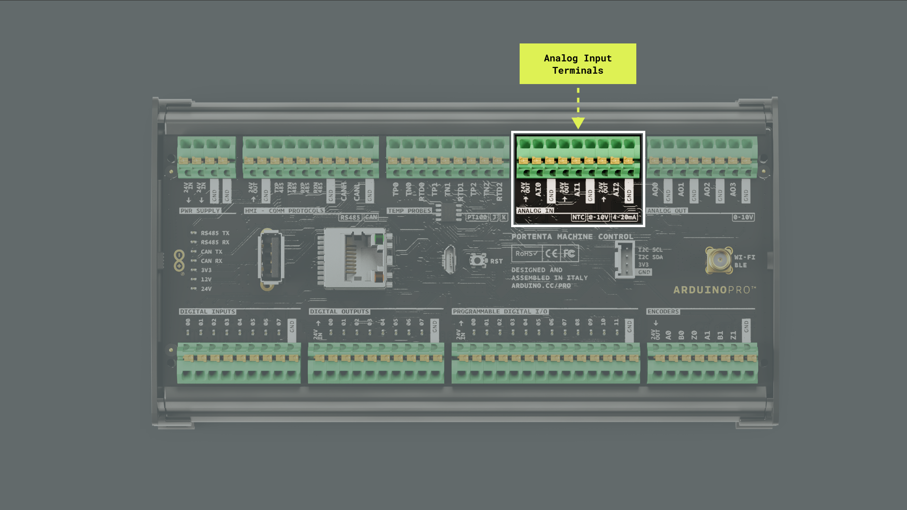

The configuration of Portenta's Machine Control analog input channels is determined by an analog switch (TS12A44514PWR), which allows switching between three different operational modes:

- **0-10V**: The analog input channel uses a resistor divider consisting of a 100 kΩ and a 39 kΩ resistor for this mode. This scales down an input voltage in the 0 VDC to 10 VDC range to a range of 0 VDC to 2.8 VDC. The resulting input impedance in this configuration is approximately 28 kΩ.
- **4-20 mA**: The analog input channel connects to a 120 Ω resistor for this mode. This configuration allows a 4 mA to 20 mA input current to be converted to a voltage in the 0.48 VDC to 2.4 VDC range.
- **NTC**: For this mode, the input is connected to a 3 VDC voltage reference (REF3330AIRSER). A 100 kΩ resistor is then placed in series, forming a part of the resistor divider powered by the voltage reference.

***Each analog input channel has an output voltage pin supplying +24 VDC for powering sensors. This pin has integrated protection through a 500 mA PTC resettable fuse.***

To use a specific operational mode with Portenta's Machine Control analog input channels, the `MachineControl_AnalogIn.begin(SensorType)` function from the `Arduino_PortentaMachineControl` library must be called before reading values from the analog input channels. Use the following constants in the `MachineControl_AnalogIn.begin(SensorType)` function to define a specific operational mode:

- `SensorType::V_0_10`: 0-10V mode
- `SensorType::MA_4_20`: 4-20mA mode
- `SensorType::NTC`: NTC mode

Below is an example sketch showcasing how to read voltages from the analog input channels set to the 0-10V mode.

```arduino
/*
  Portenta Machine Control's Analog Input 
  Name: portenta_machine_control_analog_input_simple_example.ino
  Purpose: This sketch demonstrates reading voltage values 
  from the analog input channels set in the 0-10V mode 
  of the Portenta Machine Control.

  @author Arduino PRO Content Team
  @version 1.0 01/10/23
*/

#include <Arduino_PortentaMachineControl.h>

// Define the resistor divider ratio for 0-10V input mode
const float RES_DIVIDER = 0.28057;

// Define the ADC reference voltage
const float REFERENCE   = 3.0;

void setup() {
  // Initialize serial communication at 9600 baud
  Serial.begin(9600);

  // Initialize the analog input channels of the Portenta Machine Control in 0-10V mode
  MachineControl_AnalogIn.begin(SensorType::V_0_10);
}

void loop() {
  // Loop through each analog input channel
  // Read its current voltage
  // Print the current voltage value in the IDE's Serial Monitor
  for (int i = 0; i < 3; i++) {
    float voltage = readVoltage(i);
    Serial.print("- Voltage CH");
    Serial.print(i);
    Serial.print(": ");
    Serial.print(voltage, 3);
    Serial.println(" VDC");
  }
  
  // Add a delay for readability and a separator for the next set of readings
  Serial.println();
  delay(250);
}

/**
  Reads the raw ADC value from the specified channel, then
  calculates the actual voltage using the predefined resistor 
  divider ratio and the reference voltage.
 
  @param channel (int).
  @return The calculated voltage value in volts.
*/
float readVoltage(int channel) {
  // Read the raw ADC value from the specified channel
  float raw_voltage = MachineControl_AnalogIn.read(channel);
  
  // Convert the raw ADC value to the actual voltage 
  // Use the resistor divider ratio and reference voltage 
  // Return the calculated voltage
  return (raw_voltage * REFERENCE) / 65535 / RES_DIVIDER;
}
```

Note that the example sketch uses the `MachineControl_AnalogIn.read(channel)` function to acquire the raw voltage values from each channel. These raw values are then converted to the actual voltage values using the provided `RES_DIVIDER` and `REFERENCE` constants.

## Programmable Digital I/O

The Portenta Machine Control has up to 12 programmable digital input/output channels, as shown in the image below. 

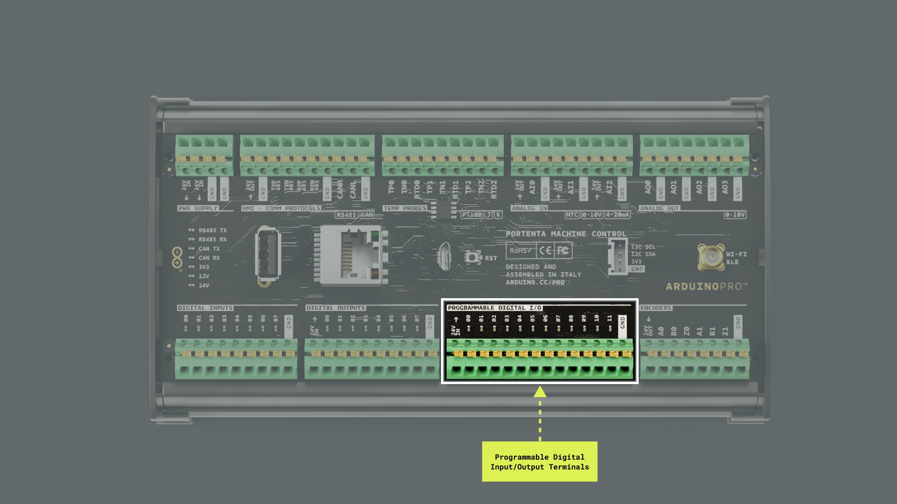

The programmable digital input/output channels are powered via three quad-channel high-side switches (TPS4H160AQPWPRQ1). Each channel comes with a nominal current value of 0.6 A. However, due to internal circuit tolerances of the high-side switches, this value can spike up to 0.9 A.

***The programmable digital input/output channels must be connected to an external +24 VDC power supply through pin `24V IN`; this power supply can be shared with the controller's +24 VDC power supply. Moreover, pin `24V IN` is not galvanically isolated, meaning the input power supply voltage must share the same `GND` as the controller.***

There are two modes of overcurrent protection in the programmable digital input/output channels:

1. **Latch mode**: The channel is deactivated once the current limit is hit. The respective channel enable pin must be toggled to reactivate the channel.
2. **Retry mode**: The channel is momentarily shut down upon reaching the current limit but reconnects briefly.

The programmable digital input/output channels integrate an internal mechanism to protect against kickback from inductive loads. Additionally, there is an external safeguard via a 60 VDC, 2 A Schottky diode (PMEG6020ER). Each of the 12 digital input channels uses a resistor divider setup consisting of a 680 kΩ and 100 kΩ resistor; this configuration scales down a 0 to 24 VDC input to a 0 to 3 VDC range. While the high-side switches function separately from the digital input channels, it is possible to read the status of the high-side switches via the digital input channels.

***Ensure each channel does not exceed a maximum current of 500 mA to avoid potential damage or malfunctions in the programmable digital input/output channels.***

The sketch below showcases using the programmable digital input/output channels of the Portenta Machine Control. This example shows how to periodically transmit values on the programmable channels and periodically read them from them.

```arduino
/*
  Portenta Machine Control's Programmable Digital I/Os
  Name: portenta_machine_control_programmable_digital_io_example.ino
  Purpose: Demonstrates the usage of the programmable digital input/output channels
  on the Portenta Machine Control. It includes initializing the channels, 
  setting digital outputs, reading digital inputs, and toggling the outputs.
  
  @author Arduino PRO Content Team
  @version 1.0 01/10/23
*/

#include <Arduino_PortentaMachineControl.h>

void setup() {
  // Initialize serial communication for debugging and displaying data
  Serial.begin(9600);
  
  // Initialize I2C communication
  Wire.begin();
  
  // Attempt to initialize the programmable digital input/output channels
  if (!MachineControl_DigitalProgrammables.begin()) {
    Serial.println("- Failed to initialize the programmable digital I/Os");
    return;
  }
  Serial.println("- Programmable digital I/Os initialized successfully!");
}

void loop() {
  // Turn ON the digital output channel 3 using the defined macro
  MachineControl_DigitalProgrammables.set(IO_WRITE_CH_PIN_03, SWITCH_ON); 
  delay(1000);

  // Read the status of digital input channel 3 using the defined macro
  int status = MachineControl_DigitalProgrammables.read(IO_READ_CH_PIN_03);
  Serial.println("- Channel 03 status: " + String(status));
  delay(1000);

  // Turn ON all digital output channels
  MachineControl_DigitalProgrammables.writeAll(SWITCH_ON_ALL);
  delay(1000);

  // Read and display the status of all digital input channels
  uint32_t inputs = MachineControl_DigitalProgrammables.readAll();
  for (int i = 0; i < 12; i++) {
    Serial.println("- CH" + formatChannel(i) + ": " + String((inputs & (1 << i)) >> i));
  }
  Serial.println();

  // Toggle the states of all digital output channels
  MachineControl_DigitalProgrammables.toggle();
  delay(1000);
  inputs = MachineControl_DigitalProgrammables.readAll();
  for (int i = 0; i < 12; i++) {
    Serial.println("- CH" + formatChannel(i) + ": " + String((inputs & (1 << i)) >> i));
  }
  Serial.println();
}

/**
  Formats the channel number with leading zeros to achieve a consistent 2-digit format

  @param channel
  @return A string with the channel number in 2-digit format.
*/
String formatChannel(int channel) {
  if(channel < 10) {
    return "0" + String(channel);
  }
  return String(channel);
}
```

The example sketch uses the `MachineControl_DigitalProgrammables.begin()`, `MachineControl_DigitalProgrammables.set(pin, state)`, `MachineControl_DigitalProgrammables.read(pin)`, `MachineControl_DigitalProgrammables.writeAll(state)`, and `MachineControl_DigitalProgrammables.readAll()` functions from the `Arduino_PortentaMachineControl` library. These functions are used to write to specific channels or all channels, read the status of a specific channel or all channels, and toggle the states of all channels. Here's an explanation of the functions:

- `MachineControl_DigitalProgrammables.begin()`: Utilized to initialize the programmable digital input/output channels, it returns a `FALSE` if the initialization fails. `MachineControl_DigitalProgrammables` is based on the I2C protocol. To work properly, it must be preceded by `Wire.begin()`, which initializes the I2C interface.
- `MachineControl_DigitalProgrammables.set(pin, state)`: Used to define a particular channel's state (ON/OFF).
- `MachineControl_DigitalProgrammables.read(pin)`: Used to discern the state of a specific channel.
- `MachineControl_DigitalProgrammables.writeAll(state)`: Used to configure the state (ON/OFF) for all available pins or channels simultaneously.
- `MachineControl_DigitalProgrammables.readAll()`: Used to read the states of all available channels collectively.
- `MachineControl_DigitalProgrammables.toggle()`: Used to invert the states of all the channels.

## Communication

This user manual section covers the different communication interfaces and protocols the Portenta Machine Control supports, including the Ethernet, RS-485, and Wi-Fi®.

### Ethernet

The Portenta Machine Control features an onboard low-power 10BASE-T/100BASE-TX Ethernet physical layer (PHY) transceiver. The transceiver complies with the IEEE 802.3 and 802.3u standards and supports communication with an Ethernet MAC through a standard RMII interface. The Ethernet transceiver is accessible through the onboard RJ45 connector.


The `Arduino Mbed OS Portenta Boards` core has a built-in library that lets you use the onboard Ethernet PHY transceiver right out of the box: the [`Ethernet` library](https://www.arduino.cc/reference/en/libraries/ethernet/). Let's use an example code demonstrating some of the transceiver's capabilities.

The sketch below enables a Portenta Machine Control to connect to the Internet via an Ethernet connection. Once connected, it performs a `GET` request to the `ip-api.com` service to fetch details about the device's IP address. It then parses the received JSON object using the [`Arduino_JSON` library](https://github.com/arduino-libraries/Arduino_JSON) to extract key IP details: IP address, city, region, and country. This data is then printed to the Arduino IDE's Serial Monitor.

```arduino
/**
  Web Client (Ethernet version)
  Name: portenta_machine_control_ethernet_web_client.ino
  Purpose: This sketch connects a Portenta Machine Control
  to ip-api.com via Ethernet and fetches IP details for 
  the controller.

  @author Arduino PRO Content Team
  @version 1.0 01/10/23
*/

// Include the necessary libraries.
#include <Ethernet.h>
#include <Arduino_JSON.h>

// Server address for ip-api.com.
const char* server = "ip-api.com";

// API endpoint path to get IP details in JSON format.
String path = "/json/";

// Static IP configuration for the Portenta Machine Control device.
IPAddress ip(10, 130, 22, 84);

// Ethernet client instance for the communication.
EthernetClient client;

// JSON variable to store and process the fetched data.
JSONVar doc;

// Variable to ensure we fetch data only once.
bool dataFetched = false;

void setup() {
  // Begin serial communication at a baud rate of 115200.
  Serial.begin(115200);

  // Wait for the serial port to connect,
  // This is necessary for boards that have native USB.
  while (!Serial);

  // Attempt to start Ethernet connection via DHCP,
  // If DHCP failed, print a diagnostic message.
  if (Ethernet.begin() == 0) {
    Serial.println("- Failed to configure Ethernet using DHCP!");

    // Try to configure Ethernet with the predefined static IP address.
    Ethernet.begin(ip);
  }
  delay(2000);
}

void loop() {
  // Ensure we haven't fetched data already,
  // ensure the Ethernet link is active,
  // establish a connection to the server,
  // compose and send the HTTP GET request.
  if (!dataFetched) {
    if (Ethernet.linkStatus() == LinkON) {
      if (client.connect(server, 80)) {
        client.print("GET ");
        client.print(path);
        client.println(" HTTP/1.1");
        client.print("Host: ");
        client.println(server);
        client.println("Connection: close");
        client.println();

        // Wait and skip the HTTP headers to get to the JSON data.
        char endOfHeaders[] = "\r\n\r\n";
        client.find(endOfHeaders);

        // Read and parse the JSON response.
        String payload = client.readString();
        doc = JSON.parse(payload);

        // Check if the parsing was successful.
        if (JSON.typeof(doc) == "undefined") {
          Serial.println("- Parsing failed!");
          return;
        }

        // Extract and print the IP details.
        Serial.println("*** IP Details:");
        Serial.print("- IP Address: ");
        Serial.println((const char*)doc["query"]);
        Serial.print("- City: ");
        Serial.println((const char*)doc["city"]);
        Serial.print("- Region: ");
        Serial.println((const char*)doc["regionName"]);
        Serial.print("- Country: ");
        Serial.println((const char*)doc["country"]);
        Serial.println("");

        // Mark data as fetched.
        dataFetched = true;
      }
      // Close the client connection once done.
      client.stop();
    } else {
      Serial.println("- Ethernet link disconnected!");
    }
  }
}
```

The sketch includes the `Ethernet` and `Arduino_JSON` libraries, ehich are essential for Ethernet and JSON handling functionality. In the `setup()` function, serial communication is initiated for debugging and output. Instead of DHCP, the Ethernet connection uses a predefined static IP address.

Once the Ethernet connection runs, the sketch connects to the `ip-api.com` service, utilizing the HTTP protocol. Specifically, an `HTTP GET` request is crafted to retrieve details about the device's IP address, including its city, region, and country. If the connection to the server fails, the sketch will output an error message to the Arduino IDE's Serial Monitor for troubleshooting.

Within the `loop()` function, an `HTTP GET` request is sent to the `ip-api.com` service once. The sketch then waits for and skips the response's HTTP headers, parsing the following JSON payload.

Key IP details such as IP address, city, region, and country are extracted and then displayed in the IDE's Serial Monitor using the parsed data. If the Ethernet link happens to be disconnected, a corresponding message is printed to the Serial Monitor. Should the JSON parsing fail, an error message is showcased on the IDE's Serial Monitor, prompting the sketch to exit the current iteration of the `loop()` function immediately.

You should see the following output in the Arduino IDE's Serial Monitor:


### Wi-Fi®

The Portenta Machine Control features an onboard Wi-Fi® module that provides seamless wireless connectivity, allowing it to connect to Wi-Fi® networks and interact with other devices over-the-air (OTA).

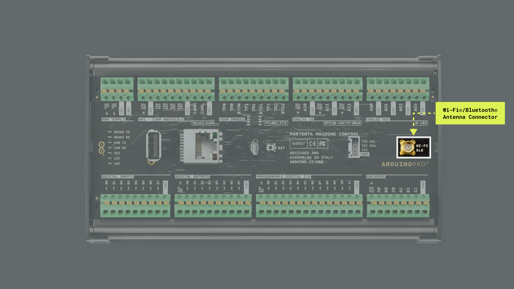

Some of the key capabilities of Portenta's Machine Control onboard Wi-Fi® module are the following:

- **Wireless connectivity**: The onboard Wi-Fi® module supports IEEE 802.11b/g/n Wi-Fi® standards, enabling devices to establish reliable and high-speed wireless connections to access the Internet and communicate with other devices.
- **Secure communication**: The onboard module incorporates various security protocols such as WEP, WPA, WPA2, and WPA3, ensuring robust data encryption and protection against unauthorized access during wireless communication.
- **Onboard antenna**: Portenta Machine Control devices feature an onboard vertical SMA antenna connector (5-1814832-2) specifically matched for the onboard Wi-Fi® module RF requirements.

The `Arduino Mbed OS Portenta Boards` core has a built-in library that lets you use the onboard Wi-Fi® module right out of the box: the [`WiFi` library](https://www.arduino.cc/reference/en/libraries/wifi/). Let's walk through an example code demonstrating some of the module's capabilities.

The sketch below enables a Portenta Machine Control device to connect to the Internet via Wi-Fi® (like the Ethernet example). Once connected, it performs a `GET` request to the [`ip-api.com`](https://ip-api.com/) server to fetch details related to its IP address. It then parses the received JSON object using the [`Arduino_JSON` library](https://github.com/arduino-libraries/Arduino_JSON) to extract key IP details: IP address, city, region, and country. This data is then printed to the Arduino IDE's Serial Monitor.

You need to create first a header file named `arduino_secrets.h` to store your Wi-Fi® network credentials. To do this, add a new tab by clicking the ellipsis (the three horizontal dots) button on the top right of the Arduino IDE 2.


Put `arduino_secrets.h` as the "Name for new file" and enter the following code on the header file:

```arduino
#define SECRET_SSID "YOUR_SSID"; // Your network SSID (name)
#define SECRET_PASS "YOUR_PASS"; // Your network password (use for WPA, or use as key for WEP)
```

Replace `YOUR_SSID` with the name of your Wi-Fi® network and `YOUR_PASS` with the password of it and save the project. The example code is as follows: 

```arduino
/**
  WiFi Web Client
  Name: portenta_machine_control_wifi_web_client.ino
  Purpose: This sketch connects a Portenta Machine Control to ip-api.com via Wi-Fi
  and fetches IP details.

  @author Arduino PRO Content Team
  @version 1.0 01/10/23
*/

#include <WiFi.h>
#include <Arduino_JSON.h>

// Wi-Fi network details.
char ssid[]     = SECRET_SSID;
char password[] = SECRET_PASS;º

// Server address for ip-api.com.
const char* server = "ip-api.com";

// API endpoint path to get IP details in JSON format.
String path = "/json";

// Wi-Fi client instance for the communication.
WiFiClient client;

// JSON variable to store and process the fetched data.
JSONVar doc;

// Variable to ensure we fetch data only once.
bool dataFetched = false;

void setup() {
  // Begin serial communication at a baud rate of 115200.
  Serial.begin(115200);

  // Wait for the serial port to connect,
  // This is necessary for boards that have native USB.
  while (!Serial);

  // Start the Wi-Fi connection using the provided SSID and password.
  Serial.print("- Connecting to ");
  Serial.println(ssid);
  WiFi.begin(ssid, password);

  while (WiFi.status() != WL_CONNECTED) {
    delay(1000);
    Serial.print(".");
  }

  Serial.println();
  Serial.println("- Wi-Fi connected!");
  Serial.print("- IP address: ");
  Serial.println(WiFi.localIP());
  Serial.println();
}

void loop() {
  // Check if the IP details have been fetched.
  // If not, call the function to fetch IP details,
  // Set the flag to true after fetching.
  if (!dataFetched) {
    fetchIPDetails();
    dataFetched = true;
  }
}

/**
  Fetch IP details from defined server

  @param none
  @return IP details
*/
void fetchIPDetails() {
  if (client.connect(server, 80)) {
    // Compose and send the HTTP GET request.
    client.print("GET ");
    client.print(path);
    client.println(" HTTP/1.1");
    client.print("Host: ");
    client.println(server);
    client.println("Connection: close");
    client.println();

    // Wait and skip the HTTP headers to get to the JSON data.
    char endOfHeaders[] = "\r\n\r\n";
    client.find(endOfHeaders);

    // Read and parse the JSON response.
    String payload = client.readStringUntil('\n');
    doc = JSON.parse(payload);

    // Check if the parsing was successful. 
    if (JSON.typeof(doc) == "undefined") {
      Serial.println("- Parsing failed!");
      return;
    }

    // Extract and print the IP details.
    Serial.println("*** IP Details:");
    String query = doc["query"];
    Serial.print("- IP Address: ");
    Serial.println(query);
    String city = doc["city"];
    Serial.print("- City: ");
    Serial.println(city);
    String region = doc["regionName"];
    Serial.print("- Region: ");
    Serial.println(region);
    String country = doc["country"];
    Serial.print("- Country: ");
    Serial.println(country);
    Serial.println("");
  } else {
    Serial.println("- Failed to connect to server!");
  }

  // Close the client connection once done. 
  client.stop();
}
```

The sketch includes the `WiFi` and `Arduino_JSON`, which provide the necessary Wi-Fi® and JSON handling functionality. The `setup()` function initiates serial communication for debugging purposes and attempts to connect to a specified Wi-Fi® network. If the connection is not established, the sketch will keep trying until a successful connection is made.

Once the Wi-Fi® connection is established, the sketch is ready to connect to the `ip-api.com` server using the HTTP protocol. Specifically, an `HTTP GET` request is constructed to query details related to its IP address. The `GET` request is sent only once after the Wi-Fi® connection is active.

The `loop()` function is the heart of the sketch. It checks whether the data has been fetched or not. If the data still needs to be fetched, it tries to establish a connection to the server. If the connection is successful, the sketch sends an `HTTP GET` request, skips the HTTP headers of the response, and uses the `JSON.parse()` function from the `Arduino_JSON` library to parse the JSON object from the response. The parsed data extracts key IP details like IP address, city, region, and country, which are then printed to the Arduino IDE's Serial Monitor. Once the data is published, the client is disconnected to free up resources. Suppose the JSON parsing fails for any reason. In that case, an error message is outputted to the Arduino IDE's Serial Monitor, and the sketch immediately exits the current iteration of the `loop()` function.

Since the data is fetched only once, there's no need to send `HTTP GET` requests repeatedly. After the initial fetch, you should see the details related to the IP address displayed in the Arduino IDE's Serial Monitor:


### RS-485

The Portenta Machine Control has a built-in RS-485 interface that enables the implementation of robust and reliable data transmission systems. RS-485 interface is still the most widely used protocol for Point Of Sale (POS), industrial, and telecommunications applications. The wide common-mode range enables data transmission over longer cable lengths and in noisy environments such as the floor of a factory. Also, the high input impedance of the receivers allows more devices to be attached to the lines.

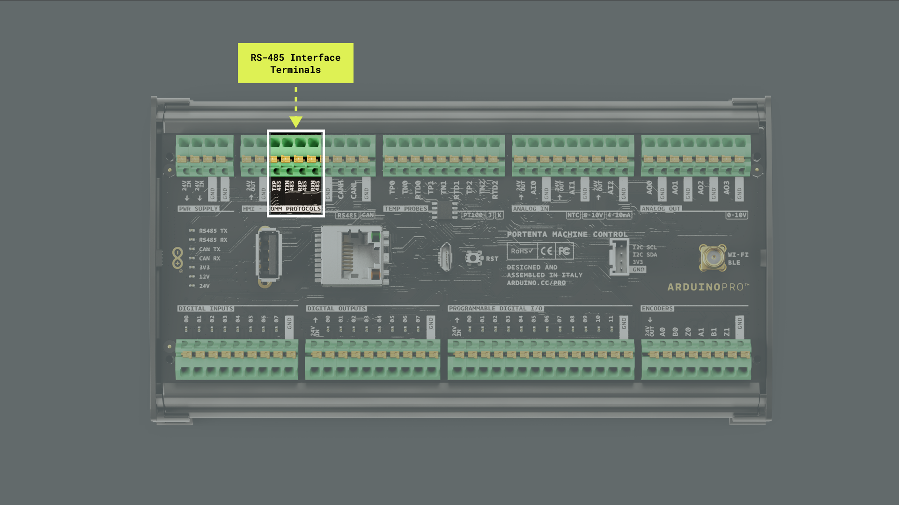

The onboard RS-485 transceiver is the SP335 from MaxLinear. The SP335 is an advanced multiprotocol transceiver that supports RS-232, RS-485, and RS-422 serial standards. Integrated cable termination and multiple configuration modes allow all three protocols to be used interchangeably over a single cable or connector with no additional switching components.

***The Portenta Machine Control has onboard termination resistors; its RS-485 interface can be configurable to be half duplex or full duplex.***

Some of the key capabilities of Portenta's Machine Control onboard RS-485 transceiver are the following:

- **High-speed operation**: The RS-485 transceiver can operate up to 20 Mbps.
- **EMI Reduction**: The slew rate is limited to 250 kbps to minimize electromagnetic interference (EMI), enhancing signal integrity.
- **ESD protection**: Transmitter outputs and receiver inputs are protected against electrostatic discharge (ESD) up to ±15 kV.
- **High impedance**: The transceiver inputs exhibit high impedance, allowing up to 256 devices on a single communication bus.
- **Communication mode**: The transceiver can be configured either half or full-duplex.
- **Termination resistors**: 120 Ω termination resistors are integrated and can be connected or disconnected through software. 

RS-485 data lines in the Portenta Machine Control are labeled as described in the following table:

***RS-485 data line labels differ between manufacturers. Most manufacturers will use + and – to label the data lines or variations such as D+ and D-. Some manufacturers will label inputs as A and B but get the polarity backward, so A is positive and B negative. Although predicting how other manufacturers will mark these lines is impossible, practical experience suggests that the - line should be connected to the A terminal. The + line should be connected to the B terminal. Reversing the polarity will not damage an RS-485 device but will not communicate.***

The example sketch below shows how to use the RS-485 interface of the Portenta Machine Control for half-duplex communication.

```arduino
/*
  Portenta Machine Control's RS-485 Half-Duplex Communication
  Name: portenta_machine_control_rs485_example.ino
  Purpose: Demonstrates half-duplex RS-485 communication using
  the Portenta Machine Control.

  @author Arduino PRO Content Team
  @version 1.0 01/10/23
*/

// Include the necessary libraries
#include <Arduino_PortentaMachineControl.h>

// Define the interval for sending messages
constexpr unsigned long sendInterval { 1000 };
unsigned long sendNow { 0 };
unsigned long counter { 0 }; 

void setup() {
    // Begin serial communication at a baud rate of 9600
    Serial.begin(9600);

    // Wait for the serial port to connect,
    // This is necessary for boards that have native USB
    while (!Serial);

    Serial.println("- Initializing RS-485 interface...");

    // Initialize the RS-485 interface with a baud rate of 115200 and specific timings
    // The timings define the preamble and postamble durations for RS-485 communication
    MachineControl_RS485Comm.begin(115200, 0, 500);

    // Set the RS-485 interface in receive mode initially
    MachineControl_RS485Comm.receive();
    Serial.println("- RS-485 initialization complete!");
}

void loop() {
  // Check if there is incoming data and read it
  if (MachineControl_RS485Comm.available()) {
    Serial.write(MachineControl_RS485Comm.read());
  }

  // Send data at defined intervals
  if (millis() > sendNow) {
    // Disable receive mode before starting the transmission
    MachineControl_RS485Comm.noReceive();

    // Begin transmission and send a message with a counter
    MachineControl_RS485Comm.beginTransmission();
    MachineControl_RS485Comm.print("- Message: ");
    MachineControl_RS485Comm.println(counter++);

    // End the transmission and switch back to receive mode
    MachineControl_RS485Comm.endTransmission();
    MachineControl_RS485Comm.receive();

    // Update the time for the next transmission
    sendNow = millis() + sendInterval;
  }
}
```

In this example sketch, a message is periodically sent over the RS-485 interface Of the Portenta Machine Control. The sketch initializes the RS-485 interface for half-duplex communication and sends a `String` message with a counter. After each transmission, it switches back to receive mode to listen for incoming data.

The example sketch uses the `MachineControl_RS485Comm.begin()`, `MachineControl_RS485Comm.receive()`, and other functions from the `Arduino_PortentaMachineControl` library for RS-485 communication. Here is an explanation of the functions:

- `MachineControl_RS485Comm.begin(baud, pre, post)`: Initializes the RS-485 module with specified baud rate and timing settings.
- `MachineControl_RS485Comm.receive()`: Puts the module in receive mode.
- `MachineControl_RS485Comm.noReceive()`: Disables receive mode for transmission.
- `MachineControl_RS485Comm.beginTransmission()`: Prepares the module to start transmitting data.
- `MachineControl_RS485Comm.endTransmission()`: Ends data transmission and prepares the module to receive data.
- `MachineControl_RS485Comm.available()`: Checks if data can be read.
- `MachineControl_RS485Comm.read()`: Reads incoming data.

**Note**: To receive and show the messages on your computer, you can use a USB to RS-485 converter, such as [the converter used by the Arduino Pro Content Team](https://www.waveshare.com/usb-to-rs485.htm). You can use the Arduino IDE's Serial Monitor to display the messages received in the converter or another serial terminal such as [CoolTerm](https://freeware.the-meiers.org/), a simple and cross-platform (Windows, Mac, and Linux) serial port terminal application (no terminal emulation) that is geared towards hobbyists and professionals.

As a practical example, we will **establish a full duplex communication between the Portenta Machine Control and a Portenta Max Carrier paired with a Portenta H7 board**. Follow the wiring below for the RS-485 full-duplex communication.

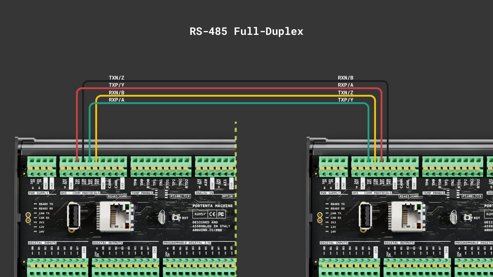

For the Portenta Machine Control, use the example sketch shown below; it can also be found on the Arduino IDE by navigating to **File > Examples > Arduino_MachineControl > RS485_fullduplex**.

```arduino
/*
 * Portenta Machine Control's RS-485 Full Duplex Communication
 * Name: portenta_machine_control_rs485_full_duplex_example.ino
 * Purpose: Demonstrates full duplex RS-485 communication using
 * the Portenta Machine Control. The sketch shows how to send 
 * and receive data periodically on the RS-485 interface.
 *
 * @author Riccardo Rizzo, modified by Arduino PRO Content Team
 * @version 1.0 01/10/23
 */

// Include the necessary libraries
#include "Arduino_PortentaMachineControl.h"

// Define the interval for sending messages
constexpr unsigned long sendInterval { 1000 };
unsigned long sendNow { 0 };
unsigned long counter = 0;

void setup() {
  // Begin serial communication at a baud rate of 9600
  Serial.begin(9600);
  // Wait for the serial port to connect
  while (!Serial);

  Serial.println("- Start RS485 initialization...");

  // Initialize the RS-485 interface with specific settings
  // Specify baud rate, preamble and postamble times for RS-485 communication
  MachineControl_RS485Comm.begin(115200, 0, 500);

  // Enable full duplex mode and 120 Ohm termination resistors
  MachineControl_RS485Comm.setFullDuplex(true);
    
  // Set the RS-485 interface in receive mode initially
  MachineControl_RS485Comm.receive();
    
  Serial.println("- Initialization done!");
}

void loop() {
  // Check if there is incoming data and read it
  if (MachineControl_RS485Comm.available())
    Serial.write(MachineControl_RS485Comm.read());

  // Send data at defined intervals
  if (millis() > sendNow) {
    // Disable receive mode before starting the transmission
    MachineControl_RS485Comm.noReceive();

    // Begin transmission and send a message with a counter
    MachineControl_RS485Comm.beginTransmission();
    MachineControl_RS485Comm.print("- Hello ");
    MachineControl_RS485Comm.println(counter++);

    // End the transmission and switch back to receive mode
    MachineControl_RS485Comm.endTransmission();
        
    // Re-enable receive mode after transmission
    MachineControl_RS485Comm.receive();

    // Update the time for the next transmission
    sendNow = millis() + sendInterval;
  }
}
```

For the Portenta H7 board paired with the Portenta Max Carrier, use the following example sketch:

```arduino
 /*
 * Portenta H7 RS-485 Full Duplex Communication
 * Name: portenta_h7_rs485_full_duplex_example.ino
 * Purpose: Demonstrates full duplex RS-485 communication using
 * the Portenta Portenta H7 (on Portenta Max Carrier) and the 
 * Portenta Machine Control. The sketch demonstrates how to send 
 * and receive data periodically on the RS-485 interface.
 *
 * @author Arduino PRO Content Team
 * @version 1.0 01/10/23
 */

// Include the necessary libraries
#include <ArduinoRS485.h>

// Define the interval for sending messages
constexpr unsigned long sendInterval{ 1000 };
unsigned long sendNow{ 0 };
int counter = 0;

arduino::UART _UART4_{ PA_0, PI_9, NC, NC };
RS485Class rs485{ _UART4_, PA_0, PI_10, PJ_10 };  // UART4, TX, CTS, RTS

void setup() {
  // Initialize RS-485 with default settings for the Portenta H7 and the Portenta Max Carrier
  RS485init();
  delay(1000);

  // Enable RS-485 interface
  rs485Enable(true);

  // Enable full duplex mode with A/B and Y/Z 120 Ohm termination resistors
  rs485FullDuplex(true);

  // Initialize RS-485 communication with specific baudrate and timing
  rs485.begin(115200, 0, 500);

  // Start in receive mode for communication with the Portenta Machine Control
  rs485.receive();
}

void loop() {
  // Read incoming data from the Portenta Machine Control
  if (rs485.available()) {
    Serial.write(rs485.read());
  }

  // Send data at defined intervals to Portenta Machine Control
  if (millis() > sendNow) {
    // Prepare for sending data
    rs485.noReceive();  

    rs485.beginTransmission();
    rs485.print("- Hello I'm Max! ");
    rs485.println(counter++);

    // End of data transmission
    rs485.endTransmission();

    // Switch back to receive mode and schedule next transmission
    rs485.receive(); 
    sendNow = millis() + sendInterval;
  }
}

/**
  Initializes the RS-485 settings for the Portenta H7 and Portenta Max Carrier.

  Sets the initial state of the RS-485 communication interface and configures
  the communication mode and termination resistors.
*/
void RS485init() {
    rs485Enable(false);
    rs485ModeRS232(false);
    rs485FullDuplex(false);
    rs485YZTerm(false);
    rs485ABTerm(false);
}

/**
  Enables or disables the RS-485 communication interface.
  Set to true to enable the RS-485 interface, or false to disable it.

  @param enable (bool)
*/
void rs485Enable(bool enable) {
    digitalWrite(PC_7, enable ? HIGH : LOW);
}

/**
  Sets the communication mode to RS232 or RS485.
  Set to true to enable RS232 mode, or false for RS485 mode.

  @param enable (bool)
*/
void rs485ModeRS232(bool enable) {
    digitalWrite(PC_6, enable ? LOW : HIGH);
}

/**
  Enables or disables the YZ termination resistors for RS-485 communication.
  Set to true to enable YZ termination resistors, or false to disable them.

  @param enable (bool)
*/
void rs485YZTerm(bool enable) {
    digitalWrite(PG_3, enable ? HIGH : LOW);
}

/**
  Enables or disables the AB termination resistors for RS-485 communication.
  Set to true to enable AB termination resistors, or false to disable them.

  @param enable (bool)
*/
void rs485ABTerm(bool enable) {
    digitalWrite(PJ_7, enable ? HIGH : LOW);
}

/**
  Sets the RS485 communication to full duplex mode.
  Set to true to enable full duplex mode, or false for half duplex.

  @param enable (bool)
*/
void rs485FullDuplex(bool enable) {
    digitalWrite(PA_8, enable ? LOW : HIGH);
    if (enable) {
        // RS485 Full Duplex requires YZ and AB 120 Ohm termination enabled
        rs485YZTerm(true);
        rs485ABTerm(true);
    }
}
```

Both, the Portenta Max Carrier and the Portenta Machine Control will send and receive messages respectively through the RS-485 interface and will print them in the IDE's Serial Monitor as shown in the animation below. 


### Modbus (RTU/TCP)

The Portenta Machine Control incorporate a built-in Modbus interface, enabling the implementation of robust and reliable data transmission systems. Modbus, in its RTU version that operates RS-485 serial transmission or in its TCP version that works over Ethernet, remains one of the most widely used protocols for industrial automation applications, building management systems, and process control, among others.

Modbus RTU, generally operating in half-duplex mode, with its capability to handle noisy and long-distance transmission lines, makes it an excellent choice for industrial environments. Modbus RTU communication is supported using Portenta's Machine Control RS-485 physical interface.

***The Portenta Machine Control has onboard termination resistors; its RS-485 interface can be configured as a half or full duplex.***

Modbus TCP, taking advantage of Ethernet connectivity, allows easy integration with existing computer networks and facilitates data communication over long distances using the existing network infrastructure. It operates in full-duplex mode, allowing simultaneous sending and receiving of data.

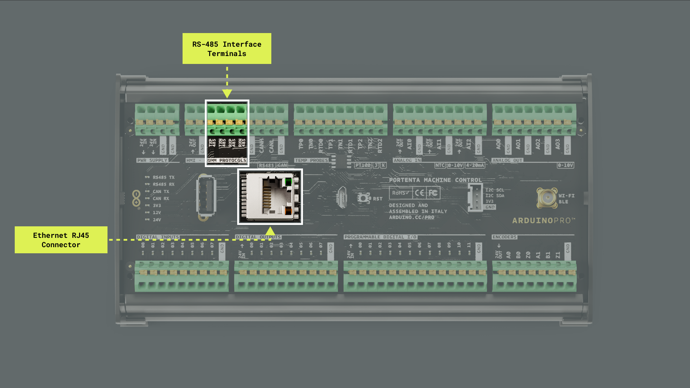

The many nodes connected in a Modbus network, whether RTU or TCP, allow high flexibility and scalability in constructing automation and control systems.

To use the Modbus protocol with your Portenta Machine Control, you will need the [`ArduinoRS485`](https://github.com/arduino-libraries/ArduinoRS485) and [`ArduinoModbus`](https://github.com/arduino-libraries/ArduinoModbus) libraries. You can install them via the Library Manager of the Arduino IDE.

The example below shows how to communicate a Portenta Machine Control with an Opta™ device via Modbus TCP. For wiring both devices, we have two options:

1. A direct connection between the Portenta Machine Control and the Opta™ device through an Ethernet cable.
2. Individually connect each device to an internet router via Ethernet cables.

We will use the second option since it will allow us to escalate the application by adding more devices to the network.


The following example code will let PMC control an Opta™ LED through the Modbus TCP protocol. The Portenta Machine Control will be the **client**, and the Opta™ device will be the **server**; as they are both connected to the internet router, IP addresses are the way for them to route their messages. 

We can define a **Static** or **DHCP** IP address to them using the function `Ethernet.begin()` as follows:

```arduino
// DHCP (will assign an IP automatically)
Ethernet.begin();

// Static IP 
Ethernet.begin(<mac>, <IP>);
```

***The client must know the server IP to establish communication between them.***

For the Portenta Machine Control defined as the client, use the example sketch shown below:

```arduino
/*
  Portenta Machine Control's Modbus TCP Communication
  Name: portenta_machine_control_modbus_tcp_example.ino
  Purpose: Demonstrates controlling an Opta™ device using Modbus TCP protocol
  on the Portenta Machine Control.

  @author Arduino PRO Content Team
  @version 1.0 01/10/23
*/

// Include necessary libraries for Ethernet and Modbus communication
#include <SPI.h>
#include <Ethernet.h>
#include <ArduinoRS485.h>
#include <ArduinoModbus.h>

EthernetClient ethClient;
ModbusTCPClient modbusTCPClient(ethClient);

// Define the IP address for the Portenta Machine Control
IPAddress ip(10, 0, 0, 157);

// Define the IP Address of the Modbus TCP server (Opta device)
IPAddress server(10, 0, 0, 227);

void setup() {
    // Begin serial communication at 9600 baud for debugging
    // Wait for the serial port to connect
    Serial.begin(9600);
    while (!Serial);

    // Initialize Ethernet connection with the specified IP address
    // Using NULL for MAC to auto-assign the device's MAC address
    Ethernet.begin(NULL, ip); 

    // Check Ethernet hardware presence
    if (Ethernet.hardwareStatus() == EthernetNoHardware) {
        Serial.println("- Ethernet shield was not found!");
        while (true);
    }

    // Check Ethernet cable connection
    if (Ethernet.linkStatus() == LinkOFF) {
        Serial.println("- Ethernet cable is not connected!");
    }
}

void loop() {
    // Attempt to connect to Modbus TCP server if not already connected
    if (!modbusTCPClient.connected()) {
        Serial.println("- Attempting to connect to Modbus TCP server...");

        // Start Modbus TCP client
        if (!modbusTCPClient.begin(server, 502)) {
            Serial.println("- Failed to connect to Modbus TCP server!");
        } else {
            Serial.println("- Connected to Modbus TCP server!");
        }
    } else {
        // Modbus TCP client is connected, perform communication
        // Write a value to a coil at address 0x00
        if (!modbusTCPClient.coilWrite(0x00, 0x01)) {
            Serial.print("- Failed to write coil: ");
            Serial.println(modbusTCPClient.lastError());
        }

        // Wait for a second
        delay(1000);

        // Reset the coil at address 0x00
        if (!modbusTCPClient.coilWrite(0x00, 0x00)) {
            Serial.print("- Failed to reset coil: ");
            Serial.println(modbusTCPClient.lastError());
        }

        // Wait for a second
        delay(1000); 
    }
}
```

For the Opta™ device defined as the server, use the example sketch shown below:

```arduino
/*
  Modbus TCP Server Example with Opta
  Name: opta_modbus_tcp_server.ino
  Purpose: Demonstrates setting up a Modbus TCP server on an Opta device
  to control an LED using Modbus TCP protocol.

  @author Arduino PRO Content Team
  @version 1.0 01/10/23
*/

#include <SPI.h>
#include <Ethernet.h>
#include <ArduinoRS485.h>
#include <ArduinoModbus.h>

// Define the IP address for the Modbus TCP server
IPAddress ip(10, 0, 0, 227);

// Server will listen on Modbus TCP standard port 502
EthernetServer ethServer(502); 

// Create a Modbus TCP server instance
ModbusTCPServer modbusTCPServer;

// Define the LED
const int ledPin = LED_BUILTIN; 

void setup() {
  // Initialize serial communication and Ethernet connection
  Serial.begin(9600);
  // Wait for the serial port to connect
  // Initialize Ethernet with the specified IP address
  while (!Serial);
  Ethernet.begin(NULL, ip); 

  // Check Ethernet hardware and cable connections
  if (Ethernet.hardwareStatus() == EthernetNoHardware) {
    Serial.println("- Ethernet shield not found!");
    while (true);
  }
  if (Ethernet.linkStatus() == LinkOFF) {
    Serial.println("- Ethernet cable not connected!");
  }

  // Start the Modbus TCP server
  ethServer.begin();
  if (!modbusTCPServer.begin()) {
    Serial.println("- Failed to start Modbus TCP Server!");
    while (1);
  }

  // Configure the LED as an output
  // Ensure LED is off initially
  pinMode(ledPin, OUTPUT);
  digitalWrite(ledPin, LOW);

  // Configure a single coil at address 0x00 for Modbus communication
  modbusTCPServer.configureCoils(0x00, 1);
}

void loop() {
  // Handle incoming client connections and process Modbus requests
  EthernetClient client = ethServer.available();
  if (client) {
    Serial.println("- Client connected!");

    // Accept and handle the client connection for Modbus communication
    modbusTCPServer.accept(client);

    // Update the LED state based on Modbus coil value
    while (client.connected()) {
      // Process Modbus requests
      // Update the LED
      modbusTCPServer.poll(); 
      updateLED();
    }

    Serial.println("Client disconnected.");
  }
}

/**
  * Updates the LED state based on the Modbus coil value.
  * Reads the current value of the coil from the Modbus TCP 
  * server and sets the LED state. If the coil value is high, 
  * the LED is turned on. If it is low, the LED is turned off.
  *
  * @param None
  */
void updateLED() {
  // Read the current value of the coil at address 0x00
  int coilValue = modbusTCPServer.coilRead(0x00);

  // Set the LED state: HIGH if coil value is 1, LOW if coil value is 0
  digitalWrite(ledPin, coilValue ? HIGH : LOW);
}
```
You should see the Opta™ device LED turn on and off as shown below:


### CAN Bus

The Portenta Machine Control features a built-in CAN bus interface, enabling the implementation of robust and reliable data transmission systems in automotive and industrial automation applications. The CAN bus is widely used due to its ability to operate effectively in electrically noisy environments and its communication method that reduces errors.

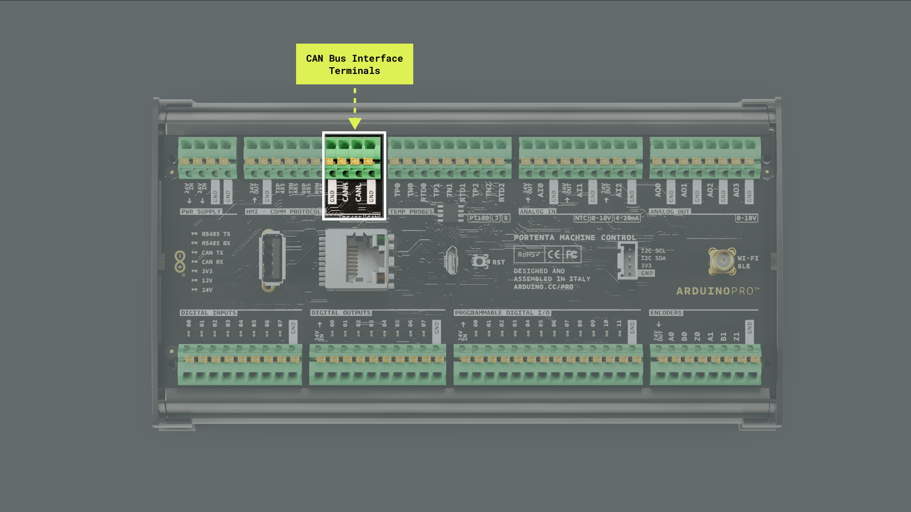

The onboard CAN transceiver of the Portenta Machine Control is the TJA1049 from NXP®. The TJA1049 is a specialized high-speed CAN transceiver for various applications, especially in automotive and high-speed CAN networks. The third-generation device offers enhanced electromagnetic compatibility (EMC) and ESD protection. This transceiver also features a low-current standby mode with a wake-up function and is compatible with microcontrollers ranging from 3 to 5 VDC. Adhering to the ISO11898 standard, the TJA1049 ensures reliable communication at data rates up to 5 Mbps, making it an optimal choice for High-Speed (HS) CAN networks that require efficient low-power operation modes.

Some of the key capabilities of the onboard CAN transceiver in the Portenta Machine Control include:

- **High-speed operation**: The onboard transceiver can operate at bit rates up to 5 Mbps.
- **Noise tolerance**: The onboard transceiver is designed to function reliably in environments with high electromagnetic interference.
- **Low-current standby mode with wake-up functionality**: The onboard transceiver features a low-power standby mode, which includes efficient wake-up capabilities, crucial for energy-efficient applications.
- **Compliance with ISO11898 standard**: Adhering to the ISO11898 standard, the TJA1049 ensures reliable communication at data rates up to 5 Mbit/s, making it ideal for HS CAN networks operating in low-power modes.

The example sketch below shows how to use the CAN bus interface of the Portenta Machine Control to transmit data.

```arduino
/*
  Portenta Machine Control's CAN Bus Communication
  Name: portenta_machine_control_can_example.ino
  Purpose: Demonstrates data transmission using the CAN bus
  interface on the Portenta Machine Control.

  @author Arduino PRO Content Team
  @version 1.0 01/10/23
*/

// Include necessary libraries
#include <Arduino_PortentaMachineControl.h>

// Define the CAN message ID and message counter
static uint32_t const CAN_ID = 13ul;
static uint32_t msg_cnt = 0;

void setup() {
    // Begin serial communication at 9600 baud
    Serial.begin(9600);
    while (!Serial); // Wait for the serial port to connect

    // Initialize the CAN interface with a bit rate of 500 kbps
    if (!MachineControl_CANComm.begin(CanBitRate::BR_500k)) {
        Serial.println("- CAN init failed!");
        while(1);
    }
}

void loop() {
  // Assemble the CAN message
  uint8_t const msg_data[] = {0x01, 0x02, 0x03, 0x04, 0x05, 0x06, 0x07, 0x08};
  CanMsg msg(CAN_ID, sizeof(msg_data), msg_data);

  // Transmit the CAN message
  int const rc = MachineControl_CANComm.write(msg);
  if (rc <= 0) {
    Serial.print("- CAN write failed with error code: ");
    Serial.println(rc);
    while(1);
  }

  // CAN message sent
  Serial.println("- CAN write message!");

  // Increase the message counter
  msg_cnt++;

  // Send a message every second
  delay(1000);
}
```

The example sketch uses the `MachineControl_CANComm.begin()`, `MachineControl_CANComm.write()`, and other functions from the `Arduino_PortentaMachineControl` library for CAN communication. Here is an explanation of these functions:

- `MachineControl_CANComm.begin(bitRate)`: Initializes the CAN module with a specified bit rate.
- `MachineControl_CANComm.write(msg)`: Transmits a data message over the CAN network. The `msg` parameter contains the data to be sent.
- `MachineControl_CANComm.available()`: Checks if data is available on the CAN bus to be read.
- `MachineControl_CANComm.read()`: Reads incoming data from the CAN bus. This function is used to retrieve data that has been received.
- `MachineControl_CANComm.end()`: This function can disable the CAN module when it's no longer needed, helping conserve power.

Now, as a practical example we are going to establish a CAN communication between the Machine Control and a Max Carrier with a Portenta C33.

Follow the wiring below for the CAN communication.


***For stable CAN bus communication, it is recommended to install 120 Ω termination resistors between CANH and CANL lines, Machine Control has it built-in.***

For the Machine Control, use the example code used above to transmit data, it also can be found on **File > Examples > Arduino_MachineControl > CAN > WriteCan**.

For the C33 on the Max Carrier, install the `Arduino_CAN` library from the library manager and use the following example sketch (it can also be found on **File > Examples > Arduino_CAN > CANRead**):

```arduino
#include <Arduino_CAN.h>

void setup()
{
  Serial.begin(115200);
  while (!Serial) { }

  if (!CAN.begin(CanBitRate::BR_500k))
  {
    Serial.println("CAN.begin(...) failed.");
    for (;;) {}
  }
}

void loop()
{
  if (CAN.available())
  {
    CanMsg const msg = CAN.read();
    Serial.println(msg);
  }
}
```

The Machine Control will send messages continuously to the Max Carrier through the CAN protocol, the received message will be printed in the Portenta C33 Serial Monitor. 


**Note**: To receive and show the messages on your computer, you can use a USB to CAN bus converter, such as [the converter used by the Arduino Pro Content Team](https://www.waveshare.com/usb-can-a.htm). You can use the Arduino IDE's Serial Monitor to display the messages received in the converter or another serial terminal such as [CoolTerm](https://freeware.the-meiers.org/), a simple and cross-platform (Windows, Mac, and Linux) serial port terminal application (no terminal emulation) that is geared towards hobbyists and professionals.

## Real-Time Clock

The Portenta Machine Control features an onboard CMOS Real-Time Clock (RTC) and calendar, the PCF8563 from NXP®, optimized for low power consumption.

Some of the key capabilities of Portenta's Machine Control onboard RTC are the following:

- **Timekeeping accuracy**: Provides year, month, day, weekday, hours, minutes, and seconds based on a 32.768 kHz quartz crystal.
- **Alarm and timer functions**: Offers additional utility for time-based alerts and operations.
- **Integrated oscillator capacitor**: Enhances timekeeping reliability and stability.
- **Internal Power-On Reset (POR)**: Ensures consistent performance and reliable operation.
- **Open-drain interrupt pin**: Facilitates external notifications and system wake-up.

The `Arduino Mbed OS Portenta Boards` core and the `Arduino_PortentaMachineControl` are equipped with built-in libraries and functions that enable you to utilize the Portenta's Machine Control onboard Real-Time Clock (RTC), connect to Wi-Fi® networks, and work with time functions using the `mbed_mktime library`. In the following example, we will explore some of these capabilities.

The following example sketch demonstrates how to connect a Portenta Machine Control device to a Wi-Fi® network, synchronize its onboard RTC with a Network Time Protocol (NTP) server using the `NTPClient` library, and display the current RTC time on the Arduino IDE's Serial Monitor every five seconds. To get started, you will need to install the `NTPClient` library, which can be easily added using the Arduino IDE's Library Manager.

Before running the sketch, create a header file named `arduino_secrets.h` to securely store your Wi-Fi network credentials. In the Arduino IDE 2, this can be done by adding a new tab. Click the ellipsis (the three horizontal dots) button at the top right of the IDE, and name the new file `arduino_secrets.h`. 

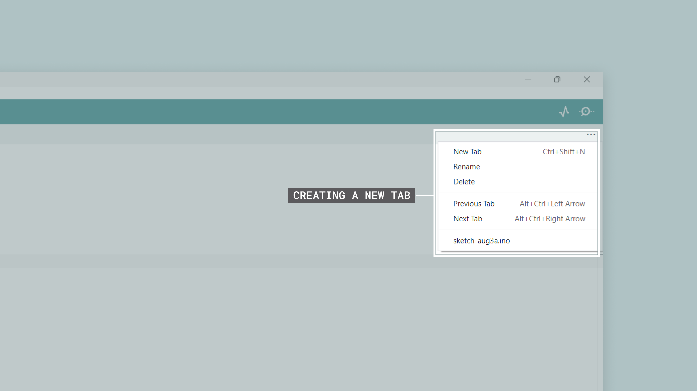

In this file, define your Wi-Fi network SSID and password as constants.

```arduino
char ssid[] = "SECRET_SSID"; // Your network SSID (name)
char password[] = "SECRET_PASS"; // Your network password (use for WPA, or use as key for WEP)
```

Replace `SECRET_SSID` with the name of your Wi-Fi® network and `SECRET_PASS` with the password of it and save the project. The example code is as follows:

```arduino
/*
  Portenta Machine Control's RTC
  Name: portenta_machine_control_enhanced_rtc.ino
  Purpose: Connects the Portenta Machine Control to a Wi-Fi network
  and synchronizes its onboard RTC with a NTP server. Displays 
  the current RTC time on the IDE's Serial Monitor every 5 seconds.
  
  @author Arduino PRO Content Team
  @version 1.0 23/07/23
*/

// Libraries used in the sketch
#include <WiFi.h>
#include "arduino_secrets.h" 
#include <NTPClient.h>
#include <mbed_mktime.h>
#include <Arduino_PortentaMachineControl.h>

// Wi-Fi network credentials
int status = WL_IDLE_STATUS;

// NTP client configuration and RTC update interval
WiFiUDP ntpUDP;
NTPClient timeClient(ntpUDP, "pool.ntp.org", -6*3600, 0);

// Display time every 5 seconds
unsigned long interval = 5000UL;
unsigned long lastTime = 0;

void setup() {
  // Initialize serial communication
  Serial.begin(9600);
  while (!Serial);
  delay(5000);

  // Attempt Wi-Fi connection
  while (status != WL_CONNECTED) {
    Serial.print("- Attempting to connect to WPA SSID: ");
    Serial.println(ssid);
    status = WiFi.begin(ssid, password);
    delay(500);
  }

  // Initialize NTP client and synchronize time
  timeClient.begin();
  timeClient.update();
  const unsigned long epoch = timeClient.getEpochTime();

  // Synchronize Portenta's Machine Control RTC with NTP time
  MachineControl_RTCController.begin();
  MachineControl_RTCController.setEpoch(epoch);

  // Display synchronized time
  displayRTC();
}

void loop() {
  // Periodically display RTC time
  unsigned long currentTime = millis();
  if (currentTime - lastTime >= interval) {
    displayRTC();
    lastTime = currentTime;
  }
}

/**
  Display Portenta's Machine Control internal RTC time 

  @param none
  @return none
*/
void displayRTC() {
  Serial.println();
  Serial.println("- TIME INFORMATION:");
  Serial.print("- RTC time: ");
  
  char buffer[32];
  tm t;
  _rtc_localtime(time(NULL), &t, RTC_FULL_LEAP_YEAR_SUPPORT);
  strftime(buffer, 32, "%Y-%m-%d %H:%M:%S", &t);
  Serial.println(buffer);
}
```
This sketch uses `WiFi.h`, `NTPClient.h`, and `mbed_mktime.h` libraries and methods to connect to a specific Wi-Fi® network using the provided credentials (network name and password). Once the internet connection has been established, the code synchronizes with a NTP server, using the `NTPClient.h` library, to obtain the current Coordinated Universal Time (UTC). This time is then converted to local time and used to set the device's internal RTC, thanks to the functionalities provided by `mbed_mktime.h` methods.

Once the RTC has been synchronized in the setup, the sketch enters an infinite loop. In this loop, every five seconds, it retrieves the current time from the RTC and prints it to the IDE's Serial Monitor in a more readable format, using the tm structure provided by `mbed_mktime.h`. This ensures that even if the internet connection is interrupted or the system restarts, accurate time tracking is maintained as long as the RTC's power supply is not interrupted. You should see the following output in the Arduino IDE's Serial Monitor:

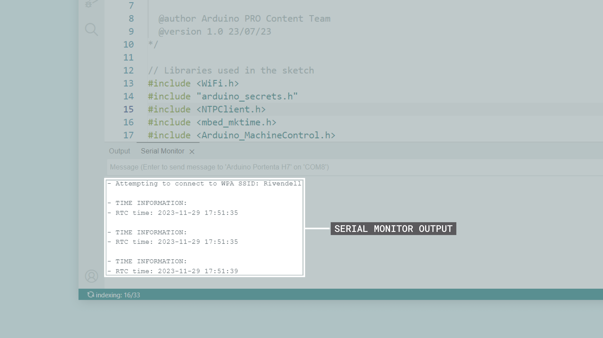

The sketch uses several key functions and methods:

- `WiFi.begin(ssid, password)`: Connects the device to a specified Wi-Fi network.
- `NTPClient`: A client object to communicate with an NTP server.
- `MachineControl_RTCController.begin()`: Initializes the onboard RTC.
- `MachineControl_RTCController.setEpoch(epoch)`: Sets the RTC time based on the epoch time obtained from the NTP server.
- `displayRTC()`: A custom function to format and display the current time from the RTC on the IDE's Serial Monitor.

## Temperature Measurments

The Portenta Machine Control is equipped with three independent temperature measurement channels, enhancing its capabilities for various industrial and environmental monitoring applications.

Some of the key capabilities of Portenta's Machine Control temperature channels are the following:

- **Independent channels**: Each of the three channels can measure temperature independently, offering flexibility in data collection and monitoring.
- **Sensor compatibility**: The channels are designed to measure temperature using either non-grounded thermocouples or PT100 sensors, but not simultaneously. This allows for versatile use with different types of temperature sensors.

***It is crucial not to connect both a thermocouple and a PT100 sensor to the same channel at the same time. Only one sensor type can be read per channel, based on the position of an analog switch.***

The Portenta Machine Control includes two onboard specialized front ends:

- **MAX31855KASA+T**: This front end is dedicated to **thermocouples**, providing accurate temperature measurements for a wide range of thermocouple types.
- **MAX31865ATP+T**: This front end is dedicated to **PT100 sensors**, ensuring precise temperature readings for these sensors.

The two onboard front ends are connected to the three temperature channels through a multiplexing system based on the following analog switches:

- **NX3L4053HR,115**: A single low-ohmic single-pole double-throw switch that selects between the two front ends.
- **TMUX1511RSVR**: Three quadruple single pole single throw switches that direct the active channel among the three available.
  
This multiplexing system allows for seamless switching between different sensor types and channels, enabling comprehensive temperature monitoring across multiple points.

**Important note**: Connect only **non-grounded** thermocouples. For more information about how to connect thermocouples to the Portenta Machine Control, please refer to the [complete pinout available here](#pinout).

The following example sketch demonstrates how to read temperatures from thermocouples connected to a Portenta Machine Control device. It uses the `Arduino_MachineControl` library to interface with the thermocouple sensors and prints the temperature values to the Arduino IDE's Serial Monitor every second.

```arduino
/*
  Portenta Machine Control's Thermocouples Temperature Reading Example
  Name: portenta_machine_control_thermocouples_temp_read.ino
  Purpose: Reads temperatures from thermocouples connected to the 
  Portenta Machine Control. The temperature values are printed to the 
  Serial Monitor every second.

  @author Riccardo Rizzo, modified by Arduino PRO Content Team
  @version 1.0 01/10/23
*/

#include <Arduino_PortentaMachineControl.h>

void setup() {
  // Initialize serial communication
  Serial.begin(9600);
  while (!Serial);
  
  // Initialize temperature probes
  MachineControl_TCTempProbe.begin();
  Serial.println("- Temperature probes initialization done!");
}

void loop() {
  // Measure and display temperature from each channel
  for (int channel = 0; channel < 3; channel++) {
    // Select channel and read temperature
    MachineControl_TCTempProbe.selectChannel(channel);
    float temperature = MachineControl_TCTempProbe.readTemperature(); 
    Serial.print("- Temperature CH");
    Serial.print(channel);
    Serial.print(" °C: ");
    Serial.println(temperature);
  }
  Serial.println();

  // Wait one second before next reading
  delay(1000); 
}
```

This example sketch reads temperatures from thermocouples connected to its temperature probe inputs. It demonstrates the use of the `Arduino_PortentaMachineControl` library to interface with thermocouple sensors. The sketch initiates serial communication in the `setup()` function and then enters a loop where it reads and displays the temperature from each channel to the Serial Monitor every second.

Key functions used in the sketch:

- `MachineControl_TCTempProbe.begin()`: Initializes the temperature probes.
- `MachineControl_TCTempProbe.selectChannel(channel)`: Selects the active channel for temperature measurement.
- `MachineControl_TCTempProbe.readTemperature()`: Reads the temperature from the selected channel.

## Encoders 

The Portenta Machine Control has two independent `ABZ` encoder channels, `0` and `1`, offering precise motion control and feedback for various applications.

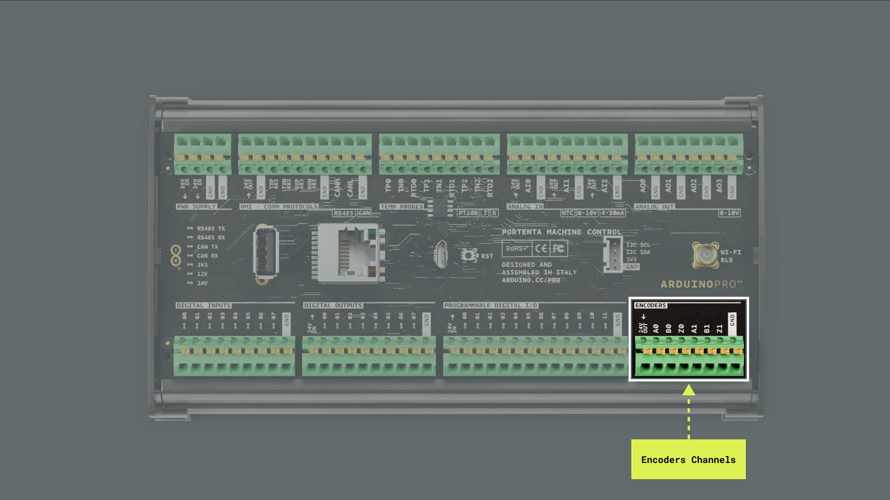

Some of the key capabilities of Portenta's Machine Control encoders channels are the following:

- **Independent operation**: Each `ABZ` encoder channel functions independently, providing motion measurement and control versatility.
- **Pull-up resistance**: The channels are equipped with 10 kΩ pull-up resistors connected to the board's 24 VDC supply, ensuring stable signal integrity and reduced noise interference.
- **24 VDC compatibility**: The connection to the 24 VDC supply makes these encoders suitable for industrial systems and applications that operate at this voltage level.

The `Arduino Mbed OS Portenta Boards` core and the `Arduino_PortentaMachineControl` have with built-in libraries and functions that enable you to utilize the Portenta's Machine Control encoders. In the following example, we will explore this capability.

```arduino
/*
  Portenta Machine Control's Single Encoder Read Example
  Name: portenta_machine_control_single_encoder_read.ino
  Purpose: Reads values from one of the encoder channels on the Portenta Machine Control,
  periodically displays the state, number of pulses, and revolutions of the encoder.
  
  @author Riccardo Rizzo, modified by Arduino PRO Content Team
  @version 1.0 01/10/23
*/

#include <Arduino_PortentaMachineControl.h>

void setup() {
  // Initialize serial communication
  Serial.begin(9600);
  while (!Serial); 
}

void loop() {
  // Read and print the current state of encoder channel 0 in binary format
  Serial.print("- Encoder 0 state: ");
  Serial.println(MachineControl_Encoders.getCurrentState(0), BIN);

  // Read and print the number of pulses recorded by encoder channel 0
  Serial.print("- Encoder 0 pulses: ");
  Serial.println(MachineControl_Encoders.getPulses(0));

  // Read and print the number of complete revolutions made by encoder channel 0
  Serial.print("- Encoder 0 revolutions: ");
  Serial.println(MachineControl_Encoders.getRevolutions(0));
  Serial.println();

  // Short delay before the next read
  delay(25); 
}
```

This sketch for the Portenta Machine Control reads and displays data from one of its encoder channels, primarily using the `Arduino_PortentaMachineControl` library. Serial communication is initiated in the `setup()` function for output to the Arduino IDE's Serial Monitor. In the main loop, the sketch reads and displays the encoder's state, total pulses, and revolutions on the Serial Monitor, updating the readings every 25 milliseconds. 

The sketch uses several key functions and methods:

- `MachineControl_Encoders.getCurrentState(channel)`: Retrieves the current binary state of the specified encoder channel.
- `MachineControl_Encoders.getPulses(channel)`: Obtains the total number of pulses recorded by the specified encoder channel.
- `MachineControl_Encoders.getRevolutions(channel)`: Calculates the total revolutions made by the specified encoder channel.

## Support

If you encounter any issues or have questions while working with the Portenta Machine Control, we provide various support resources to help you find answers and solutions.

### Help Center

Explore our Help Center, which offers a comprehensive collection of articles and guides for the Portenta Machine Control. The Help Center is designed to provide in-depth technical assistance and help you make the most of your device.

- [Portenta Machine Control help center page](https://support.arduino.cc/hc/en-us/sections/360004767859-Portenta-Family)

### Forum

Join our community forum to connect with other Portenta Machine Control users, share your experiences, and ask questions. The Forum is an excellent place to learn from others, discuss issues, and discover new ideas and projects related to the Portenta Machine Control.

- [Portenta Machine Control category in the Arduino Forum](https://forum.arduino.cc/c/hardware/portenta/portenta-machine-control/173)

### Contact Us

Please get in touch with our support team if you need personalized assistance or have questions not covered by the help and support resources described before. We are happy to help you with any issues or inquiries about the Portenta Machine Control.

- [Contact us page](https://www.arduino.cc/en/contact-us/)  