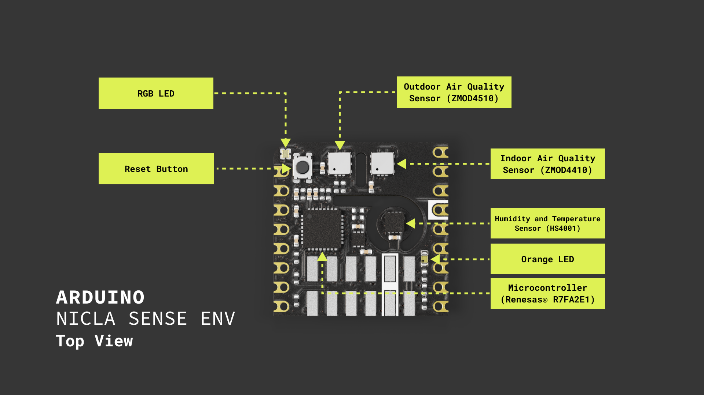
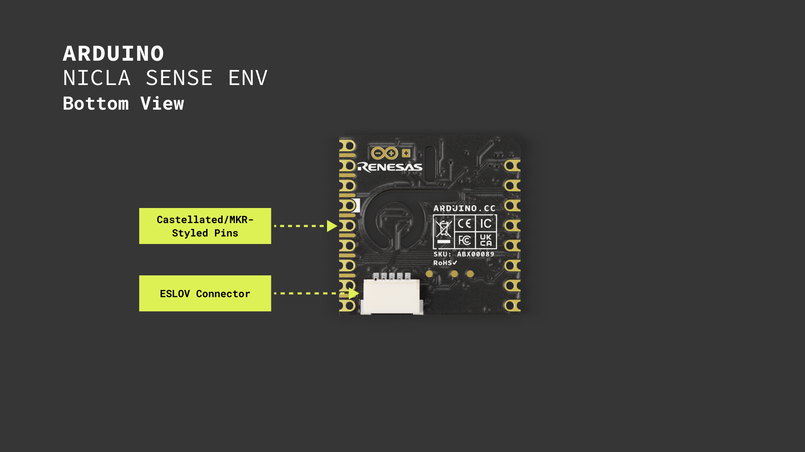

This user manual provides a comprehensive Nicla Sense Env board overview, highlighting its hardware and software elements. With it, you will confidently learn how to set up, configure, and use all the main features of a Nicla Sense Env board.

## Hardware and Software Requirements

### Hardware Requirements

- [Nicla Sense Env](https://store.arduino.cc/products/nicla-sense-me) (x1)
- [Portenta C33](https://store.arduino.cc/products/portenta-c33) (x1)
- [USB-C® cable](https://store.arduino.cc/products/usb-cable2in1-type-c) (x1)

### Software Requirements

- [Arduino IDE 2.0+](https://www.arduino.cc/en/software) or [Arduino Web Editor](https://create.arduino.cc/editor)
- [Arduino_NiclaSenseEnv library](https://github.com/sebromero/Arduino_NiclaSenseEnv)
- [Arduino Renesas Portenta Boards core](https://github.com/arduino/ArduinoCore-renesas) (required to work with the Portenta C33 board)

***The Nicla Sense Env board is not intended as a standalone device but as a shield of another Portenta, MKR, or Nano family board. In this User Manual, we will use the Portenta C33 as the main board and show how to use the Nicla Sense Env board as a shield.***

## Nicla Sense Env Overview

Enhance your environmental sensing capabilities with the Nicla Sense Env board. This board combines three cutting-edge sensors from Renesas® with the Arduino ecosystem's ease of integration and scalability. This board is well-suited for augmenting your Portenta or MKR-based projects with environmental sensing capabilities.

The Nicla Sense Env includes an ultra-low power temperature and humidity sensor, complemented by two sophisticated, industrial-grade gas sensors capable of assessing air quality in both indoor and outdoor settings. Its compact dimensions (22.86 x 22.86 mm) and sturdy construction make the Nicla Sense Env an excellent choice for projects that demand sensor fusion and the computational capabilities of Arduino boards.

### Nicla Sense Env Architecture Overview

The Nicla Sense Env features a secure, certified, and durable design that enables it for several applications, such as industrial automation, building automation, and prototyping. 

Here's an overview of the board's main components shown in the images above:

- **Microcontroller**: At the heart of the Nicla Sense Env is a [Renesas R7FA2E1 microcontroller](https://www.renesas.com/us/en/products/microcontrollers-microprocessors/ra-cortex-m-mcus/ra2e1-48mhz-arm-cortex-m23-entry-level-general-purpose-microcontroller). This entry-level single-chip microcontroller, known as the industry's most energy-efficient ultra-low-power microcontroller, is based on a 48 MHz Arm® Cortex®-M23 core with up to 128 KB code flash and 16 KB SRAM memory.
- **Onboard humidity and temperature sensor**: The Nicla Sense Env features an onboard humidity and temperature sensor, the [HS4001 from Renesas](https://www.renesas.com/us/en/products/sensor-products/environmental-sensors/humidity-temperature-sensors/hs4001-relative-humidity-and-temperature-sensor-digital-output-15-rh). This highly accurate, ultra-low power, fully calibrated relative humidity and temperature sensor features proprietary sensor-level protection, ensuring high reliability and long-term stability.
- **Onboard indoor air quality sensor**: The Nicla Sense Env features an onboard gas sensor, the [ZMOD4410 from Renesas](https://www.renesas.com/us/en/document/dst/zmod4410-datasheet). This sophisticated sensor was designed to detect total volatile organic compounds (TVOC), estimate CO2, and monitor and report indoor air quality (IAQ). 
- **Onboard outdoor air quality sensor**: The Nicla Sense Env features an onboard gas sensor, the [ZMOD4510 from Renesas](https://www.renesas.com/us/en/document/dst/zmod4410-datasheet). This sophisticated sensor was designed to monitor and report outdoor air quality (OAQ) based on nitrogen dioxide (NO2) and ozone (O3) measurements. 
- **Onboard user LEDs**: The Nicla Sense Env has two onboard user-programmable LEDs; one is a white LED, and the other one is an RGB LED.
- **ESLOV connector**: The Niclas Sense Env has an onboard ESLOV connector to extend the board communication capabilities via I2C. 
- **Surface mount**: The castellated pins of the board allow it to be positioned as a surface-mountable module.

### Board Libraries 

The [`Arduino_NiclaSenseEnv` library](https://github.com/sebromero/Arduino_NiclaSenseEnv) contains an application programming interface (API) to read data from the board and control its parameters and behavior over I2C. This library supports the following: 

- Board control (sleep, reset, and factory reset)
- Board configuration (I2C address)
- Onboard RGB LED control
- Onboard white LED control
- Onboard indoor air quality sensor control
- Onboard outdoor air quality sensor control
- Temperature and humidity sensor control
- UART CSV output

***The Portenta, MKR, and Nano family boards support the `Arduino_NiclaSenseEnv` library.***

To install the `Arduino_NiclaSenseEnv` library, navigate to `Tools > Manage libraries...` or click the Library Manager icon in the left tab of the Arduino IDE. In the Library Manager tab, search for `Arduino_NiclaSenseEnv` and install the latest version of the library.

### Pinout

The full pinout is available and downloadable as PDF from the link below:

- Nicla Sense Env pinout

### Datasheet

The complete datasheet is available and downloadable as PDF from the link below:

- Nicla Sense Env datasheet

### Schematics

The complete schematics are available and downloadable as PDF from the link below:

- Nicla Sense Env schematics

