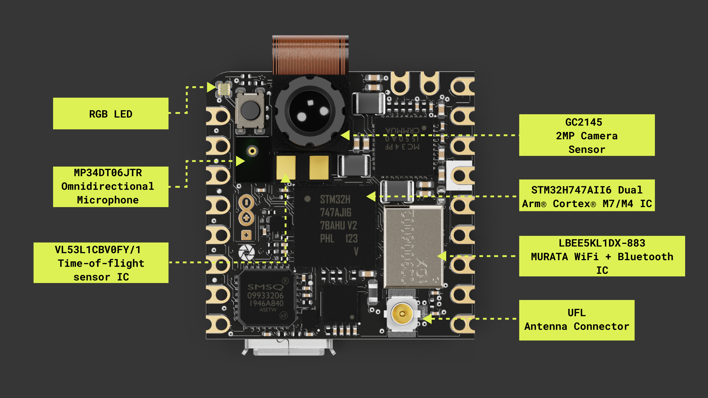
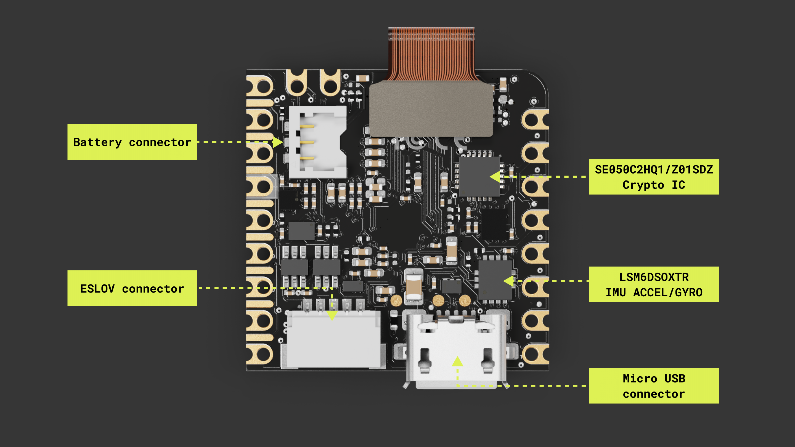

## Overview

This user manual will guide you through a practical journey covering the most interesting features of the Arduino Nicla Vision. With this user manual, you will learn how to set up, configure and use this Arduino board.

## Hardware and Software Requirements
### Hardware Requirements

- [Nicla Vision](https://store.arduino.cc/products/nicla-vision) (x1)
- Micro USB cable (x1)

### Software Requirements

- [Arduino IDE 1.8.10+](https://www.arduino.cc/en/software), [Arduino IDE 2.0+](https://www.arduino.cc/en/software), or [Arduino Web Editor](https://create.arduino.cc/editor)
- To create custom Machine Learning models, the integrated Machine Learning Tools of the [Arduino Cloud](https://create.arduino.cc/iot/) are needed. In case you do not have an Arduino Cloud account, you will need to create one first.

## Product Overview

The Arduino® Nicla Vision is a ready-to-use, standalone camera for analyzing and processing images on the edge. Thanks to its 2 MP color camera, smart 6-axis motion sensor, integrated microphone and distance sensor, it is suitable for asset tracking, object recognition and predictive maintenance. Quickly implement sensor nodes to send collected data to the Arduino® Cloud (or third-party vendor services) via integrated Wi-Fi®/Bluetooth® LE connectivity.

### Board Architecture Overview

The Nicla Vision features a robust and efficient architecture that integrates a range of sensors packed into a tiny footprint. Nicla Vision combines a powerful STM32H747AII6 Dual ARM® Cortex® M7/M4 IC processor with a 2MP color camera that supports TinyML, as well as a smart 6-axis motion sensor, integrated PDM microphone and a Time of Flight distance sensor.

Here is an overview of the board's architecture's main components shown in the images above:

- **Camera**: the Nicla Vision features a camera based on GC2145 Color rolling shutter image sensor. The GC2145 incorporates a 1616V x 1232H active pixel
array, on-chip 10-bit ADC, and image signal processor.
The 2MP GC2145 CMOS camera module is equipped with a 80°(DFOV) stock lens, 1.75 μm pixel size and a focal length of 2.2 mm. It supports RGB output format.
- **Microcontroller**: at the heart of the Nicla Vision is the dual-core STM32H747 (U1) including a Cortex® M7 running at 480 MHz and a Cortex® M4 running at 240 MHz. The two cores communicate via a Remote Procedure Call mechanism that allows calling functions on the other processor seamlessly.
- **Onboard advanced motion sensor**: the board features the LSM6DSOX, a smart IMU that includes a 3-axis accelerometer and a 3-axis gyroscope. The LSM6DSOX has a full-scale acceleration range of ±2/±4/±8/±16 g and an angular rate range of ±125/±250/±500/±1000/±2000 dps.
- **Onboard distance sensor**: the VL53L1CBV0FY Time-of-Flight sensor (U4) adds accurate and low power ranging capabilities to the Arduino® Nicla Vision. The invisible near infrared VCSEL laser (including the analog driver) is encapsulated together with receiving optics in an all-in-one small module located below the camera.
- **Digital Microphone**: the MP34DT05 digital MEMS microphone is omnidirectional and operates via a capacitive sensing element with a high (64 dB) signal-to-noise ratio. The sensing element, capable of detecting acoustic waves, is manufactured using a specialized silicon micromachining process dedicated to producing audio sensors (U6).
- **Wireless connectivity**: the Murata® LBEE5KL1DX-883 wireless module (U9) simultaneously provides Wi-Fi® and Bluetooth® connectivity in an ultra-small package based on the Cypress CYW4343W. The IEEE802.11 b/g/n Wi-Fi® interface can be operated as an access point (AP), station (STA) or dual-mode simultaneous AP/STA. It supports a maximum transfer rate of 65 Mbps. Bluetooth® interface supports Bluetooth® Classic and BLE. An integrated antenna circuitry switch allows a single external antenna (J6) to be shared between Wi-Fi® and Bluetooth®.
- **Power management**: the Nicla Vision is designed for ultra-low power operation, with efficient power management features that ensure minimal energy consumption even when using always-on motion recognition and image processing. The Nicla Vision features the PF1550 from NXP®; a highly integrated battery charge management integrated circuit (IC) designed for wearables and Internet of Things (IoT) devices. 
- **Security Elements**: the Arduino® Nicla Vision enables IC level edge-to-cloud security capability through the NXP SE050C2 Crypto chip (U8). This provides Common Criteria EAL 6+ security certification up to OS level, as well as RSA/ECC cryptographic algorithm support and credential storage.