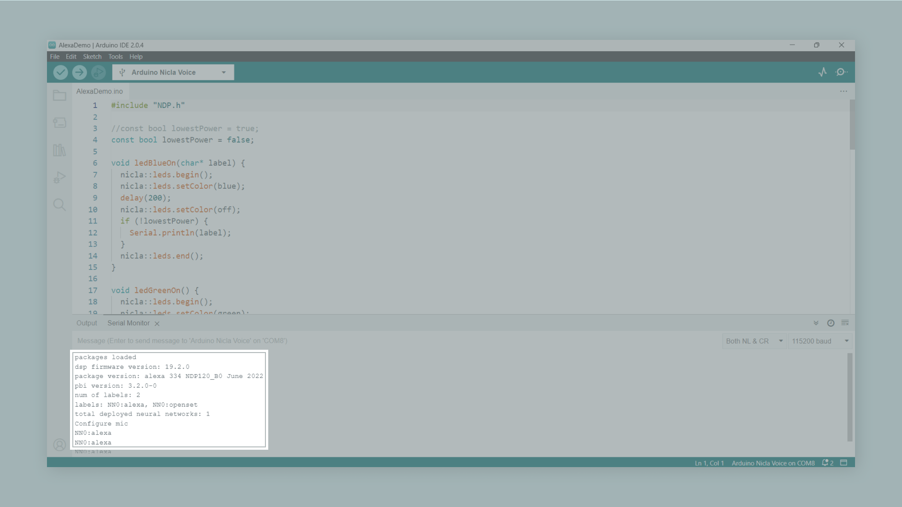
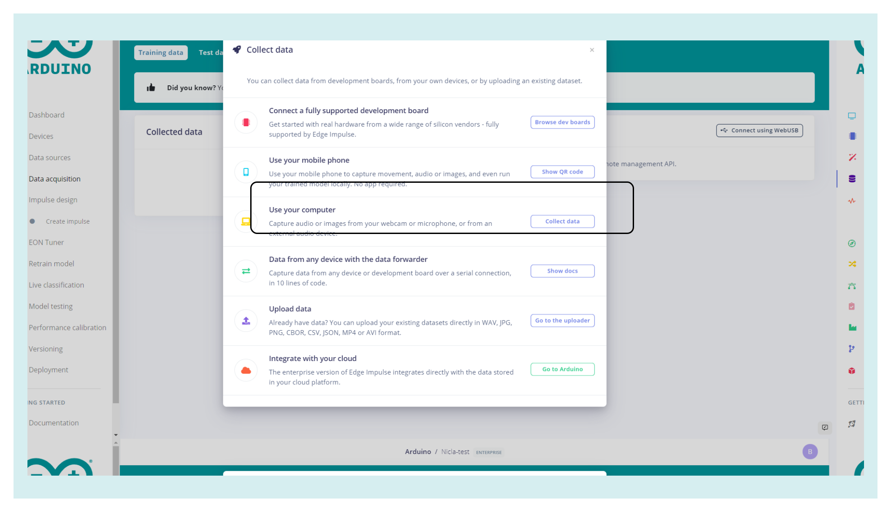
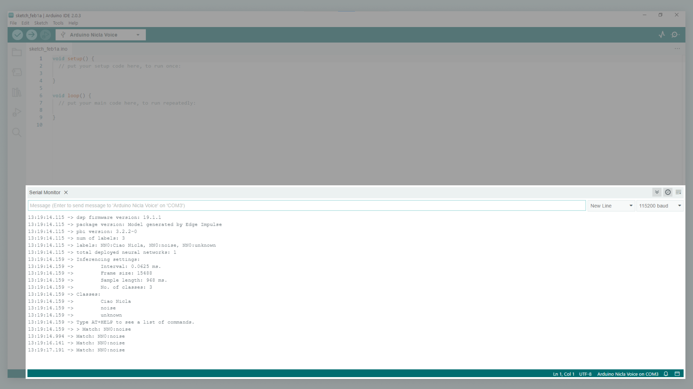
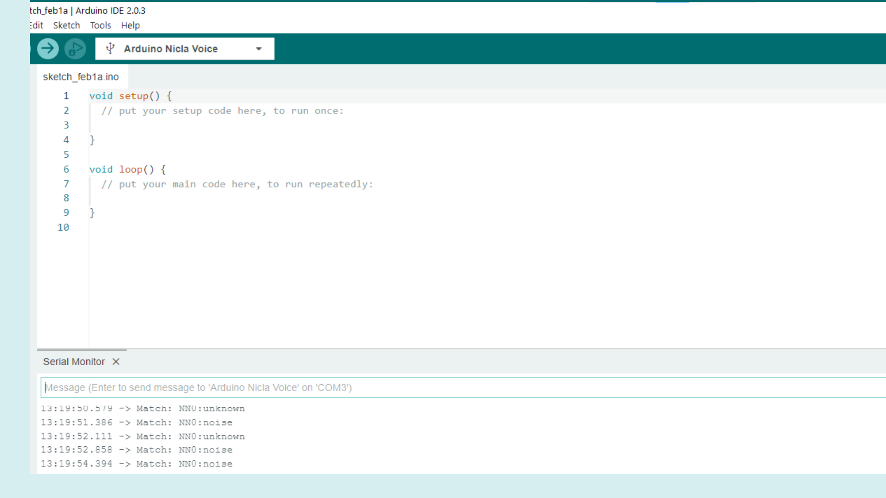

## Overview

The Arduino® Nicla Voice processes audio inputs using the powerful Syntiant® NDP120™ Neural Decision Processor™, which simulates human neural pathways to execute multiple artificial intelligence (AI) algorithms and automate complex tasks. The NDP120 is capable of understanding and learning the sounds in its surroundings, recognizing different events, and detecting keywords simultaneously.

To make use of these keyword triggers, such as blinking the LED when the board recognizes a specific word, a machine learning (ML) model is required. With the [Machine Learning Tools](https://cloud.arduino.cc/machine-learning-tools/) powered by Edge Impulse® and integrated into the Arduino Cloud, you can quickly build, train and deploy ML models onto the Nicla Voice. This tutorial will guide you through getting started with the Nicla Voice, testing a built-in speech recognition example, and creating your ML models with the Machine Learning Tools integrated into the Arduino Cloud.


## Goals

- Test the built-in speech recognition example
- Learn how to capture audio data to train an ML model
- Learn how to train an ML model using audio data
- Learn how to export an ML model to the Nicla Voice
- Learn how to test an ML model uploaded to the Nicla Voice

## Hardware and Software Requirements

### Hardware Requirements

- [Nicla Voice](https://store.arduino.cc/nicla-voice) (x1)
- Micro USB cable (x1)

### Software Requirements

- [Arduino IDE 1.8.10+](https://www.arduino.cc/en/software), [Arduino IDE 2.0+](https://www.arduino.cc/en/software), or [Arduino Web Editor](https://create.arduino.cc/editor)
- To create your ML model, we will use the [Arduino Cloud](https://create.arduino.cc/iot/things) (you will need to create an account if you don't have one yet)
- [The compiled uploaders for various operating systems and the updated NDP120 processor firmware and speech recognition model files](assets/nicla_voice_uploader_and_firmwares.zip)

## Testing the Built-in Speech Recognition Example

The Nicla Voice has a built-in speech recognition example: **the Alexa demo**. You can test this example by just powering the board after unboxing it **without flashing anything**. To deploy the example again after flashing your board, you must first update the NDP120 processor firmware and the speech recognition model to the latest release. Follow these four steps to complete the update process:


1. Upload the `Syntiant_upload_fw_ymodem` sketch. This sketch can be found in the board's built-in examples by navigating to **File -> Examples -> NDP -> Syntiant_upload_fw_ymodem**. **Remember to select the board first before navigating to the examples**.
2. Extract [this .zip file](assets/nicla_voice_uploader_and_firmwares.zip), which contains the compiled uploaders for various operating systems, as well as the updated NDP120 processor firmware and speech recognition model. 
3. Open a new terminal where the .zip file was extracted and execute the following command:

    ```
    ./syntiant-uploader send -m "Y" -w "Y" -p $portName $filename
    ```

    Replace `portName` and `filename` with the relevant information. Three different files must be uploaded to the board by executing the following three commands:

    ```
    ./syntiant-uploader send -m "Y" -w "Y" -p COM6 mcu_fw_120_v91.synpkg
    ```

    ```
    ./syntiant-uploader send -m "Y" -w "Y" -p COM6 dsp_firmware_v91.synpkg
    ```

    ```
    ./syntiant-uploader send -m "Y" -w "Y" -p COM6 model_name.synpkg
    ```

    Ensure all executed commands return a `filename sent succesful` message in the console as shown in the image below. 

    

4. After successfully uploading the three files, we can upload the speech recognition example to the Nicla Voice. The speech recognition example can be found in the board's built-in examples by navigating to **File -> Examples -> NDP -> AlexaDemo**. To test the example say "Alexa"; this should make the onboard LED of the Nicla Voice blink blue if the word "Alexa" is recognized. If there is no response from the board, try speaking from a closer proximity or louder. You should also see in the Serial Monitor if the word "Alexa" was detected as shown in the image below:



Now, let's replicate this behavior using a custom Machine Learning model.

## The Custom Machine Learning Model

To train a machine learning model to classify audio, we first need to feed it with an audio sample, which will be a sound that it should recognize. The model will be trained using a concept called *supervised learning*. With *supervised learning*, we train the model with data already known and tell it while it's "practicing" its predictions if they are correct or not. This is normally known as the *training* process. For the training on *supervised learning*, objects are labeled beforehand with their names, which you will see when we get to the audio recording section.

### What Is Overfitting and How to Avoid It

If a machine learning model is overfitting, it means that it is too well geared toward your training data and it will not perform well with unseen input data. This is a common pitfall in machine learning. You need some variation in the training dataset and adjust the parameters, so that the model does not just learn all input data by heart, making the classification based on that, but it will rather learn the concept that makes up an object or a sound.

Finding the proper configuration for your application often requires trial and error. Check [this article](https://docs.edgeimpulse.com/docs/tips-and-tricks/increasing-model-performance) to learn more about how to improve poorly performing machine learning models.

### Creating a Custom Machine Learning Model

With the Nicla Voice, it is possible to train your own models for voice recognition and use them with the board. This will allow the Nicla Voice to detect words or phrases based on your recordings. First, if you do not already have an Arduino Cloud account, please go [here and create one](https://cloud.arduino.cc/home/). You can then access the Machine Learning Tools integration via the Arduino Cloud, as shown in the image below. 


With the account set up, create a new project and proceed to the next step to capture data for the model.

### Capturing Data for the Model

There are multifarious methods for capturing sound for the model with the Machine Learning Tools integration. Navigate to the "Data acquisition" page and pick the preferred method for capturing audio.


This tutorial will go through how to capture audio from the phone directly to the Machine Learning model. It is possible to capture audio from the Nicla Voice and upload it to the Machine Learning model by using the NDP library's "Record and Stream" example.

On the data acquisition page, press the "Let's collect some data" button. Now select the "Show QR code" option in the "Use your mobile phone" section.



Scan the QR code with your phone and it will automatically connect. Set the options as shown below and you are ready to start recording audio for the Machine Learning model. On your phone, select the option for recording audio and give the appropriate permissions. There should now be a button on the screen that says "Start recording". Before recording, set the label of the recordings to match the phrase you want to have recognized, this will simplify the data sorting.


When a recording is made on the phone, it will automatically show up on the webpage. First start by recording around five minutes of the phrase you want to have recognized, for this tutorial "Ciao Nicla" will be used. Try to vary the distance from the microphone, the pronunciation and the inflection when speaking the phrase to give the model a wider definition of the phrase that should be recognized. If you want to make the model more accurate have multiple people recording the same phrase, going through the same process of varying the distance from the microphone, the pronunciation and the inflection.

Once this is done, record another five minutes of random words that are not the desired phrase and set the label for these recordings as "unknown". This will help you with the training of the model later. And, to give the model a better understanding of which sounds not to recognize as the trigger, also record five minutes of background and ambient noise. Set the label of these recordings as "noise". The more data collected, the better the model can be trained to recognize the required sentence. Feel free to collect as many of these three different categories as needed.


Make sure to have a good training/test data split ratio of around 80/20. The test data is used to test the model with "unseen" data after the training has finished. If you have an overfitting model, you may see high accuracy in the training results but poor performance in the testing results. If that is the case, you may have to tweak the parameters or collect more/better training data. More information on this can be found in this [documentation](https://docs.edgeimpulse.com/docs/tips-and-tricks/increasing-model-performance).


### Create an Impulse

Now that we acquired the data samples, we can move on to designing the Impulse. In a nutshell, an Impulse is a pipeline that the model will use for training and it consists of an input block, a processing block and a learning block. The input block indicates the type of data being used in the model, which will be audio in this case. The processing block extracts meaningful features from your data. The Audio Syntiant processing block we are using in this tutorial extracts time and frequency features from the audio used in the model. The learning block uses a neural network classifier that will take the input data and the audio that was captured in the previous step and provides a probability that indicates how likely it is that the input data belongs to a particular class as its output.

In the menu navigate to "Create Impulse" under "Impulse Design" and add an Audio processing block, which will be "Syntiant" in this case, as well as a Classification block. The page should now look like the image below.


Under "Impulse Design" go to the "Syntiant" page. In the "Parameters" settings the "Features extractor" has to be set to "log-bin". This means that the window will be a fixed size. The window is the size of the data that will be processed per classification.


Now select the "Generate features" tab on the "Syntiant" page. On this page, press the green "Generate features" button. If you have collected a total of fifteen minutes of data as suggested in the previous step, this will take some time to complete. Now the data can be visualized on the right. Here you can easily see if the different classes of collected data are separated into clear groups with respect to their different classes; this can help you figure out if the desired phrase will be easily differentiated from the noise and random words recorded.


Now that the settings are correct and we have the data for the model, it is time to train.

### Training the Model

Go to the "Classifier" tab under "Impulse design". We can keep the default settings here and press the "Start training" button. On the right, you can see the progress of the training, this process will also take some time to complete. Once it is complete, the performance of the model's training can be seen in the image below.


Ideally, you want to get as close to 100% accuracy as possible for each class. If the results are poor, the sound recorded may not be representative of the audio that it is being classified as. The audio that is incorrect should then be removed from the data set and replaced if the data set becomes too small.

### Deploying the Model

The model is now ready to be built and deployed. Go to the "Deployment" page, select the "Arduino Nicla Voice" under "Build firmware" and set the posterior parameters. Click the "Find posterior parameters" button. In the window that pops up select all keywords that we have created in the steps before. We can keep the calibration settings to "No calibration". Then press the green "Find parameters" button and, when the job is done, close this window.


Now it is time to prepare the model created to upload it to the Nicla Voice. Select the Nicla Voice firmware and press the green "Build" button. When the building is done you will receive a .zip file containing the model built for the Nicla Voice. Now that you have the Machine Learning model built, we need to set up the Arduino IDE installing the appropriate core and CLIs.


### Setting up the Arduino IDE

Make sure the latest version of the Arduino IDE is installed. The IDE can be downloaded [here](https://www.arduino.cc/en/software). Within the Arduino IDE install the core for Nicla. Go to **Tools > Board > Boards Manager**, in the board's manager section search for **Arduino Mbed OS Nicla Boards** and install it.

### Installing Additional Dependencies

To easily flash any Machine Learning model created with Machine Learning Tools integration onto the Nicla Voice, we need to install the Arduino CLI and Edge Impulse® CLI. Follow [this article](https://docs.edgeimpulse.com/docs/development-platforms/officially-supported-mcu-targets/arduino-nicla-vision#installing-dependencies) from Edge Impulse® to install both properly.

### Uploading the Model

Now that everything needed for flashing the firmware and the model to the Nicla Voice is installed, you can finally flash the board with your model. Extract the files that were packed into the .zip file received from Edge Impulse® when the model was built into a folder. At this point, run the right "flash" file for your OS on the machine you are using, as reported in this list:

- Use **flash_windows.bat** if you are using a PC
- Use **flash_mac.command** if you are using a MAC
- Use **flash_linux.sh** if you are using a Linux machine

If there is any issue in the process, try to run these as administrator. A command window will appear where you can follow the status of the installation.

### Testing It Out

To make sure everything is working open the Arduino IDE, select the correct port that the board is connected to, and open the serial monitor. If there is nothing in the serial monitor try pressing the reset button on the Nicla Voice once. The information about the files and the model that is loaded onto the board should now be printed on the serial monitor.



Now you can go ahead and say your wake up words to the Nicla Voice. The board should then blink the blue LED when a sound is registered. If the LED does not blink try moving closer to the Nicla Voice or pronounce the wake up words differently. The board will print what class it thinks the sounds recognized belongs to, as seen in the image below. This makes it easy to see if the board will recognize the desired phrase or if it is recognized as a different class. If the board has problems recognizing the right phrase it might be a good idea to take another look at the model and the data that has been collected.



## Conclusion

This tutorial showed how to set up the Machine Learning Tools platform to create a machine learning model to be used with the Nicla Voice. It went through how to collect audio with a phone, how to train the model with the data, and then how to build it to work with the board. Lastly, the tutorial shows how to upload the model to the Nicla Voice and how to use that model.
