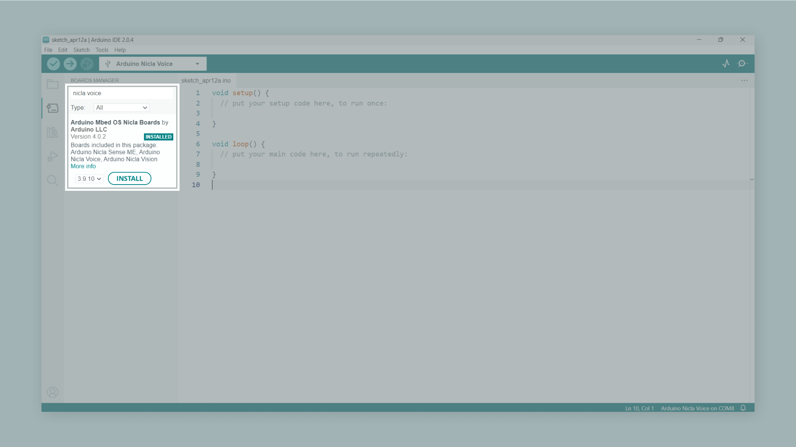
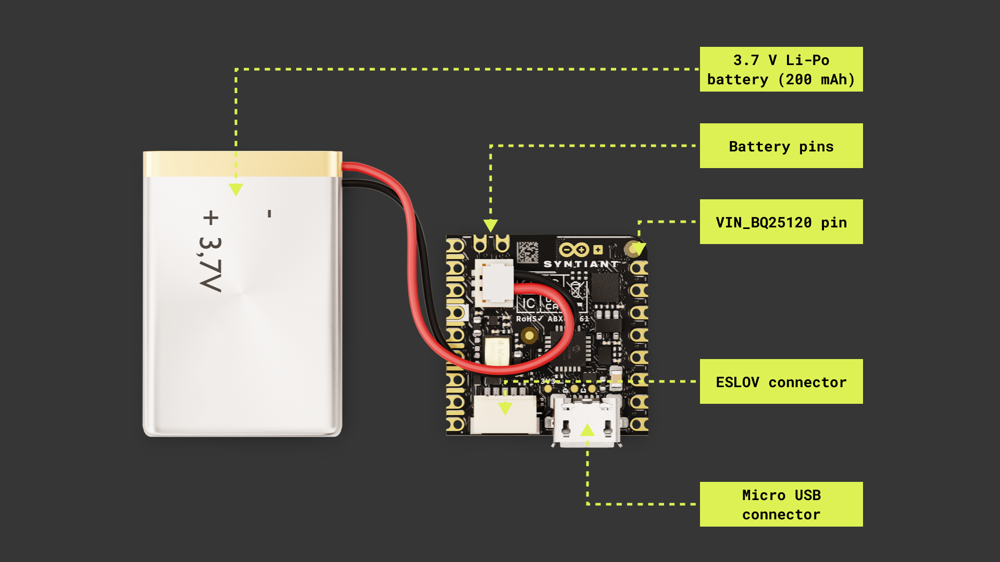
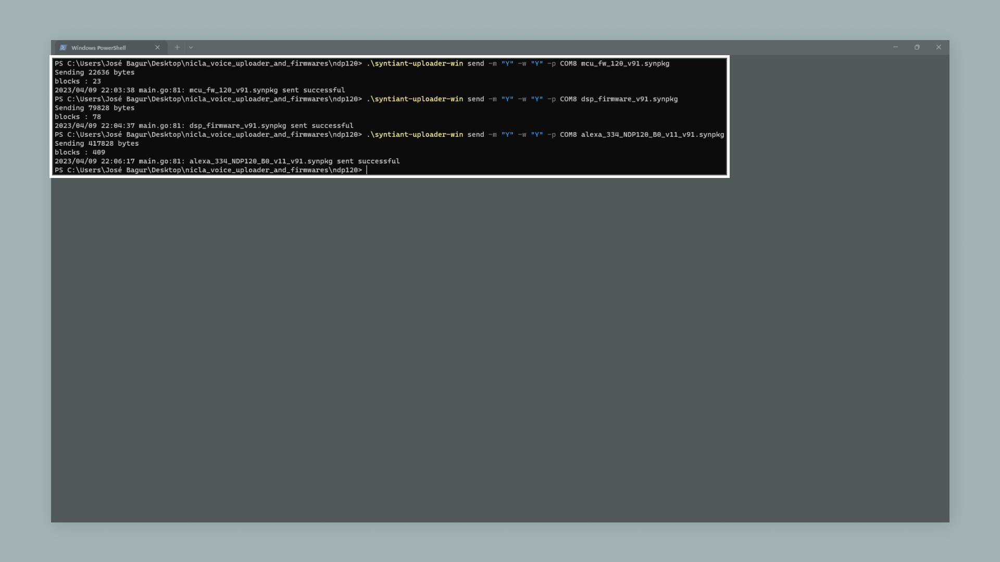
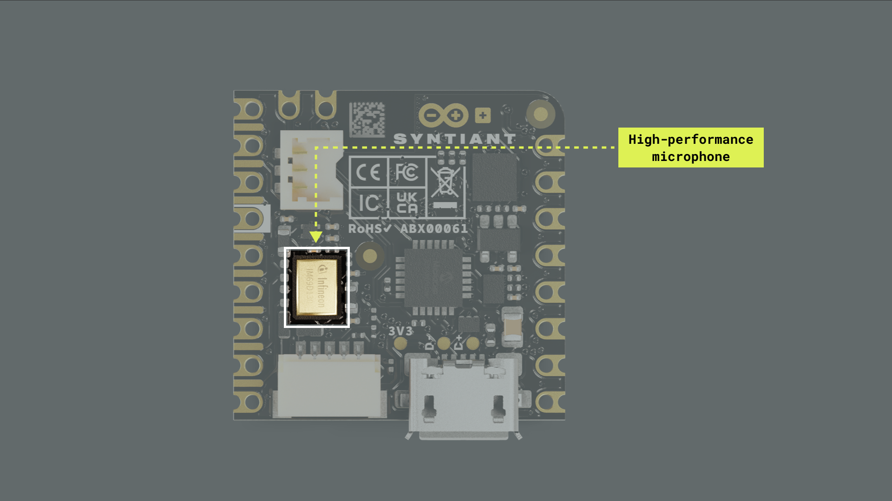
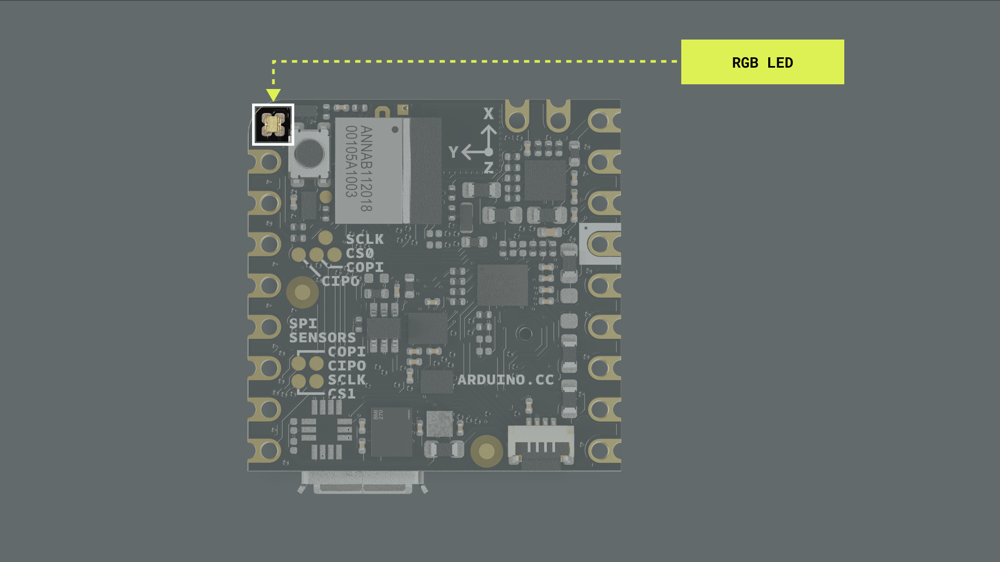
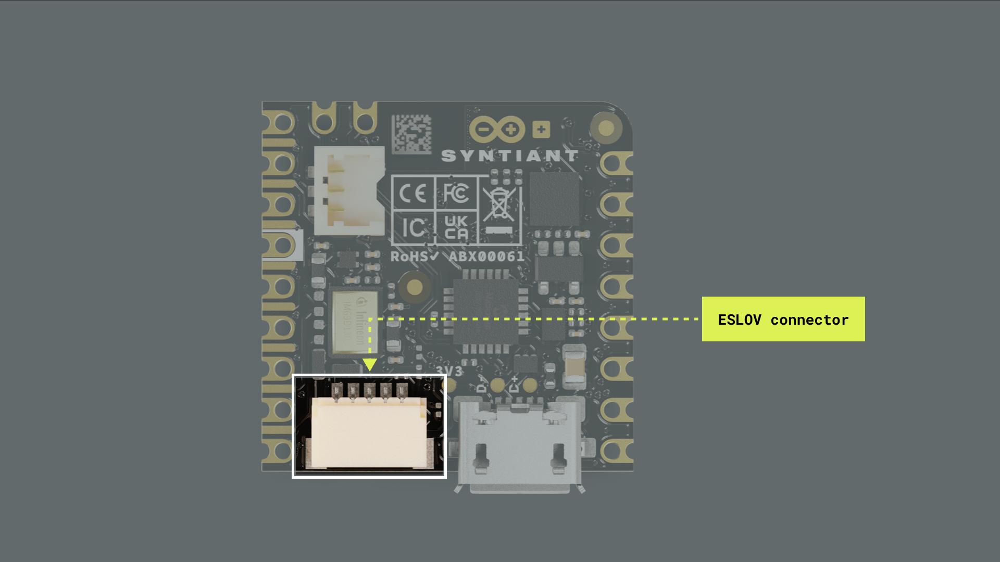

## Overview

This user manual will provide you with a comprehensive overview of the Arduino Nicla Voice board, covering its main hardware and software features. With this user manual, you will also learn how to set up, configure and use these features. 

## Hardware and Software Requirements

### Hardware Requirements

- [Nicla Voice](https://store.arduino.cc/products/nicla-voice) (x1)
- Micro USB cable (x1)

### Software Requirements

- [Arduino IDE 1.8.10+](https://www.arduino.cc/en/software), [Arduino IDE 2.0+](https://www.arduino.cc/en/software), or [Arduino Web Editor](https://create.arduino.cc/editor)
- To create custom Machine Learning models, we will use the integrated Machine Learning Tools of the [Arduino Cloud](https://create.arduino.cc/iot/) (you will need to create an account if you don't have one yet)

## Product Overview

The Nicla Voice is an innovative and versatile development board designed by the Arduino team for voice-enabled projects and applications. This board has an onboard always-on speech recognition processor, advanced motion sensors, and wireless connectivity via Bluetooth® Low Energy. The Nicla Voice is an ideal solution for various applications, from ultra-low power predictive maintenance and gesture or voice recognition systems to contactless wireless applications.

### Board Architecture Overview

The Nicla Voice features a robust and efficient architecture that integrates various components to enable voice-enabled projects and applications. 


Here is an overview of the board's architecture's main components shown in the images above:

- **Microcontroller**: at the heart of the Nicla Voice is the nRF52832, a powerful and versatile System-on-Chip (SoC) from Nordic® Semiconductor. The nRF52832 is built around a 32-bit Arm® Cortex®-M4 processor running at 64 MHz.
- **Speech recognition processor**: the board features the NDP120 Neural Decision Processor™, an ultra-low power always-on speech processor from Syntiant®, which enables several applications, including echo-cancellation, beamforming, noise suppression, speech enhancement, speaker identification, and keyword spotting. 
- **Onboard advanced motion sensors**: the board features the BMI270, a high-precision IMU by Bosch® Sensortec, which combines a 3-axis accelerometer and a 3-axis gyroscope for precise motion tracking and orientation detection. The board also features the BMM150, a compact geomagnetic sensor from Bosch® Sensortec with a 3-axis magnetometer.
- **Onboard high-performance microphone**:  The Nicla Voice is equipped with the IM69D130, a high-quality MEMS microphone by Infineon® Technologies. The IM69D130 offers excellent audio quality and low noise performance, ensuring accurate and distortion-free audio capturing.
- **Wireless connectivity**: the board supports Bluetooth® Low Energy (BLE) connectivity, provided by the ANNA-B112 module developed by u-blox®. This compact, high-performance BLE module allows the Nicla Voice to communicate wirelessly with other devices and systems.
- **Power management**: The Nicla Voice is designed for ultra-low power operation, with efficient power management features that ensure minimal energy consumption even when using always-on speech recognition and multiple sensors. The Nicla Voice features the BQ25120 from Texas Instruments; a highly integrated battery charge management  integrated circuit (IC) designed for wearables and Internet of Things (IoT) devices. 

### Board Core and Libraries

The **Arduino Mbed OS Nicla Boards** core contains the libraries you need to work with the board's components, such as its IMU, magnetometer, and onboard. To install the core for Nicla boards, navigate to **Tools > Board > Boards Manager** or click the Boards Manager icon in the left tab of the IDE. In the Boards Manager tab, search for `nicla` and install the latest `Arduino Mbed OS Nicla Boards` version.



### Board Pinout

The full pinout is available and downloadable as PDF from the link below:

- [Nicla Voice pinout](assets/ABX00061-full-pinout.pdf)

### Board Datasheet

The complete datasheet is available and downloadable as PDF from the link below:

- [Nicla Voice datasheet](assets/ABX00061-datasheet.pdf)

### Board Schematics

The complete schematics are available and downloadable as PDF from the link below:

- [Nicla Voice schematics](assets/ABX00061-schematics.pdf)

### Board STEP Files

The complete STEP files are available and downloadable from the link below:

- [Nicla Voice STEP files](assets/ABX00061-step.zip)

## Board First Use

### Powering the Board

The Nicla voice can be powered by:

- Using a Micro USB cable (not included). 
- Using an external **5 V power supply** connected to `VIN_BQ25120` pin (please, refer to the [board pinout section](#board-pinout) of the user manual).
- Using a **3.7 V Lithium Polymer (Li-Po) battery** connected to the board through the onboard battery connector; the manufacturer part number of the battery connector is BM03B-ACHSS and its matching receptacle manufacturer part number is ACHR-03V-S. The **recommended battery capacity for the Nicla Voice is 200 mAh**. A Li-Po battery with an integrated NTC thermistor is also recommended for thermal protection. 
- Using the onboard **ESLOV connector**, which has a dedicated 5 V power line.



### NDP120 Processor Firmware Update

It is recommended to update the NDP120 processor firmware and the built-in speech recognition model to the latest release. Follow these three steps to complete the update process:

1. Upload the `Syntiant_upload_fw_ymodem` sketch. This sketch can be found in the board's built-in examples by navigating to **File -> Examples -> NDP -> Syntiant_upload_fw_ymodem**. **Remember to select the board in the Arduino IDE first before navigating to the examples**.
2. Extract [this .zip file](assets/nicla_voice_uploader_and_firmwares.zip), which contains the compiled uploaders for various operating systems, and the updated NDP120 processor firmware and speech recognition model, in a known location on your computer. 
3. Open a new terminal in the location where the .zip file was extracted and execute the following command:

    ```
    ./syntiant-uploader send -m "Y" -w "Y" -p $portName $filename
    ```

    Replace `portName` and `filename` with the relevant information. Three different files must be uploaded to the board by executing the following three commands:

    ```
    ./syntiant-uploader send -m "Y" -w "Y" -p COM6 mcu_fw_120_v91.synpkg
    ```

    ```
    ./syntiant-uploader send -m "Y" -w "Y" -p COM6 dsp_firmware_v91.synpkg
    ```

    ```
    ./syntiant-uploader send -m "Y" -w "Y" -p COM6 model_name.synpkg
    ```

    Ensure all executed commands return a `filename sent successful` message in the console, as shown in the image below. 

    

### Built-in Speech Recognition Example

The speech recognition example can be found in the board's built-in examples by navigating to **File -> Examples -> NDP -> AlexaDemo**. After successfully updating the NDP120 processor firmware and the speech recognition model to the latest release, we can upload the speech recognition example to the Nicla Voice. To test the example, say "Alexa"; this should make the onboard LED of the Nicla Voice blink blue if the keyword "Alexa" is recognized. If there is no response from the board, try speaking from a closer proximity or louder. You should also see in the Serial Monitor if the word "Alexa" was detected, as shown in the image below:


## Board Pins

The Nicla Voice pinout is shown in the image below:


### Analog Pins

The Nicla Voice has two analog pins mapped as `A0` and `A1`. Both pins can be used through the built-in functions of the Arduino programming language. The example code shown below reads the voltage value from a potentiometer connected to `A0` and displays it on the IDE Serial Monitor:

```arduino
// Define the potentiometer pin and variable to store its value
int potentiometerPin = A0;
int potentiometerValue = 0;

void setup() {
  // Initialize Serial communication
  Serial1.begin(9600);
}

void loop() {
  // Read the voltage value from the potentiometer
  potentiometerValue = analogRead(potentiometerPin);

  // Print the potentiometer voltage value to the Serial Monitor
  Serial1.print("- Potentiometer voltage value: ");
  Serial1.println(potentiometerValue);

  // Wait for 1000 milliseconds
  delay(1000);
}
```

### Digital Pins

The Nicla Voice has ten digital pins mapped as `0`, `1`, `2`, `3`, `4`, `5`, `6`, `7`, `8` and `9`; analog pins `A0` and `A1` can also be used as digital pins. Please, refer to the [board pinout section](#board-pinout) of the user manual to find them on the board.

The digital pins of the Nicla Voice can be used as inputs or outputs through the built-in functions of the Arduino programming language. The configuration of a digital pin is done in the `setup()` function with the built-in function `pinMode()` as shown below:

```arduino
// Pin configured as an input
pinMode(pin, INPUT);        

// Pin configured as an output
pinMode(pin, OUTPUT);        

// Pin configured as an input, internal pull-up resistor enabled
pinMode(pin, INPUT_PULLUP);  
```

The state of a digital pin, configured as an input, can be read using the built-in function `digitalRead()` as shown below:

```arduino
// Reads pin state, stores value in state variable
state = digitalRead(pin);
```

The state of a digital pin, configured as an output, can be changed using the built-in function `digitalWrite()` as shown below:

```arduino
// Set pin on
digitalWrite(pin, HIGH);    

// Set pin off
digitalWrite(pin, HIGH);    
```

The example code shown below uses digital pin `3` to control an LED and reads the state of a button connected to digital pin `2`:

```arduino
// Define button and LED pin
int buttonPin = 2;
int ledPin = 3;

// Variable to store the button state
int buttonState = 0;

void setup() {
  // Configure button and LED pins
  pinMode(buttonPin, INPUT_PULLUP);
  pinMode(ledPin, OUTPUT);

  // Initialize Serial communication
  Serial1.begin(9600);
}

void loop() {
  // Read the state of the button
  buttonState = digitalRead(buttonPin);

  // If the button is pressed, turn on the LED and print its state to the Serial Monitor
  if (buttonState == LOW) {
    digitalWrite(ledPin, HIGH);
    Serial1.println("- Button is pressed. LED is on.");
  } else {
    // If the button is not pressed, turn off the LED and print to the Serial Monitor
    digitalWrite(ledPin, LOW);
    Serial1.println("- Button is not pressed. LED is off.");
  }

  // Wait for 1000 milliseconds
  delay(1000);
}
```
### PWM Pins

Most digital and analog pins of the Nicla Voice can be used as PWM (Pulse Width Modulation) pins. This functionality  of the Nicla Voice pins can be used with the built-in function `analogWrite()` as shown below:

```arduino
analogWrite(pin, value);  
```

The example code shown below uses digital pin `9` PWM functionality to control the brightnees of an LED connected to it:

```arduino
// Define the LED pin, brightness, and fade amount variables
int ledPin = 9;
int brightness = 0;
int fadeAmount = 5;

void setup() {
  // Configure the LED pin as an output
  pinMode(ledPin, OUTPUT);
}

void loop() {
  // Set the brightness of the LED
  analogWrite(ledPin, brightness);

  // Update the brightness value
  brightness += fadeAmount;

  // Reverse the fade direction when reaching the limits
  if (brightness <= 0 || brightness >= 255) {
    fadeAmount = -fadeAmount;
  }

  // Wait for 30 milliseconds
  delay(30);
}
```

## Board Sensors

The Nicla Voice boards come with various onboard sensors that allow you to capture and process environmental and motion data via a high-performance microphone, a 6-axis IMU, and a 3-axis magnetometer. The onboard sensors can be used for developing various applications, such as voice recognition, gesture control, and environmental monitoring.

### Microphone

The onboard high-performance microphone of the Nicla Voice is the IM69D130 from Infineon® Technologies. The IM69D130 is specifically designed for applications that require high-quality audio recording and accurate voice detection, such as voice-controlled Internet of Things (IoT) oT devices, smart home systems, and mobile devices.



The example code shown below captures audio from the onboard microphone of the Nicla Voice, compresses the audio using the G722 codec, and streams the compressed audio data to the serial port. The example can be found in the board's built-in examples by navigating to **File -> Examples -> NDP -> Record_and_stream**. 

```arduino
// Include necessary libraries for the Nicla Voice board, audio processing, and G722 codec support
#include "Arduino.h"
#include "NDP.h"
#include "AudioTools.h"
#include "AudioCodecs/CodecG722.h"

// Create an instance of the G722Encoder class for handling audio encoding
G722Encoder encoder;

// Declare a buffer to temporarily store audio data
uint8_t data[2048];

// Define a function to turn on the green LED for a short duration as an event indicator
void ledGreenOn() {
  nicla::leds.begin();
  nicla::leds.setColor(green);
  delay(200);
  nicla::leds.setColor(off);
  nicla::leds.end();
}

void setup() {
  // Start UART communication at 115200 baud
  Serial.begin(115200);

  // Initialize the Nicla Voice board, disable the LDO
  nicla::begin();
  nicla::disableLDO();

  // Initialize the built-in RGB LED, set up as an event indicator
  nicla::leds.begin();
  NDP.onEvent(ledGreenOn);

  // Set up the G722 encoder (1 channel, 16 kHz sample rate)
  AudioBaseInfo bi;
  bi.channels = 1;
  bi.sample_rate = 16000;
  encoder.setOptions(0);
  encoder.begin(bi);

  // Set the output stream for the encoder to the serial port
  encoder.setOutputStream(Serial);

  // Load the required firmware packages for the NDP processor, turn on the onboard microphone
  NDP.begin("mcu_fw_120_v91.synpkg");
  NDP.load("dsp_firmware_v91.synpkg");
  NDP.load("alexa_334_NDP120_B0_v11_v91.synpkg");
  NDP.turnOnMicrophone();

  // Check the audio chunk size to ensure it doesn't exceed the buffer size
  int chunk_size = NDP.getAudioChunkSize();
  if (chunk_size >= sizeof(data)) {
    for(;;);
  }
}

// Continuously read audio data from the microphone, encode it using the G722 codec, send it to the serial port
void loop() {
  // Declare a variable to store the length of the extracted audio data
  unsigned int len = 0;

  // Extract audio data from the NDP and store it in the data buffer
  NDP.extractData(data, &len);

  // Pass the extracted audio data to the G722 encoder and send it to the serial port
  encoder.write(data, len);
}
```

Here's a step-by-step explanation of the code:

- First, the necessary libraries are included: 
  - `Arduino.h` and `NDP.h` for the Nicla Voice board's basic functions and microphone control; `AudioTools.h` and `CodecG722.h` for audio processing and G722 codec support.
- An instance of the `G722Encoder` class is created to handle audio encoding.
- The `data` buffer is declared with a size of 2048 bytes to store audio data temporarily.
- In the `setup()` function:
  - The serial communication is initialized at a baud rate of 115200.
  - The Nicla Voice board is initialized, and the LDO is disabled.
  - The green LED is configured to turn on when an event occurs.
  - The `G722Encoder` instance is set up with the proper audio parameters (1 channel, 16 kHz sample rate).
  - The output stream for the encoder is set to the serial port.
  - The NDP Processor is set up with the necessary firmware packages and the onboard microphone is turned on.
  - The audio chunk size is checked to ensure it doesn't exceed the buffer size.
- In the `loop()` function:
  - Audio data is extracted from the NDP processor and stored in the `data` buffer.
  - The length of the extracted audio data is stored in the `len` variable.
  - The extracted audio data is passed to the G722 encoder, which compresses the audio and sends it to the serial port.

To extract the audio data on a computer, you'll need to set up the serial port as raw and dump the data to a file (e.g., test.g722). Then, you can open the file with a software like [Audacity](https://www.audacityteam.org/) to play back the audio.

Keep in mind that this example code requires the following libraries:

- [arduino-libg722](https://github.com/pschatzmann/arduino-libg722)
- [arduino-audio-tools](https://github.com/pschatzmann/arduino-audio-tools)

Make sure to install these libraries in the Arduino IDE before uploading the code to your Nicla Voice board.

### IMU

## Board Actuators

### RGB LED

The Nicla Voice features a built-in I2C RGB LED that can be a visual feedback indicator for the user. The LED is connected through the boards' I2C port; therefore, specific functions must be used to operate the LED colors. 



To use the RGB LED, include the `Nicla System` header:

```arduino
// Include the Nicla System header to access the built-in RGB LED functions
#include "Nicla_System.h" 
```

Since the functions are scoped under a class name called `nicla`, you must explicitly write it before each statement. To initialize the board's built-in RGB LED along with the Nicla system inside the void `setup()` function:

```arduino
void setup() {
  // Initialize the Nicla system and the built-in RGB LED
  nicla::begin();
  nicla::leds.begin();
}
```

The built-in RGB LED can be set to a desired color using the RGB color model in which the red, green, and blue primary colors of light are added together in various ways to reproduce a broad array of colors. There are predefined colors: `red`, `green`, `blue`, `yellow`, `magenta`, and `cyan`; to turn off the LED, use `off`. To set the built-in RBG LED to a predefined color, for example, green or blue:

```arduino
// Set the LED color to green, wait for 1000 milliseconds
nicla::leds.setColor(green);
delay(1000);

// Set the LED color to blue, wait for 1000 milliseconds
nicla::leds.setColor(blue);
delay(1000);  
```

To turn off the built-in RGB LED:

```arduino
// Turn off the LED
nicla::leds.setColor(off);
```

You can also choose a value between o and 255 for each color component (red, green, or blue) to set a custom color:

```arduino
// Define custom color values for red, green, and blue components
int red = 234;
int green = 72;
int blue = 122;

// Set the LED to the custom color, wait for 1000 milliseconds
nicla::leds.setColor(red, green, blue);
delay(1000);

// Turn off the LED and wait, wait for 1000 milliseconds
nicla::leds.setColor(off);
delay(1000); 
```
Here's a complete example code to blink the built-in I2C RGB LED of the Nicla Voice:

```arduino
// Include the Nicla System header to access the built-in RGB LED functions
#include "Nicla_System.h"

void setup() {
  // Initialize the Nicla system and the built-in RGB LED
  nicla::begin();
  nicla::leds.begin();  
}

void loop() {
  // Set the LED color to red, wait for 1000 milliseconds
  nicla::leds.setColor(red);
  delay(1000);

  // Turn off the LED and wait, wait for 1000 milliseconds
  nicla::leds.setColor(off);
  delay(1000); 
}
```

## Communication

This section of the user manual covers the different communication protocols that are supported by the Nicla Voice board, including the Serial Peripheral Interface (SPI), Inter-Integrated Circuit (I2C), Universal Asynchronous Receiver-Transmitter (UART), and BLE; communication via the onboard ESLOV connector is also explained in this section. The Nicla Voice features dedicated pins for each communication protocol, making it easy to connect and communicate with different components, peripherals, and sensors.

### SPI

The Nicla Voice supports SPI communication, which allows data transmission between the board and other SPI-compatible devices. The pins used in the Nicla Voice for the SPI communication protocol are the following:

- `CS`: `6`
- `CIPO`: `7`
- `COPI`: `8`
- `SCLK`: `9`

Please, refer to the [board pinout section](#board-pinout) of the user manual to find them on the board.

Include the `SPI` library at the top of your sketch to use the SPI communication protocol. The SPI library provides functions for SPI communication:

```arduino
#include <SPI.h>
```

In the `setup()` function, initialize the SPI library, define and configure the chip select (`CS`) pin:

```arduino
const int chipSelectPin = 6; 

void setup() {
  // Set the chip select pin as output
  pinMode(chipSelectPin, OUTPUT); 

  // Pull the CS pin HIGH to unselect the device
  digitalWrite(chipSelectPin, HIGH); 
  
  // Initialize the SPI communication
  SPI.begin();
}
```

To transmit data to an SPI-compatible device, you can use the following commands:

```arduino
// Replace with the target device's address
byte address = 0x00; 

// Replace with the value to send
byte value = 0xFF; 

// Pull the CS pin LOW to select the device
digitalWrite(chipSelectPin, LOW); 

// Send the address
SPI.transfer(address); 

// Send the value
SPI.transfer(value); 

// Pull the CS pin HIGH to unselect the device
digitalWrite(chipSelectPin, HIGH); 
```

### I2C

The Nicla Voice supports I2C communication, which allows data transmission between the board and other I2C-compatible devices. The pins used in the Nicla Voice for the I2C communication protocol are the following:

- `SDA`: `3`
- `SCL`: `4`

Please, refer to the [board pinout section](#board-pinout) of the user manual to find them on the board. The I2C pins are also available through the onboard ESLOV connector of the Nicla Voice.

To use I2C communication, include the `Wire` library at the top of your sketch. The `Wire` library provides functions for I2C communication:

```arduino
#include <Wire.h>
```

In the `setup()` function, initialize the I2C library:

```arduino
 // Initialize the I2C communication
Wire.begin();
```

To transmit data to an I2C-compatible device, you can use the following commands:

```arduino
// Replace with the target device's I2C address
byte deviceAddress = 0x1; 

// Replace with the appropriate instruction byte
byte instruction = 0x00; 

// Replace with the value to send
byte value = 0xFF; 

// Begin transmission to the target device
Wire.beginTransmission(deviceAddress); 

// Send the instruction byte
Wire.write(instruction); 

// Send the value
Wire.write(value); 

// End transmission
Wire.endTransmission(); 
```

To read data from an I2C-compatible device, you can use the `requestFrom()` function to request data from the device and the `read()` function to read the received bytes:

```arduino
// The target device's I2C address
byte deviceAddress = 0x1; 

// The number of bytes to read
int numBytes = 2; 

// Request data from the target device
Wire.requestFrom(deviceAddress, numBytes);

// Read while there is data available
while (Wire.available()) {
  byte data = Wire.read(); 
}
```

### UART

The pins used in the Nicla Voice for the UART communication protocol are the following:

- `RX`: `1`
- `TX`: `2`

Please, refer to the [board pinout section](#board-pinout) of the user manual to find them on the board.

To begin with UART communication, you'll need to configure it first. In the `setup()` function, set the baud rate (bits per second) for UART communication:

```arduino
// Start UART communication at 9600 baud
Serial1.begin(9600); 
```

To read incoming data, you can use a `while()` loop to continuously check for available data and read individual characters. The code shown above stores the incoming characters in a String variable and process the data when a line-ending character is received:

```arduino
// Variable for storing incoming data
String incoming = ""; 

void loop() {
  // Check for available data and read individual characters
  while (Serial1.available()) {
    // Allow data buffering and read a single character
    delay(2); 
    char c = Serial1.read();
    
    // Check if the character is a newline (line-ending)
    if (c == '\n') {
      // Process the received data
      processData(incoming);

      // Clear the incoming data string for the next message
      incoming = ""; 
    } else {
      // Add the character to the incoming data string
      incoming += c; 
    }
  }
}
```

To transmit data to another device via UART, you can use the `write()` function:

```arduino
// Transmit the string "Hello world!
Serial1.write("Hello world!");
```

You can also use the `print` and `println()` to send a string without a newline character or followed by a newline character:

```arduino
// Transmit the string "Hello world!" 
Serial1.print("Hello world!");

// Transmit the string "Hello world!" followed by a newline character
Serial1.println("Hello world!");
```

### BLE

To enable BLE communication on the Nicla Voice, you can use the [ArduinoBLE library](https://www.arduino.cc/reference/en/libraries/arduinoble/). The library works with the Nicla Voice with some minor modifications. 

To get started with the ArduinoBLE library and the Nicla Voice, follow these steps:

Include the `Nicla System` header:

```arduino
#include "Nicla_System.h" 
```

In the `setup()` function, call `nicla::begin()` to initialize the Nicla Voice board:

```arduino
void setup() {
  nicla::begin();
}
```

Here is an example of how to use the ArduinoBLE library to create a voltage level monitor application:

```arduino
#include "Nicla_System.h"
#include <ArduinoBLE.h>

// Define the voltage service and its characteristic
BLEService voltageService("1101");
BLEUnsignedCharCharacteristic voltageLevelChar("2101", BLERead | BLENotify);

const int analogPin = A0;

/**
  Read voltage level from an analog input of the Nicla Voice,
  then maps the voltage reading to a percentage value ranging from 0 to 100.

  @param none
  @return the voltage level percentage (int).
*/
int readVoltageLevel() {
  int voltage = analogRead(analogPin);
  int voltageLevel = map(voltage, 0, 1023, 0, 100);
  return voltageLevel;
}

void setup() {
  // Initialize the Nicla system and the built-in RGB LED
  nicla::begin();
  nicla::leds.begin();

  Serial.begin(9600);
  // Wait for the serial connection to be established
  while (!Serial)
    ;

  // Initialize the BLE module
  if (!BLE.begin()) {
    Serial.println("starting BLE failed!");
    while (1)
      ;
  }

  // Set the local name and advertised service for the BLE module
  BLE.setLocalName("VoltageMonitor");
  BLE.setAdvertisedService(voltageService);
  voltageService.addCharacteristic(voltageLevelChar);
  BLE.addService(voltageService);

  // Start advertising the BLE service
  BLE.advertise();
  Serial.println("- Bluetooth device active, waiting for connections...");
}

void loop() {
  // Check for incoming BLE connections
  BLEDevice central = BLE.central();

  // If a central device is connected
  if (central) {
    Serial.print("- Connected to central: ");
    Serial.println(central.address());

    // Set the LED color to red when connected
    nicla::leds.setColor(red);

    // While the central device is connected
    while (central.connected()) {
      // Read the voltage level and update the BLE characteristic with the level value
      int voltageLevel = readVoltageLevel();

      Serial.print("- Voltage level is: ");
      Serial.println(voltageLevel);
      voltageLevelChar.writeValue(voltageLevel);

      delay(200);
    }
  }

  // Turn off the LED when disconnected
  nicla::leds.setColor(off);

  Serial.print("- Disconnected from central: ");
  Serial.println(central.address());
}
```

The example code shown above creates a BLE service and characteristic for transmitting a voltage value read by one of the analog pins of the Nicla Voice to a central device. 

- The code begins by importing all the necessary libraries and defining the BLE service and characteristic.
- In the `setup()` function, the code initializes the Nicla Voice board and sets up the BLE service and characteristic; then, it begins advertising the defined BLE service.
- A BLE connection is constantly verified in the `loop()` function; when a central device connects to the Nicla Voice, its built-in LED is turned on (red). The code then enters into a loop that constantly reads the voltage level from an analog input and maps it to a percentage value between 0 and 100. The voltage level is printed to the Serial Monitor and transmitted to the central device over the defined BLE characteristic.

### ESLOV 

The Nicla Voice board features an onboard ESLOV connector meant as an **extension** of the I2C communication bus. This connector simplifies connecting various sensors, actuators, and other modules to the Nicla Voice without soldering or wiring.



 The ESLOV connector is a small 5-pin connector with a 1.00 mm pitch; the mechanical details of the connector can be found in the connector's datasheet.

The pin layout of the ESLOV connector is the following:

1. VCC_IN (5 V input)
2. INT
3. SCL
4. SDA
5. GND

The manufacturer part number of the ESLOV connector is SM05B-SRSS and its matching receptacle manufacturer part number is SHR-05V-S-B. 

## Support

If you encounter any issues or have questions while working with the Nicla Voice, we provide various support resources to help you find answers and solutions.

### Help Center

Explore our [Help Center](https://support.arduino.cc/hc/en-us), which offers a comprehensive collection of articles and guides for the Nicla Voice. The Arduino Help Center is designed to provide in-depth technical assistance and help you make the most of your device.

- [Nicla Family help center page](https://support.arduino.cc/hc/en-us/sections/4410176504978-Nicla-Family)

### Forum

Join our community forum to connect with other Nicla Voice users, share your experiences, and ask questions. The forum is an excellent place to learn from others, discuss issues, and discover new ideas and projects related to the Nicla Voice.

- [Nicla Voice category in the Arduino Forum](https://forum.arduino.cc/c/hardware/nicla-family/nicla-voice/180)

### Contact Us

Please get in touch with our support team if you need personalized assistance or have questions not covered by the help and support resources described before. We're happy to help you with any issues or inquiries about the Nicla Voice.

- [Contact us page](https://www.arduino.cc/en/contact-us/) 