## Introduction

This comprehensive tutorial will guide you through the process of integrating Opta™ and CloudMQTT in a clear and detailed manner. You will discover the necessary steps to establish a reliable and secure connection, exploring various configuration methods and connectivity options.

## Goals

- **Initial Configuration:** Guide the user through the necessary steps to configure CloudMQTT and establish a connection with Opta™.
  
- **Reliable Transmission:** Ensure that the data transmitted from Opta™ to CloudMQTT is reliable and secure.

- **Connection Methods:** Explore the various connectivity methods offered by Opta™ to integrate with CloudMQTT efficiently and flexibly.

- **Code Enhancement:** Throughout the tutorial, methods for improving and enriching your code will be presented.

## Required Hardware and Software

### Required Hardware

- [Opta™](https://store.arduino.cc/collections/pro-family) (x1)
- USB-C® Cable (x1)

### Required Software

- [Arduino IDE](https://www.arduino.cc/en/software)
- [ArduinoMqttClient](https://github.com/arduino-libraries/ArduinoMqttClient) (installable from the IDE, see next steps)
- [Example](assets/opta-mqtt-tutorial.zip) (You can also download it later in the sketch chapter)

## CloudMQTT

[CloudMQTT](https://www.cloudmqtt.com/) is a cloud-based messaging service platform designed to enable reliable and scalable management of MQTT brokers. With CloudMQTT, you can easily configure and manage MQTT brokers in the cloud without having to deal with the complexity of the underlying infrastructure.

1. **Reliability**: CloudMQTT offers highly reliable infrastructure, ensuring the availability and security of your MQTT messaging services.
2. **Ease of Use**: With an intuitive user interface and advanced management tools, CloudMQTT simplifies the configuration and monitoring of your MQTT brokers.
3. **Security**: CloudMQTT offers advanced security options, including encryption of data in transit and at rest, to protect your MQTT communications.
4. **Integration with Other Services**: The platform seamlessly integrates with other cloud services, allowing you to create complex and interoperable IoT solutions.

**IMPORTANT**: The CloudMQTT service offers monthly paid plans based on the required resources, primarily aimed at businesses needing a stable and secure MQTT broker. The sketch shown at the end of the tutorial is adaptable to any existing MQTT service, whether in the cloud or locally.

## Software Instructions

### Arduino IDE Configuration

If you haven't already installed the Arduino IDE, you can install it from [this page](https://www.arduino.cc/en/software).

Open the Library Manager from the menu **Sketch > Include Library >Manage Libraries**.

Search for the "ArduinoMqttClient" library using the Library Manager's search feature.

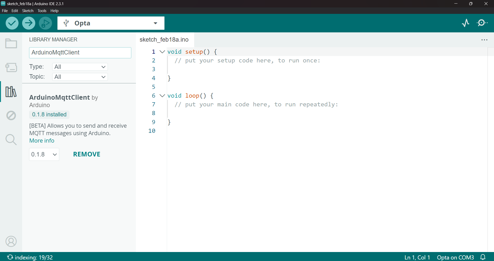

## CloudMQTT Instructions

Create an account and log in to the [CloudMQTT](https://www.cloudmqtt.com/) website using the login button located at the top right of the homepage.

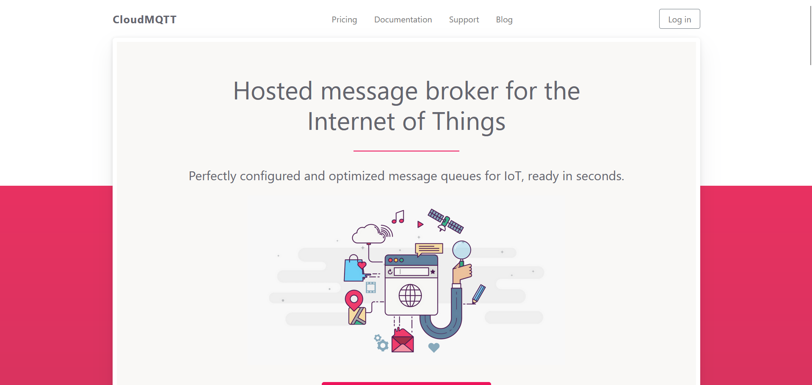

If it's your first time on CloudMQTT, you'll need to sign up by clicking on "Sign up" at the bottom of the page. Alternatively, you can log in by entering your account credentials.

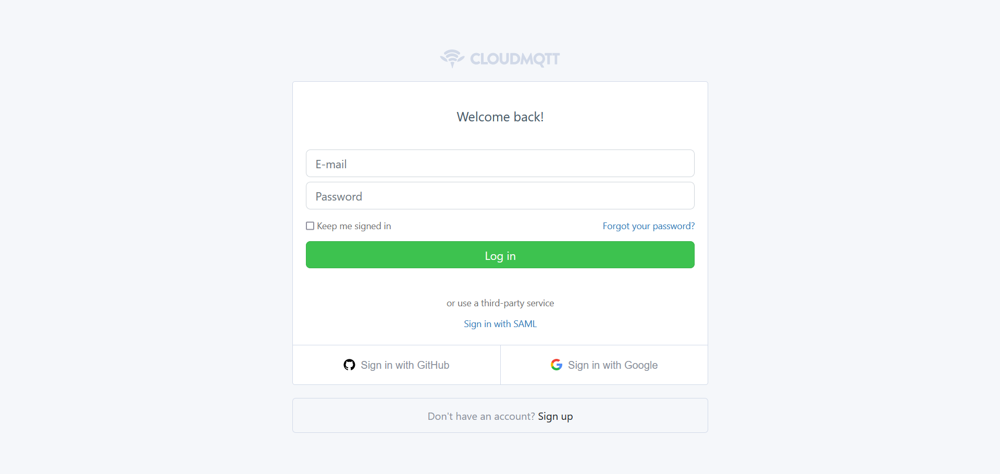

Upon logging in for the first time, you'll be prompted to create a "Work Team". In this tutorial, the team will be named **TeamOpta**.


You'll need to agree to the terms of use and, if applicable, provide the email of your team's privacy officer. Then, press the "Create Team" button.

After completing the team creation, you'll be redirected to the "Instances" page.

An **instance on CloudMQTT** represents an individual installation of an MQTT broker within the CloudMQTT infrastructure. It's like a virtual "container" for your MQTT broker, where you can configure and manage connections, topics, and data. Each instance has its own settings and dedicated resources, ensuring an isolated and secure environment.


To create a new instance, click on the green "+ Create New Instance" button at the top right of the page.

You may need to update payment information before proceeding with instance creation.

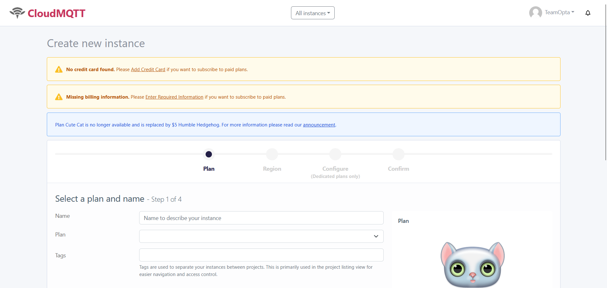

After setting up a payment method, fill in the fields to customize the new instance:

- **Name**: Set the name of the instance (e.g., **OptaInstance**).
- **Plan**: Select the desired monthly plan (recommended: **Humble Hedgehog** at $5 per month).
- **Tags**: Add any tags to identify the instance.

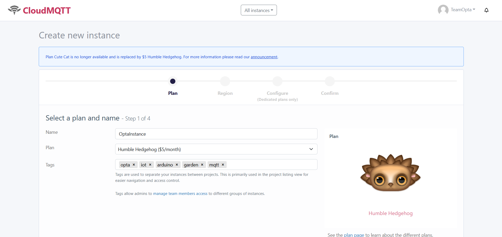

Select the server region for the instance and proceed by pressing the "Select region" button.

For this tutorial, the "EU-West-1 (Ireland)" Data center region has been chosen.

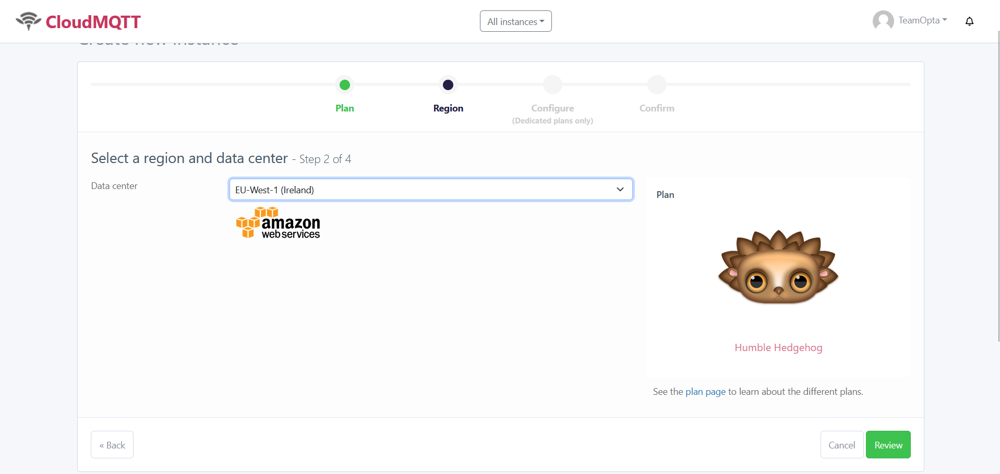

Finally, click on "Review" and, if everything is correct, press "Create Instance".

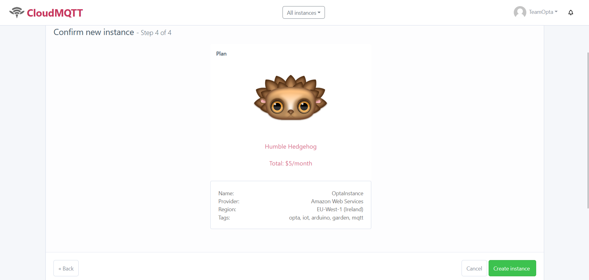

You'll be redirected to the list of instances, where you can find the necessary information to connect to your MQTT broker.


Click on the name of the newly created instance (OptaInstance) to access the control dashboard.

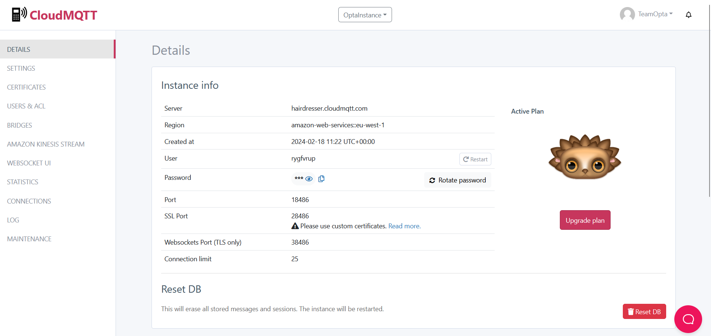

All the information needed to connect Opta™ to your MQTT broker is displayed on the current page and can be copied and pasted into your sketch within the **arduino_secrets.h** file.

- **Server** will be your MQTT host.
- **User** is the username to connect to your MQTT broker.
- **Password** is the password for the username.
- **Port** is the MQTT port required for connection, usually just use the one indicated in the **Port** field.

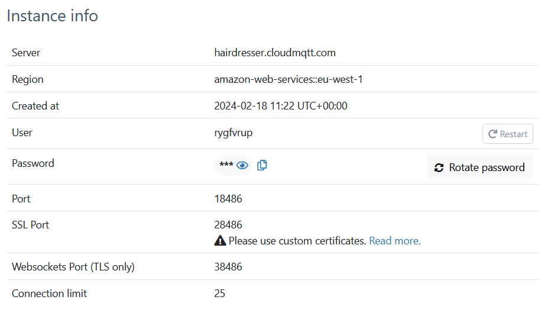

In the next chapter, you'll focus on learning what the sketch does, how to configure it correctly, and how to upload it to your Opta™.

## Sketch

### Overall Code Analysis

You can download the complete example project from [here](assets/opta-mqtt-tutorial.zip).

After downloading the .zip file, extract it and open the .ino file inside.


Briefly analyzing the code, at the beginning of the .ino file, there are the necessary library inclusions.

```cpp
#include <ArduinoMqttClient.h>   // Include the ArduinoMqttClient library to handle MQTT connection
#include <WiFi.h>                // Include the WiFi library to handle WiFi connection

#include "arduino_secrets.h"     // Include the arduino_secrets.h file containing WiFi and MQTT connection credentials
```

Then, two objects are created to handle the MQTT service connection.

```cpp
WiFiClient wifiClient;           // Create a wifiClient object of type WiFiClient to handle WiFi connection
MqttClient mqttClient(wifiClient);  // Create an mqttClient object of type MqttClient using wifiClient to handle MQTT connection
```

The **setup()** function is responsible for establishing the Wi-Fi® connection and connecting to the MQTT broker.

```cpp
void setup() {
  // Start Wi-Fi connection using provided credentials
  while (WiFi.begin(SECRET_SSID, SECRET_PASS) != WL_CONNECTED) { // Keep attempting connection until connected
    Serial.print(".");  // Print a dot on serial to indicate connection attempt
    delay(5000);        // Wait 5 seconds between connection attempts
  }

  mqttClient.setUsernamePassword(MQTT_USER, MQTT_PASSWORD);  // Set the username and password for authentication with the MQTT broker
  
  // Connect to MQTT broker using provided credentials
  if (!mqttClient.connect(MQTT_BROKER, MQTT_PORT)) {  // If MQTT connection fails
    while (1);  // Halt program execution in an infinite loop
  }

}
```

The **loop()** function sends a test message, in this case "hello", to the MQTT broker every 10 seconds.

```cpp
void loop() {
    mqttClient.poll();  // Check for incoming messages from MQTT broker
    
    // Begin a new MQTT message on the specified topic
    mqttClient.beginMessage(MQTT_TOPIC);
    
    // Add message content (in this case, "hello" followed by a count)
    mqttClient.print("hello");

    // End the MQTT message and send it to the broker
    mqttClient.endMessage();
    
    delay(10000);  // Wait for 10 seconds before sending the next message
}
```

### Connection Configuration


In the attached sketch to this tutorial, you will find a support file called **arduino_secrets.h**, which contains the definitions that will allow you to configure the connection to the newly created MQTT broker.


In this file, we can replace the data according to the information generated on CloudMQTT:

```cpp
#define SECRET_SSID "Your Network"               // WiFi network SSID (name)
#define SECRET_PASS "Your Network password"      // WiFi network password
#define MQTT_BROKER "hairdresser.cloudmqtt.com"  // MQTT broker address
#define MQTT_PORT 18486                           // MQTT broker port
#define MQTT_TOPIC "arduino/topic"                // MQTT topic to publish messages to
#define MQTT_USER "rygfvrup"                      // MQTT broker username (if required)
#define MQTT_PASSWORD "xxxxxxx"                   // MQTT broker password (if required)
```

**MQTT_TOPIC ?** A "topic" is like a communication channel on which devices can send and receive messages using the MQTT protocol. It's akin to a topic of conversation: when a device publishes a message on a specific topic, other devices interested in that topic can receive and read the message. It's a way to organize and address messages in an IoT network, allowing devices to communicate in a targeted and efficient manner. For example, you might have a topic called "temperature" on which a sensor publishes temperature data and a control device receives them to regulate an air conditioning system. In this tutorial, we use the topic **arduino/topic**, which is not transcendental and can be customized as you prefer.

### First Upload and Testing

By uploading the just analyzed code, if the connection settings inside the **arduino_secrets.h** file are correct, you'll be ready to verify if telemetry messages are arriving correctly at the MQTT Broker.

From the dashboard of your instance, you can access the WEBSOCKET UI section in the left menu, and every 10 seconds, you should see the message "hello" in the chosen topic:

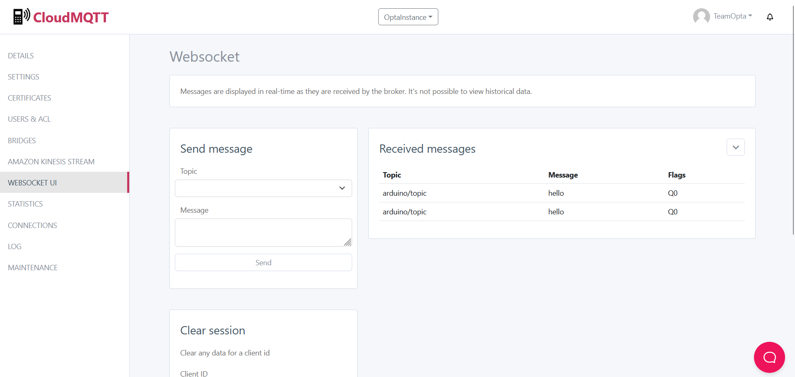

### Non-Blocking Method for Message Sending

In this section of the tutorial, you will learn how to improve message sending by using a non-blocking method, as the 10-second delay in the loop would block further code operations.

Replacing the delay function with a time control using **millis()** will suit your needs. Here are the necessary modifications:

At the beginning of the code, we create two **unsigned long** variables that will allow us to keep track of the elapsed time.

```cpp
unsigned long current_time, previous_time = millis();  // Variables for time control
```

Then, at the end of **setup()**, we update the **previous_time** variable with the current milliseconds.

```cpp
previous_time = millis();  // Set previous time to current time
```

In the **loop()**, we track the elapsed time using the two variables **current_time** and **previous_time** within an if condition.

```cpp
void loop() {
  mqttClient.poll();  // Check for incoming messages from MQTT broker
  current_time = millis();                      // Get current time in milliseconds
  if (current_time - previous_time >= 10000) {  // If 10 seconds have elapsed
    previous_time = current_time; //Update previous_time with current_time
    // Begin a new MQTT message on the specified topic
    mqttClient.beginMessage(MQTT_TOPIC);
    // Add message content (in this case, "hello")
    mqttClient.print("hello");
    // End the MQTT message and send it to the broker
    mqttClient.endMessage();
    previous_time = current_time;  // Update previous time to current time
  }
}
```

The complete code might look like this:

```cpp
#include <ArduinoMqttClient.h>  // Include the ArduinoMqttClient library to handle MQTT connection
#include <WiFi.h>               // Include the WiFi library to handle WiFi connection

#include "arduino_secrets.h"   // Include the arduino_secrets.h file containing WiFi and MQTT connection credentials

WiFiClient wifiClient;              // Create a wifiClient object of type WiFiClient to handle WiFi connection
MqttClient mqttClient(wifiClient);  // Create an mqttClient object of type MqttClient using wifiClient to handle MQTT connection

unsigned long current_time, previous_time = millis();  // Variables for time control

void setup() {
  // Start WiFi connection using provided credentials
  while (WiFi.begin(SECRET_SSID, SECRET_PASS) != WL_CONNECTED) {  // Keep attempting connection until connected
    Serial.print(".");                                            // Print a dot on serial to indicate connection attempt
    delay(5000);                                                  // Wait 5 seconds between connection attempts
  }

  mqttClient.setUsernamePassword(MQTT_USER, MQTT_PASSWORD);  // Set the username and password for authentication with the MQTT broker

  // Connect to MQTT broker using provided credentials
  if (!mqttClient.connect(MQTT_BROKER, MQTT_PORT)) {  // If MQTT connection fails
    while (1)
      ;  // Halt program execution in an infinite loop
  }

  previous_time = millis();  // Set previous time to current time
}

void loop() {
  mqttClient.poll();  // Check for incoming messages from MQTT broker
  current_time = millis();                      // Get current time in milliseconds
  if (current_time - previous_time >= 10000) {  // If 10 seconds have elapsed
    previous_time = current_time; //Update previous_time with current_time
    // Begin a new MQTT message on the specified topic
    mqttClient.beginMessage(MQTT_TOPIC);
    // Add message content (in this case, "hello")
    mqttClient.print("hello");
    // End the MQTT message and send it to the broker
    mqttClient.endMessage();
    previous_time = current_time;  // Update previous time to current time
  }
}
```

This code will produce the same transmission effect already observed previously but with the advantage of keeping the **loop()** function free for other operations and avoiding interference with the synchronization necessary for connecting to the MQTT cloud.

The "hello" message was used for example purposes; you can customize this message by sending the value of a sensor or other information based on your needs.

### Receiving Message

Previously, we saw that to send messages to the MQTT Broker, a topic is specified. This topic can also be used to listen for messages coming from that topic and receive them on Opta™.

The MQTT client library offers a method called **subscribe**, which allows you to register on a specific topic and keep listening to it.

```cpp
mqttClient.subscribe("arduino/led");  // Subscribe to the MQTT topic "arduino/led"
```

Subsequently, it's necessary to check if there are incoming messages with the **parseMessage()** function, allowing you to use an if statement in the code. You can then use the **available** and **read** methods of the MQTT client to check the content of the message:

```cpp
int messageSize = mqttClient.parseMessage();  // Parse any incoming MQTT messages and get their size, if available
if (messageSize) {
  // If there is an incoming MQTT message (i.e., messageSize is not zero), execute the code inside this block
  // Read all available bytes from the MQTT client and append them to the 'message' String
  String message = "";
  while (mqttClient.available()) {
    char c = mqttClient.read();
    message += String(c);
  }
  // Check if the received message is "on"
  if (message == "on") {
    // If the message is "on", turn on the LED by setting its pin to HIGH
    digitalWrite(LEDR, HIGH);
  }
  // Check if the received message is "off"
  if (message == "off") {
    // If the message is "off", turn off the LED by setting its pin to LOW
    digitalWrite(LEDR, LOW);
  }
}
```

Your complete code might look like this:

```cpp
#include <ArduinoMqttClient.h>  // Include the ArduinoMqttClient library to handle MQTT connection
#include <WiFi.h>               // Include the WiFi library to handle Wi-Fi connection

#include "arduino_secrets.h"  // Include the arduino_secrets.h file containing Wi-Fi and MQTT connection credentials

WiFiClient wifiClient;              // Create a wifiClient object of type WiFiClient to handle Wi-Fi connection
MqttClient mqttClient(wifiClient);  // Create an mqttClient object of type MqttClient using wifiClient to handle MQTT connection

unsigned long current_time, previous_time = millis();  // Variables for time control
String message;                                        // Create String for message content
int messageSize; // Size of message

void setup() {

  pinMode(LEDR, OUTPUT);  // Set LEDR to OUTPUT

  // Start WiFi connection using provided credentials
  while (WiFi.begin(SECRET_SSID, SECRET_PASS) != WL_CONNECTED) {  // Keep attempting connection until connected
    Serial.print(".");                                            // Print a dot on serial to indicate connection attempt
    delay(5000);                                                  // Wait 5 seconds between connection attempts
  }

  mqttClient.setUsernamePassword(MQTT_USER, MQTT_PASSWORD);  // Set the username and password for authentication with the MQTT broker

  // Connect to MQTT broker using provided credentials
  if (!mqttClient.connect(MQTT_BROKER, MQTT_PORT)) {  // If MQTT connection fails
    while (1)
      ;  // Halt program execution in an infinite loop
  }

  mqttClient.subscribe("arduino/led");  // Subscribe to the MQTT topic "arduino/led"

  previous_time = millis();  // Set previous time to current time
}

void loop() {

  messageSize = mqttClient.parseMessage();  // Parse any incoming MQTT messages and get their size, if available
  if (messageSize) {
    // If there is an incoming MQTT message (i.e., messageSize is not zero), execute the code inside this block
    // Read all available bytes from the MQTT client and append them to the 'message' String
    message = "";
    while (mqttClient.available()) {
      char c = mqttClient.read();
      message += String(c);
    }
    // Check if the received message is "on"
    if (message == "on") {
      // If the message is "on", turn on the LED by setting its pin to HIGH
      digitalWrite(LEDR, HIGH);
    }
    // Check if the received message is "off"
    if (message == "off") {
      // If the message is "off", turn off the LED by setting its pin to LOW
      digitalWrite(LEDR, LOW);
    }
  }

  current_time = millis();                      // Get current time in milliseconds
  if (current_time - previous_time >= 10000) {  // If 10 seconds have elapsed
    mqttClient.poll();                          // Check for incoming messages from MQTT broker
    previous_time = current_time;
    // Begin a new MQTT message on the specified topic
    mqttClient.beginMessage(MQTT_TOPIC);
    // Add message content (in this case, "hello")
    mqttClient.print("hello");
    // End the MQTT message and send it to the broker
    mqttClient.endMessage();
    previous_time = current_time;  // Update previous time to current time


  }
}
```

An important detail not to overlook is the **poll()** function of the MQTT client, which should be moved from the beginning of **loop()** to inside the time control if statement. The **poll()** function affects the reception of messages from the topic Opta™ is listening to. It's important that this function is called only when it's necessary to send messages from Opta™ to the broker and not continuously.

By uploading the new modifications, you can test to verify if the received message turns the red LED on Opta™ on and off based on its content.

In the WEBSOCKET UI interface, enter "arduino/led" in the **Topic** field and "on" in the **Message** field.

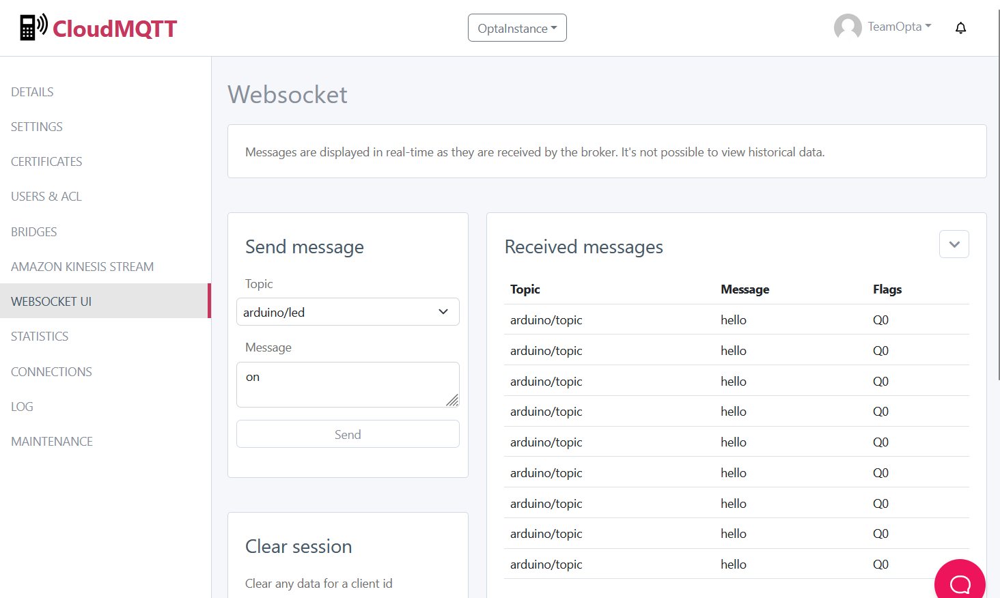

Clicking the **Send** button will simulate sending a message from another device, and you should see the red LED on Opta™ turn on.

Similarly, by sending the "off" message, the LED should turn off.

### Using Ethernet for MQTT

Opta™ allows you to connect to cloud services using Ethernet connection, leveraging a more stable and efficient connection compared to Wi-Fi®.

You can replace the portion of code related to Wi-Fi® connectivity with the necessary methods for Ethernet.

Add the **Ethernet.h** library:

```cpp
#include <Ethernet.h> // Include Ethernet library
```

Create an Ethernet client and assign it to the MQTT client:

```cpp
EthernetClient client; // Create an Ethernet Client
MqttClient mqttClient(client);  // Create an mqttClient object of type MqttClient using client to handle MQTT connection
```

Check when the Ethernet connection is established and an IP is assigned to Opta™ in the **setup()** function:

```cpp
if (Ethernet.begin() == 0) {
  while (1)
    ;  // If Ethernet connection fails, halt program execution in an infinite loop
}
```

Your code could be modified like this:

```cpp
#include <ArduinoMqttClient.h>  // Include the ArduinoMqttClient library to handle MQTT connection
#include <Ethernet.h> // Include Ethernet library

#include "arduino_secrets.h"  // Include the arduino_secrets.h file containing WiFi and MQTT connection credentials

EthernetClient client; // Create an Ethernet Client
MqttClient mqttClient(client);  // Create an mqttClient object of type MqttClient using wifiClient to handle MQTT connection

unsigned long current_time, previous_time = millis();  // Variables for time control
String message;                                        // Create String for message content

void setup() {

  pinMode(LEDR, OUTPUT);  // Set LEDR to OUTPUT

  if (Ethernet.begin() == 0) {
    while (1)
      ;  // If Ethernet connection fails, halt program execution in an infinite loop
  }

  mqttClient.setUsernamePassword(MQTT_USER, MQTT_PASSWORD);  // Set the username and password for authentication with the MQTT broker

  // Connect to MQTT broker using provided credentials
  if (!mqttClient.connect(MQTT_BROKER, MQTT_PORT)) {  // If MQTT connection fails
    while (1)
      ;  // Halt program execution in an infinite loop
  }

  mqttClient.subscribe("arduino/led");  // Subscribe to the MQTT topic "arduino/led"

  previous_time = millis();  // Set previous time to current time
}

void loop() {

  int messageSize = mqttClient.parseMessage();  // Parse any incoming MQTT messages and get their size, if available
  if (messageSize) {
    // If there is an incoming MQTT message (i.e., messageSize is not zero), execute the code inside this block
    // Read all available bytes from the MQTT client and append them to the 'message' String
    message = "";
    while (mqttClient.available()) {
      char c = mqttClient.read();
      message += String(c);
    }
    // Check if the received message is "on"
    if (message == "on") {
      // If the message is "on", turn on the LED by setting its pin to HIGH
      digitalWrite(LEDR, HIGH);
    }
    // Check if the received message is "off"
    if (message == "off") {
      // If the message is "off", turn off the LED by setting its pin to LOW
      digitalWrite(LEDR, LOW);
    }
  }

  current_time = millis();                      // Get current time in milliseconds
  if (current_time - previous_time >= 10000) {  // If 10 seconds have elapsed
    mqttClient.poll();                          // Check for incoming messages from MQTT broker
    previous_time = current_time;
    // Begin a new MQTT message on the specified topic
    mqttClient.beginMessage(MQTT_TOPIC);
    // Add message content (in this case, "hello")
    mqttClient.print("hello");
    // End the MQTT message and send it to the broker
    mqttClient.endMessage();
    previous_time = current_time;  // Update previous time to current time
  }
}
```

By uploading the modified code and ensuring that Opta™ is properly connected to the Ethernet network, you should see your device generating activity on your MQTT broker similar to what was happening with WiFi.

### Conclusion

In conclusion of the Opta™ and CloudMQTT tutorial, you have successfully tackled the implementation of a stable and reliable connection between your Opta™ device and CloudMQTT's MQTT messaging service. Now that you have gained familiarity with the basic concepts and practices of MQTT connectivity, you are ready to explore further development and integration opportunities in the realm of IoT.

- **Stable Connection:** You are now able to connect Opta™ to CloudMQTT reliably, enabling secure transmission of telemetry data.

- **Flexibility:** With the provided libraries and functions, you have learned to manage MQTT connection efficiently and adaptably to your needs.

- **Simple Integration:** With detailed instructions provided, you can easily integrate Opta™ with CloudMQTT, opening doors to a wide range of data management and remote control possibilities.

- **Future Expansion:** This tutorial provides a solid foundation for further development, allowing you to explore additional features and expand Opta™'s capabilities in the realm of IoT connectivity.