## Introduction
Arduino® Alvik is a powerful and versatile robot specifically designed for programming and STEAM education.

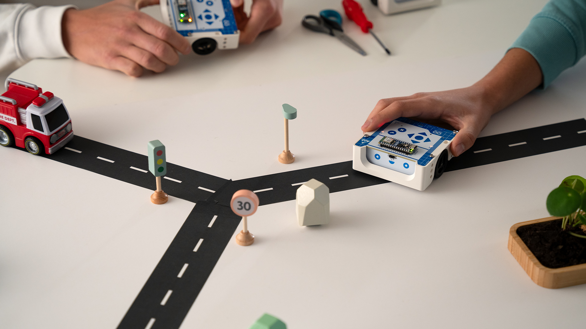

Powered by the Arduino® Nano ESP32, Alvik offers diverse learning paths through different programming languages including MicroPython, Arduino C, and block-based coding; enabling different possibilities to explore Robotics, IoT, and Artificial Intelligence.

In this tutorial, you will find useful information to get started, test, and maintain Alvik.

## Alvik Overview


***When the PCB is out of the chassis and the battery is in place there is the risk of short-circuiting the 18650 Li-Ion battery. If you remove the hardware from the chassis make sure you do it on a __non-conductive surface clean__ of materials or tools that can short-circuit the battery***

### Main Components

Alvik is a robot with two controllers and tons of useful sensors and actuators. The main controller is the Arduino Nano ESP32 attached at the top of the robot while there is an STM32 controller integrated into the robot that takes care of the low-level commands like reading the sensors and moving the motors.

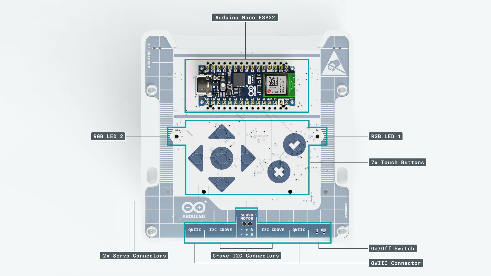

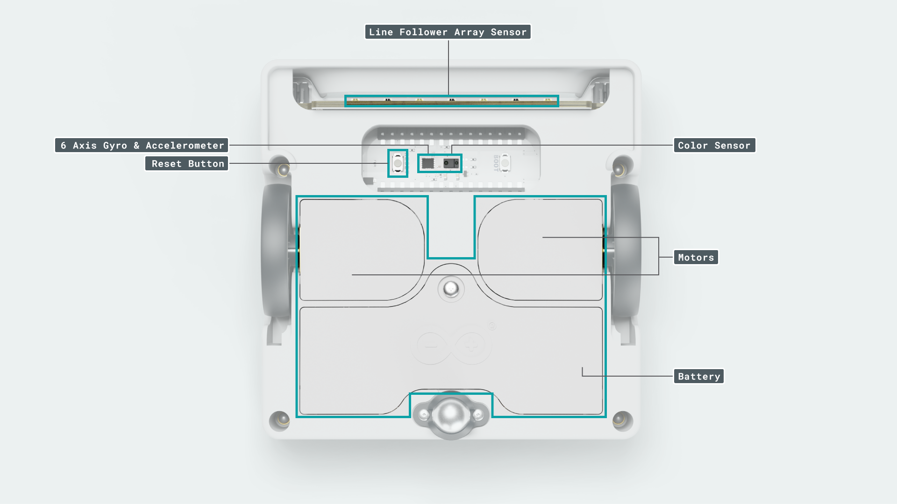

## Move Your Robot!

To get started to play with Alvik you will need the following hardware and software:

### Hardware Requirements

- Alvik (x1)
- USB-C® to USB-C® cable (x1)
- Phillips® Screwdriver (cross head) (x1)
- Computer (x1)

***Make sure the USB-C® cable you are using works with data lines, not only power lines***

### Software Requirements

- Operating Systems: Linux, macOS and Windows
- [Arduino Lab for Micropython](https://labs.arduino.cc/en/labs/micropython)

## What Is Alvik

Arduino® Alvik is a robot with two controllers and numerous useful sensors and actuators. It is designed for STEAM education, making it an ideal tool for learning programming, Robotics, IoT, and Artificial Intelligence.

## The Brain
The brain of the Alvik robot is the Nano ESP32, which is the central component we program to run the logic and make decisions. It is extremely important because it processes all the high-level commands and controls the overall operation of the robot. However, instead of directly moving the motors or reading sensors, it communicates with the STM32 (the body) to execute these actions. The Nano ESP32 gives orders to the STM32 to move, read sensors, or report status, allowing the robot to make informed (or better yet, as informed as we program it) decisions and run tasks and routines using this information.
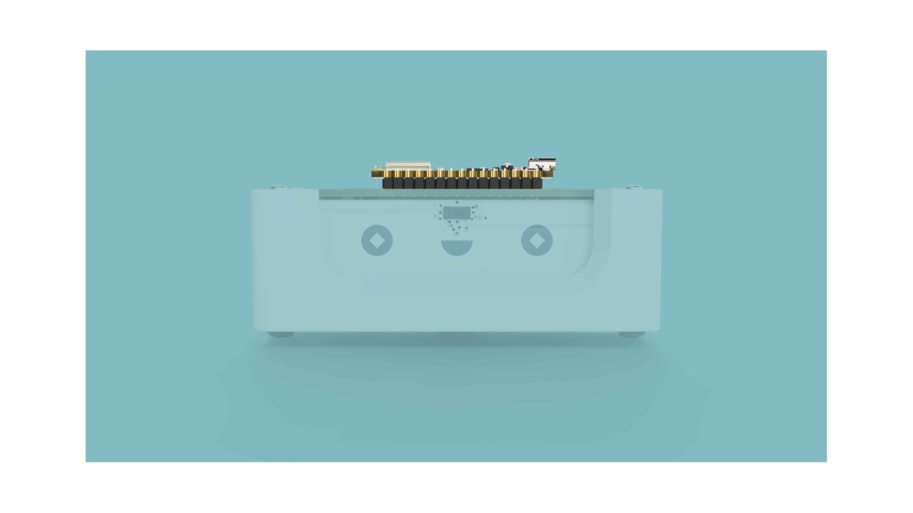


### Nano ESP32

The [Nano ESP32](https://store.arduino.cc/products/nano-esp32) is the board used to control Alvik. It has a fast processor, large flash memory, and a Wi-Fi® enabled chip packed into a tiny circuit board.

***You can find out more about this board in the [Nano ESP32 documentation](https://docs.arduino.cc/hardware/nano-esp32).***

Please note that when using MicroPython the pin number reflects the GPIO on the ESP32-S3, not the Nano board. Use the **green labeled number** in the following image. You can read more about this [here](https://docs.arduino.cc/micropython/micropython-course/course/introduction-python#nano-esp32--micropython-pinout).

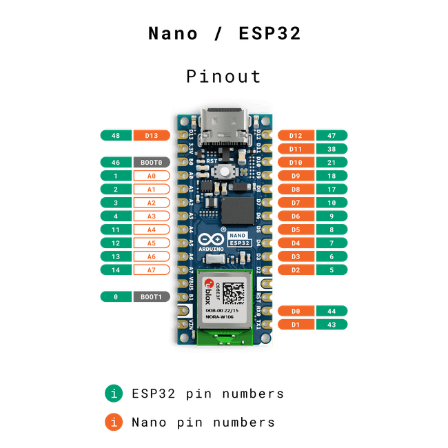

## The Body
Using the same analogy, the body of the Alvik robot includes everything else from the sensors and motors to the connectors supporting external modules and, of course, the STM32, which acts like the nervous system of the robot. Just as the human nervous system transmits signals between the brain and various parts of the body, the STM32 transmits commands and collects data from the robot's components. When the Nano ESP32, acting as the brain, sends commands, the STM32 executes these low-level operations, such as moving the motors, flashing the LEDs, or interacting with external devices. The STM32 is essential for carrying out the detailed actions based on the high-level instructions from the Nano ESP32, ensuring that the robot's movements and functions are performed accurately.

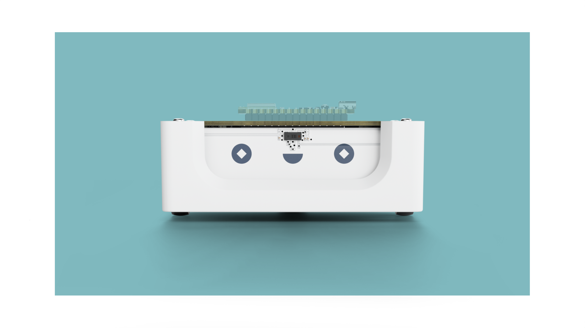


### Controller - STM32


The main core of the robot is the STM32 ARM Cortex-M4 32 Bit controller. It handles the low-level commands such as reading sensors and moving motors. You can access it through a set of dedicated APIs from the Nano ESP32.

You can learn more about the available functions for Alvik in the following [Alvik's API Documentation](https://docs.arduino.cc/tutorials/alvik/api-overview).

***Although Alvik's "out of the box" experience is designed in micropython, there are C++ APIs that allow you to program Avlik in the Arduino IDE, these APIs are 1 to 1 compatible with the micropython APIs, which means that the API overview will be interesting for both micropython and C++ programs.***

The latest firmware of the STM32 can be found at [this link](https://github.com/arduino-libraries/Arduino_AlvikCarrier/releases), and [here](#how-to-upload-firmware) is the guide to flash it.


### ON/OFF Switch


At the back-right side of Alvik there is the main switch of the robot. When ON the robot will power up and it will execute the already loaded program.

***Keep the robot off while programming to avoid undesired movements and remember to turn it on when you are ready to execute your program. A feature of the Arduino Lab for MicroPython terminal is that it will notify you if you forgot to switch on the robot to run the code.***


### Battery

The battery is a rechargeable Li-ion 18650, it allows to run Alvik for 8+ hours non stop.
The battery is located in the bottom part of Alvik, if you need to access it you'll need to remove one Phillip's screw and take out the plastic holder.


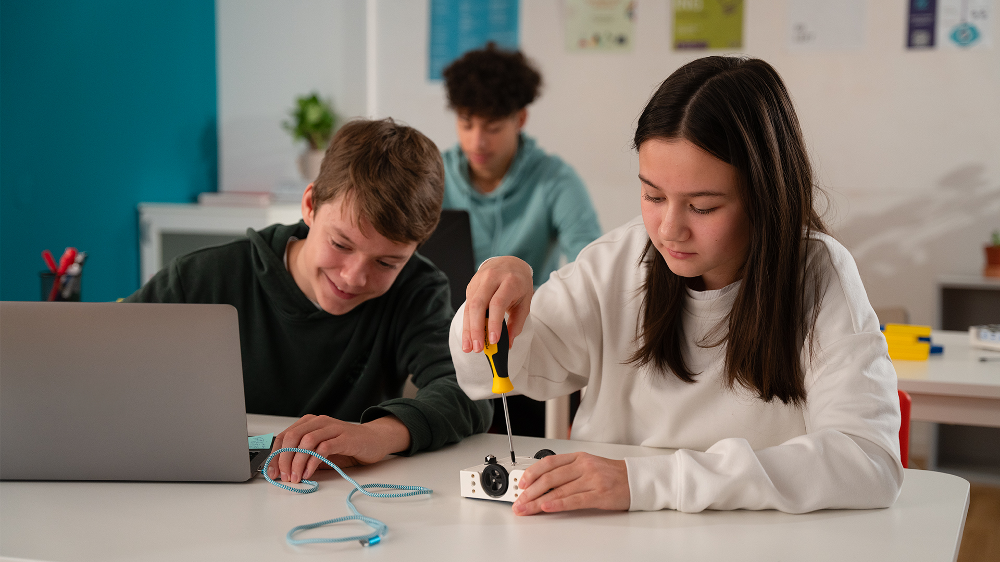


**Changing the battery:**

1. **Detach the Existing Battery**: Carefully remove the old battery from its compartment.
2. **Attach a New Battery**: Place the new battery into the holder, ensuring it is securely connected.
3. **Plug in the Nano ESP32**: If you are using a different controller or have used the robot in another manner, reconnect the Nano ESP32.
4. **Connect the Nano ESP32 to the Computer**: Use a USB cable to connect the Nano ESP32 to your computer.

These steps are crucial for resetting the Battery Management System (BMS) after a battery replacement. If these steps are not followed, the BMS will remain "off," and the robot will not turn on.

The Nano ESP32 can report the status of the battery through the terminal of the Arduino Lab for MicroPython and with its RGB status LED. To do that you need to call the `Alvik.begin()` function in any program or directly at the command line area.

When the battery is charging the status LED will blink RED for one second.


When fully charged it will stay GREEN.


***Don't confuse the RGB status LED with the power ON LED of the Nano ESP32, which is always green.***

## Sensors


Alvik includes a set of  different sensors listed below, all connected to the STM32 and accessible through the [APIs](https://docs.arduino.cc/tutorials/alvik/api-overview). For each sensor there is test example program that you can find in the _examples_ folder in [this repository](https://github.com/arduino/arduino-alvik-mpy/tree/main/examples) for micropython and in [this repository](https://github.com/arduino-libraries/Arduino_AlvikCarrier/tree/main/examples) for C++.


| **Sensor name**              | **Part name** | **Test program name** |
|------------------------------|---------------|-----------------------|
| RGB Color detection          | APDS 9660     | read_color_sensor.py  |
| ToF 8x8 Array - up to 350 cm | LSM6DSOX      | read_tof.py           |
| IMU - 6 degree               | VL53L7CX      | read_imu.py           |
| 3x Line follower             | custom made   | line_follower.py      |
| 7x Touch sensor              | AT42QT2120    | read_touch.py         |

***Before using the ToF sensor check if it has a yellow protective film, if present, remove it from the sensor to ensure it works properly***

### Touch Buttons

The Arduino Alvik robot is equipped with seven capacitive touch buttons. These buttons allow for interactive input and can be used to control various functions of the robot, such as movement, mode selection, and more.

**Available buttons are:**
- Up
- Down
- Left
- Right
- Center
- OK (represented by a "tick" Icon)
- Cancel (represented by a "x")

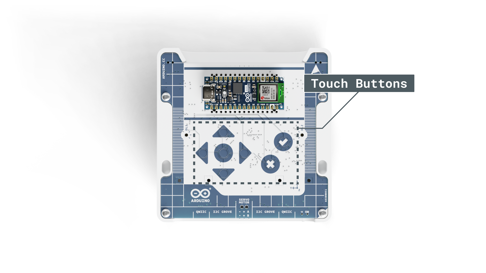

Each button can be programmed to perform specific actions, providing more complex interface for user interaction.

### Distance Sensors

The Arduino Alvik robot is equipped with a ToF (Time of Flight) 8x8 Array sensor, specifically the VL53L7CX, which can measure distances up to 350 cm. These distance sensors help the robot detect obstacles and measure the distance to objects in its environment. The sensor is integrated into the front PCB of the robot.

**Key Features:**
- Maximum distance: 350 cm
- High precision and accuracy
- Used for obstacle detection and distance measurement

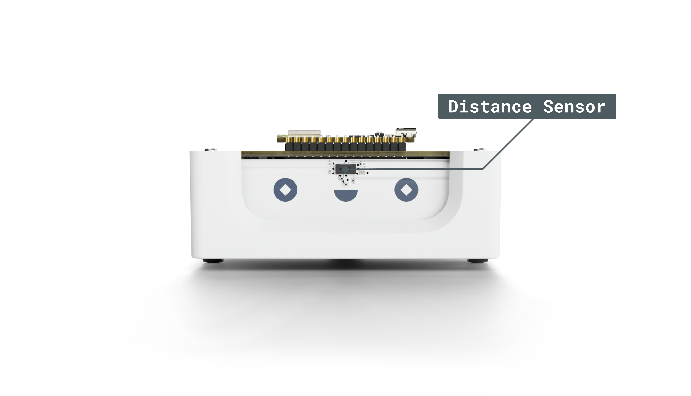

### Line Follower Sensor

The Arduino Alvik robot is equipped with line follower sensors that help it detect and follow lines on the ground. This is useful for applications where the robot needs to navigate along predefined paths. The line follower array consists of three phototransistors and five infrared LEDs, mounted on the front PCB.

The infrared LEDs emit light towards the ground, and the phototransistors detect the reflected light. When the sensors pass over a line (typically a dark line on a light surface), the amount of reflected light changes. Dark lines reflect less infrared light compared to light surfaces, allowing the phototransistors to detect the presence of a line.

**Key Features:**
- Detects lines on the ground (or any patterns using colors or materials with different reflective properties)
- Helps in navigating predefined paths
- Consists of three phototransistors and five infrared LEDs

**How it Works:**

**Infrared LEDs**: Emit infrared light towards the ground.
**Phototransistors**: Detect the reflected infrared light.
- When over a dark line, the reflection is low, indicating the presence of a line.
- When over a light surface, the reflection is high, indicating no line.


By continuously reading the values from the phototransistors, the robot can determine its position relative to the line and adjust its movements to follow the path accurately.

### Color Sensor

The color sensor on the Arduino Alvik robot is used to detect and identify colors on surfaces that the robot encounters. It provides both raw color readouts and labeled color information that can be used for various applications such as line following, object detection, and more. The sensor used is the APDS 9660.

**Key Features:**
- Detects and identifies colors
- Provides raw color readouts and labeled color information
- Useful for line following, object detection, and other applications

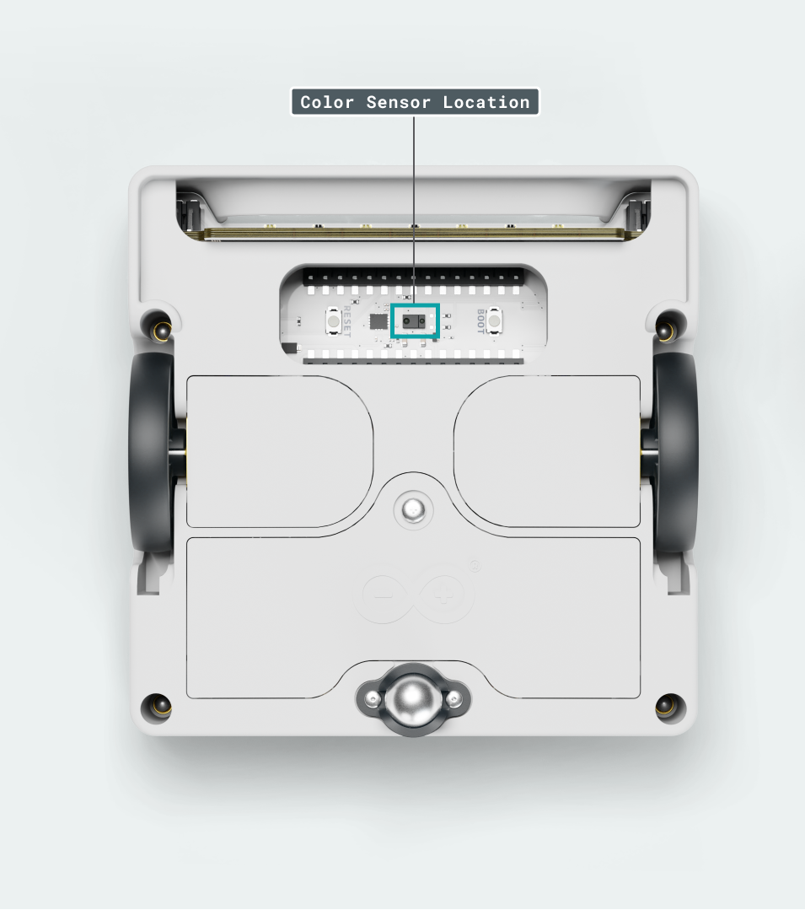

### IMU

The Arduino Alvik robot is equipped with an onboard IMU (Inertial Measurement Unit) that provides valuable information about the robot's motion and orientation. The IMU can measure acceleration, angular velocity, and orientation. The sensor used is the LSM6DSOX.

**Key Features:**
- Measures acceleration, angular velocity, and orientation
- Provides roll, pitch, and yaw values
- Useful for motion tracking and stabilization

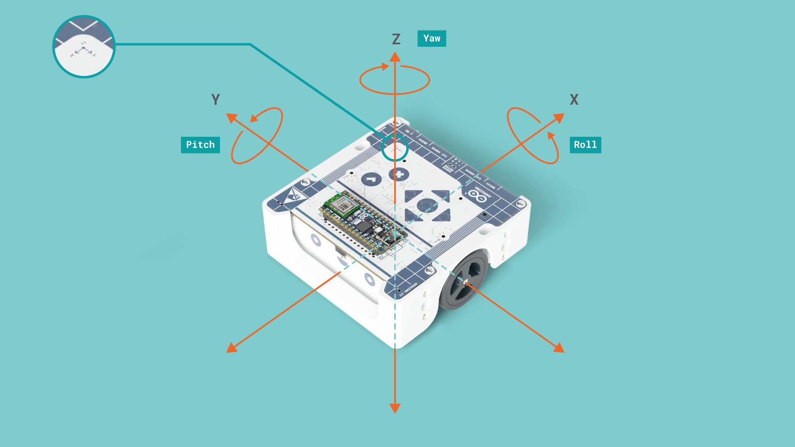

## Actuators


| **Actuator name**        | **Part name**           | **Test program name** |
|--------------------------|-------------------------|-----------------------|
| Geared motors w/ encoder | GM12-N20VA-08255-150-EN | wheels_positions.py   |
| RGB LEDs                 | RGB LEDs                | leds_settings.py      |

The RGB LEDs can be used for visual feedback and can be programmed to display various colors and patterns.

### Connectors

The connectors are placed in the back of the robot, the pinout is shown in the following image:


## Moving Alvik!

Alvik is equipped with three ready-to-go examples. To choose one of the examples, just turn your Alvik ON, move the switch located at the bottom right corner of the robot to the right, wait until the LEDs turn blue and use the Up and Down buttons to pick one color, then hit the "tick" confirmation button. 

### Basic Touch Programming

Alvik’s touch buttons can be programmed to control various actions such as movement, changing modes, and interacting with the environment. This allows for creating intuitive control schemes for different applications.

### Following Objects

Using the distance sensors, Alvik can follow objects by maintaining a certain distance from them. This is useful for applications like automated guided vehicles and interactive robotics.

### Line Follower

With its line follower sensors, Alvik can navigate along predefined paths marked by lines on the ground. This is especially useful in educational settings and for demonstrating basic robotic navigation.

The goal is to present the sensors and actuators of the Alvik robot, highlighting their key features and uses without delving into programming specifics.


## Alvik's Firmware


To get started to play with Alvik you will need the following hardware and software:

### Hardware Requirements

- Alvik (x1)
- USB-C® to USB-C® cable (x1)
- Phillips Screwdriver (cross head)(optional) (x1)

- Computer (x1)

***Make sure the USB-C® cable you are using works with data lines, not only power lines***

### Software Requirements

- Operating Systems: Linux, macOS or Windows

- [Arduino Lab for Micropython](https://labs.arduino.cc/en/labs/micropython)

### ESP32 MicroPython Firmware

Download and install the [Arduino Lab for MicroPython](https://labs.arduino.cc/en/labs/micropython), if you are able to connect the Arduino Nano ESP32 it means that your board is ready. You have to see the **CONNECTED** yellow label at the bottom.


If something goes wrong it means you need to upload the MicroPython firmware on the Nano ESP32.

Follow [this guide](https://docs.arduino.cc/micropython/basics/board-installation/).

### How to Upload Libraries

You will find the latest instructions directly in the [repository](https://github.com/arduino/arduino-alvik-mpy/releases). Here are the main steps:

1. Prepare file

Download the repository and extract all the files in a specific folder that will become the main Alvik folder.

2. Remove old files

Open **Arduino Lab for MicroPython** and **connect** Alvik. Then:

 Click on the `files` icon

 Click on a `files name` in the bottom left explorer windows.

 Click on the `bin` icon to delete it

 Repeat for all the files, from all folders


3. Install mpremote

[mpremote](https://docs.micropython.org/en/latest/reference/mpremote.html) is a Python module needed to upload files on the Nano ESP32. The minimum suggested mpremote release is 1.22.0. Be sure to have Python installed before proceeding!

`(venv)$ pip install mpremote` or `(venv)$ python3 -m pip install mpremote`

Depending on how you configure Python on your machine.

4. Install library
Run the following line to upload all files and download the dependencies needed to run the Arduino Alvik MicroPython library.

Linux
`$ ./install.sh -p <device port>`

Windows
`install.bat -p <device port>`


The `install.*` script will copy all the needed files into your Alvik.
The `<device port>` is the name of the USB port that your computer assigned to the Nano ESP32. 

There are several ways to find it, depending on your OS, for example:
- You can use the Arduino IDE to discover the port, [follow this guide to know more](https://support.arduino.cc/hc/en-us/articles/4406856349970-Select-board-and-port-in-Arduino-IDE).
- You can check it by using the Arduino Lab for MicroPython by clicking `Connect` after connecting Alvik with the USB cable.
- You can check the list of the USB devices attached to your PC.

### How to Upload Firmware

1. Download the latest [pre-compiled firmware](https://github.com/arduino-libraries/Arduino_AlvikCarrier/releases/latest) and place it inside Alvik's project folder.

2. Go into `utilities` folder and run the `flash_firmware` script:

Linux
`$ ./flash_firmware.sh -p <device port> <path-to-your-firmware>`


Windows
`flash_firmware.bat -p <device port> <path-to-your-firmware>`


Answer `y` to flash firmware.


There are also several examples to test all the features of your Alvik placed inside the `examples` folder.
Open **Arduino Lab for MicroPython** and **connect** Alvik. Then:

1. Click on the `files` icon
2. Click on the `path string` in the bottom right explorer windows.
3. Click on the `file name` of the example you choose
4. Click on the `play button`


## Program Alvik!


In order for Alvik to work properly three things have to be set correctly:

1. The Nano ESP32 needs the [MicroPython firmware](https://labs.arduino.cc/en/labs/micropython) on it.
2. The [latest libraries](https://github.com/arduino/arduino-alvik-mpy/releases) have to be placed in the Nano ESP32.
3. The [latest firmware](https://github.com/arduino-libraries/Arduino_AlvikCarrier/releases) has to be uploaded to the STM32 microcontroller.

Alvik comes with a preinstalled version of libraries and firmware, but in case you want to upgrade it or if something happens and you mess things up, here is the guide to reinstall both libraries and firmware.

### Controlling the Motors

Movement is one of Alvik's main features, making it essential to have a variety of methods to control Alvik's motors. This flexibility allows you to use different control methods depending on your needs, whether it's for precise movement or simple speed control.

**Power Over Distance/Time**

You can set the speed of Alvik's motors directly and let it run for a specific amount of time or distance. This method is straightforward and useful for simple tasks where precise control isn't necessary.

**Function: `set_wheels_speed`**

The `set_wheels_speed` function sets the speed of the left and right motors.

**Inputs:**
- `left_speed`: The speed value for the left motor.
- `right_speed`: The speed value for the right motor.
- `unit`: Unit of rotational speed of the wheels (default is 'rpm').

**Example Usage:**

```python
alvik.set_wheels_speed(30, 30, 'rpm')
sleep_ms(2000)  # Run motors at 30 rpm for 2 seconds
alvik.brake()
```

**Distance And Angle**

Alvik allows you to control the motors based on specific distances or angles. This method provides precise control over the robot's movements, ensuring it travels the exact distance or rotates to the exact angle specified.

**`set_wheels_position`** method

The `set_wheels_position` function sets the angle position for the left and right motors.

**Inputs:**
- `left_angle`: The angle value for the left motor.
- `right_angle`: The angle value for the right motor.
- `unit`: The angle unit (default is 'deg').

**Example Usage:**

```python
alvik.set_wheels_position(360, 360, 'deg')
sleep_ms(2000)  # Rotate wheels 360 degrees in 2 seconds
alvik.brake()
```

**Using Move**

The `move` function moves the robot by a given distance.

**Inputs:**
- `distance`: The distance value.
- `unit`: The distance unit (default is 'cm').
- `blocking`: True or False, whether the function should block until the movement is complete (default is True).

**Example Usage:**

```python
alvik.move(50, 'cm')
sleep_ms(2000)  # Move forward 50 cm in 2 seconds
alvik.brake()
```

**Using Drive**

You can also specify the power and time for Alvik's motors in terms of degrees per second or centimeters per second. This method is useful for tasks requiring fine-tuned control of the robot's speed and direction.

**`drive`** method

The `drive` function drives the robot by setting the linear and angular velocity.

**Inputs:**
`linear_velocity`: Speed of the robot.
`angular_velocity`: Speed of the wheels.
`linear_unit`: Unit of linear velocity (default is 'cm/s').
`angular_unit`: Unit of rotational speed of the wheels (default is 'deg/s').

**Example Usage:**

```python
alvik.drive(10, 30, 'cm/s', 'deg/s')
sleep_ms(2000)  # Drive at 10 cm/s linear velocity and 30 deg/s angular velocity for 2 seconds
alvik.brake()
```

### Encoder’s Control

The Alvik robot provides various functions to control and monitor the motors using encoders. These functions allow you to get real-time feedback on the speed, position, and pose of the robot, which is essential for precise movement and navigation.

** Check Wheels Speed **

The `get_wheels_speed` function returns the current speed of the wheels.

**Inputs:**
- `unit`: Unit of rotational speed of the wheels (default is 'rpm').

**Outputs:**
- `left_wheel_speed`: The speed of the left wheel.
- `right_wheel_speed`: The speed of the right wheel.

**Example Usage:**
```python
left_speed, right_speed = alvik.get_wheels_speed(unit='rpm')
print(f"Left Wheel Speed: {left_speed} rpm, Right Wheel Speed: {right_speed} rpm")
```

**Check Wheels Position**

The `get_wheels_position` function returns the current angle of the wheels.

**Inputs:**
- `unit`: Unit of the wheel angle (default is 'deg').

**Outputs:**
- `left_wheel_angle`: The angle of the left wheel.
- `right_wheel_angle`: The angle of the right wheel.

**Example Usage:**
```python
left_angle, right_angle = alvik.get_wheels_position(unit='deg')
print(f"Left Wheel Angle: {left_angle} degrees, Right Wheel Angle: {right_angle} degrees")
```

**Check Velocity**

The `get_drive_speed` function returns the linear and angular velocity of the robot.

**Inputs:**
- `linear_unit`: Unit of linear velocity (default is 'cm/s').
- `angular_unit`: Unit of rotational speed of the wheels (default is 'deg/s').

**Outputs:**
- `linear_velocity`: The linear speed of the robot.
- `angular_velocity`: The angular speed of the wheels.

**Example Usage:**
```python
linear_velocity, angular_velocity = alvik.get_drive_speed(linear_unit='cm/s', angular_unit='deg/s')
print(f"Linear Velocity: {linear_velocity} cm/s, Angular Velocity: {angular_velocity} deg/s")
```

**Check Pose**

The `get_pose` function returns the current pose of the robot.

**Inputs:**
- `distance_unit`: Unit of x and y outputs (default is 'cm').
- `angle_unit`: Unit of theta output (default is 'deg').

**Outputs:**
- `x`: The x-coordinate of the robot.
- `y`: The y-coordinate of the robot.
- `theta`: The orientation angle of the robot.

**Example Usage:**
```python
x, y, theta = alvik.get_pose(distance_unit='cm', angle_unit='deg')
print(f"Pose - X: {x} cm, Y: {y} cm, Theta: {theta} degrees")
```

These functions allow for precise control and monitoring of the Alvik robot's movements, enabling advanced navigation and path planning capabilities.


### Reading Buttons

The Arduino Alvik robot is equipped with several touch buttons that can be used for various input purposes. The following functions are available to read the state of each button:

- Detect **any** button pressed.

   The `[get_touch_any](https://docs.arduino.cc/tutorials/alvik/api-overview/#get_touch_any)` function returns true if any of the buttons is pressed.


- Detect the **OK** button pressed.

   The `[get_touch_ok](https://docs.arduino.cc/tutorials/alvik/api-overview/#get_touch_ok)` function returns true if the OK button is pressed.


- Detect the **Cancel** button pressed.

   The `[get_touch_cancel](https://docs.arduino.cc/tutorials/alvik/api-overview/#get_touch_cancel)` function returns true if the Cancel button is pressed.


- Detect the **Center** button pressed.

   The `[get_touch_center](https://docs.arduino.cc/tutorials/alvik/api-overview/#get_touch_center)` function returns true if the Center button is pressed.


- Detect the **Up** button pressed.

   The `[get_touch_up](https://docs.arduino.cc/tutorials/alvik/api-overview/#get_touch_up)` function returns true if the Up button is pressed.


- Detect the **Left** button pressed.

   The `[get_touch_left](https://docs.arduino.cc/tutorials/alvik/api-overview/#get_touch_left)` function returns true if the Left button is pressed.


- Detect the **Down** button pressed.

   The `[get_touch_down](https://docs.arduino.cc/tutorials/alvik/api-overview/#get_touch_down)` function returns true if the Down button is pressed.


- Detect the **Right** button pressed.

   The `[get_touch_right](https://docs.arduino.cc/tutorials/alvik/api-overview/#get_touch_right)` function returns true if the Right button is pressed.


**Example**
The following example demonstrates how to read the state of each button and print its name when pressed:

```python
from arduino_alvik import ArduinoAlvik
from time import sleep_ms
import sys

alvik = ArduinoAlvik()
alvik.begin()

while True:
    try:
        if alvik.get_touch_any():
            if alvik.get_touch_up():
                print("UP")
            if alvik.get_touch_down():
                print("DOWN")
            if alvik.get_touch_left():
                print("LEFT")
            if alvik.get_touch_right():
                print("RIGHT")
            if alvik.get_touch_ok():
                print("OK")
            if alvik.get_touch_cancel():
                print("CANCEL")
            if alvik.get_touch_center():
                print("CENTER")

        sleep_ms(100)
    except KeyboardInterrupt as e:
        print('over')
        alvik.stop()
        sys.exit()
```

This example provides a simple way to read and respond to button presses on the Arduino Alvik robot.
Feel free to expand to it by adding customized responses to each different press.


### Detecting Obstacles

These sensors provide detailed readouts from multiple positions around the robot, including **left**, **center-left**, **center, center-right**, **right**, **top**, and **bottom**. Unlike single-point sensors, these distance sensors offer comprehensive zone-based information.

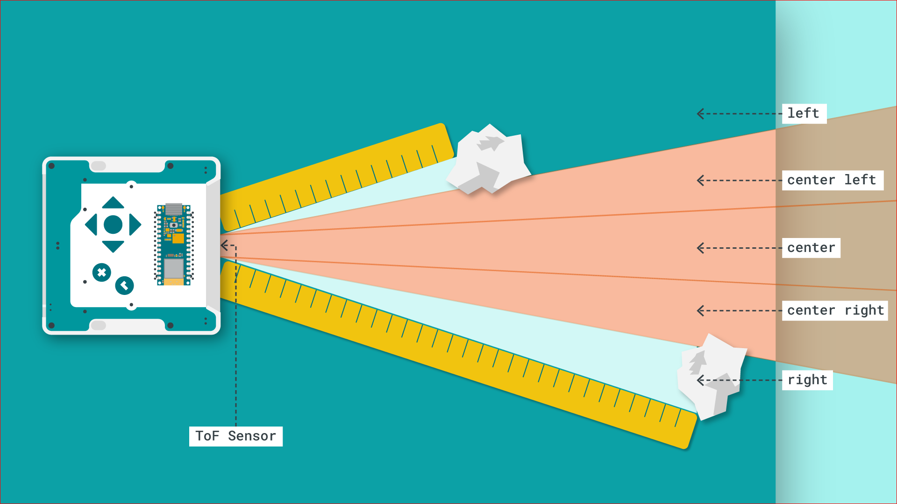

The distance sensor array is divided into five distinct zones: left, center-left, center, center-right, and right. Each zone measures distances and is capable of detecting objects up to three meters away. It's important to note that while the sensors can detect objects at greater distances, the reliability of the readings may decrease.

**Read distance**

The `get_distance` function returns the distance readouts from the left, center-left, center, center-right, and right sensors.

**Outputs:**
`L`: Left sensor readout.
`CL`: Center-left sensor readout.
`C`: Center sensor readout.
`CR`: Center-right sensor readout.
`R`: Right sensor readout.

**Example Usage**

Here is an example of how to use the distance sensors to get distance measurements:

```python
from arduino_alvik import ArduinoAlvik
from time import sleep_ms
import sys

alvik = ArduinoAlvik()
alvik.begin()

while True:
    try:
        L, CL, C, CR, R = alvik.get_distance()
        T = alvik.get_distance_top()
        B = alvik.get_distance_bottom()
        print(f'T: {T} | B: {B} | L: {L} | CL: {CL} | C: {C} | CR: {CR} | R: {R}')
        sleep_ms(100)
    except KeyboardInterrupt as e:
        print('over')
        alvik.stop()
        sys.exit()
```

In this example, the robot uses its distance sensors to measure distances in its environment. The distance readouts from the left, center-left, center, center-right, right, top, and bottom sensors are printed continuously, allowing the robot to detect obstacles and measure distances accurately.


### Following a Line

**Read line sensor**

The `get_line_sensors` function returns the line follower sensors' readouts, providing the status of the left, center, and right sensors.

**Outputs:**
- `left`: Left sensor readout.
- `center`: Center sensor readout.
- `right`: Right sensor readout.

**Example Usage**

Here is an example of how to use the line follower sensors to make the robot follow a line:

```python
from arduino_alvik import ArduinoAlvik
from time import sleep_ms
import sys

def calculate_center(left: int, center: int, right: int):
    centroid = 0
    sum_weight = left + center + right
    sum_values = left + 2 * center + 3 * right
    if sum_weight != 0:
        centroid = sum_values / sum_weight
        centroid = 2 - centroid
    return centroid

alvik = ArduinoAlvik()
alvik.begin()

error = 0
control = 0
kp = 50.0

alvik.left_led.set_color(0, 0, 1)
alvik.right_led.set_color(0, 0, 1)

while alvik.get_touch_ok():
    sleep_ms(50)

while not alvik.get_touch_ok():
    sleep_ms(50)

try:
    while True:
        while not alvik.get_touch_cancel():

            line_sensors = alvik.get_line_sensors()
            print(f' {line_sensors}')

            error = calculate_center(*line_sensors)
            control = error * kp

            if control > 0.2:
                alvik.left_led.set_color(1, 0, 0)
                alvik.right_led.set_color(0, 0, 0)
            elif control < -0.2:
                alvik.left_led.set_color(1, 0, 0)
                alvik.right_led.set_color(0, 0, 0)
            else:
                alvik.left_led.set_color(0, 1, 0)
                alvik.right_led.set_color(0, 1, 0)

            alvik.set_wheels_speed(30 - control, 30 + control)
            sleep_ms(100)

        while not alvik.get_touch_ok():
            alvik.left_led.set_color(0, 0, 1)
            alvik.right_led.set_color(0, 0, 1)
            alvik.brake()
            sleep_ms(100)

except KeyboardInterrupt as e:
    print('over')
    alvik.stop()
    sys.exit()
```

In this example, the robot uses its line follower sensor array to navigate along a line. The `calcu2late_center` function determines the center of the line's position, and the robot adjusts its wheel speeds to stay on the line based on the calculated error from this center.

### Sensing Colors

**Available features**

1. **Calibrate** the sensor for a specific background

   The `color_calibration` function is used to calibrate the color sensor for accurate color detection. Calibration can be done against a white or black background.

   ```
   color_calibration(background: str = 'white')
   ```

   **Inputs:**
    `background`: A string specifying the background color for calibration. Can be "white" or "black".

2. Gets the **raw** sensor value

   The `get_color_raw` function returns the raw readout from the color sensor. This is the direct sensor data before any processing or labeling. It can be useful for advanced applications where precise color data is needed.

   ```python
   get_color_raw()
   ```

   **Outputs:**
 `color`: The color sensor's raw readout.

3. Gets the **labelled** sensor value

   The `get_color_label` function returns the label of the color as recognized by the sensor. This function processes the raw sensor data and converts it into a human-readable label, such as "red", "blue", "green", etc. It simplifies the use of color data for most applications however some flexibility is lost as colors are grouped into the nearest labeled color.

   ```python
   get_color_label()
   ```

   **Outputs:**
- `color`: The label of the color as recognized by the sensor. These can be:
      `'BLACK'`, `'GREY'`, `'BLACK'`, `'LIGHT GREY'`, `'WHITE'`, `'YELLOW'`, `'LIGHT GREEN'`, `'BLUE'`, `'VIOLET'`, `'BROWN'`, `'ORANGE'`, `'RED'`.

   **Example Usage**

   Here is an example of how to use the `get_color_label` function in a script that makes the robot walk in a straight line, detect three different colors (ignoring white), stop, and communicate the detected colors via serial every second:

   ```python
   from arduino_alvik import ArduinoAlvik
   import time
   from time import sleep

   # Initialization
   alvik = ArduinoAlvik()
   alvik.begin()
   sleep(5)  # Waiting for the robot to setup

   # Calibrate color sensor for white
   alvik.color_calibration('white')

   # Main logic
   detected_colors = set()

   print("Starting to move and detect colors...")

   try:
       while len(detected_colors) < 3:
           alvik.set_wheels_speed(20, 20)
           color = alvik.get_color_label()
           
           if color != 'WHITE' and color not in detected_colors:
               detected_colors.add(color)
               print(f"Detected color: {color}")
           
           time.sleep(0.1)  # Adjust the sleep time as needed
       
       alvik.brake()
       print("Detected three different colors. Stopping...")
       
       # Communicate the detected colors via serial every second
       while True:
           print(f"Detected colors: {', '.join(detected_colors)}")
           time.sleep(1)
   except KeyboardInterrupt:
       alvik.brake()
       print("Interrupted. Stopping the robot.")
   except Exception as e:
       alvik.brake()
       print(f"An error occurred: {e}")
   ```

4. **get_color**

   The `get_color` function returns the normalized color readout of the color sensor. This function can output the color in either RGB or HSV format.

   ```python
   get_color(color_format: str = 'rgb')
   ```

   **Inputs:**
    `color_format`: The format of the color readout. Can be "rgb" or "hsv".

   **Outputs:**
    `r` or `h`: The red component in RGB format or the hue in HSV format.
    `g` or `s`: The green component in RGB format or the saturation in HSV format.
    `b` or `v`: The blue component in RGB format or the value in HSV format.

You can use these functions depending on your needs:
- Use `color_calibration` to calibrate the sensor for accurate readings.
- Use `get_color_raw` to get the raw sensor data.
- Use `get_color_label` to get a human-readable label of the detected color.
- Use `get_color` to get normalized color data in RGB or HSV format.
- Use `hsv2label` to convert HSV values to a color label.

### Detecting Falling and Crashes (IMU)

The `get_imu` function from the [Alvik API](https://docs.arduino.cc/tutorials/alvik/api-overview/#get_imu) returns all the IMU's readouts. The readouts include acceleration (ax, ay, az) and angular acceleration (gx, gy, gz) on the x, y, and z axes.

**Available Functions**

1. Retrieves IMU's orientation values like **roll**, **pitch** and **yaw**

   The [`get_orientation()`](https://docs.arduino.cc/tutorials/alvik/api-overview/#get_orientation) function returns the orientation of the IMU, including roll, pitch, and yaw values. This can be useful for determining the robot's orientation in 3D space.

    **Outputs:**
    **r**: roll value
 **p**: pitch value
 **y**: yaw value

1. Retrieves 3-axial acceleration values

   The [`get_accelerations()`](https://docs.arduino.cc/tutorials/alvik/api-overview/#get_accelerations) function returns the 3-axial acceleration of the IMU. This provides the acceleration values along the x, y, and z axes.

   **Outputs:**
    **ax**: acceleration on x
     **ay**: acceleration on y
  **az**: acceleration on z

1. Retrieves 3-axial angular acceleration values

   The [`get_gyros()`](https://docs.arduino.cc/tutorials/alvik/api-overview/#get_gyros) function returns the 3-axial angular acceleration of the IMU. This provides the angular acceleration values along the x, y, and z axes.

   **Outputs:**
    **gx**: angular acceleration on x
    **gy**: angular acceleration on y
    **gz**: angular acceleration on z

2. Retrieves all IMU readouts including acceleration and angular acceleration

   The [`get_imu()`](https://docs.arduino.cc/tutorials/alvik/api-overview/#get_imu) function returns all the IMU's readouts, including both the acceleration and angular acceleration values.

   **Outputs:**
    **ax**: acceleration on x
    **ay**: acceleration on y
    **az**: acceleration on z
    **gx**: angular acceleration on x
    **gy**: angular acceleration on y
    **gz**: angular acceleration on z

**Example**

Here is a combined example that utilizes all IMU functions:

```python

from arduino_alvik import ArduinoAlvik
import time

# Initialization
alvik = ArduinoAlvik()
alvik.begin()

# Give some time for initialization
time.sleep(2)

# Get orientation
orientation = alvik.get_orientation()
roll = orientation['r']
pitch = orientation['p']
yaw = orientation['y']
print(f"Orientation - Roll: {roll}, Pitch: {pitch}, Yaw: {yaw}")

# Get accelerations
accelerations = alvik.get_accelerations()
ax = accelerations['ax']
ay = accelerations['ay']
az = accelerations['az']
print(f"Acceleration - X: {ax}, Y: {ay}, Z: {az}")

# Get gyros
gyros = alvik.get_gyros()
gx = gyros['gx']
gy = gyros['gy']
gz = gyros['gz']
print(f"Gyro - X: {gx}, Y: {gy}, Z: {gz}")

# Combine all IMU readings
imu_readings = alvik.get_imu()
ax = imu_readings['ax']
ay = imu_readings['ay']
az = imu_readings['az']
gx = imu_readings['gx']
gy = imu_readings['gy']
gz = imu_readings['gz']

print(f"IMU Readings - Acceleration: X: {ax}, Y: {ay}, Z: {az}, Gyro: X: {gx}, Y: {gy}, Z: {gz}")
```


Now that we've got a solid grasp on how the IMU works and how to interact with it, let's put this knowledge to use in a practical scenario. Events like falls and crashes are critical for a robot, as they often result from sudden changes in linear acceleration (movement along the x, y, or z axes) or angular velocity (rotational movement around these axes). By monitoring these specific changes, we can effectively detect such incidents and respond accordingly.

In the following example, we'll create a sketch that uses the IMU to identify falls and crashes. The sketch will look for sudden spikes in linear acceleration or angular velocity, using set thresholds to accurately determine when these events occur.

Here's how you can implement this functionality:
```python
from arduino_alvik import ArduinoAlvik
import time

# Initialize the Alvik robot
alvik = ArduinoAlvik()
alvik.begin()

# Function to detect falling and crashes
def detect_fall_or_crash():
    imu_readings = alvik.get_imu()
    
    ax = imu_readings['ax']
    ay = imu_readings['ay']
    az = imu_readings['az']
    gx = imu_readings['gx']
    gy = imu_readings['gy']
    gz = imu_readings['gz']
    
    # Thresholds for detecting a fall or crash (example values)
    acceleration_threshold = 2.5
    angular_acceleration_threshold = 1.0
    
    if abs(ax) > acceleration_threshold or abs(ay) > acceleration_threshold or abs(az) > acceleration_threshold:
        print("Fall or crash detected based on acceleration!")
    
    if abs(gx) > angular_acceleration_threshold or abs(gy) > angular_acceleration_threshold or abs(gz) > angular_acceleration_threshold:
        print("Fall or crash detected based on angular acceleration!")

while True:
    detect_fall_or_crash()
    time.sleep(0.1)  # Adjust the sleep time as needed
```

Now that you've got the basics down, why not take it a step further? You can customize how Alvik reacts to falls and crashes. Whether it's sending an alert, logging the event for later analysis, or performing a recovery maneuver, the possibilities are endless. 

And let's be honest, there's a certain satisfaction in programming your robot to handle mishaps gracefully (or even dramatically). It's not just about functionality—sometimes, it's about giving our robots that extra bit of personality and, let's face it, feeling a bit superior when our creations stumble. Go ahead, have fun with it and see what creative solutions you can come up with when Alvik takes a tumble!


### LEDs

The Arduino Alvik robot comes equipped with two RGB LEDs that can be controlled to display various colors. These LEDs can be used for signaling, indicating status, or just for fun. The following functions are available for controlling the LEDs:

 **Set color** of the Alvik's RGB LEDs

   The `set_color` function sets the color of the LED by specifying the intensity of red, green, and blue components.

   **Inputs:**
    `red`: Intensity of the red component (0 or 1)
    `green`: Intensity of the green component (0 or 1)
    `blue`: Intensity of the blue component (0 or 1)

**Example**

Here's an example sketch that cycles through different colors on both LEDs:

```python
from arduino_alvik import ArduinoAlvik
from time import sleep
import sys

alvik = ArduinoAlvik()
alvik.begin()
sleep(5)

while True:
  alvik.left_led.set_color(0, 0, 0)
  alvik.right_led.set_color(0, 0, 0)
  sleep(1)
  alvik.left_led.set_color(0, 0, 1)
  alvik.right_led.set_color(0, 0, 1)
  sleep(1)
  alvik.left_led.set_color(0, 1, 0)
  alvik.right_led.set_color(0, 1, 0)
  sleep(1)
  alvik.left_led.set_color(1, 0, 0)
  alvik.right_led.set_color(1, 0, 0)
  sleep(1)
```

By following these steps, you can control the LEDs on the Arduino Alvik robot to display different colors and create various lighting effects.


## Talking With Other Machines!

### WiFi

The ESP32 on the Arduino Alvik robot includes built-in Wi-Fi capabilities, enabling it to connect to wireless networks and communicate with other devices over the internet. This can be particularly useful for remote control applications. In this example, we'll set up the Alvik robot to connect to a Wi-Fi network, host a web server, and provide a simple web interface with buttons to control the robot's movements.

The provided code will:
1. Connect the ESP32 to a specified Wi-Fi network.
2. Set up a web server to listen for incoming HTTP requests.
3. Serve a simple web page with buttons for directional control.
4. Move the robot in the specified direction when a button is pressed.

### Instructions

1. Replace `Insert_SSID_Here` and `Password_Here` with your Wi-Fi credentials.
2. Upload the script to the Arduino Nano ESP32.
3. Connect to the robot's IP address (printed on the console) using a web browser.
4. Use the web interface to control the robot's movement.

**Connecting to Wi-Fi**

The following code connects the ESP32 to a specified Wi-Fi network using the provided SSID and password.

```python
import network
import socket
from arduino_alvik import ArduinoAlvik
from time import sleep_ms

# Wi-Fi credentials
SSID = "InErt_SSID_Here"
PASSWORD = "Password_Here"

# Connect to Wi-Fi
sta_if = network.WLAN(network.STA_IF)
sta_if.active(True)
sta_if.connect(SSID, PASSWORD)

# Wait for connection
while not sta_if.isconnected():
    pass

print("Connected to WiFi. IP address:", sta_if.ifconfig()[0])
```

Replace `Insert_SSID_Here` and `Password_Here` with your Wi-Fi network's SSID and password to enable the ESP32 to connect to your Wi-Fi.

**Initializing the Robot**

The following code initializes the Alvik robot and gives it time to set up.

```python
# Initialize the robot
alvik = ArduinoAlvik()
alvik.begin()
sleep_ms(5000)
```

**Setting Up the Web Server**

The following code defines the HTML for the web interface. Feel free to customize this to your taste.

```html
# HTML for the web interface
html = """
<!DOCTYPE html>
<html>
<head>
<title>Alvik Robot Control</title>
</head>
<body>
<h1>Control Alvik Robot</h1>
<form action="/up">
    <button type="submit">Up</button>
</form>
<form action="/down">
    <button type="submit">Down</button>
</form>
<form action="/left">
    <button type="submit">Left</button>
</form>
<form action="/right">
    <button type="submit">Right</button>
</form>
</body>
</html>
"""
```

We finally set up the web server, note that the selected port should be valid for your network with no conflicts. This can be tuned to the setting that best works for your network configuration.

```python
#EADDRINUSE erroris prompted change port
addr = socket.getaddrinfo('0.0.0.0', 80)[0][-1]
s = socket.socket()
s.bind(addr)
s.listen(5)

print('Listening on', addr)
```

**Handling HTTP Requests**

The following code handles incoming HTTP requests and moves the robot in the specified direction. Note that the robot will continue the action until the break is pressed.

```python
def handle_request(conn):
    request = conn.recv(1024)
    request = str(request)
    print("Request:", request)

    if '/up' in request:
        alvik.set_wheels_speed(30, 30)
    elif '/down' in request:
        alvik.set_wheels_speed(-30, -30)
    elif '/left' in request:
        alvik.set_wheels_speed(-30, 30)
    elif '/right' in request:
        alvik.set_wheels_speed(30, -30)
    else:
        alvik.brake()

    conn.send('HTTP/1.1 200 OK\n')
    conn.send('Content-Type: text/html\n')
    conn.send('Connection: close\n\n')
    conn.sendall(html)
    conn.close()
```

**Main Loop**

The following code runs the main loop to handle incoming connections and process HTTP requests.

```python
# Main loop to handle incoming connections
try:
    while True:
        conn, addr = s.accept()
        print('Connection from', addr)
        handle_request(conn)
except KeyboardInterrupt:
    print("Server stopped")
    s.close()
    alvik.stop()
```

This section ensures the server keeps running, accepting incoming connections, and handling requests until the script is interrupted. If an `EADDRINUSE` error occurs, change the port number from 80 to an unused port, like 8080, in the `addr = socket.getaddrinfo('0.0.0.0', 80)[0][-1]` line. Also, make sure the device you access the web interface on should be on the same network as the Alvik.

### ESP-NOW

The ESP32 on the Arduino Alvik robot also supports ESP-NOW, a fast, connectionless communication protocol that enables direct, quick, and low-power control of smart devices without the need for a router. ESP-NOW can work alongside Wi-Fi and Bluetooth LE, making it versatile for various applications. It supports the ESP8266, ESP32, ESP32-S, and ESP32-C series. In this example, we'll set up the Alvik robot to receive commands via ESP-NOW.

**Device Identification**

It is important for ESP-NOW to ensure that youknow the MAC address for your device.

You can do that by running the following code:
```python
import network

# Initialize the network interface
e = network.WLAN(network.STA_IF)
e.active(True)

# Get and print the MAC address
mac = e.config('mac')
print("MAC address:", ':'.join('%02x' % b for b in mac))
```
Each device will have a different address, feel free to identify your devices so that you can easily build your ESP-NOW projects.

Now that you know the address for your device we can run your first ESP-NOW project.


Lets now establish connection between a pair of Alviks. One will act as a controller and the other will follow the controls and move in the according direction.

The provided code will:
1. Initialize ESP-NOW on the ESP32.
2. Set up a callback function to handle incoming ESP-NOW messages.
3. Move the robot based on the received commands while buttons are pressed.

### Instructions

1. Upload the receiver script to the Arduino Nano ESP32 on the Alvik robot.
2. Use another ESP32 device to send commands to the Alvik robot via ESP-NOW.

### Code

**Setting Up ESP-NOW on the Receiver**

The following code initializes ESP-NOW on the receiver and sets up a callback function to handle incoming messages.

```python
from arduino_alvik import ArduinoAlvik
import network
import espnow

# Initialize ESP-NOW
wlan = network.WLAN(network.STA_IF)
wlan.active(True)
esp = espnow.ESPNow()
esp.active(True)

# Print the MAC address
mac = wlan.config('mac')
print("MAC address:", ':'.join('%02x' % b for b in mac))

# Initialize Alvik
alvik = ArduinoAlvik()
alvik.begin()

def perform_action(command):
    print(f"Performing action: {command}")
    if command == "MOVE_FORWARD":
        alvik.set_wheels_speed(60, 60)
    elif command == "MOVE_BACKWARD":
        alvik.set_wheels_speed(-60, -60)
    elif command == "TURN_LEFT":
        alvik.set_wheels_speed(-60, 60)
    elif command == "TURN_RIGHT":
        alvik.set_wheels_speed(60, -60)
    elif command == "STOP":
        alvik.brake()
    elif command == "ACTION":
        pass

print("Waiting for commands...")

while True:
    try:
        host, msg = esp.recv()
        if msg:
            print(f"Received message from {host}: {msg}")
            perform_action(msg.decode())
        else:
            print("No message received")
    except Exception as e:
        print(f"An error occurred: {e}")
    except KeyboardInterrupt:
        alvik.stop()
        print("Script terminated by user")
        sys.exit()
```

### Sending Commands

The following code can be used on another Alvik to send commands to the Alvik robot.

```python
from arduino_alvik import ArduinoAlvik
from time import sleep_ms
import network
import espnow

# Initialize ESP-NOW
wlan = network.WLAN(network.STA_IF)
wlan.active(True)
esp = espnow.ESPNow()
esp.active(True)

# Define the peer's MAC address
peer_mac = b'\x74\x4d\xbd\x00\x00\x00'  # MAC address of the receiver Alvik

# Try to add the peer, and handle the error if the peer already exists
try:
    esp.add_peer(peer_mac)
except OSError as e:
    if e.args[0] == -12395:  # ESP_ERR_ESPNOW_EXIST
        print("Peer already exists.")
    else:
        raise

# Initialize Alvik
alvik = ArduinoAlvik()
alvik.begin()

# Define button to command mapping
button_commands = {
    "UP": "MOVE_FORWARD",
    "DOWN": "MOVE_BACKWARD",
    "LEFT": "TURN_LEFT",
    "RIGHT": "TURN_RIGHT",
    "OK": "STOP",
    "CANCEL": "STOP",
    "CENTER": "ACTION"
}

def send_command(command):
    esp.send(peer_mac, command.encode())
    print(f"Sent command: {command}")

print("Controller running. Press buttons to send commands.")

while True:
    try:
        if alvik.get_touch_any():
            if alvik.get_touch_up():
                send_command(button_commands["UP"])
            if alvik.get_touch_down():
                send_command(button_commands["DOWN"])
            if alvik.get_touch_left():
                send_command(button_commands["LEFT"])
            if alvik.get_touch_right():
                send_command(button_commands["RIGHT"])
            if alvik.get_touch_ok():
                send_command(button_commands["OK"])
            if alvik.get_touch_cancel():
                send_command(button_commands["CANCEL"])
            if alvik.get_touch_center():
                send_command(button_commands["CENTER"])

        sleep_ms(100)
    except KeyboardInterrupt:
        alvik.stop()
        sys.exit()
```

### Receiver

1. **Initializing ESP-NOW**: The code sets up the ESP32 as a Wi-Fi station and initializes ESP-NOW.
2. **Callback Function**: A callback function `on_receive_msg` is defined to handle incoming messages. This function decodes the message and moves the robot based on the received command.
3. **Registering the Callback**: The callback function is registered with ESP-NOW to ensure it gets called when a message is received.

### Sender

1. **Initializing ESP-NOW**: The code sets up the ESP32 as a Wi-Fi station and initializes ESP-NOW.
2. **Adding a Peer**: The MAC address of the receiver (Alvik robot) is added as a peer.
3. **Sending Commands**: The function `send_command` sends commands to the receiver. Example commands are provided to move the robot in different directions.

By following these steps, you'll be able to control your Arduino Alvik robot remotely using ESP-NOW, a fast and efficient communication protocol.
Feel free to tinker with this feature to add new and interesting interactions.

## Maintenance

### Check Wheels Alignment

The motion calculations performed by Alvik are based on the precise position of both wheels. You can check this position and correct it in case you think your robot is not moving as expected:

1. Place your Alvik on a side on a flat surface
2. Check that the exterior part of the wheel is in contact with the flat surface and aligned with the plastic chassis
3. Repeat with the other wheel


### Calibrate Color Sensors

To calibrate the color sensor, placed in the bottom PCB under the Nano ESP32, you'll need a white surface and a black surface. Follow these steps:

1. Open the Arduino Lab for MicroPython
2. Connect Alvik
3. Open the REPL terminal (just click on the Terminal Icon on top)

Now you're ready to send commands directly to Alvik. Every time you click enter the command will be executed in real time.

```bash
 from arduino_alvik import ArduinoAl

 alvik = ArduinoAlvi

 alvik.begin()
```

Now place your robot on the white surface and type:

```bash
alvik.color_calibration('white')
```

Now place your robot on the black surface and type:

```bash
alvik.color_calibration('black')
```

Press reset on Lab for MicroPython.

You can now test using read_color_sensor.py in the examples folder. Refer to the [test chapter](#test) if you have any problems.

***Colors are tested on paper painted using acrylic marker pens, such as UNIPOSCA, or paper printed with an inkjet printer.***

## Expanding the Robot

### Additional Connectors

Alvik includes several connectors that expand its capabilities:

- **Qwiic Connectors**
- **Grove Connectors**
- **Servomotor Connectors**
- **Lego Technic Compatibility**


### Qwiic Connectors

The Qwiic connectors on the Arduino Alvik robot are used for I2C connectivity with compatible sensors and actuators using the Qwiic standard. This standard simplifies the process of connecting multiple I2C devices by using a common connector and pinout. The Qwiic system supports daisy-chaining, allowing multiple devices to be connected in series. There are two Qwiic connectors, one on each side at the back of the robot, allowing for easy expansion and integration of additional components.

### Grove Connectors

The Grove connectors on the Arduino Alvik robot are used for connectivity with compatible sensors and actuators following the Grove standard. The Grove system uses standardized connectors and pinouts to simplify the connection of various I2C devices. The system is modular and user-friendly, ideal for rapid prototyping and educational purposes. There are two Grove connectors, one on each side at the back of the robot, providing additional flexibility for expanding the robot's capabilities.

### Servomotor Connectors

The Arduino Alvik robot features 3-pin connectors for attaching servomotors while providing PWM control external servomotors. The connectors are disposed on a 6 by 2 header in the center at the back of the robot, supporting multiple servomotor connections. This arrangement enables complex robotic movements and functions, allowing the robot to perform a variety of additional tasks.


### Lego Technic Compatibility

Alvik's body includes compatibility with Lego Technic pieces for physical expansion and customization.


### Custom Parts

***When adding extensions to the robot, never use screws longer than 10 mm or the device could be damaged.***

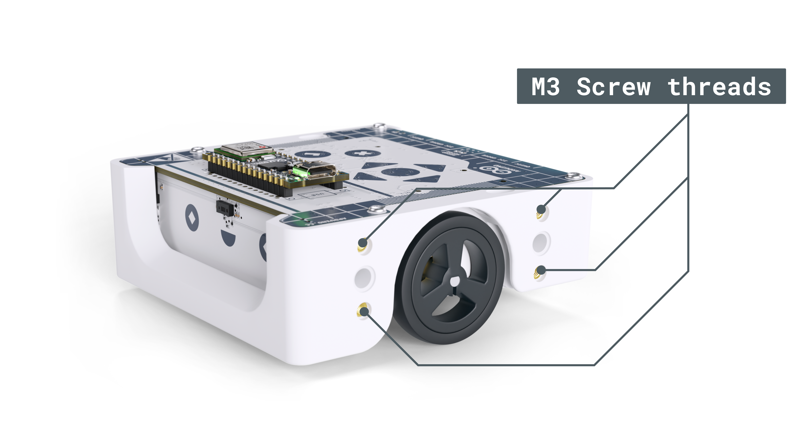

### Add LEGO® Addons

On both sides of Alvik there are different housings that let you add:

- 4x M3 screws per side
- 2x LEGO® Technic™ Connector per side

The dimensions are:


As reference you can take a look at the following images:

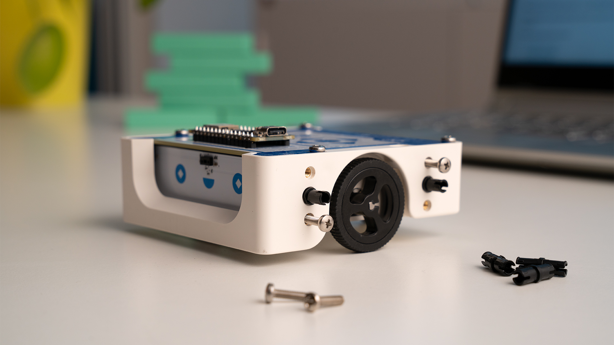


### Add Servo Motors

The servo motors connectors are placed at the back of Alvik, in this tutorial we'll attach a servo motor to the port A. You can take a look at the pinout image in the [pinout](#3.2.7-connectors) chapter.

***The port provides 5 Volt to the motor, so be sure to connect a servo that runs with 5V.***

1. Connect the servo motor to the upper port


2. Open the Arduino Lab for MicroPython

3. Connect Alvik with a USB cable and click CONNECT

4. Copy and paste the following test code

```python
from arduino_alvik import ArduinoAlvik
import time

# Initialize Alvik
alvik = ArduinoAlvik()
alvik.begin()

while True:
    # Moves servo
    alvik.set_servo_positions(0,0)
    time.sleep(2)
    alvik.set_servo_positions(90,0)
    time.sleep(2)
    alvik.set_servo_positions(180,0)
    time.sleep(2)
    alvik.set_servo_positions(90,0)
    time.sleep(2)
```

5. Click on the PLAY button to run the test code

6. The motor should move as in the gif below

Click on the PLAY button to run the test code

The motor should move as in the gif below


If you want to understand how the command `alvik.set_servo_positions` works, you can have a look in the [API overview](https://docs.arduino.cc/tutorials/alvik/api-overview).

### Add I2C Grove

The I2C Grove connectors are placed at the back of Alvik, in this tutorial we'll see how to scan a generic I2C device connected to it. You can take a look at the pinout image at [Alvik's Product Page](https://docs.arduino.cc/hardware/alvik).

1. Connect the I2C Grove device to one of the two ports.

2. Open the Arduino Lab for MicroPython

3. Connect Alvik with a USB cable and click CONNECT

4. Turn ON Alvik

5. Copy and paste the following test code

```python
from machine import I2C
from machine import Pin

i2c = I2C(0, scl=Pin(12, Pin.OUT), sda=Pin(11, Pin.OUT))

print()
print('Scan i2c bus...')
print()

devices = i2c.scan()

if len(devices) == 0:
    print("No i2c device !")
else:
    print('i2c devices found:',len(devices))
print()

for device in devices:
    print("Decimal address: ",device," | Hexa address: ",hex(device))

print()
```

6. Click on the PLAY button to run the test code

7. Look at the terminal to see the list of the I2C devices

### Add Qwiic

The Qwiic connectors are placed at the back of Alvik, for this example we'll be using the Qwiic OLED display from SparkFun. You can take a look at the pinout image in the [pinout](#3.2.7-connectors) chapter](#connectors).


1. Connect the OLED display to one of the Qwiic connectors, you can use either the left one or the right one.


2. We've prepared the example code and the libraries in [this](assets/qwiic_display.zip) zip file.

3. Extract the files and open the folder

4. Install mpremote

[mpremote](https://docs.micropython.org/en/latest/reference/mpremote.html) is a Python module needed to upload files on the Nano ESP32. The minimum suggested mpremote release is 1.22.0. Be sure to have Python installed before proceeding!

```
(venv)$ pip install mpremote
```

or

```
(venv)$ python3 -m pip install mpremote
```

Depending on how you configure Python on your machine.

5. Install library

Run the following line to upload all files and download the dependencies needed to run the Arduino Alvik MicroPython library.


Linux
```
$ ./install_oled_lib.sh -p <device port>
```
Windows
```
> install_oled_lib.bat -p <device port>
```

The `<device port>` is the name of the USB port that your computer assigned to the Nano ESP32. There are several ways to find it, depending on your Operating System, for example:

- You can use the Arduino IDE to know the port by [following this guide](https://support.arduino.cc/hc/en-us/articles/4406856349970-Select-board-and-port-in-Arduino-IDE).
- You can look it using the Arduino Lab for MicroPython by clicking `Connect` after have connected the Alvik with the USB cable.
- You can look at the list of the USB devices attached to the PC

6. Test `Hello World!`

Now you can open the Arduino Lab for MicroPython, connect Alvik and open the example called `hello_world.py` in the `examples` folder. If everything works as expected you'll see something like the following image:


## Want More?

If you're looking to get the most out of your Alvik robot, we have a comprehensive course available for you. Visit [Explore Robotics with MicroPython](https://courses.arduino.cc/explore-robotics-micropython/) for guided projects and lessons designed to help you master your Alvik. This course provides step-by-step instructions and detailed explanations to enhance your robotics and programming skills. Whether you're a beginner or an experienced maker, our course will take your Alvik experience to the next level.

Explore our hands-on, step-by-step solutions that support students in their first steps in programming, electronics, and science. Linked directly into the curriculum, no prior knowledge or experience is required.

## Need Help

If you need further assistance, you can find support through the following channels:

- [Arduino Discord](https://discord.com/invite/arduino)
- [Arduino Forum](https://forum.arduino.cc/)
- [Arduino Contact Us Form](https://www.arduino.cc/en/contact-us)

For more detailed support, you can also reach out to the Arduino Help Center.
