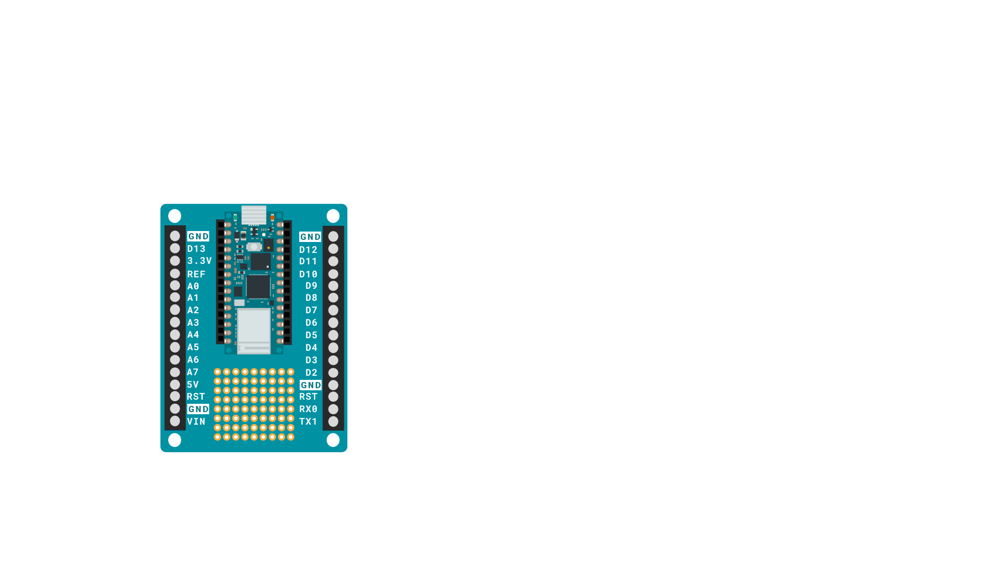
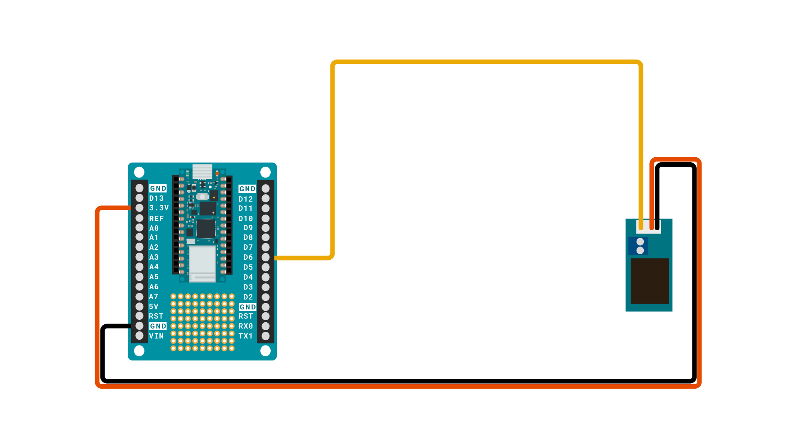
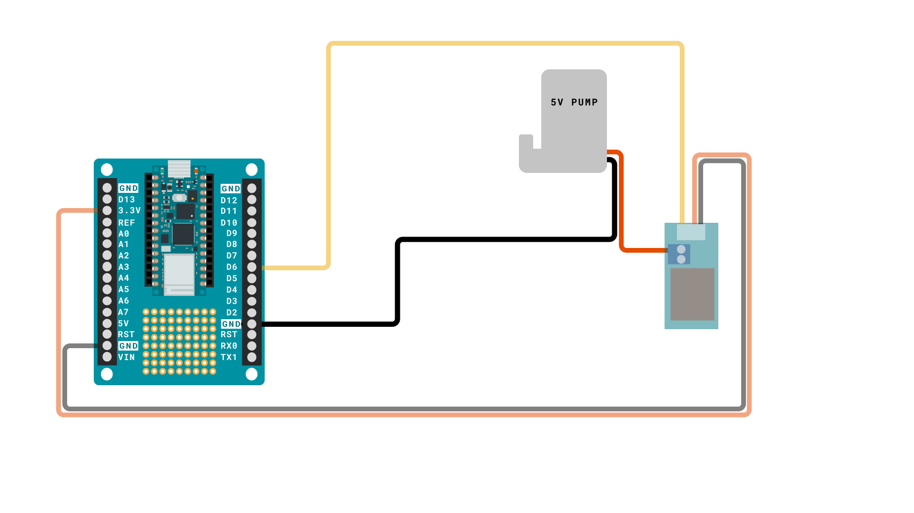
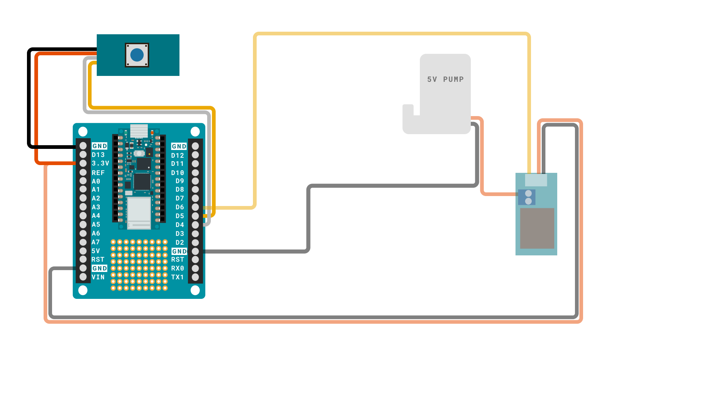
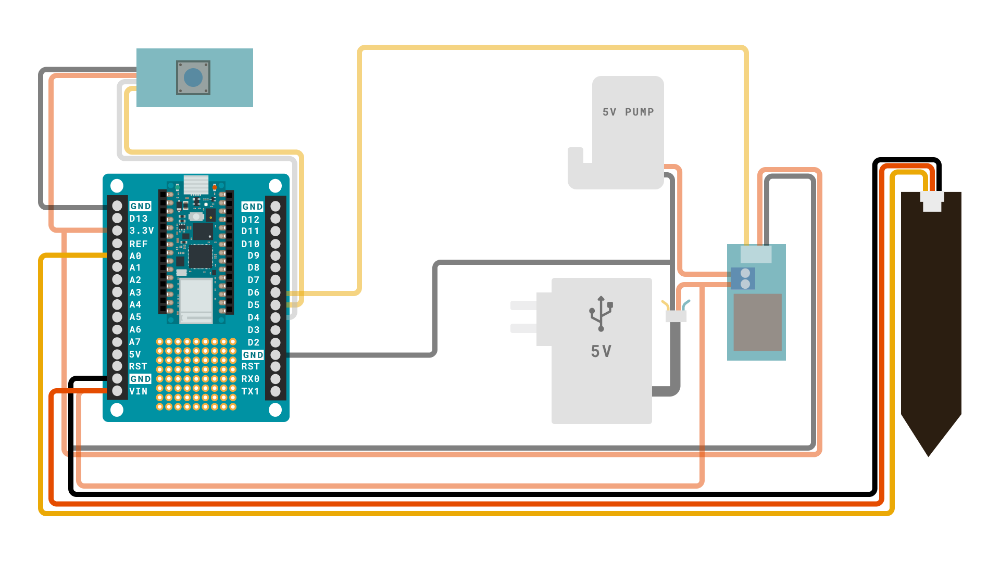
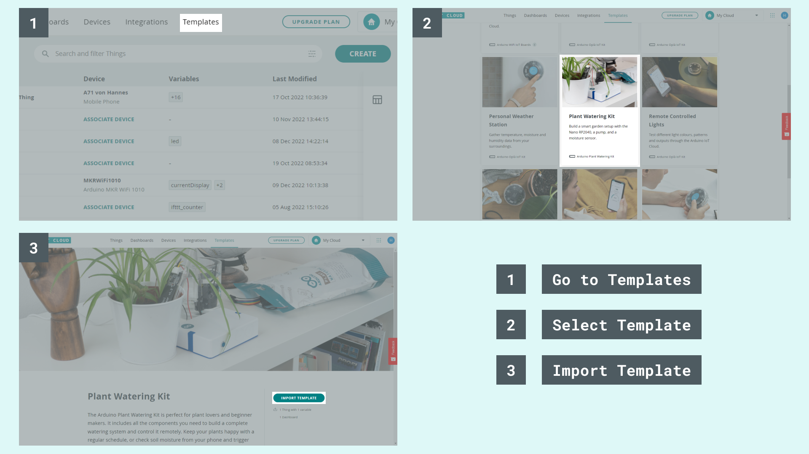
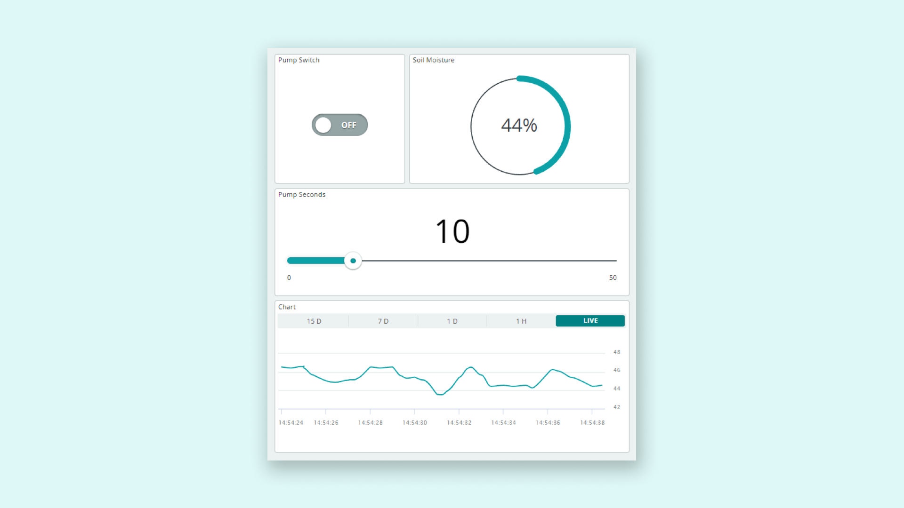

## Introduction

**Water your plants from anywhere using the Arduino IoT Cloud**

Decorating your home with plants is an easy way to bring some life into your day-to-day. The only problem is - those plants need water to survive, and if you forget to pay attention to them for a while you may need to start over. So instead of staying ever vigilant, why not spend an afternoon creating a setup that will let you both monitor the amount of moisture in your plants soil, and water your plants from afar using the [Arduino IoT Cloud](https://docs.arduino.cc/cloud/iot-cloud)?

In this tutorial we will learn how attaching an external relay to the Arduino Nano Screw Terminal Adapter lets you control circuits that are powered separately. We will be using a relay module attached to the Arduino Nano Screw Terminal Adapter to control a pump, providing water for one of our plants from the Arduino IoT Cloud thanks to the functionality of the Arduino Nano RP2040 Connect.

## Goals

* Introducing the Arduino IoT Cloud
* Introducing the Arduino IoT Remote app
* Managing sensors with the Arduino IoT Cloud
* Creating an Arduino IoT Cloud Dashboard

## Hardware & Software Needed
* [Arduino IoT Cloud](https://cloud.arduino.cc)
* [Arduino Plant Watering Kit](https://store.arduino.cc/plant-watering-kit)
* [3D-printed enclosure](https://www.printables.com/model/379111-plant-watering-kit-parts) (optional)
* USB - wall adapter (not included in the kit)

OR

* [Arduino Nano RP2040 Connect](https://store.arduino.cc/products/arduino-nano-rp2040-connect)
* [Arduino Nano Screw Terminal Adapter](https://store.arduino.cc/products/nano-screw-terminal)
* 5V submersible pump.
* 1 meter watering pipe.
* USB wall adapter
* Water container.
* Micro-USB cable.
* Open ended USB Cable.
* Soil moisture sensor.
* Grove LED button.
* [3D-printed enclosure](https://www.printables.com/model/379111-plant-watering-kit-parts) (optional).
* Short Grove cable (20cm).
* Long Grove cable (50cm).
* Long 3-pronged Grove cable (50cm).
* A few spare jumper cables just in case you need them.

## Hardware & Circuit Assembly

There are cases were multiple wires are going into the same screw terminal, you may find it easier to get them in at the same time if you twist them together before trying to insert them.


In case you want to place your plant further away from the electronics, we've included a loose set of extra screw terminals, that you can use to add more length to your cables. Just use wire cutters to clip off as many as you need and screw down the cables you want to connect together. These can also be used to join cables instead of twisting, if you find that easier.

Now on to the circuit assembly! Begin by grabbing the Arduino Nano RP2040 Connect board, and pushing it into place on the Nano Screw Terminal Adapter.



Then find the relay module, and a grove cable. You will need to cut the grove cable in half to expose the copper cable inside so you can connect it to the Screw terminal adapter. Connect the wires from the grove cable to the Nano Screw Terminal Adapter as follows:

- Black wire (-) to GND pin.
- Red wire (+) to 3.3V pin.
- Yellow wire to D6 pin.




Now let's wire up the submersible pump. This pump runs on 5V, and draws more current than an Arduino board can provide, so it needs to be powered by the USB wall adapter. This is why we need a relay acting as a power switch that we control with software. Connect the black wire from the pump to GND, and the red wire to one of the screw terminal connectors on the relay.



***Note: These types of subermisible pumps can easily break if they're run without being submersed in water. In this project, a faulty pump might have a short circuit, causing the board to reset as soon as the pump is engaged.***

Now find the LED Grove button and a Grove cable. This cable also needs to be cut to expose the copper wire inside. The wires from the grove cable should be connected as follows:

- Black wire (-) to GND pin.
- Red wire (+) to 3.3V pin.
- Yellow wire to D5 pin.
- White wire to D4 pin.



Find the open ended USB cable, this will be used both to power the board through it's Vin pin, and the pump through the relay. Connect the black wire to GND, and connect the red wire, together with a separate jumper cable, to Vin. The other jumper wire that you just connected should be wired to the other screw terminal connector on the Relay module. 

If you find this step hard, you can also use one of the loose screw terminals provided in the kit to connect the red wire from the USB cable to two jumper cables.


***Note: Because of how the pump works, it will draw a significant current as it is starting up. Therefore it is good practice to isolate it from the rest of the circuit as much as possible. Do this by making sure the path between GND of the pump and the GND of the power supply is not longer than it has to be. An easy way to accomplish this that we recommend you to do is connecting the GNDs to the same screw terminal on the Nano Screw Terminal Adapter.***

The USB-cable can then be plugged into any USB port, on a laptop, or in a wall-adapter, as long as it can provide at least 500 mA at 5V. Most wall-adapters meet these requirements, so don't worry too much about finding the right one.

Lastly, find the moisture sensor and a grove cable. Connect it to the Nano Screw Terminal Adapter as follows: 

- Black wire (-) to GND pin. 

- Red wire (+) to Vin pin.

- Yellow wire to A0 pin.



***Note: The moisture sensor needs to be powered with 5V, and therefore you will need to power it with the same wall adapter that powers the board. This also means that if you're using a different power supply solution than we are suggesting, you should be careful not to exceed 5V or you may damage the sensor, your board, or both.***

The complete circuit should look something like this:


If you are using the 3D-printed enclosure we provide a 3D-model for, now is a good time to fit the components inside if you haven't already. Use the standoffs to click the components into place.

In the top-cover of the enclosure you will find a hole that will fit the LED-Button. Simply push the button into place, it might take a little force but it will firmly click into place.

We recommend gathering the cables that will leave through the opening, and zip-tying them to the bottom of the enclosure using the two slits in the bottom-plate, this way it stays organised and is a little bit easier to close.


## IoT Cloud Setup
If you are new to the Arduino IoT Cloud, check out our [Getting Started Guide](https://docs.arduino.cc/arduino-cloud/getting-started/iot-cloud-getting-started).

### Template
To connect your board to the Arduino IoT Cloud, we will use the [Plant Watering Kit Template](https://create.arduino.cc/iot/templates/plant-watering-kit). This template installs a specific sketch on your board and creates a dashboard that allows you to interact with your board: you don't need to write any code at all!

See the image below to understand how to set it up.



### Manual Setup
***This section is for you who want to set up the cloud manually. For easy setup, use the template provided (see section just above).*** 
Begin by navigating to the [Arduino IoT Cloud](https://create.arduino.cc/iot/things). You will need to have a registered account with Arduino to use it. Follow the steps below to set up the Arduino IoT Cloud.

**1.** Create a new Thing, and select/configure the Nano RP2040 board. Note that the board needs to be connected to your computer during this setup.

**2.** Create variables according to the table below:

| Name        | Data Type | Function                               | Permission   |
| ----------- | --------- | -------------------------------------- | ------------ |
| moisture    | int       | Read moisture                          | Read Only    |
| watering    | boolean   | Activate / de-activate pump            | Read & Write |
| waterTime   | int       | How long the pump should run (seconds) | Read & Write |

**3.** Enter the credentials to your Wi-Fi network in the network section. 

**4.** Your Thing overview should now look like the following:


**5.** Go to the sketch tab, and use the following code:

***Note: If you copy the code, it is important to make sure the capitalisation and read/write permissions of the variables created in the previous step matches perfectly. Otherwise the sketch will not compile.***

```arduino
/* 
 Arduino Watering Plant Kit

 A setup that allows for remote/local control of a pump, as well as reading sensors.

 Built using the Arduino IoT Cloud service

 Components used:
- Arduino Nano RP2040 Connect
- Arduino Nano Screw terminal Adapter
- 5V submersible pump.
- 1 meter watering pipe.
- USB wall adapter
- Water container.
- Micro-USB cable.
- Open ended USB Cable.
- Soil moisture sensor.
- Grove LED button
- 3D-printed enclosure (optional)
- Short Grove cable (20cm)
- Long Grove cable (50cm)
- Long 3-pronged Grove cable (50cm)
*/

/* ------------- START CONFIG ------------- */
constexpr int BUTTON_PIN = 4;
constexpr int LED_PIN    = 5;
constexpr int RELAY_PIN  = 6;
constexpr int MOIST_PIN  = A0;


int raw_moisture = 0;
/* ------------- END CONFIG ------------- */

#include "thingProperties.h"
#include <Bounce2.h>

Bounce b;
unsigned long startedWatering;

void setup() {
  Serial.begin(9600);
  delay(1500);

  b.attach(BUTTON_PIN,INPUT_PULLUP);
  b.interval(25);
  pinMode(LED_PIN, OUTPUT);
  pinMode(RELAY_PIN, OUTPUT);

  // Make sure the pump is not running
  stopWatering();

  // Connect to Arduino IoT Cloud
  initProperties();
  ArduinoCloud.begin(ArduinoIoTPreferredConnection);
  setDebugMessageLevel(4);
  ArduinoCloud.printDebugInfo();

  // Blink LED to confirm we're up and running
  for (int i = 0; i<=4; i++) {
    digitalWrite(LED_PIN, HIGH);
    delay(200);
    digitalWrite(LED_PIN, LOW);
    delay(200);
  }

}

void loop() {
  ArduinoCloud.update();
  
  // Read the sensor and convert its value to a percentage 
  // (0% = dry; 100% = wet)
  raw_moisture = analogRead(MOIST_PIN);
  moisture = map(raw_moisture, 610, 90, 0, 100); 
  Serial.println(moisture);

  // Set the LED behavior according to the moisture percentage or watering status
  if (watering) {
    digitalWrite(LED_PIN, HIGH);
  } else if (moisture > 40) {
    // good, LED is turned off
    digitalWrite(LED_PIN, LOW);
  } else if (moisture > 10) {
    // warning, slow blink
    digitalWrite(LED_PIN, (millis()%1000)<500);
  } else {
    // need water, fast blink
    digitalWrite(LED_PIN, (millis()%500)<250);
  }
  
  // Stop watering after the configured duration
  if (watering && (millis() - startedWatering) >= waterTime*1000) {
    stopWatering();
  }

  // Read button status
  b.update();
  if (b.changed() && b.read() == false) { // button pressed
    if (watering) {
      stopWatering();
    } else {
      startWatering();
    }
  }
}

// This function is triggered whenever the server sends a change event,
// which means that someone changed a value remotely and we need to do
// something. 
void onWateringChange() {
  if (watering) {
    startWatering();
  } else {
    stopWatering();
  }
}


void startWatering () {
  watering = true;
  startedWatering = millis();
  digitalWrite(RELAY_PIN, HIGH);
}

void stopWatering () {
  watering = false;
  digitalWrite(RELAY_PIN, LOW);
}

void onWaterTimeChange()  {
  // Add your code here to act upon WaterTime change
}

```

**6.** Upload the code. When successful, you can navigate over to the **"Dashboards"** section. Create a new dashboard.

**7.** Inside the dashboard view, click on **"Add"** then **"Things"** and select your Thing. This will generate a list of widgets and you can click on **"Create Widget"** to complete it. You should now see something similar to this dashboard:


Once you see the values changing, we know that the connection is successful, and we can monitor and interact with our device. 

Depending on what type of plant you decide to use this device with, you may need to calibrate the threshold values in the code to what is appropriate for your plant. Don't worry, it's not difficult, on line 79 and 82 in the code, numbers are compared to the moisture levels in your plants soil, you can just change those numbers and try different values until you find what is right for you.

***In this dashboard, we replaced some of the widgets with nicer representations, like percentage.***

## Final Setup

We have now assembled the hardware + configured the Arduino IoT Cloud, and we are ready to start using our setup. Now, let's start using it.

**1.** If you have confirmed that the connection works, we can unplug the setup from the computer, and move it to the plant we want to monitor.

**2.** Place the moisture sensor into the soil of the plant.

**3.** Place the pump inside a water container. Attach the plastic pipe to the pump, and place the other end into the plant pot. Place the enclosure with your electronics next to the plant. Your setup could now look like this: 

**4.** Finally, plug in a USB adapter into the wall. This will now power the entire setup, which should now connect to the IoT Cloud, via your Wi-Fi network. And that is it, you now have a Smart Garden setup! 

## Usage

Let's take a look at what our Smart Garden can do. To control it, we can either use the dashboard in the Arduino IoT Cloud, or the Arduino Remote app ([Playstore](https://play.google.com/store/apps/details?id=cc.arduino.cloudiot&hl=en&gl=US) / [Appstore](https://apps.apple.com/us/app/arduino-iot-cloud-remote/id1514358431)).



***In this dashboard, we have also added a chart widget to monitor the soil moisture over time.***

**Watering:** to activate the pump, do the following:
- Select number of seconds that you want the pump to run for.
- Click on the switch widget. The pump will now run for **x** amount of seconds, and then it will turn off.
- You can also activate the pump locally with the Grove button. 

**Moisture:** monitor the moisture of your plant: if it is low, turn on the pump, and watch the moisture levels rise. The moisture of your plant can be viewed in the cloud dashboard.

**Button:** you can activate the pump from without a connection by pressing the button. 


## Conclusion

With a smart garden setup, you can easily monitor the environment of your plant, and water it remotely. In this tutorial, we have gone through the basic elements needed for achieving just that: but there are more things you can do. Below is a list of some fun ideas that you can do with your plant:

- **Automatic watering** - instead of watering your plant remotely, you can also activate the pump automatically whenever moisture drops too low. We do however think it is more fun to control it from a phone, but the choice is yours.
- **Cooling/heating fan** - With some more work, you can connect a cooling/heating fan. This can help you bring the temperature to a perfect level (some plants like it cold, some hot).
- **Humidifier** - a humidifier is an awesome component that increases the humidity (a perfect combo if you also add a humidity sensor).
- **UV lights** - a UV light allows you to grow plants even when there's no natural sun light