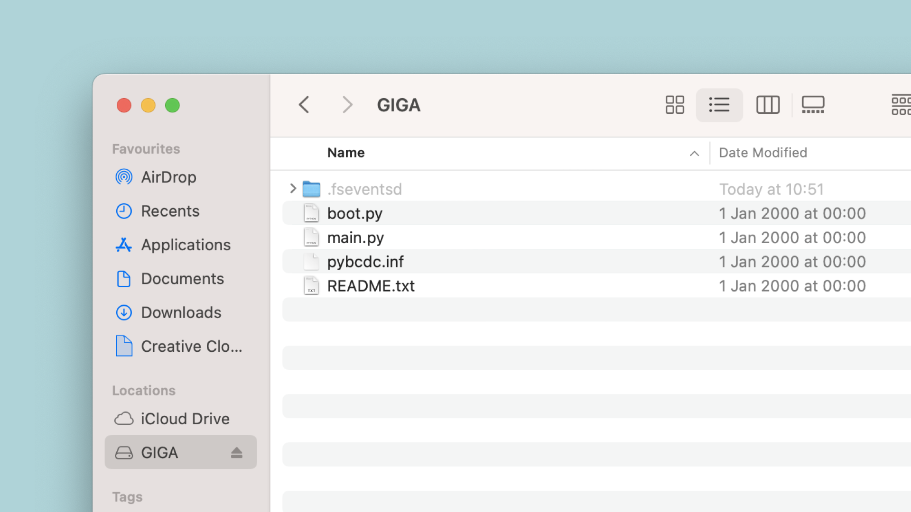
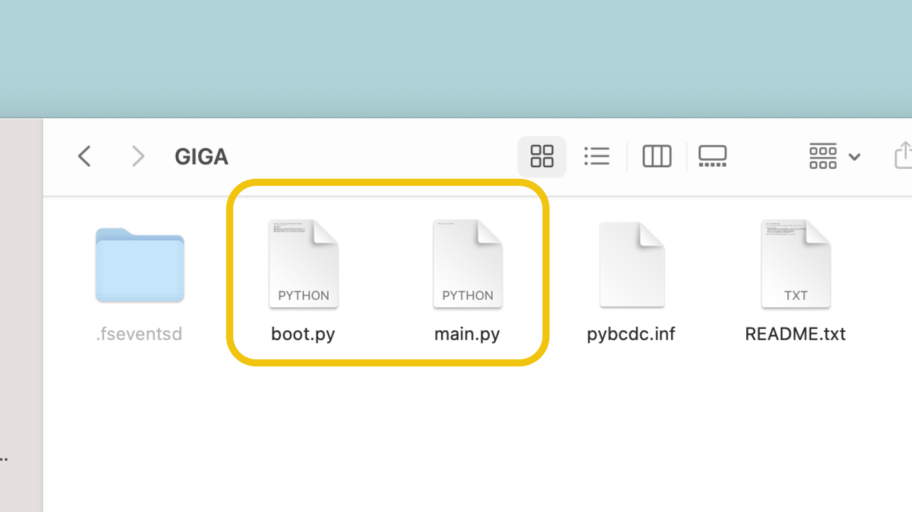

***Please note that MicroPython support for the GIGA R1 is currently in an experimental phase.***

***To learn more about MicroPython, please visit [MicroPython with Arduino](/learn/programming/arduino-and-python). This article is specific only to the GIGA R1 board.***

[MicroPython](https://micropython.org/) is an implementation of Python in a *micro* format. It can be installed on the GIGA R1, where instead of compiling and uploading sketches, the board has a built-in interpreter that converts Python code to machine code in runtime.

This makes it possible to load various scripts instantly on the board, without the need of compiling the code, which is a great advantage of MicroPython.

In this article, we will guide you through the installation steps, as well as some cool tips and tricks to get creative with MicroPython on the GIGA R1.

## Hardware & Software Needed

To follow along with this guide, you will need an [Arduino GIGA R1 WiFi](/hardware/giga-r1-wifi)

You will need the following software/tools installed:
- [dfu-util](https://dfu-util.sourceforge.net/)\*
- An editor with support for MicroPython (such as [Arduino Lab for MicroPython](https://labs.arduino.cc/en/labs/micropython) or [Thonny](https://thonny.org/))
- This specific [GIGAR1_MP_FW.dfu](/resources/firmware/GIGAR1_MP_FW.dfu) firmware.

***\*The installation for `dfu-util` varies between operation systems. For installation using [brew.sh](https://formulae.brew.sh/formula/dfu-util) simply use `brew install dfu-util`.***

## Installation

**1.** Download the [GIGAR1_MP_FW.dfu](/resources/firmware/GIGAR1_MP_FW.dfu) firmware.

**2.** Download the [dfu-util](https://dfu-util.sourceforge.net/) tool, or install via Brew (or other package managers). Make sure it is in your PATH.

```
$ brew install dfu-util 
```

**3.** Double tap the reset button on the GIGA R1 board. The green LED should now be pulsing. This means it is in bootloader mode.

**4.** Open a terminal, and navigate to the directory of your `GIGAR1_MP_FW.dfu` file. Run the following command:

```
$ dfu-util -w -a 0 -d 2341:0366 -D GIGAR1_MP_FW.dfu 
```

At the end of the process, you will see the following message on success:

```
Done parsing DfuSe file
```

**5.** Reset the board by clicking the reset button (just once). You should now be able to view and access some of the GIGA R1 boards onboard storage as a mass storage device in your file manager.



Congratulations! You have now installed MicroPython on the GIGA R1 board.

## Programming Your Board

To program your GIGA R1 with MicroPython, you will need an editor with support for MicroPython (such as [Arduino Lab for MicroPython](https://labs.arduino.cc/en/labs/micropython) or [Thonny](https://thonny.org/)).

The editors listed above are great for getting things to work quickly. One important aspect is that in the editor, you will need to **connect to your board**, as this will make it possible to load scripts.

As the MicroPython installation has a built-in interpreter, in the editor, you can just write a script and click on the **Run Script** button, and if it compiles, it will load almost instantly. You can make sure it works by running something simple, such as:

```python
print("Hello world!")
```

If it is printed in the REPL, it means it works, and you're ready to take on bigger challenges!

To find out examples and more fundamental knowledge, please visit the [MicroPython with Arduino documentation](/learn/programming/arduino-and-python). Here you will find an introduction to this environment and useful examples to get started.

***It is important to note that different Arduino boards have different implementations. This is mainly due to what microcontroller the board is based on. For example, to access digital pin 2, on the GIGA R1, you will need to use `'PA3'` (with the quotation marks). See more in [GIGA R1 Pin Map](#pin-map)***

## Main.py

## File System (Mass Storage)

The MicroPython installation exposes the mass storage device on your board, which can be edited directly from your computer. This allows you to install modules, edit the boot & main script as well as adding the possibility of switching between scripts.

### Boot & Main Scripts



You will notice that in the mass storage device, there's two `.py` files: `boot.py` and `main.py`.

- `boot.py` - when device loads, this script is executed. Typically you do not edit this script.
- `main.py` - this script executes right after `boot.py`. You can consider this your classic Arduino sketch, that runs as soon your board is powered. If you want a specific program to run on your board, save it to `main.py`.

### Adding Modules

It is possible to add modules, drivers or scripts directly to your board. It is also as simple as dragging and dropping it into the mass storage, and `import` it in your script.

### Execute Scripts

A really cool thing with this implementation is that you can pack the mass storage with many different scripts, and load them when needed.

This can be done using only a simple line of code:

```python
exec(open("script.py").read())
```

This allows you to create a number of scripts and store it on the mass storage, and execute them from the board itself (e.g. a button).

## Pin Map

In the table below, you will find the matching between the **STM32H7** and **Arduino**. When writing MicroPython code, you need to use the pin designations listen in the STM32H7 column.

| STM32H7 | Arduino |
| ------- | ------- |
| PB7     | D0      |
| PA9     | D1      |
| PA3     | D2      |
| PA2     | D3      |
| PJ8     | D4      |
| PA7     | D5      |
| PD13    | D6      |
| PB4     | D7      |
| PB8     | D8      |
| PB9     | D9      |
| PK1     | D10     |
| PJ10    | D11     |
| PJ11    | D12     |
| PH6     | D13     |
| PG14    | D14     |
| PC7     | D15     |
| PH13    | D16     |
| PI9     | D17     |
| PD5     | D18     |
| PD6     | D19     |
| PB11    | D20     |
| PH4     | D21     |
| PJ12    | D22     |
| PG13    | D23     |
| PG12    | D24     |
| PJ0     | D25     |
| PJ14    | D26     |
| PJ1     | D27     |
| PJ15    | D28     |
| PJ2     | D29     |
| PK3     | D30     |
| PJ3     | D31     |
| PK4     | D32     |
| PJ4     | D33     |
| PK5     | D34     |
| PJ5     | D35     |
| PK6     | D36     |
| PJ6     | D37     |
| PJ7     | D38     |
| PI14    | D39     |
| PE6     | D40     |
| PK7     | D41     |
| PI15    | D42     |
| PI10    | D43     |
| PG10    | D44     |
| PI13    | D45     |
| PH15    | D46     |
| PB2     | D47     |
| PK0     | D48     |
| PE4     | D49     |
| PI11    | D50     |
| PE5     | D51     |
| PK2     | D52     |
| PG7     | D53     |
| PI5     | D54     |
| PH8     | D55     |
| PA6     | D56     |
| PJ9     | D57     |
| PI7     | D58     |
| PI6     | D59     |
| PI4     | D60     |
| PH14    | D61     |
| PG11    | D62     |
| PH11    | D63     |
| PH10    | D64     |
| PH9     | D65     |
| PA1     | D66     |
| PD4     | D67     |
| PC6     | D68     |
| PI0     | D69     |
| PI1     | D70     |
| PI2     | D71     |
| PI3     | D72     |
| PC1     | D73     |
| PB12    | D74     |
| PD3     | D75     |
| PC4     | A0      |
| PC5     | A1      |
| PB0     | A2      |
| PB1     | A3      |
| PC3     | A4      |
| PC2     | A5      |
| PC0     | A6      |
| PA0     | A7      |
| PA4     | A12     |
| PA5     | A13     |

## Conclusion

In this article, we have learned how to install MicroPython on the GIGA R1, using the `dfu-util` tool. We have also gone through some useful tips and tricks that can help you develop and run MicroPython code on your board.

For more information, visit the [MicroPython with Arduino documentation](/micropython). 