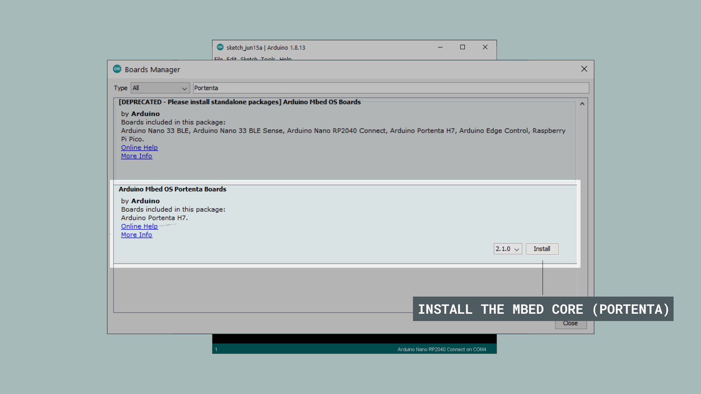
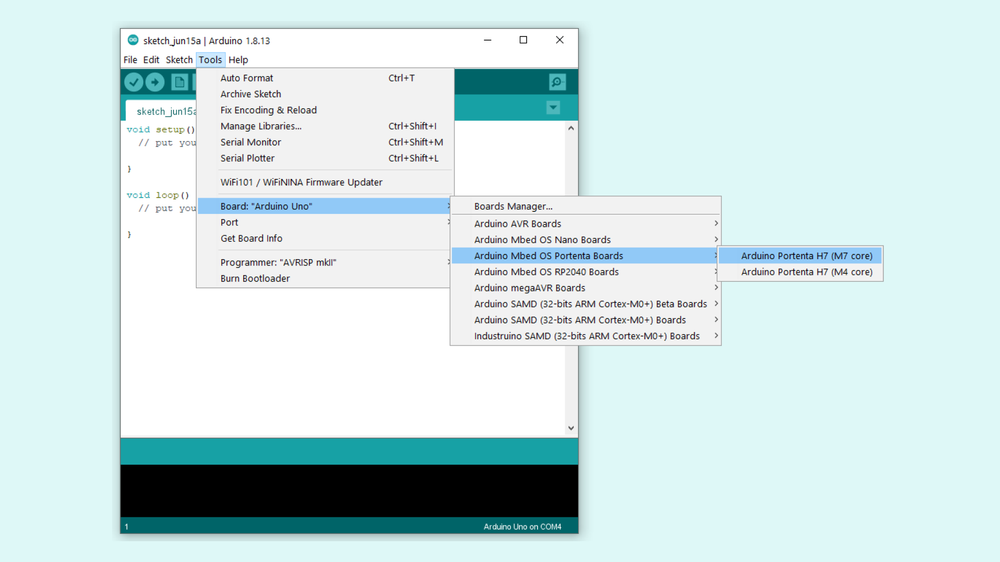
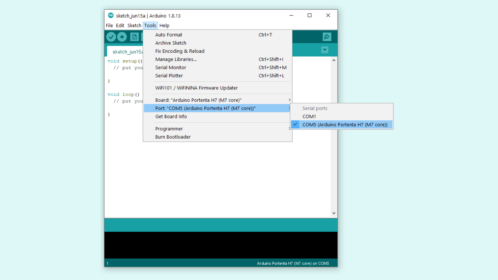

## Required Hardware and Software

- [Portenta H7](https://store.arduino.cc/products/portenta-h7).
- [Portenta Max Carrier](http://store.arduino.cc/portenta-max-carrier).
- USB-C® cable (either USB-A to USB-C® or USB-C® to USB-C®).
- DC 4.5-20V power supply with barrel jack. 
- [Arduino IDE (online or offline)](https://www.arduino.cc/en/software). 

## Instructions 

### The Circuit

The Arduino® Portenta Max Carrier uses the Arduino® Portenta H7 as the main central processing unit and that powers up the carrier's modules mentioned above. Both systems possess High-Density Connectors to establish communication interface in between. It is simple as attaching the Portenta H7 to Portenta Max Carrier's High-Density Connectors. The following connection scheme shows how exactly the device is paired with correct orientation. 


### Power Distribution

The Portenta Max Carrier provides several peripherals and modules to cover a wide spectrum of applications. For these peripherals and modules to be powered up and run, the Portenta Max Carrier bases on a sophisticated electric power distribution architecture. To power the Portenta Max Carrier, you can use the **barrel jack** connector or a **3.7V 18650 Li-Ion battery** connected to the Portenta Max Carrier's battery clips. You can also power the Portenta Max Carrier directly from the USB-C® connector of the Portenta H7 board.

The Portenta Max Carrier's power inputs are indicated in the following image:


**If the Arduino IDE throws an error failing to upload the Code, please put the Portenta H7 in Bootloader Mode before uploading.**

### Basic Setup of the Portenta Max Carrier

The Portenta Max Carrier only requires the Portenta H7 as main unit to be able to use it.

When we open the editor, we will see an empty sketch.


Here we need to navigate to **Tools > Board > Board Manager**.


This will open up a new window, with all available cores. Find the one named **Arduino Mbed OS Portenta Boards** and install it.



This process may take some time, and you may need to accept the installation window that comes up (depending on your operative system). When it is finished, it should say `"INSTALLED"` under the title.

>**Note:** This process may take several minutes.

Exit the board manager, and go to **Tools > Board > Arduino Mbed OS Portenta Boards**. Here you can see all the Mbed boards listed, where you can select the board you are using. You have now successfully installed the core.



To take advantage of Portenta Max Carrier's Power Architecture, an important physical configuration requires to be verified. A DIP Switch for Boot mode selection is present on the Portena Max Carrier board. It requires to set **BOOT_SEL** to select between 2 boot addresses, which will enable Portenta H7 and Max Carrier to run the firmware. **BOOT** parameter will switch the Portenta H7 state into Boot mode.

Every time it initiates at Boot mode, the Portenta H7 will fade the Green LED to indicate its state. This will help to understand the board is in Boot mode and not turned off due to unavailable electric supply as it shutted off. As the power lines are alive even if the board shows no indication of operating instance. 


### Selecting the port

Now, let's make sure that our board is found by our computer, by selecting the port. Regardless what kind of program we are uploading to the board, we **always** need to choose the port for the board we are using. This is simply done by navigating to **Tools > Port**, where you select your board from the list.



This will look different depending on what kind of operative system you are using.

For **Windows** users, it could look like this:

- `<COM14> (Arduino Portenta H7 (M7 core))`

For **MAC** users, it could look like this:

- `/dev/cu.usbmodem14112 (Arduino Portenta H7 (M7 core))`

### Uploading a simple example

You are now ready to start using your board! The easiest way to check that everything is working, is to upload a simple sketch example to your board.

Copy and paste the below code into your empty sketch on your IDE:

```arduino
int pin1 = D0;
int pin2 = D1;
int pin3 = D2;

void setup() {
  Serial.begin(9600);
  pinMode(pin1, OUTPUT);
  pinMode(pin2, OUTPUT);
  pinMode(pin3, OUTPUT);
}

void loop() {
  delay(100);
  Serial.write("Hello World");
  digitalWrite(pin1, HIGH);
  delay(100); 
  digitalWrite(pin1, LOW);
  digitalWrite(pin2, HIGH);
  delay(100);
  digitalWrite(pin2, LOW);
  digitalWrite(pin3, HIGH);
  delay(100);
  digitalWrite(pin3, LOW);
  delay(500);
}
```

With the code copied it is now ready to be uploaded. To upload the sketch, simply click on the arrow in the top left corner. This process takes a few seconds, and it is important to not disconnect the board during this process.


When the code is uploaded, the text `"Done uploading."` is visible in the bottom left corner. If you open the **serial monitor** in the Arduino IDE you should see "Hello World", make sure the baudrate is set to `9600`.