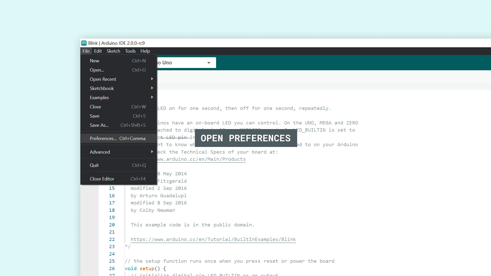
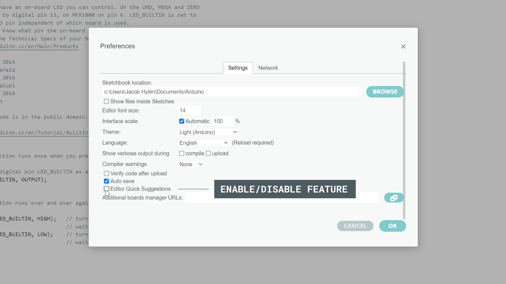
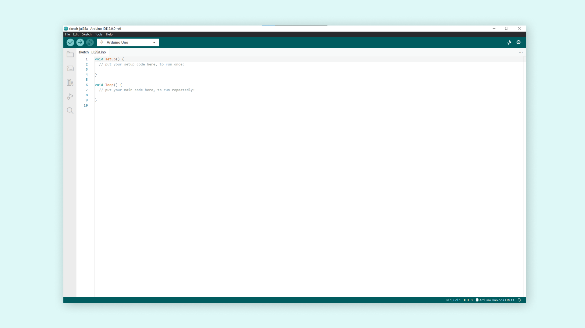
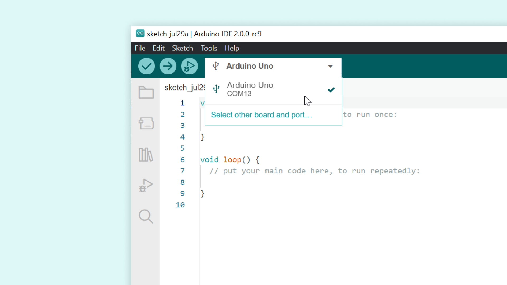
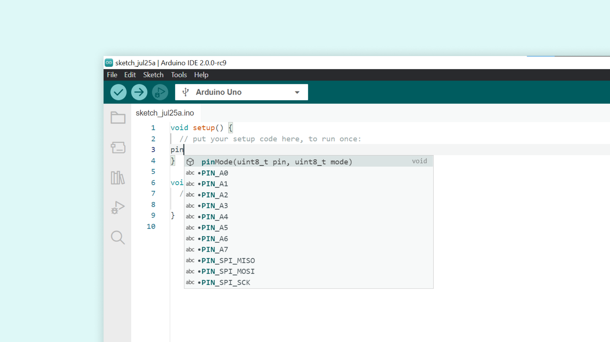
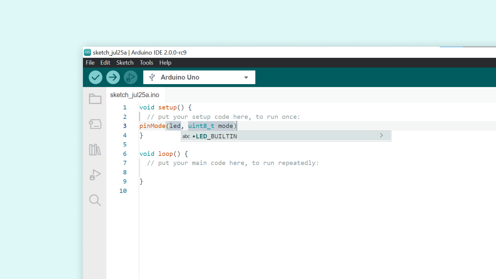
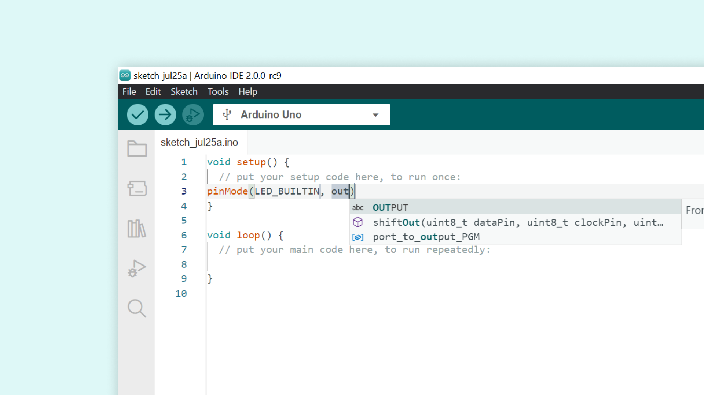
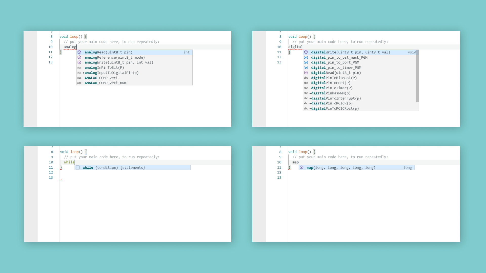

Autocompletion when writing code is great. Not only does it save you time, but it gives you an understanding of how the programming language functions.

The Arduino IDE 2.0 comes equipped with this tool, to make your code-writing experience, a pleasant one. In this tutorial, we will go through some basics on how to use it.

You can easily download the editor from the [Arduino Software page](https://www.arduino.cc/en/software#experimental-software). 

You can also follow the [downloading and installing the Arduino IDE 2.0](/en/Tutorial/getting-started-with-ide-v2/ide-v2-downloading-and-installing) tutorial for more detailed guide on how to install the editor.

## Requirements

- Arduino IDE 2.0 installed. 

## Enable/Disable Autocompletion

To enable or disable autocompletion, you need to navigate to **File > Preferences**.

Then, you will need to tick/untick the box next to **"Editor Quick Suggestions"**, and then click on the **"OK"** button to apply the changes.

## The Autocomplete Feature

Whether you are writing code in C++, JavaScript, HTML, CSS or any other common languages, understanding the syntax and how to write functions is an absolute necessity. It is also an integral part of your skill progression, and the more you know about a language, the better a programmer you become.

Enter the autocompletion feature: a tool designed to increase your knowledge while writing code faster. It lives in the background, and is there to help!

## Using the Autocomplete Feature

Using the autocomplete feature is easy, but let's take a look at how it actually works in action, and what the requirements are for it to properly function. We will now go through it an a step-by-step fashion.  

**1.** First, let's open the Arduino IDE v2. If it is the first time you are using the editor, it will just be a blank sketch.

**2.** Now, to enable the autocompletion, we first need to select a board that we are going to use. This is done by selecting a connected board in the dropdown menu. If you don't have a board connected you can still use this feature, just click "Select other board and port" instead, and follow the instructions in the IDE to select the board you intend to use with your program.

**3.** With the board selected, we are all good to go. In the sketch, inside `void setup()`, start typing pin, then trigger the autocomplete feature by pressing **CTRL** + **spacebar** at the same time. You can now see a list of suggestions, where `pinMode(uint8_t pin, uint8_t mode)` comes up as a suggestion. By either clicking on the selection, or hitting **"Enter"**, it will autocomplete it.

**4.** Now, by clicking enter, it automatically marks the first parameter, which is designed for the `pin` that we want to define. If we now start writing **led** and once more trigger the autocomplete feature by pressing **CTRL** + **spacebar**, a suggestion for `LED_BUILTIN` will appear. If we press **Enter**, it will also autocomplete.

**5.** Now if we mark the following parameter, `uint8_t mode`, delete it, and instead start writing **out**, we will see the suggestion for `OUTPUT` appear, as the autocomplete feature is triggered once more, which we can also autocomplete.

**6.** We have now written `pinMode(LED_BUILTIN, OUTPUT)`, with the help of the autocompletion tool!

## Conclusion

The autocompletion tool can be a real time-saver, while also helping you develop an understanding of a programming language. In this tutorial, we demonstrated a very basic example of defining a pin as an output, but there are many more situations when it will come in handy!

### More Tutorials

You can find more tutorials in the [Arduino IDE 2 documentation page](/software/ide-v2/).
