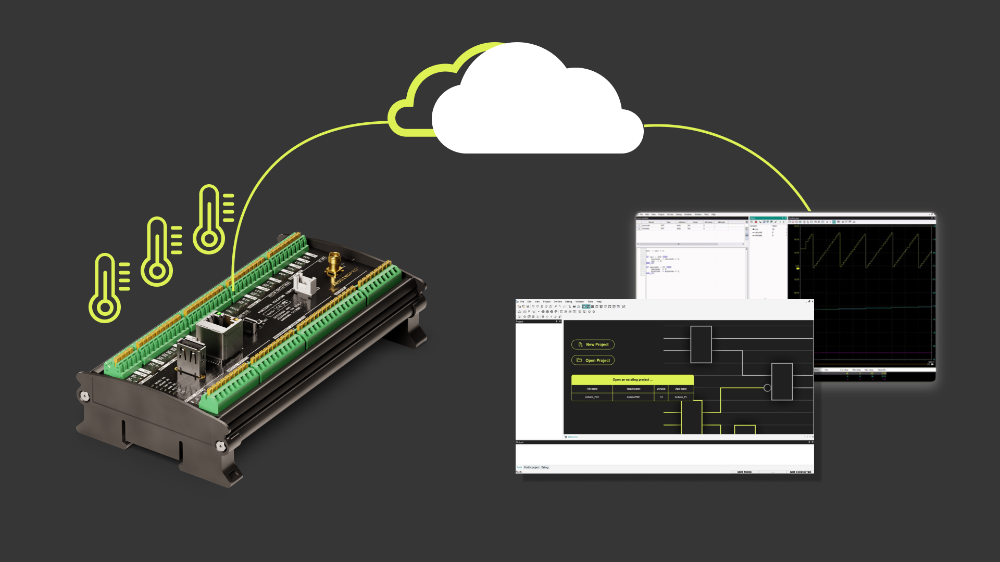

The Pro Smart Industry OEM Condition Monitoring Kit is the perfect way to learn and create solutions focused on a micro PLC programming environment, industrial instrumentation and control applications.

- Develop experience in programming a micro PLC with IEC 61131-3 languages or Arduino C++ to realize a small industrial control system.
- Implement projects including temperature measurements exploiting the Portenta Machine Control’s capabilities with 3 temperature inputs for Thermocouples J/K and RTD PT100.
- Experience multiple communication features (Ethernet and Wi-Fi®) and get familiar with Fieldbus communications (Modbus RTU through RS485 and Modbus TCP through Ethernet) 

## The Kit

The following items are included in the kit:

| Quantity |                Element                |       SKU       |
|:--------:|:-------------------------------------:|:---------------:|
|    1     |       Portenta Machine Control        |    AKX00032     |
|    1     |            PLC KEY for PMC            |    AVX00070     |
|    1     |           RTD sensor PT100            |     514-109     |
|    1     |             Thermocouple              |     401-301     |
|    1     |             WiFi Antenna              | ANT-W63-MON-RPS |
|    1     | Cloud for business - 3 Months Voucher |        -        |

Additionally, you may need the following accessories:

* Micro-USB cable (x1)

## Getting Started with Your Kit

1. Get to [cloud.arduino.cc](https://cloud.arduino.cc/), sign in, or Create an Arduino account. Rescue your Arduino Cloud 3 months voucher code using this [Procedure](https://docs.arduino.cc/tutorials/generic/cloud-business-voucher-redeem) and [Get Started](https://docs.arduino.cc/arduino-cloud/getting-started/arduino-cloud-for-business)!

2. Download [Arduino IDE](https://www.arduino.cc/en/software#future-version-of-the-arduino-ide) and follow the [Installation Procedure](https://docs.arduino.cc/software/ide-v2/tutorials/getting-started/ide-v2-downloading-and-installing) and [Get Started with it](https://docs.arduino.cc/software/ide-v2/tutorials/getting-started-ide-v2).

3. Download [Arduino PLC IDE](https://www.arduino.cc/en/software#arduino-plc-ide) and follow the [Installation Procedure](https://docs.arduino.cc/software/plc-ide/tutorials/plc-ide-setup-license) and [Get Started with it](https://docs.arduino.cc/software/plc-ide/tutorials/plc-programming-introduction). Use the PLC KEY code supplied in the bundle to unlock for lifetime the Portenta Machine Control to be programmed with PLC IDE.

4. Check the [Portenta Machine Control docs](https://docs.arduino.cc/hardware/portenta-machine-control) to retrieve the product resources. Carefully read the [datasheet](https://docs.arduino.cc/resources/datasheets/AKX00032-datasheet.pdf) and the [User Manual](). On [docs.arduino.cc](http://docs.arduino.cc) the [Pinout](https://docs.arduino.cc/resources/pinouts/AKX00032-full-pinout.pdf) and [Schematics](https://docs.arduino.cc/resources/schematics/AKX00032-schematics.pdf) are also available.

5. Start practicing the first examples included in the User Manual, deep dive into the knowledge topics needed to exploit all the product’s features such as [Modbus Protocol](https://docs.arduino.cc/learn/communication/modbus), and try the programs available in the [Portenta Machine Control Library](https://github.com/arduino-libraries/Arduino_MachineControl/tree/master/examples), the IDE examples, and the experiences proposed below.

## Experiences Proposed

If you want to learn more about the technologies of the kit, we propose the following experiences:

|                                                                   Experience                                                                   | Machine Control |
|:----------------------------------------------------------------------------------------------------------------------------------------------:|:---------------:|
|    [Temperature Management with Portenta Machine Control ](https://docs.arduino.cc/tutorials/portenta-machine-control/rtd-thermocouple-pmc)    |       Yes       |
|         [Portenta Machine Control Library examples](https://github.com/arduino-libraries/Arduino_MachineControl/tree/master/examples)          |       Yes       |
|                  [CAN Bus Setup with Arduino® PLC IDE](https://docs.arduino.cc/tutorials/portenta-machine-control/can-setup)                   |       Yes       |
|                 [Modbus Setup with Arduino® PLC IDE](https://docs.arduino.cc/tutorials/portenta-machine-control/modbus-setup)                  |       Yes       |
|                 [Arduino® PLC IDE Pin Mapping](https://docs.arduino.cc/tutorials/portenta-machine-control/plc-ide-pin-mapping)                 |       Yes       |
| [Connect an RTD/Thermocouple to the Portenta Machine Control](https://docs.arduino.cc/tutorials/portenta-machine-control/rtd-thermocouple-pmc) |       Yes       |

The experiences marked with a `Yes` are the ones related to the product. Experiences marked with a `+` means that to follow the tutorial you must use all the products with the `+` symbol.

## Support

If you encounter any issues or have questions, we offer various support resources to help you find answers and solutions. In case of any issues with the redemption process, please contact us by filling out the form available [here](https://www.arduino.cc/en/contact-us/).